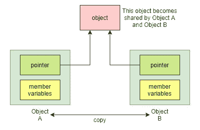

# Python vs C++系列:可变、不可变和复制赋值

> 原文：<https://medium.com/nerd-for-tech/python-vs-c-series-mutable-immutable-and-copy-assignment-d95c0ea73879?source=collection_archive---------8----------------------->

[Python vs C++系列](/nerd-for-tech/python-vs-c-series-getter-setter-and-property-e92d7801c21a)的第三篇文章是关于不变性的——对象一旦被创建就不能被修改。

(注意，本系列中的 Python 代码假设使用 Python 3.7 或更高版本)

# C++中的 Const 和 Constexpr

C++支持两种不变性概念: *const* 和 *constexpr* 。为了声明一个对象是不可变的，我们在定义一个对象时使用 *const* 或者 *constexpr* 。当然，当我们考虑 C++中的不可变性时，还有比这更多的细节，但一般来说，所有对象都是默认可变的。

```
void main()
{
    int nonConstVariable = 0; // Non-const object
    const int constVariable = 0; // Const object
    constexpr int secondsPerHour = 60 * 60; // Const expression
} 
```

本文在一般情况下使用单词 mutable，所以不要与 C++ [mutable](https://en.cppreference.com/w/cpp/keyword/mutable) 关键字混淆，该关键字允许类成员是可变的，即使其类实例是 *const* 或允许由 *const* 方法修改的类成员。

```
class MyClass
{
    public:
        int variable1 = 0;
        mutable int variable2 = 0;
};

void main()
{
    const MyClass myClass; // Const object
    myClass.variable2 = 10; // Ok because variable2 is mutable
    myClass.variable1 = 10; // Error; myClass object is const
}
```

# Python 中的可变性和不变性

与默认情况下每个对象都是可变的 C++不同，Python 对象的不变性是由其类型决定的。下面的列表总结了一些常见的可变和不可变数据类型。

(详见[内置类型](https://docs.python.org/3/library/stdtypes.html)

# Python 中不可变是什么意思？

当我们刚接触 Python 时，我们可能认为 Python 中的一切都是可变的，因为我们可以更新我们想要的任何对象。例如，下面的代码可以正常工作。

```
variable = 10
variable = "string"
variable = 2.0
variable = [1, 2, 3]
```

然而，更新对象的意义在不可变对象和可变对象之间是不同的。当把一个对象赋给一个变量时，我们可以认为该变量是一个指向该对象的命名指针(我们将在复制赋值一节中详细讨论这一点)。如果在我们更新变量的时候对象是不可变的，我们实际上是把它指向了另一个对象，Python 的垃圾回收会把原来的对象回收，如果不再使用的话。相反，如果一个变量指向一个可变对象，当我们更新这个变量时，这个可变对象就会被修改。

我们可以使用内置函数 [id](https://docs.python.org/3/library/functions.html#id) 来验证我们更新的对象是否还是同一个对象。 *id* 函数返回一个对象的标识(对象在内存中的地址)。下面的例子展示了不变性在 Python 中的表现，以及我们如何使用 *id* 函数来检查对象的身份。此外，我们使用[十六进制](https://docs.python.org/3/library/functions.html#hex)函数将 *id* 输出转换为十六进制格式，因此它看起来更像一个内存地址。

```
# int is immutable type
integer = 10
print(f"integer: {integer}; address: {hex(id(integer))}")
# integer: 10; address: 0x7f7a7b35fa50
integer = 20
print(f"integer: {integer}; address: {hex(id(integer))}")
# integer: 20; address: 0x7f7a7b35fb90

# str is immutable type
string = "hello"
print(f"string: {string}; address: {hex(id(string))}")
# string: hello; address: 0x7f7a7b205370
string = "world"
print(f"string: {string}; address: {hex(id(string))}")
# string: world; address: 0x7f7a7b205470

# list is mutable type
list_var = [1, 2, 3]
print(f"list_var: {list_var}; address: {hex(id(list_var))}")
# list_var: [1, 2, 3]; address: 0x7f7a7b259840
list_var.append(4)
print(f"list_var: {list_var}; address: {hex(id(list_var))}")
# list_var: [1, 2, 3, 4]; address: 0x7f7a7b259840

# dictionary is mutable type
dict_var = {"key1": "value1"}
print(f"dict_var: {dict_var}; address: {hex(id(dict_var))}")
# dict_var: {'key1': 'value1'}; address: 0x7f7a7b2cf500
dict_var["key2"] = "value2"
print(f"dict_var: {dict_var}; address: {hex(id(dict_var))}")
# dict_var: {'key1': 'value1', 'key2': 'value2'}; address: 0x7f7a7b2cf500
```

我们可以看到变量 *integer* 和 *string* 在更新前后的地址是不同的，这意味着这两个变量在更新后指向新的对象( *20* 和 *world* )。相反， *list_var* 和 *dict_var* 是可变的，所以更新前后地址保持不变。因此，它们仍然指向相同的对象。

为什么了解 Python 对象的可变性和不变性是至关重要的？

这是因为如果我们对 Python 对象的不变性视而不见，我们可能会对它们的行为感到惊讶，有时不小心使用可变对象会导致错误。下面的小节将讨论一些对于 C++背景的人来说不太直观的场景。

# 使用可变值作为默认函数参数

Python 的[默认参数](https://docs.python.org/3/tutorial/controlflow.html#default-argument-values)特性允许我们在定义函数时为函数参数提供默认值。然而，如果我们的默认值是可变类型，它们的行为可能不是我们所期望的。参见下面的示例。

```
# Use an empty list as the default value.
def my_function_1(parameter: List = []) -> None:
    parameter.append(10)
    print(parameter)
```

在这个例子中，我们定义了一个函数( *my_function_1* )，并使用一个空列表作为默认值。然后我们试着多次不提供参数调用这个函数。

```
my_function_1()
# [10]
my_function_1()
# [10, 10]
my_function_1()
# [10, 10, 10]
```

如果我们运行代码，我们会注意到*参数*保持我们每次追加的值(即 *10* )。所以第三次输出变成*【10，10，10】*。其行为实际上类似于我们在 C++中的函数中定义一个*静态*变量——静态变量只初始化一次，并且即使在函数调用过程中也保持该值。

**如何避免这种情况？**

如果有必要使用可变类型，比如 *list* (这很常见)，我们应该使用 *None* 作为缺省值，使用 [Optional](https://docs.python.org/3/library/typing.html#typing.Optional) 进行类型检查(使用 *Optional* 告诉类型检查器该值可以是 *None* 或期望的类型)。这种方式保证了无论何时我们调用函数而不提供参数时，*参数*都是新的。参见下面的示例。

```
# Use None as the default value. And use Optional for type checking
def my_function_2(parameter: Optional[List] = None) -> None:
    if parameter:
        parameter.append(10)
    else:
        parameter = [10]
    print(parameter)
```

这一次，如果我们多次调用函数( *my_function_2* )而没有提供参数，*参数*将不会保存上一次调用的值。

```
my_function_2()
# [10]
my_function_2()
# [10]
```

简而言之，不要使用可变类型作为函数参数的默认值。如果参数需要可变类型，使用 *None* 作为默认值。

# 类变量的行为

第二种情况发生在我们使用可变变量作为类变量的时候。Python 中的一个[类变量](https://docs.python.org/3/tutorial/classes.html#class-and-instance-variables)被所有实例共享。场景类似于 C++类变量(即，用*静态*声明一个类变量)。要在 Python 中定义一个类变量，请在类内部但在任何方法外部定义一个变量。在下面的例子中，我们用一个可变变量( *mutable_member* )、一个不可变变量( *immutable_member* )和几个实例变量定义了一个类( *MyClass* )。

```
from typing import List

class MyClass:
    # Mutable class variable. Shared by all instances
    mutable_member: List = []

    # Immutable class variable.
    # Shared by all instances unless an instance binds
    # this variable to something else.
    immutable_member: int = 0

    def __init__(self) -> None:
        # Instance variables are unique to each instance.
        self.immutable_instance_variable: int = 0
        self.mutable_instance_variable: List = []
```

由于类变量由所有实例共享，如果变量是可变类型，那么变量的改变将影响该类的所有实例。在我们更新类变量之前，让我们检查它们的值和内存地址。

```
print(f"MyClass.mutable_member: {MyClass.mutable_member}")
# MyClass.mutable_member: []
print(f"MyClass.mutable_member address: {hex(id(MyClass.mutable_member))}")
# MyClass.mutable_member address: 0x7f0f7092fe40
print(f"MyClass.immutable_member address: {hex(id(MyClass.immutable_member))}")
# MyClass.immutable_member address: 0x7f0f70b34910

class1 = MyClass()
print(f"class1.mutable_member: {class1.mutable_member}")
# class1.mutable_member: []
print(f"class1.mutable_member address: {hex(id(class1.mutable_member))}")
# class1.mutable_member address: 0x7f0f7092fe40
print(f"class1.immutable_member address: {hex(id(class1.immutable_member))}")
# class1.immutable_member address: 0x7f0f70b34910

class2 = MyClass()
print(f"class2.mutable_member: {class2.mutable_member}")
# class2.mutable_member: []
print(f"class2.mutable_member address: {hex(id(class2.mutable_member))}")
# class2.mutable_member address: 0x7f0f7092fe40
print(f"class2.immutable_member address: {hex(id(class2.immutable_member))}")
# class2.immutable_member address: 0x7f0f70b34910
```

在这里，我们可以看到 *class1* 和 *class2* 的 *mutable_member* 和 *immutable_member* 都指向相同的对象，它们与 *MyClass* 相同。

现在，让我们更新可变类变量，并打印出它们的值。

```
# Update the mutable class variable
class1.mutable_member.append(10)
print(f"class1.mutable_member: {class1.mutable_member}")
# class1.mutable_member: [10]
print(f"class2.mutable_member: {class2.mutable_member}")
# class2.mutable_member: [10]
```

该更新会影响 *MyClass* 的所有实例。

**不可变类变量怎么样？**

当我们更新一个不可变的类变量时，行为有一点不同。现在，让我们从 *class1* 更新*不可变成员*，并打印出两个实例 *class1* 和 *class2* 的地址。

```
# Update the immutable class variable
class1.immutable_member = 20
print(f"class1.immutable_member: {class1.immutable_member}")
# class1.immutable_member: 20
print(f"class1.immutable_member address: {hex(id(class1.immutable_member))}")
# class1.immutable_member address: 0x7f0f70b34b90
print(f"class2.immutable_member: {class2.immutable_member}")
# class2.immutable_member: 0
print(f"class2.immutable_member address: {hex(id(class2.immutable_member))}")
# class2.immutable_member address: 0x7f0f70b34910
```

输出显示*class 1 . immutable _ member*不再绑定到*my class . immutable _ member*。

如果我们创建一个新的 *MyClass* 实例 *class3* ，它的类变量仍然绑定到 *MyClass* 的类变量。

```
class3 = MyClass()
print(f"class3.immutable_member: {class3.immutable_member}")
# class3.immutable_member: 0
print(f"class3.immutable_member address: {hex(id(class3.immutable_member))}")
# class3.immutable_member address: 0x7f0f70b34910
print(f"MyClass.immutable_member address: {hex(id(MyClass.immutable_member))}")
# MyClass.immutable_member address: 0x7f0f70b34910
```

因此，类变量由所有实例共享。对于一个可变的类变量，如果我们修改它，这种改变将影响所有的实例，然而，对于一个不可变的类变量，如果我们从一个类实例改变它，这个实例的变量不再绑定到原来的类变量。

此外，值得一提的是，实例变量对于每个类实例都是唯一的，不管其可变性如何。

```
# Instance variables are unique to each instance
class1.mutable_instance_variable.append(30)
print(f"class1.mutable_instance_variable: {class1.mutable_instance_variable}")
# class1.mutable_instance_variable: [30]
print(
    f"class1.mutable_instance_variable address: "
    f"{hex(id(class1.mutable_instance_variable))}"
)
# class1.mutable_instance_variable address: 0x7f0f709e6140
print(f"class2.mutable_instance_variable: {class2.mutable_instance_variable}")
# class2.mutable_instance_variable: []
print(
    f"class2.mutable_instance_variable address: "
    f"{hex(id(class2.mutable_instance_variable))}"
)
# class2.mutable_instance_variable address: 0x7f0f709e6180
```

# 复制分配

在 Python 中使用赋值操作符(例如， *x = 10* )不会创建对象的副本。相反，它在变量和对象之间建立了一个绑定。在处理不可变对象时，这种行为不是问题。赋值操作符将在变量和不可变对象的新目标之间创建一个新的绑定。我们可以使用 [is](https://docs.python.org/3/reference/expressions.html#is) 操作符来检查两个对象是否是同一个对象(我们也可以像前面的例子一样使用 *id* 函数)。下面的例子展示了不可变对象上的赋值操作行为和 *is* 操作符的用法。

```
# Copy an immutable object
my_string = "hello"
my_string_copy = my_string
# They both bind to the same object.
print(my_string is my_string_copy)
# True

# After we update one variable, they bind to two different objects.
my_string_copy += " world"
print(my_string is my_string_copy)
# False

# Of course, their values are different.
print(f"my_string: {my_string}")
# my_string: hello
print(f"my_string_copy: {my_string_copy}")
# my_string_copy: hello world
```

# 复制模块和浅层复制

我们知道拷贝赋值只是在对象和目标之间创建一个绑定，那么我们如何创建一个对象的拷贝呢？Python 提供了一个[复制](https://docs.python.org/3/library/copy.html)模块，提供了浅层和深层复制操作。以下示例使用 [copy.copy](https://docs.python.org/3/library/copy.html#copy.copy) 函数从可变对象( *value* )创建副本( *value_copy* )。

```
import copy

# Define a mutable object.
value = [1, 2, 3]
print(hex(id(value)))
# 0x7fc0df486380

# Copy assignment just creates binding.
value_bind = value
print(hex(id(value_bind)))
# 0x7fc0df486380

# Use copy.copy function to perform shallow copy.
value_copy = copy.copy(value)
print(hex(id(value_copy)))
# 0x7fc0df4af740

# Update the copied variable.
value_copy.append(4)
print(value_copy)
# [1, 2, 3, 4]

# The update does not affect the original variable.
print(value)
# [1, 2, 3]
```

在这个例子中， *value_copy* 变量独立于 *value* 变量。另外，值得一提的是， *copy.copy* 函数仍然为不可变对象创建对象和目标之间的绑定。

**可变复合对象或不可变复合对象上的浅拷贝包含可变复合对象**

[浅拷贝](https://docs.python.org/3/library/copy.html)发生在 C++中处理包含指针的复合对象(如类)时；副本复制指针，但不复制指针指向的对象(见下图)。



因此，*对象 A* 和*对象 B* 的指针所指向的*对象*成为共享的。

由于 Python 中的 [copy.copy](https://docs.python.org/3/library/copy.html#copy.copy) 函数执行的是浅层复制，所以在复制一个包含可变复合对象的复合对象时，会出现上面提到的情况，无论顶层复合对象是可变的还是不可变的。以下示例演示了浅层复制方案。

```
import copy

# Create an object with an mutable object,
# and print out its memory address.
compound_object = {"key1": 123, "key2": [1, 2, 3]}
print(hex(id(compound_object)))
# 0x7fbd2b61d480

# Use copy.copy to create a copy of the compound_object.
# and print out its memory address.
compound_object_copy = copy.copy(compound_object)
print(hex(id(compound_object_copy)))
# 0x7fbd2b61d540

# The address shows compound_object_copy is a different object
# from compound_object.
# However, if we print out the address of the key2 value
# from both compound_object and compound_object_copy,
# they are the same object.
print(hex(id(compound_object["key2"])))
# 0x7fbd2b5561c0
print(hex(id(compound_object_copy["key2"])))
# 0x7fbd2b5561c0

# Since key2 is shared, if we update it, the change will
# affect both compound_object and compound_object_copy.
compound_object_copy["key2"].append(4)
print(compound_object_copy)
# {'key1': 123, 'key2': [1, 2, 3, 4]}
print(compound_object)
# {'key1': 123, 'key2': [1, 2, 3, 4]}
```

**使用 copy.deepcopy 函数进行深度复制**

如果我们要执行深度复制，我们应该使用 [copy.deepcopy](https://docs.python.org/3/library/copy.html#copy.deepcopy) 来代替。请参见下面的示例。

```
import copy

# Create an object with an mutable object,
# and print out its memory address.
compound_object = {"key1": 123, "key2": [1, 2, 3]}
print(hex(id(compound_object)))
# 0x7fbba9d11480

# Use copy.deepcopy to create a copy of the compound_object.
# and print out its memory address.
compound_object_copy = copy.deepcopy(compound_object)
print(hex(id(compound_object_copy)))
# 0x7fbba9c3b600

# Also print out the address of the key2 value from both
# compound_object and compound_object_copy, and they are
# different objects.
print(hex(id(compound_object["key2"])))
# 0x7fbba9c4a180
print(hex(id(compound_object_copy["key2"])))
# 0x7fbba9c6d9c0

# Therefore, if we update the key2 value from compound_object_copy,
# it does not affect compound_object.
compound_object_copy["key2"].append(4)
print(compound_object_copy)
# {'key1': 123, 'key2': [1, 2, 3, 4]}
print(compound_object)
# {'key1': 123, 'key2': [1, 2, 3]}
```

# 结论

Python 对象的不变性是由其类型定义的。了解哪些数据类型是可变的，哪些是不可变的，以及在某些情况下使用可变对象时的行为，对于避免编写错误代码至关重要。

(所有示例代码也可在[mutable _ immutable _ and _ copy _ assignment](https://github.com/shunsvineyard/shunsvineyard/tree/main/python_vs_cpp_series/mutable_immutable_and_copy_assignment)获得)

*原载于 2021 年 10 月 19 日*[*https://shunsvineyard . info*](https://shunsvineyard.info/2021/10/19/python-vs-c-series-mutable-immutable-and-copy-assignment/)*。*