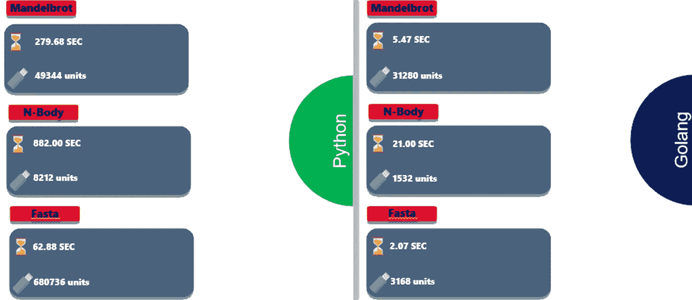

# Python VS Go

> 原文：<https://medium.com/nerd-for-tech/python-vs-go-28a636313a1e?source=collection_archive---------1----------------------->

在我们开始之前，让我先介绍一下编码语言的机器人

## 围棋是什么？？

GO 是谷歌创造的一种编程语言。它简单易学，非常适合团队发展。另一个特征是它的速度。它是世界上发展最快的编程语言之一。

## 能去做什么？？

网站(仍然可以使用 java 脚本的网站)

移动应用(前端部分)

系统编程

用于服务器端编程

## 围棋历史

最初是由罗伯特·格里斯默、罗布·派克和肯·汤普森在谷歌进行的一项实验。由谷歌 2007 年创建。

目标:python 的开发速度与 c 和 c++的性能安全。

## 介绍

GO 是用强大的语言静态类型化的，快速而强大。Golang 是一种过程化的静态类型编程语言，其语法类似于 [**C**](https://www.geeksforgeeks.org/c-programming-language/) 编程语言。有时它被称为**围棋编程语言**。它提供了丰富的标准库、垃圾收集和动态类型功能。Golang 是开发者中最流行的编程语言之一。 **Go** 是一种真正灵活的**语言**，能够解决很多问题。你可以**使用**它进行系统和网络编程、大数据、机器学习、音频和视频编辑等等。

## 计算机编程语言

学习编程语言是一个很好的开始。但是管理如何开始或者学习什么编码语言是一项困难的任务。所以推荐大家都来入门 python 吧。但是期望知道许多编码语言。

# Python 是什么？

Python 是非常流行的编程语言，事实上它是目前发展最快的语言。它经常被用于脚本和自动化机器学习，互联网等等。python 已经成为世界级公司的首选，如脸书、谷歌、Spotify 和网飞等等。

要了解更多关于 python 的知识，请点击链接查看我的博客- [点击这里](/nerd-for-tech/why-python-is-popular-336809dd4aba)

## 让我们开始比较

我们会比较

表演

图书馆

可读性

## 表演

[https://www.edureka.co/blog/golang-vs-python/](https://www.edureka.co/blog/golang-vs-python/)

性能取决于编码语言解决问题的速度。

python 使用 mandelbrot 279.68 秒并使用 49344 个单位，而 GO 使用 5.47 秒和 31280 个单位来解决 mandelbrot 问题。

python 需要 882.00 秒并使用 8212，而 GO 需要 21.00 秒并使用 1532 个单位来解决问题

从上面的例子中，我们可以肯定 python 比 python 慢。

## 图书馆

最流行的 python 库是

1 .张量流
2。Scikit-Learn
3。Numpy
4。Kera
5。PyTorch
6。LightGBM
7 .Eli5
8。9。第十章。熊猫

最受欢迎的围棋库有

1.  戈尔姆

2.情报

3.鹅

4.硬币指示器 （coin-levelindicator 的缩写）命令行界面（Command Line Interface for batch scripting）

5.Go 套件

6.贝吉塔

7.Authboss

8.滑音

9.银杏树

10.码头工人

可读性

当你为客户开发软件时，你通常会和十个甚至上百个其他开发人员组成一个团队。在这种情况下，代码可读性成为需要考虑的主要因素。

现在，你们中的很多人可能会认为 Python 肯定是最棒的，但是我有不同的看法，所以请听我说完。乍看之下，Python 确实有很好的可读性，但在我看来，它们有时做得过头了。在 Python 中，可能有 10 种不同的方式来表达同一件事，这通常会在代码很大或者从事代码工作的人很多的时候导致混乱。

另一方面，在编程方面，Go 有着严格的规则。它不允许导入不必要的库，也不允许创建不必要的变量。这意味着有一种明确的方法来执行一项任务，从而在大的团队中更好地理解代码。你们中的一些人可能会说代码的通用性受到了影响，但是谁真正关心通用性，尤其是在核心编程方面？Go 的语法对初学者来说也不太友好，但它不像 C 或 C++那样无情。所以为了代码的可读性，我打算用 go。

所以正如你们所看到的，在我看来，Go 在大多数情况下都占了上风，并且胜过 Python 作为一种编程语言。当然，它可能没有 Python 这些年来赢得的名声和互联网的扩张，但 Go 肯定也在这方面迎头赶上。不同意我？在下面的评论区告诉我为什么。这个对比暂时到此为止！我希望我已经帮助你决定了哪种语言更适合你的项目