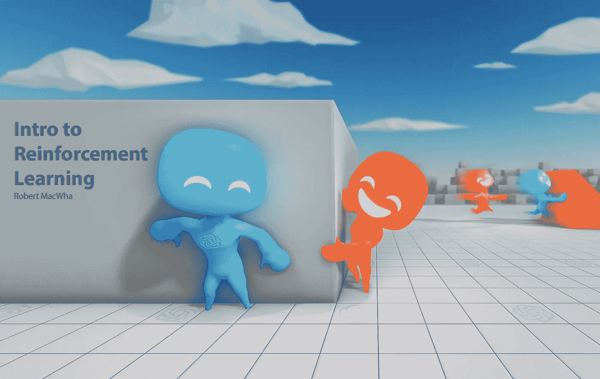
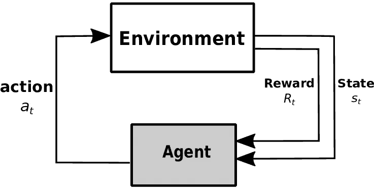
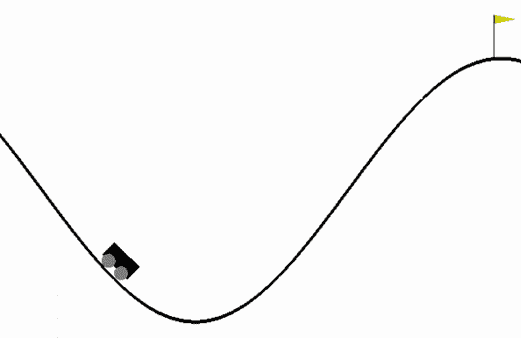
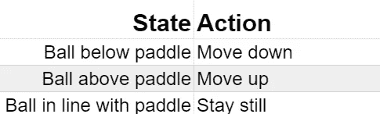
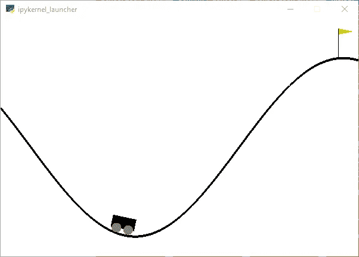
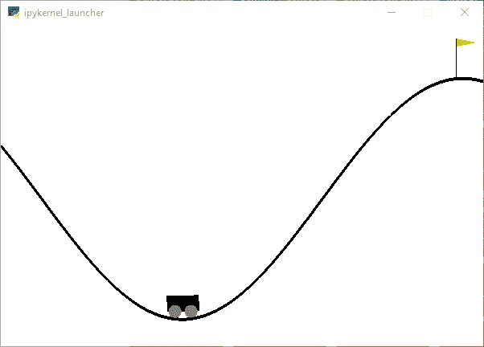
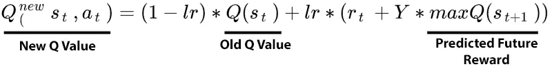
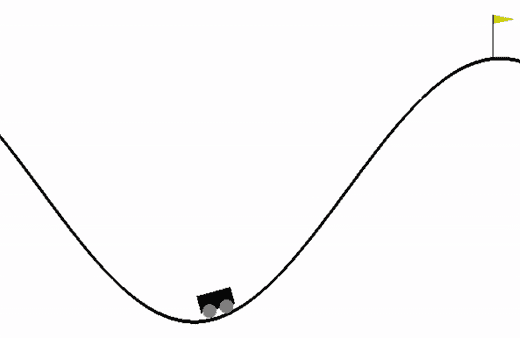
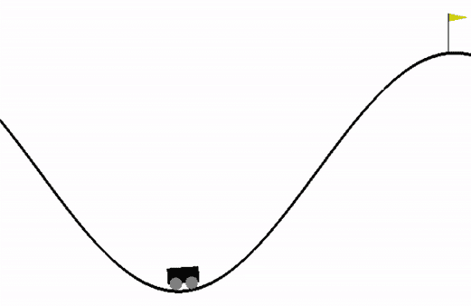

# q 学习——从基础开始

> 原文：<https://medium.com/nerd-for-tech/q-learning-from-the-basics-b68e74f97254?source=collection_archive---------3----------------------->



强化学习(RL)是人工智能研究的一个子集，它处理训练代理以最大化奖励功能。RL 系统通常用于难以判断单个动作但易于对整体表现评分的任务。这些系统有两个核心组件:**代理**和**环境**。

## 代理人

代理是接受给定状态并返回动作的函数。这些系统可以建立在任何东西上——神经网络和查找表就是两个常见的例子。神经网络通常用于复杂环境的应用中，而改进的查找表(Q 表)用于较简单的环境中。

## 环境

环境是代理学习导航的硬编码系统。现在，我们可以把环境看作一个黑匣子，它接受一个动作，并返回一个奖励和下一个状态。



代理人在一个环境中行动，然后返回一个状态和奖励

作为一个例子，想象使用一个 pong 游戏作为环境。代理采取一个动作，比如向下移动桨，这个动作由环境处理。然后，环境返回下一个状态，比如球拍和球的位置，加上一个衡量代理人表现如何的奖励。

# 构建强化学习模型

本文中的所有代码都将使用 python 编写。OpenAI 的[体育馆](https://gym.openai.com/)库，可以通过 pip 或 anaconda 安装。另一个选择是使用 Google Colab——但是，您将无法观察代理在环境中的操作。

## 创建随机爬山者

让我们从构建最简单的代理开始——随机漫步机。随机漫步机是一种不管状态如何都采取随机行动的代理。这意味着它们非常简单，但也永远不会改进，使它们成为无效的 RL 模型。

要创建这个随机漫步机，我们需要做两件事:构建一个环境和一个代理。本文中的所有环境都将使用 [Gym](https://gym.openai.com/) 库来构建。下载完库**健身房。create()** 可以用来初始化环境。

```
import gymenv = gym.create('MountainCar-v0') # create the hill climbing environment
env.reset() # remember to reset the environment before taking any actions
```

创建代理甚至更容易——因为它只是一个随机漫步机，我们可以使用 gym 的**env . action _ space . sample()**函数来生成一个有效的随机动作。每个动作都是一个整数，其中 0 表示向左移动，2 表示向右移动，1 表示什么都不做。

```
action = env.action_space.sample()
env.step(action)
```

现在我们可以将代理的动作代码放在 for 循环中，这样它就可以执行多个动作，这样就可以了:在一个新创建的环境中随意走动。

```
import gymenv = gym.make('MountainCar-v0')
env.reset()for i in range(1000):
    env.render()

    action = env.action_space.sample()
    env.step(action)env.close()
```



样本随机漫步—脚本可在此处[获得](https://nbviewer.jupyter.org/github/Robert-MacWha/Reinforcement_Learning-From_The_Basics/blob/main/1_random_walker.ipynb)

# 构建智能模型

如果你只是想看到一个代理与环境交互，那么拥有一个随机漫步机是很好的，但是如果我们想让代理学习，就需要一些更复杂的东西。最简单的方法是做一个 Q 表。



乒乓球游戏的查找表

Q 表可以被认为是一个查找表。在一列中，您有代理可能遇到的每个状态。在另一列中，您有在所述状态下应该采取的动作。

为了创建这个 Q 表，我们需要知道两件事。代理可以采取多少个动作，可以处于多少种状态？

获取动作的数量相对容易——只需从 **env.action_space.n** 变量中读取即可。状态空间也可以通过随机观察的长度很容易地找到。

```
ACTION_SPACE = env.action_space.n # 3OBSERVATION_SPACE = len(env.observation_space.sample()) # continuous(2)
```

## 创建 Q 表

一旦确定了动作和状态空间，我们就可以开始构建 Q 表了。首先要做的是把环境返回的连续观测空间，剁成一组离散的单元。这样做是因为在连续观察空间中有无限多个离散状态。



这两种状态在技术上是不同的，但是它们是如此的相似，以至于把它们如此看待是没有意义的。

为什么我们关心是否有无限多的离散状态？如果不这样做，我们就永远无法建立 Q 表。想象一下，编写一本说明书，其中需要为日期、时间、天气和用户的中间名的每一种可能的配置单独写一页。这是不可能的。因此，我们将把相似的状态组合成离散的块。

那么，让我们创建 Q 表。对于这种环境，它的形状为[20，20，3]——前两个维度对应于观察空间中每个参数的 20 个离散单元，最后一个维度对应于三个动作。

```
Q_INCREMENTS = 20 # the number of discrete cells
DISCRETE_OS_SIZE = [Q_INCREMENTS] * OBSERVATION_SPACE # an array of shape [20, 20]q_table = np.random.uniform(
    low=-1, # low value is minimum reward
    high=0, # high value is maximum reward
    size=(DISCRETE_OS_SIZE + [ACTION_SPACE])) # an array of shape [20, 20, 3]
```

现在我们有了 Q 表，我们还需要构建一个函数，将连续状态转换为离散单元，这样我们就可以索引 Q 表。

```
def continuous_Observation_To_Index(env, observation, increments):

    # get the range of the observation_space so it can be normalized
    obs_min = env.observation_space.low
    obs_max = env.observation_space.high # normalize the observation so it goes from 0-1
    obs = (obs - obs_min) / (obs_max - obs_min) # convert the normalized observation into an integer index
    indice = tuple(np.round(obs * increments).astype(int)) return indice
```

我们现在可以修改 random walker，使其基于带有这两个代码块的预先生成的 Q 表采取行动。在任何给定的状态下，步行者将采取 Q 表中对应值最高的动作。这样做是因为稍后当我们开始训练代理人时，最高价值将与产生最高未来回报的行动相对应。

```
# store the initial state of the environment
done = False
observation = env.reset()while not done:
    env.render() # get the action coresponding to the current observation
    indice = obs_To_Index(env, observation, Q_INCREMENTS)
    action = q_table[indice].argmax() # take the action
    new_observation, reward, done, info = env.step(action)
    observation = new_observationenv.close()
```

## 培养

现在我们已经有了一个 Q 表，一切都可以正常工作了，对吗？不完全是。我们有说明书，但目前所有的页面都充满了胡言乱语。下一步是更新 Q 表的值，以更好地反映代理在给定状态下应该采取什么行动。

为了更新 Q 表，我们可以使用贝尔曼方程，这是一个从当前状态和奖励预测未来奖励的函数。这个等式通过缓慢更新 Q 表中的值来匹配**预测的未来回报**、**、**一个状态有多“好”的数字表示。

我们如何找到这个预测的未来回报？这就是我们存储在 Q 表中的值。因此，为了计算 Q 表的新值，我们可以使用以下等式:



这个等式可以被翻译成代码并在我们的算法中实现，这样代理就可以开始学习了。首先，需要定义学习率(lr)和折扣(Y)超参数。

```
LEARNING_RATE = 0.1 # lr - how quickly values in the q table change
DISCOUNT      = 0.95 # Y - how much the agent cares about future rewards
```

然后，我们可以指定训练模型的时期数。把一个时期想象成一个训练周期。代理不会在一堂课中神奇地学会所有东西，所以我们需要通过多次训练来巩固课程。

```
EPOCHS        = 5000
```

最后，我们可以将上面的贝尔曼方程转换成 python 代码，这样它就可以集成到我们的脚本中。

```
# calculate the predicted future reward
new_indice = obs_To_Index(env, new_observation, Q_INCREMENTS)
future_reward = reward + DISCOUNT * q_table[new_indice].max()# update the value in the q table
current_q = q_table[indice + (action,)]
new_q = (1 - LEARNING_RATE) * 
         current_q + LEARNING_RATE * future_reward
```

一旦完成，我们将修改先前脚本的培训部分，以集成培训代码。

```
for e in range(EPOCHS): # store the initial state of the environment
    done = False
    observation = env.reset() while not done:
        env.render() # get the action coresponding to the current observation
        indice = obs_To_Index(env, observation, Q_INCREMENTS)
        action = q_table[indice].argmax() # take the action
        new_observation, reward, done, info = env.step(action) # train the Q-Table # calculate the predicted future reward
        new_indice = obs_To_Index(env, new_observation, Q_INCREMENTS)
        future_reward = reward + DISCOUNT * q_table[new_indice].max() # update the value in the q table
        current_q = q_table[indice + (action,)]
        new_q = (1 - LEARNING_RATE) * 
                current_q + LEARNING_RATE * future_reward # update the observation
        observation = new_observationenv.close()
```

现在您已经完成了脚本的编写，试着运行一下，在代理训练的时候等待几百个纪元。这可能需要一段时间，取决于你的硬件，但一旦完成，你会留下一个非常有能力的车。



经过全面培训的 Q 表示例—脚本可用[此处](https://nbviewer.jupyter.org/github/Robert-MacWha/Reinforcement_Learning-From_The_Basics/blob/main/3_trainable_q_table.ipynb)

## 埃普西隆

还有最后一个应该对代理进行的调整，以便它可以学习导航更复杂的环境。该代理目前可以导航简单的环境，但是，一旦它找到解决方案，它将停止改进，即使该解决方案是次优的。这是因为改善它的表现将需要执行不会导致最高预测回报的行动，这是代理目前不能做的。

在简单的环境中，这不会是一个问题，但是在更复杂的模拟中，有不同的获得奖励的方法，这可能对代理的成功有害。

那么，我们如何阻止代理一次又一次地采取相同的动作呢？为什么，强行让它在一定比例的时间里采取随机行动。这就是 epsilon 所做的，它让代理探索环境并寻找更好的解决方案。

Epsilon 的实现非常简单。你只需要两个新的超参数——ε和ε衰变。

```
EPSILON = 0.5          # how often the agent takes random actions
EPSILON_DECAY = 0.9998 # rate at which epsilon gets reduced
```

艾司隆控制代理采取随机行动的速度。在培训过程开始时，这个数字会很高，但随着代理的改进，我们会降低这个数字。这个还原过程由ε衰变变量处理。

实现这个系统需要在选择动作的地方改变代码。模型现在有时会采取随机的探索性行动，而不是总是采取 Q 表指定的行动。

```
# select the action to take
if random.uniform(0, 1) < EPSILON:
    action = env.action_space.sample() # random action (exploration)
else:
    action = q_table[indice].argmax()  # action from the q table
```

最后，我们需要在每个时期结束时减少ε。

```
EPSILON *= EPSILON_DECAY
```

就是这样！对于像代理这样的简单环境，使用 epsilon 进行训练可能需要稍长的时间，但这是为生成最佳解决方案而付出的合理代价。



带 epsilon 的完整训练 Q 表示例—脚本可用[此处](https://nbviewer.jupyter.org/github/Robert-MacWha/Reinforcement_Learning-From_The_Basics/blob/main/4_trainable_q_table_epsilon.ipynb)

> 感谢阅读我的文章！请随意查看我的[作品集](https://tks.life/profile/robert.macwha#portfolio)，如果你有什么要说的，请在 [LinkedIn](https://www.linkedin.com/in/robert-macwha-0555141b6/) 上给我发消息，或者在 Medium 上关注我，以便在我发布另一篇文章时得到通知！