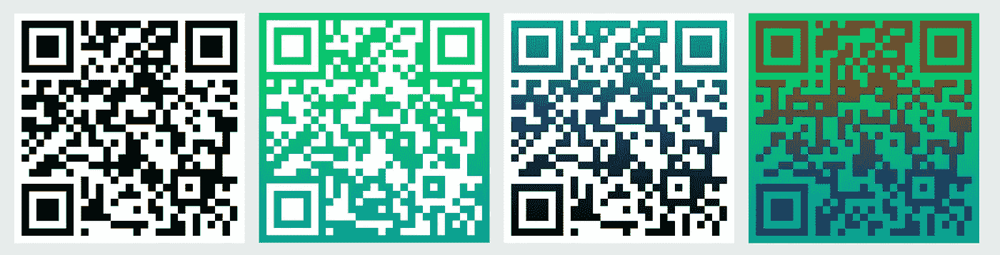

# 在 macOS 上使用 Swift 生成二维码

> 原文：<https://medium.com/nerd-for-tech/qr-codes-on-macos-with-swift-be0ba2d58de2?source=collection_archive---------11----------------------->

Claudio Schwarz | @purzlbaum 在 [Unsplash](https://unsplash.com/s/photos/qr-code?utm_source=unsplash&utm_medium=referral&utm_content=creditCopyText) 上的照片

在创建了一个 macOS 应用程序来生成二维码并面临各种问题后，我认为分享这些知识和我最终得到的代码可能会很有趣。我必须说这是做二维码的简化版本，然而，对于增加新功能和增加定制，这可能是一个伟大的第一步。好吧，让我们开始学习教程。

## 从结尾开始

正如我通常在创建新特性时所做的那样，我试图描绘出函数应该是什么样子，并创建空方法(如果您愿意，可以称之为框架),稍后我将着手实现这些方法。

*我必须在这里做一个小小的免责声明，这种在实际编写代码之前想象代码的做法对初学者来说可能不是最好的，因为它需要对 Swift 能提供什么以及相关 API 有一点了解。*

我希望最终的代码是什么样的。

这就是在我看来，代码在实现特性的最后应该是什么样子的。由于我没有在本文中介绍测试，所以我在函数中声明了值，并且没有将它们作为参数接收。以下是其他一些相关要点:

*   我想支持背景和前景的渐变颜色。这就是为什么我把`QRCodeColor`想象成一个带有事例`solid`和`gradient`的枚举，每个事例都带有关联值`NSColors`。
*   我想创建一个结构`QRGenerator`,它接受要编码的文本、前面描述的颜色定义、结果图像的大小以及代码的质量，也称为纠错级别。

## 实施

现在让我们继续用名为`create(String, QRCode.Color, CGFloat, QRCode.Quality)`的静态函数创建结构`QRGenerator`。在这个函数中，我们将生成两幅图像，一幅带有点或编码数据，另一幅带有背景，最后我们将它们合并成一幅图像结果。

完美！我们的特色正在形成。现在我们已经写好了框架，函数是具有特定职责的小代码块，开始单独编写它们会更容易。在我们继续之前，让我们快速定义一下我们将使用的结构。

## 创建背景图像

## 创建前景图像

## 生成 QR 码层

可以在[核心图像滤波器参考](https://developer.apple.com/library/archive/documentation/GraphicsImaging/Reference/CoreImageFilterReference/index.html#//apple_ref/doc/filter/ci/CIQRCodeGenerator)中找到`CIQRCodeGenerator`滤波器的值`inputMessage`和`inputCorrectionLevel`。

## 把所有的放在一起

有了这段独立的代码，我们将能够创建大量具有高度颜色定制的二维码。有更多的可能性来定制我们的代码，如线条圆形，代码中间的徽标，等等，但在本文中，我只是触及了 macOS 中二维码可能做的事情的表面。在这个 [GitHub 资源库](https://github.com/cristhianleonli/qr-codes-macos)中，您可以找到整个项目，包括我们在本文中没有涉及的扩展。

*感谢阅读。我希望你喜欢这个教程，如果它对你有用，不要害羞👏关于这篇文章。下次见。*