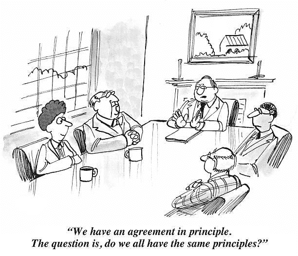
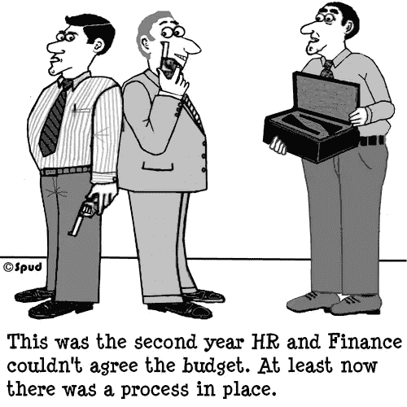
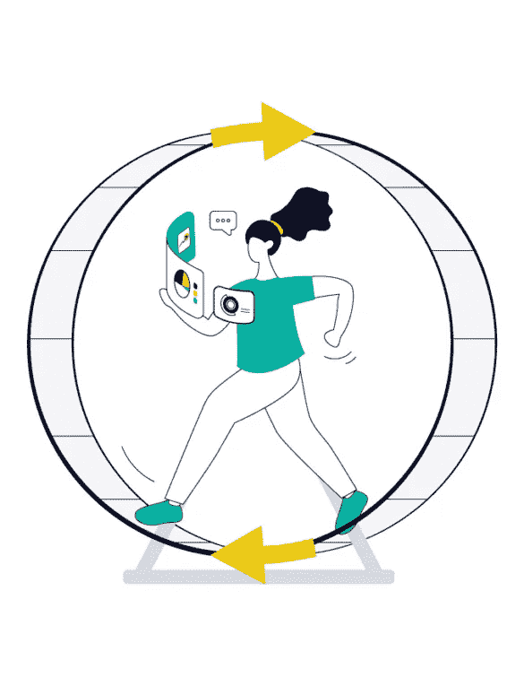

# 产品经理的素质

> 原文：<https://medium.com/nerd-for-tech/qualities-of-a-product-manager-3317915bdaf2?source=collection_archive---------3----------------------->

🎯这是摘自 udemy 课程**[**伟大的产品经理:微软 PM 的产品管理**](https://www.udemy.com/course/become-a-product-manager/)**

****因此，在整个课程中，有 8 种重要的技能或品质是项目经理需要在他们的生活中反复灌输的。我觉得这些技能不仅仅是项目经理这个职位所需要的，而且在任何人的生活中都扮演着非常重要的角色。因此，让我们了解它们，以及如何将它们灌输给我们。****

1.  ******面向数据:******

****这是‣的核心价值观之一。****

****‣:在做出任何决定之前，必须从数据驱动的角度来看待这种情况，例如:通过统计数据来了解用户使用了多少产品，每天下了多少订单，等等。这有助于为我们的决策打下坚实的基础，并最大限度地减少做出错误决策的可能性。****

****‣必须使用科学方法，根据弗朗西斯·培根的说法，科学方法被定义为“系统追求知识的原则和程序，包括识别和表述问题，通过观察和实验收集数据，以及表述和检验假设。”****

****‣为了理解决策背后的数据，人们需要采取七个现代科学步骤。这些步骤可以防止你做出糟糕的草率决定。它们如下:****

1.  ******问题**——你想知道的事情****
2.  ******研究** —进行研究****
3.  ******假设—** 对实验结果的有根据的猜测或预测****
4.  ******实验** —检验假设****
5.  ******观察**——你在实验过程中收集的数据****
6.  ******结果/结论******
7.  ******沟通******

********

******2。卑微:******

****‣这只是意味着处理事实，而不是魅力。****

****‣让我们说，例如:我是项目经理，XYZ 的一个应用程序有了一些改进，所以**我没有说是我**交付了产品，**总是我们**，指的是整个团队。****

****‣谦逊是一个人必须具备的重要品质，这样才能创造一个良好的团队环境，并轻松地执行每一个流程和决策。****

****‣让我们在这里看一个例子 ***“已经设计的战略证明是成功的，我们的新功能已经大大超过了最初的指标改进估计。没有团队的长时间努力工作，这是不可能的。”*******

****‣保持谦逊的心态有助于建立信任，并在你的旅程中与支持你的人建立一个团队。****

********

******3。挑战自我:******

****‣:这有助于挑战自我，采取必要的最佳步骤，让你现有的产品变得更好。****

****‣质疑和挑战自己将帮助你变得更加自信和值得信任，同时防止你过于自信。****

****‣:这更像是例行公事，反复检查自己的假设、数据和决定。****

****‣有一个橡皮鸭理论，说***“****w****当程序员需要调试他们的代码时，他们应该向一只橡皮鸭逐行解释程序。”*** 这种一步一步解释问题的行为使得解决方案自己呈现出来，并最小化可能发生的错误数量。这个理论也可以用在 **PM** 角色上，帮助你交叉检查并消除缺点。****

********

******4。感同身受&尊敬:******

****‣:作为一名项目经理，你要和你周围的很多人打交道。每个人都有自己的问题、健康问题、家庭状况等，你需要对这些人感同身受，这样他们会觉得得到了支持，而不必独自面对问题。****

****‣团队中的每个人都需要各方面的尊重。我相信你不希望最后对人无礼，不了解他们的问题就解雇他们。作为一名项目经理，你需要对你周围的人负责，尊重他们，帮助他们让生活和工作更加舒适。****

****‣这些品质有助于建立更牢固的职业关系，同时也有助于职场之外的个人关系，所以确保你尊重、支持和同情你周围的人。****

********

******5。完整性:******

****‣让我们看看这意味着什么。根据维基百科 ***“诚信是诚实的实践，表现出对强大的道德和伦理原则和价值观的一贯和毫不妥协的坚持。在伦理学中，正直被认为是一个人行为的诚实、真实或准确。正直可以抵制虚伪。”*******

****‣:这一点很重要，因为一旦人们信任你，你们两个人就更容易合作。作为一个首相，你应该遵守你的诺言，或者更简单的说，按照你说的去做。如果你最终卷入了公司的政治，你周围的人可能会完全失去对你的信任，这将在环境中产生压力，导致他们难以与你共事。****

****‣:归根结底，不仅仅是在办公室工作 8 小时，而是要拿出更好的产品来解决利益相关者的担忧，并与你的团队一起为 It 创造更多价值。****

****正直的总理‣不会试图逃避自己的错误，也不会试图逃避责任。****

********

******6。外交:******

****‣:很明显，作为一个项目经理，你有很多工作要做，你不能为了让每个利益相关者高兴而对他们说“是”。****

****‣:在某些情况下，你需要对他们说不，但是你会直接对他们说不吗？当然不是，你的答案需要以一种结构良好的方式呈现出来，这样你和你的利益相关者都不会觉得不好。****

****‣:我们都知道，每个团队都有自己有限的制造能力，他们可以处理多少负载，所以说“不”很重要**，但“是”总是正确的方式**。****

****‣对你所说的话很有策略，你必须训练你的思维。你必须向利益相关者展示议程和其他需要做的事情。例如:让利益相关者了解将要发生的事情的好处等。****

****‣付出努力将有助于与利益相关者建立更牢固的关系，并保持这种信任，即在为他们的产品选择要开发的东西时，你会做得一丝不苟。****

****‣:这是一个当你被迫做出决定时传达决定的好方法的例子 ***“公司的这个紧急要求是为了让我们与公司的新政策保持一致，我相信这真的很重要。让我们一起快点做这件事，这样我们就能尽快回到常规计划中去。”*******

********

******7。透明度:******

****‣:这直接取自一个叫做**敏捷 Scrum 的开发框架。******

****‣根据定义 ***“透明意味着如实呈现事实。所有相关人员——客户、首席执行官和个人贡献者——在与他人的日常交往中都是透明的。他们彼此信任，他们都有勇气让彼此知道好消息和坏消息。每个人都为共同的组织目标而奋斗和集体协作，没有人有任何隐藏的议程。”*******

****‣:这意味着很容易处理你的透明决策，很容易阅读数据，诚实，勇气等等。一个好的项目经理应该像一本打开的书，每个人都知道他，没有什么是隐藏的。****

****‣项目经理应该容易接近，容易理解，并且积极主动。这有助于建立理解，显然节省了 PM 的时间，也有助于避免风险，因为更多的人可以检查你的工作，并帮助你将风险降至最低，从而限制未来可能出现的问题。****

********

******8。领先一步:******

****‣的领先地位为 PMs 提供了额外的优势。它帮助他们了解或预测未来的缺点或产品的差异化因素，使他们在与其他产品的竞争中领先。****

****‣:我从我读过的书中了解到，苹果公司的创始人史蒂夫·乔布斯总是为苹果公司设计的任何产品制定一个五年计划。这帮助他领先于所有的竞争对手，并在竞争中提供了额外的优势。****

****‣:因此，每个项目经理都应该有一个超前的愿景，无论是推出新产品还是在现有产品中增加新功能，同时意识到市场上新老竞争对手都在研究同一问题陈述等。可能会有很多事情同时发生。****

****‣的领先地位给产品和公司都带来了价值。这有助于在竞争中领先&为解决即将到来的障碍做好准备。****

********

****这是我所理解的，因为我仍然在学习这门课程，但是确实也有很多东西要学。随着我的深入，我将继续通过博客分享我的学习，并帮助你们在成为项目经理的旅程中与我一起成长。由于我是最后一年的学生，我一直在寻找机会，我确信今年我会获得项目经理的徽章！！****

****感谢你花时间阅读。不断学习🙌，继续成长，直到我们下次相遇！祝您好运💻****

****如果你喜欢看我的博客，为什么不做我的咖啡，支持我的工作呢！！[https://www.buymeacoffee.com/sukanyabharati](https://www.buymeacoffee.com/sukanyabharati)☕****