# 用 Python 查询 MS Graph API

> 原文：<https://medium.com/nerd-for-tech/query-ms-graph-api-in-python-e8e04490b04e?source=collection_archive---------0----------------------->

## 使用客户端 ID 和密码开始使用 Python 项目中的 Microsoft 365 数据

# **简介**

在与那些 IT 生态系统围绕微软平台构建的客户合作时，我多次面临连接底层数据以进行各种数据分析或自动化的需求。在本文中，我将一步一步地介绍如何使用客户端 ID 和密码连接到 Microsoft Graph API，以验证数据并将其加载到 Python 项目中。

[车窗](https://unsplash.com/@windows?utm_source=medium&utm_medium=referral)在[挡泥板](https://unsplash.com?utm_source=medium&utm_medium=referral)上拍照

# 创建 Azure 广告应用程序注册

为了授权我们对 API 的调用，我们需要 Azure AD 应用程序注册。使用具有全局管理员权限的帐户登录到 https://portal.azure.com/的 Azure 门户网站。

> 如果您没有全局管理权限，您可以稍后请求您组织中有权限的其他人授予您应用程序的管理权限。

打开**应用注册**服务，方法是在屏幕顶部的搜索字段中搜索该服务，或者使用左侧门户导航转到 Azure Active Directory →应用注册。

点击**新注册**。

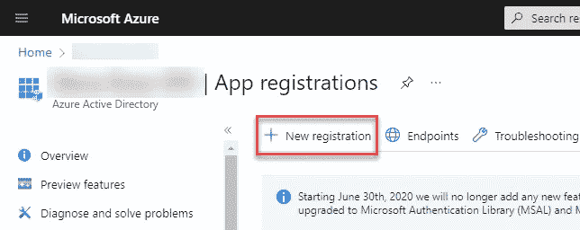

选择应用注册的名称、支持的帐户类型并重定向 URI。然后点击**注册**按钮。

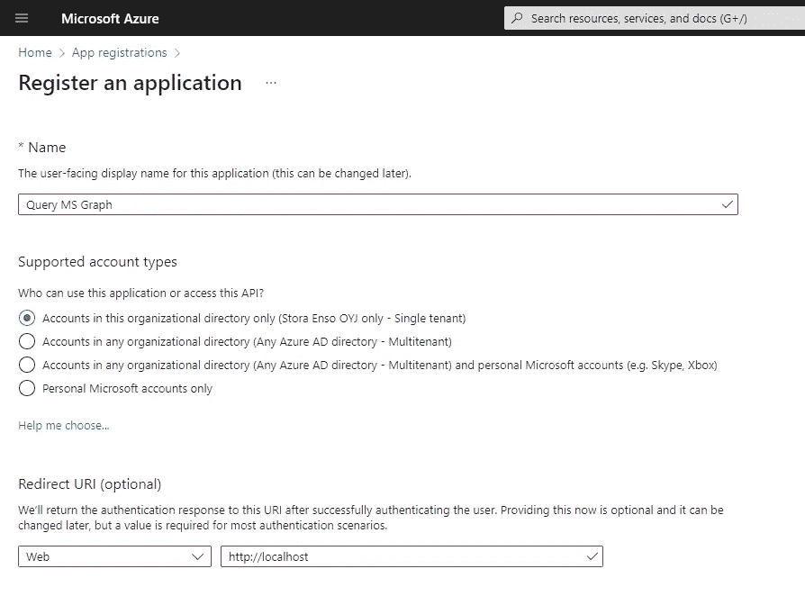

成功注册应用程序后，您将看到它的概述。注意**应用程序(客户端)ID** 和**目录(租户)ID** 并复制它们的值，我们稍后将需要它们。

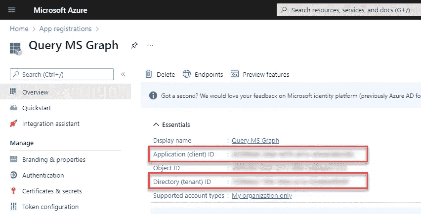

现在，让我们生成一个请求访问令牌时需要的秘密。转到**证书&机密**并点击**新客户机密**。

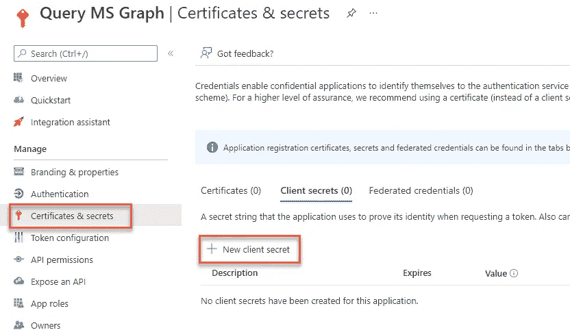

您可以在**添加客户端密码**窗格中更改密码的描述和到期时间。然后点击**添加**。请注意，密码过期后，您需要生成一个新密码。

确保通过点击**复制到剪贴板**按钮复制整个秘密值。秘密只有在创建后才立即可见。

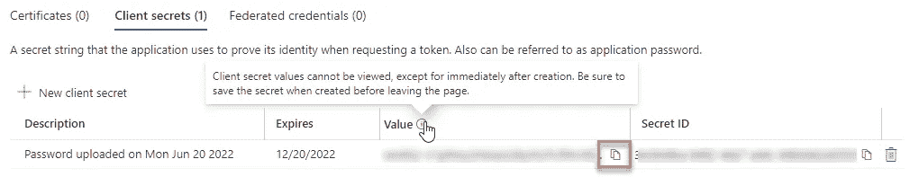

现在，让我们为应用程序注册配置权限。转到 **API 权限**并点击**添加权限**。

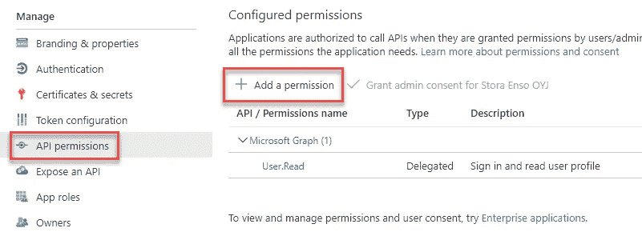

选择**微软图形** → **应用权限**。然后找到您的应用程序所需的权限，选择它们并点击**添加权限**。在这个例子中，我们将查询 Azure 广告组的成员，为此我们需要该组。Read.All 和 User。读取。所有权限。

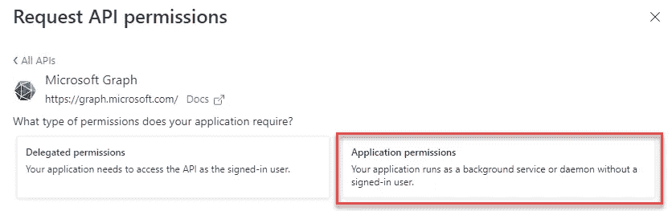

使用具有全局管理员权限的帐户，单击**授予管理员权限……按钮**。如果您没有权限，请向您组织中能够授予您的应用程序管理员许可的人询问。

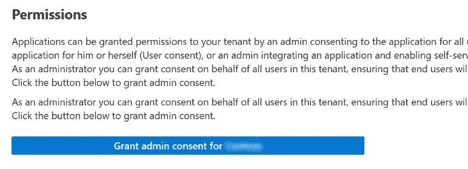

完成后，您应该会在所有权限旁边看到一个绿色的勾号。

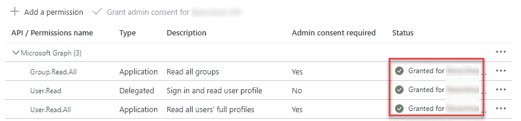

就是这样！应用程序注册现在已经配置好了，我们可以使用客户端 ID 和密码来授权我们对 Microsoft Graph API 的请求。

# 获取访问令牌

当向 MS Graph API 发送请求时，我们需要在请求头中提供一个访问令牌。在本文中，我们将使用 Python 的`msal`库来获取令牌。

代码实现非常简单。不要忘记用你的 Azure 广告应用注册的值来更新`client_id`、`client_secret`和`authority`变量。

运行代码后，您应该会看到类似的结果(实际的令牌会有所不同):

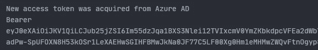

当您再次运行从第 16 行开始的代码时(例如在 jupyter 笔记本中)，您应该看到访问令牌是从缓存中加载的，实际的令牌应该与之前相同。

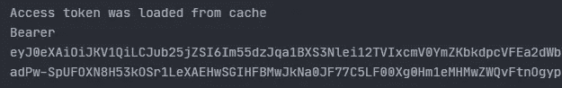

稍后我们将重构代码。现在让我们第一次调用 MS Graph API！

# 使用 client_id 和 secret 查询 MS 图

为了从 MS Graph API 获取数据，我们将使用 Python 中的`requests`库发出 get 请求。

如果请求成功，您应该会看到以 JSON 格式打印出来的结果的第一页(通常是前 100 项)。关于组的信息存储在数组`value`中。在截图中，JSON 输出已经被美化了。

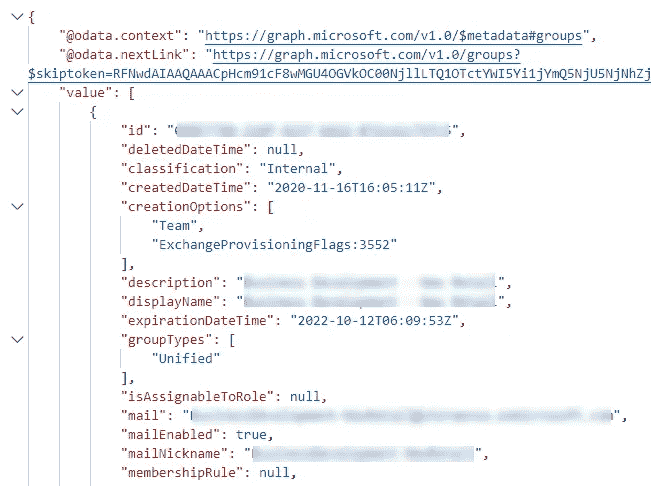

MS Graph API 响应示例

## 页码

注意响应第二行的`@odata.nextLink`属性。这表明返回的数据不完整，我们需要遍历多个页面来检索所有数据。

幸运的是，MS Graph API 让这一切变得非常容易。`@odata.nextLink`属性仅在下一页包含更多数据时可用。我们需要做的是在响应中检查这个属性，只要它在那里，就将端点 URL 更改为它的值。

在 Python 中，它可能是这样的:

# 重构和总结

我们经历了查询 Microsoft Graph API 以将数据放入 Python 项目的所有重要步骤。最后一步是重构代码。让我们创建一个`make_graph_call`函数，它负责获取一个访问令牌，从 API 获取数据并以 JSON 格式返回它们。该函数有两个参数——URL(我们调用的图形 API 端点)和 pagination(可选参数，如果设置为`False`，则只允许查询结果的第一页)。

我希望你喜欢这个教程！请在评论中分享你的反馈。