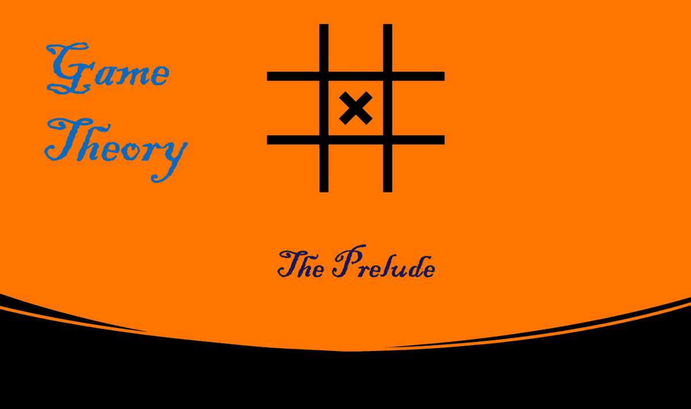

# 傻瓜快速游戏理论博客系列

> 原文：<https://medium.com/nerd-for-tech/quick-game-theory-blog-series-for-dummies-a6fdf7acacd6?source=collection_archive---------27----------------------->

## 6 个博客系列，每个不到 5 分钟

 [## 博弈论:前奏

### 写这一系列博客的意图是向初级读者介绍博弈论，而不需要…

medium.com](/gaming-the-life-game-theory/game-theory-the-prelude-c6fe8791f035)  [## 博弈论:思考的故事

### 在这个博客中，我们将讨论思考，这是做任何决定前不可避免的过程。我们将躺下…

kowshikchilamkurthy.medium.com](https://kowshikchilamkurthy.medium.com/game-theory-story-of-thinking-8cde01a436be)  [## 博弈论:竞争和交叉效应

### 到目前为止，我们已经讨论了理性个体可能面临的决策问题。但是当我们越来越靠近…

kowshikchilamkurthy.medium.com](https://kowshikchilamkurthy.medium.com/game-theory-contention-and-cross-effects-c8cc9f6f0af2)  [## 博弈论:解决方案概念和战略优势(第四部分)

### 信念和最佳对策，共同理性

kowshikchilamkurthy.medium.com](https://kowshikchilamkurthy.medium.com/game-theory-solution-concepts-f6298fec59f9)  [## 博弈论:纳什的天才

### 我们在上一篇博客中详细讨论了严格优势解的概念。它的应用是有限的，只有…

kowshikchilamkurthy.medium.com](https://kowshikchilamkurthy.medium.com/game-theory-the-genius-of-nash-3682751c0ee2)  [## 博弈论:混合策略的纳什均衡(第六部分)

### 连续行动和随机战略博弈

kowshikchilamkurthy.medium.com](https://kowshikchilamkurthy.medium.com/game-theory-nash-equilibrium-for-mixed-strategies-73ae0c45a399)