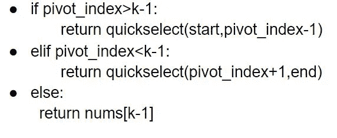
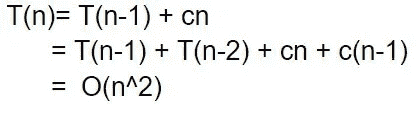
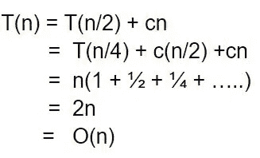
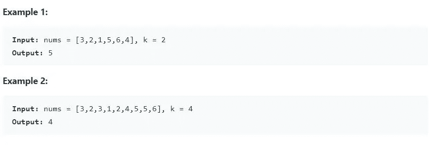

# 快速选择算法

> 原文：<https://medium.com/nerd-for-tech/quick-select-algorithm-17ac146b6218?source=collection_archive---------2----------------------->

快速选择是快速排序算法的一种变体。这是在未排序的数组中找到第 k 个最小/最大元素的优化方法。

## 算法:

*   该算法的划分部分与快速排序相同。
*   在分区函数根据 pivot 排列列表中的元素并返回 pivot_index 之后，我们不再递归 pivot 索引的两侧，而是只递归包含所需元素的部分

## 时间复杂度分析:

最坏的情况:最坏的情况发生在我们选择最大/最小的元素作为轴心的时候。

最好的情况:最好的情况发生在我们把列表分成两半，并且只继续我们感兴趣的那一半的时候。

快速选择的平均时间复杂度是 O(n)(从 O(nlogn)-快速排序减少)。最坏情况的时间复杂度仍然是 O(n ),但是通过使用随机枢轴，在大多数情况下可以避免最坏情况。因此，平均而言，快速选择提供了一个 O(n)的解决方案来查找未排序列表中第 k 个最大/最小的元素。

## 练习:数组中第 k 个最大的元素[ LeetCode — 215]

问题链接:

 [## 数组中第 k 个最大的元素- LeetCode

### 提高你的编码技能，迅速找到工作。这是扩展你的知识和做好准备的最好地方…

leetcode.com](https://leetcode.com/problems/kth-largest-element-in-an-array/) 

问题描述:

给定一个整数数组`nums`和一个整数`k`，返回数组中最大的元素`kth`**。**

注意，它是排序顺序中最大的`kth`元素，而不是`kth`独特元素。

## 解决方案 1:简单易行

对给定的输入列表进行逆序排序，并打印第 k 个元素。时间复杂度为 O(nlogn)。

## 解决方案 2:使用最大堆

构建一个最大堆，提取元素 k 次。最后提取的元素将是答案。建立最大堆的时间复杂度为 O(n ),执行堆化操作的时间复杂度为 O(logn)。所以整体复杂度会是 O(n+klogn)。

以上解决方案足够体面，给你想要的答案。但是在面试中，要求你解决 O(n)中的问题。

## 解决方案 3:快速选择

快速选择允许我们平均在 O(n)内解决问题。使用随机化枢纽，我们可以在大多数情况下避免最坏的情况。因此，当在面试中被问到时，快速选择应该是你的答案，因为它给出了一个更好的时间复杂性解决方案。