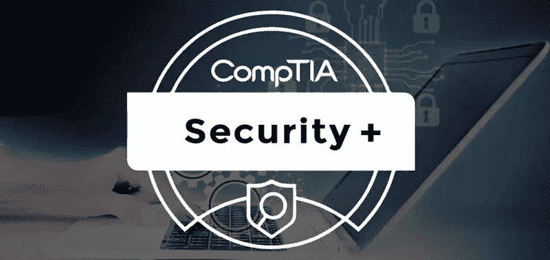
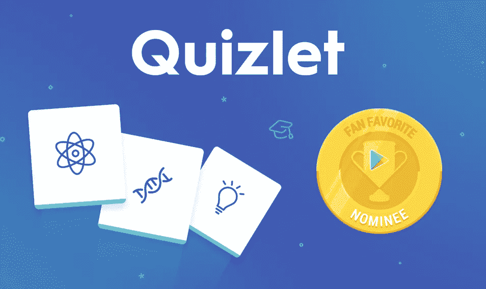
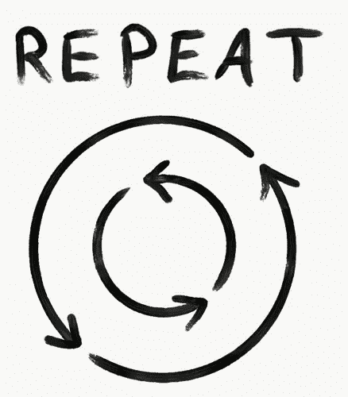

# 通过 CompTIA Security Plus SY0-601 考试的快速提示

> 原文：<https://medium.com/nerd-for-tech/quick-tips-for-passing-the-comptia-security-plus-sy0-601-exam-61ff7f3e499c?source=collection_archive---------1----------------------->

图像[来源](https://www.bytecode.in/wp-content/uploads/2021/04/comptia-security-plus.jpg)

我目前是卡耐基梅隆大学(CMU)的研究生，学习信息安全和策略管理，重点是网络安全。我有 CompTIA SY0–601 Security Plus 考试主题的背景知识。在您阅读更多内容之前，我想让您了解，要通过 Security Plus 考试，您不一定要有信息安全方面的学术背景。在学习材料之前，我对所有与考试相关的话题有了一个基本的了解。这只意味着你需要多花一点时间学习，以获得对网络、加密和恶意软件等主题的基本理解。考试由 80%的术语记忆和 20%的理解组成。本文将概述以下内容:

*   **谁应该参加考试？**
*   **为什么要考？**
*   你想参加考试。现在怎么办？
*   **考试基本布局**
*   **我的学习日程和进程**

‘**谁**’—如果你想改变职业领域，进入 IT 领域，提高你当前工作的技能，或增加你的收入潜力，compTIA Security Plus 认证是一个很好的起点。这个考试最好的一点是，如果你想进入信息安全领域，它是一个入门认证。你需要的所有信息都可以在网上和书本中找到，以通过考试。通过考试不需要真实的 IT 经验。以下是你可以通过认证获得的 [**工作**](https://www.comptia.org/faq/security/why-should-i-get-comptia-security-certified) 清单:

*   初级 IT 审计员
*   渗透测试仪
*   系统管理员
*   网络管理员
*   安全管理员

*'* ***为什么****'*——如果你对认证做过任何研究，你就会知道关于你是否需要认证才能得到一份工作或者没有认证的人仍然可以做这份工作的争论。根据我的经验，招聘人员、人力资源和几家公司希望你有一个认证，以便获得面试机会。认识一个人绕过人事混乱是值得的，但是你仍然需要通过面试才能得到这份工作。学习信息安全基础知识在面试中会大有帮助。如果你想为政府机构、国防承包商或许多私营公司工作，证书是从事项目工作或被雇用的必要条件。

图像[来源](https://whyy.org/programs/the-why/)

现在的'**什么**'——既然你明白了 ***谁****为什么了，那我们就来铺陈一下 ***现在的事情吧。*** 有很多在线资源提供了关于如何通过安全升级考试的见解。我鼓励你自己做研究，找出适合你的方法。我想出了一个适合我的两周学习计划和过程。根据你的知识，你可以调整学习计划，因为你会看到它很容易调整。*

> *一个好的经验法则是从 2-3 个来源获取学习材料，因为没有一个来源会提供通过考试所需的所有信息。*

*考试集中在 5 个部分，理解与每个部分相关的所有主题和定义非常重要。考试中的问题经常被放到真实世界的场景中，你必须选择最好的选项。参考下面提到的部分是很重要的，因为考试的大部分 **(70%)** 在前 3 个部分已经涵盖了。*

## *1.攻击、威胁和漏洞→ 24%*

## *2.建筑和设计→ 21%*

## *3.实施→ 25%*

## *4.运营和事故响应→ 16%*

## *5.治理、风险和合规性→ 14%*

*更多信息可以在这里找到.pdf)****。*****

*****考试详情:*****

*   ***CompTIA Security 的当前版本是 2020 年 11 月 12 日发布的 SY0–601。***
*   ***费用为 381 美元，学生为 240 美元。***
*   ***最多 90 个问题，包括选择题和基于表现的问题。***
*   ***及格分数是 750 分(在 100-900 分的范围内)或 83%。***
*   ***更多考试信息可以在 **这里找到 [**。**](https://www.comptia.org/certifications/security)*****

1.  *****阅读**[**CompTIA Security Plus SY0–601**](https://www.amazon.com/CompTIA-Security-Certification-Complete-coverage/dp/1800564244/ref=sr_1_1_sspa?crid=1Q7XH0ZAYWYC4&keywords=security+plus+601+study+guide&qid=1642276723&sprefix=security+plus+%2Caps%2C90&sr=8-1-spons&psc=1&spLa=ZW5jcnlwdGVkUXVhbGlmaWVyPUExTTNUREVQNDE4NEJKJmVuY3J5cHRlZElkPUEwODY3Nzk3MTQwNEdURFA1SlI5MiZlbmNyeXB0ZWRBZElkPUExMDQwNDQ2M1FaVkg1NU9aOTVWTiZ3aWRnZXROYW1lPXNwX2F0ZiZhY3Rpb249Y2xpY2tSZWRpcmVjdCZkb05vdExvZ0NsaWNrPXRydWU=)**学习指南。*****

******

***买一份 [**这里**](https://amzn.to/3nwE553)***

***我买了这本书，因为它有很好的评论，概述了几乎没有绒毛的材料。它解释了这一概念的基础，并经常提供一些很好的例子来说明现实世界与技术的联系。我花了第一周的时间阅读这本书，并为章末复习题创建了一个学习指南。每章的长度不同，问题的数量从 30-60 个不等。在每一章之后，我把问题打出来，并在这一章中找到每个问题的答案。答案在书后面的索引里。找到答案帮助我更好地理解材料，并为考试中的问题类型做好准备。问题和考试中的不完全一样，但是接触问题和材料在这一点上是很重要的。每晚睡觉前，我都会复习这些问题。***

*****2。使用刀子乐队教授的材料来辅助学习材料。*****

***刀子乐队教授是一个很好的资源，你可以免费在线观看他的视频。这是更好地理解恶意软件、加密、云安全、风险缓解和法规遵从性等关键概念的好方法。这些视频很棒，分成几个部分以方便学习。有些主题和定义非常简单，你只需要读一两遍就能记住。还有的需要重复记忆。我用视频来补充这本书，这意味着我用这本书作为我寻找定义和例子的主要来源。如果我需要更多的例子和更深入的理解，我会用刀子乐队教授的视频和谷歌来补充我的学习。***

***[刀子乐队教授](https://www.professormesser.com)***

******

***查看他的网站[**这里**](https://www.amazon.com/gp/product/B08LVKZ7HY/ref=as_li_tl?ie=UTF8&camp=1789&creative=9325&creativeASIN=B08LVKZ7HY&linkCode=as2&tag=alltechguy-20&linkId=0f9a06ac784090f157f3617f390bc52f")***

***在读完整本书，看完视频，学习完所有的章节末评论后，是时候参加书末的 2 个练习题了。这样做的目的是根据你的分数来看你的知识水平。不要因为自己的分数而气馁；这是一个发现你需要改进的地方的机会。例如，我对第 1 部分(攻击、威胁和漏洞)有了很好的理解，但我需要更彻底地研究其他部分。***

*****3。使用闪存卡。*****

******

***图片[来源](https://quizlet.com/blog/vote-for-quizlet-for-google-play-fan-favorite-app-of-2018)***

***我更喜欢使用 Quizlet 应用程序，因为我可以从我的手机上的任何地方访问它们，它们可以根据你的 Quizlet 学习集为你创建问题。Quizlet 是免费的，还提供了一个具有更多功能的 Plus 版本。免费版就足够了，是记忆定义的好工具。考试很大一部分是记忆，消除错误答案找到正确答案是一个很好的策略。此时，我又看了一遍这本书，用我需要再次学习的定义填补了空白。例如，加密部分比其他部分更不直观，需要花费大量精力才能理解。还有很多术语要背。为了给你一个更好的想法，我最后做了大约 200 个单词/抽认卡。***

*****4。练习考试，练习考试，更多练习考试*****

***有几个地方你可以找到实践考试，但我发现刀子乐队教授的内容有价值和负担得起的。点击 查看刀子乐队教授考试 [**。此时，分数对判断你的知识水平和做出调整以填补空白很重要。如果你在模拟考试中获得了 90%或以上的分数，你就可以参加考试了。**](https://www.professormesser.com/sy0-601-success-bundle/)***

******

***图像[来源](https://crunchprep.com/gre/free-gre-practice-tests)***

> ***为自己设定一个考试日期和截止日期是很重要的。如果你给自己三周时间，你会在三周内实现它。如果你从不为自己设定最后期限，你很可能无法完成它。***

***我买了教育考试券，把考试安排在两个星期后。我觉得时间足够了，因为寒假期间我有时间准备考试。我要说的是，刀子乐队教授的模拟考试相当准确，提供了大量关于考试问题类型的信息，以及如何提问的示例，这是安全专业人员最常通过场景完成的。***

***我发现复习你在考试中漏掉的问题极其重要。刀子乐队教授的考试也有每个问题的详细解释和涉及该主题的视频链接。每次练习考试后，我都会复习我错过的内容，并更加认真地学习那些抽认卡。我制作了新的抽认卡，以确保我不会错过基于该术语/主题的另一个问题。当我重复这个过程时，我发现我的分数提高了 6-8%。如果你需要额外的练习，你可以重复练习考试，因为你很可能在参加了几次考试后就不记得答案了。根据我的考试成绩，在参加了 5 次模拟考试后，我为考试做好了准备。***

******

***图像[来源](https://dariusforoux.com/repetition/)***

***总之，你可以通过这四个简单的步骤通过安全考试。虽然这并不容易，需要你付出很多努力，但它将为你提供基础知识，帮助你的学习之旅和职业生涯。***

1.  ***通读全书，获取基础知识。***
2.  ***使用刀子乐队教授的材料来补充你的学习。***
3.  ***使用抽认卡并记住术语。***
4.  ***做几次模拟测试，复习，研究术语，然后重复。***

***感谢您的阅读！我希望这篇短文能够帮助您实现通过 CompTIA Security Plus 考试的目标！如果你想购买上面提到的书，请随时使用此链接购买你的[**CompTIA Security+:SY0–601 认证指南**](https://amzn.to/3nwE553) ，因为我是亚马逊的一个分支机构。谢谢大家的支持！***