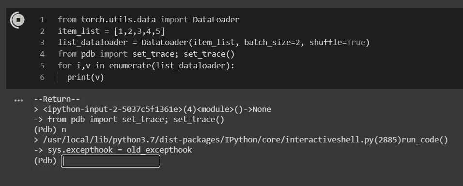
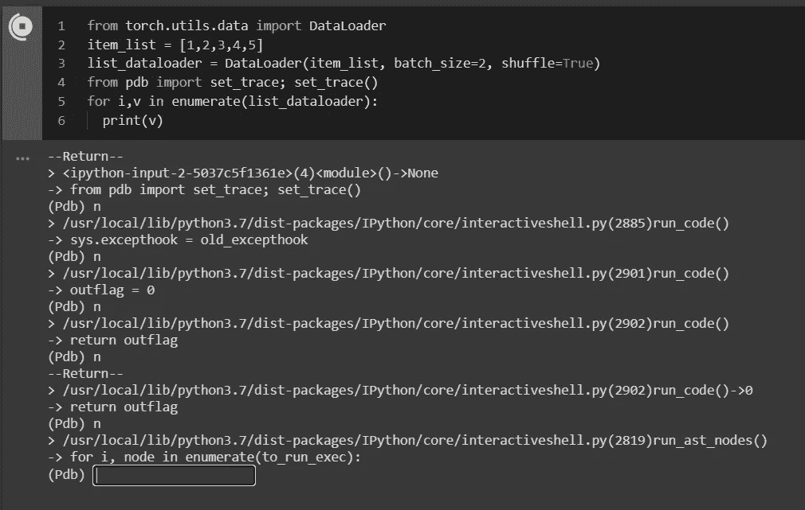
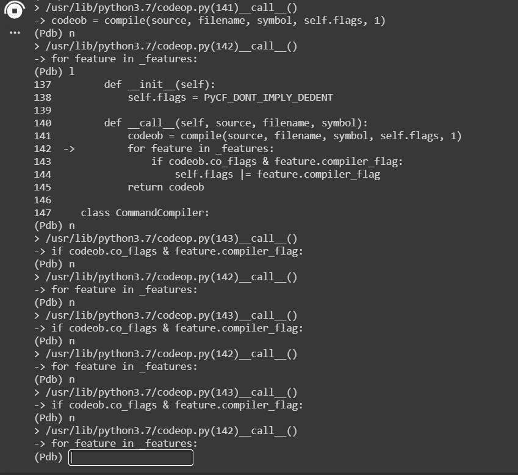
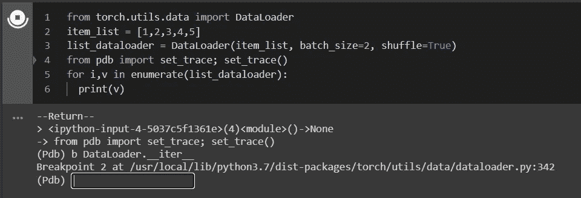
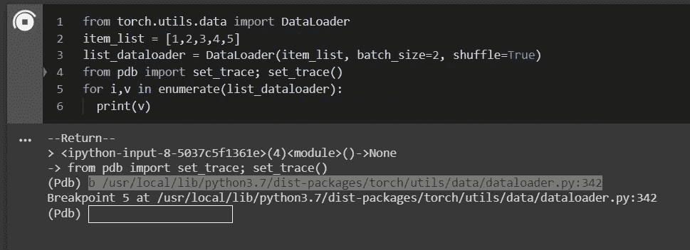
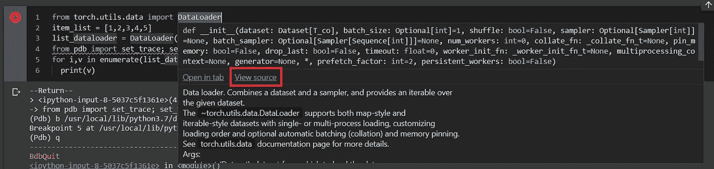
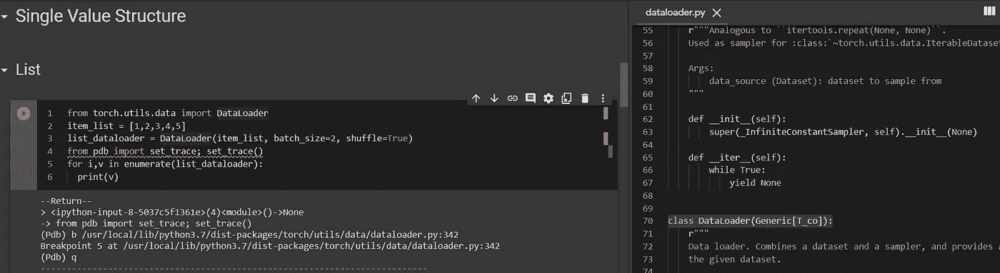

# 使用 pdb 调试 Colab 中已安装软件包的代码的快速技巧

> 原文：<https://medium.com/nerd-for-tech/quick-tips-on-using-pdb-to-debug-code-of-installed-packages-in-colab-2a243984b578?source=collection_archive---------8----------------------->

当在 Colab 中运行代码时，有时我需要调试不是由我开发而是来自已安装的包的代码，并且不可能在内部修改代码。

当代码由我自己编写时，添加代码很容易:

```
from pdb import set_trace; set_trace()
```

所以当代码运行到这行时，就会触发调试:



# **问题**

请注意，在调试时，点击“n”(下一步)不会将我们带到代码中的下一行(第 5 行)，我们需要尝试一些“n”或“s”(步骤)来到达该行:



为了进入枚举函数以运行数据加载器，它需要更多的“n”或“s”或“up ”,有时只是通过了代码行，需要再次重复相同的过程。

原因是有许多 Colab/Jupter 笔记本代码需要运行到我想要调试行。



# 解决办法

解决方案实际上很简单，因为我们有 list_dataloader 对象实例，我们实际上可以告诉调试器将断点设置到数据加载器内部的实例函数，即 list_dataloader。__iter__()


打“c”(继续)设置断点后，我到了 dataloader 实例的 __iter__()处。


另一方面，如果我们在当前的调试范围内没有实例，并且想要向类添加断点，我们将执行类似的 add breakpoint 命令。



有时你可能想在函数中间的一行中断，你可以在特定的一行设置断点。



但是我们怎么知道是哪条线呢？Colab 给出了一个非常简单的 UX，点击“查看源代码”链接



代码将在右窗格中打开，浏览文件并找到设置断点所需的行。



希望这对某人有所帮助。