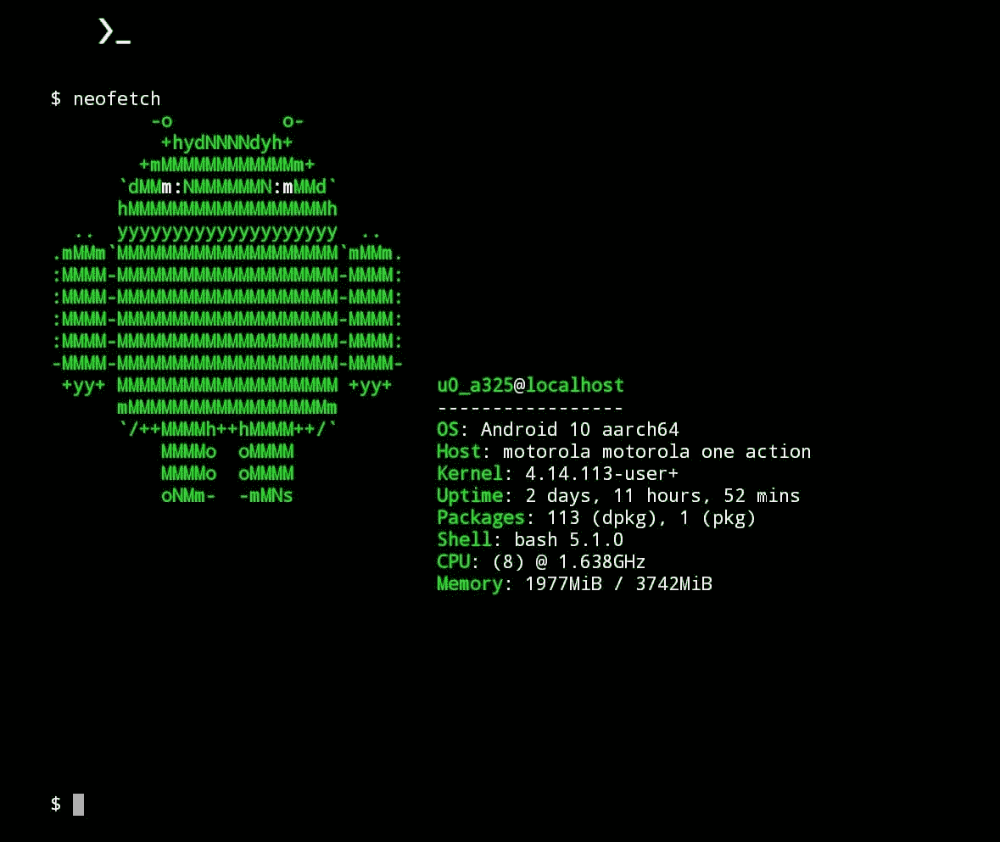

# 在 Termux 上查找系统信息的快速方法

> 原文：<https://medium.com/nerd-for-tech/quick-way-to-look-up-system-info-on-termux-9a3b35710f54?source=collection_archive---------3----------------------->

当你读完这篇文章后，看看我关于 Termux 的其他文章:

[为什么使用 Termux](/@seandreas/why-use-termux-bad137142f3e)

[使用 Termux 将照片同步到桌面](/@seandreas/sync-photos-to-desktop-using-termux-767f1ff4aff2)

通常你需要点击几个 GUI 按钮来获取一些系统信息。使用 Termux，你只需输入一个词:neofetch。



看那个可爱的小家伙！

现在，我承认这是一个非常古怪的获取系统信息的方式。通过命令行这样做的要点是，获得您需要的信息比通过 GUI 找到正确的选项卡要快得多。图片上面的并不是你能得到的全部信息。让我们看看如何修改它，以获取更多信息。

首先你需要下载 Neofetch:

```
pkg install neofetch
```

它已经配置好了，所以你可以输入`neofetch`，你会得到类似上面图片的东西。有更多的选项可供选择，所以让我们看看配置文件，看看我们还能想到什么。要进入配置文件，键入`ls -a`来查看 Termux 的主文件夹中有什么。它可能看起来类似于 thins:

```
. .. .bash_history  .config  .local  .ssh  storage
```

我们正在寻找的文件夹是`.config`，所以继续前进，进入`cd`。输入`ls`，这一次你应该会看到一个标有`neofetch`的文件夹。现在`cd`进入那个文件夹，那里唯一的东西应该是 config.conf 文件。让我们用`nano`编辑它。(你可能需要安装`nano`，所以输入`pkg install nano`)。

```
nano config.conf
```

您应该会得到类似如下的输出:

```
# Neofetch config file
# [https://github.com/dylanaraps/neofetch](https://github.com/dylanaraps/neofetch)# See this wiki page for more info:
# [https://github.com/dylanaraps/neofetch/wiki/Customizing-Info](https://github.com/dylanaraps/neofetch/wiki/Customizing-Info)
print_info() {
    info title
    info underlineinfo "OS" distro
    info "Host" model
    info "Kernel" kernel
    info "Uptime" uptime
    info "Packages" packages
    info "Shell" shell
    info "Resolution" resolution
    info "DE" de
    info "WM" wm
    info "WM Theme" wm_theme
    info "Theme" theme
    info "Icons" icons
    info "Terminal" term
    info "Terminal Font" term_font
    info "CPU" cpu
    info "GPU" gpu
    info "Memory" memoryinfo "GPU Driver" gpu_driver  # Linux/macOS only
    info "CPU Usage" cpu_usage
    # info "Disk" disk
    # info "Battery" battery
    # info "Font" font
    # info "Song" song
    # info "Local IP" local_ip
    # info "Public IP" public_ip
    # info "Users" users
    # info "Install Date" install_date
    # info "Locale" locale  # This only works on glibc systems.
    info line_break
    info cols
    info line_break
}
```

这并不是配置文件中的全部内容，但是足够我们选择我们想要的选项了。您可以通过在行首添加一个`#`来轻松禁止信息打印。如果不想打印任何行，则相反。并非所有这些选项都适合 Android。这个软件包更多的是集中在桌面电脑上，并且没有根用户权限来访问你的手机，这将会限制你所看到的内容。因此，您应该尝试一下选项，看看哪些信息可以打印出来。

你可以添加一些不在列表中的东西。首先是天气。你输入这行代码，它会给出你的 IP 地址所在位置的天气情况(这意味着它可能不是你的实际物理位置):

```
prin "Weather" "$(curl wttr.in/?0?q?T | awk '/°(C|F)/ {printf $(NF-1) $(NF) " ("a")"} /,/ {a=$0}')"
```

您可以将这条线放在`{}`之间的任何位置。此外，使用`prin`命令，您可以添加自定义消息或信息行。您的行可能如下所示:

```
prin "They say the command line is too hard."prin "Date" "$(date)"
```

更多关于你可以添加到 neofetch 为你打印的信息中的信息，请访问他们的[维基](https://github.com/dylanaraps/neofetch/wiki)。请在下面的评论中分享一些你想到或尝试的选择吧！