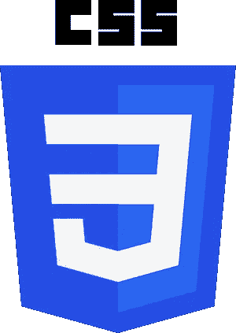

# Quickie 开发#9:使用 CSS 选择器

> 原文：<https://medium.com/nerd-for-tech/quickie-dev-9-using-css-selectors-8d68a4ed5472?source=collection_archive---------10----------------------->

## 因为“普通的 CSS”选择器通常是您样式化 DOM 所需要的全部！

在过去的几年里，CSS 预处理程序的前端开发有一个很大的趋势。 [SASS，LESS，Stylus…](https://www.template.net/tutorials/css-preprocessor/) 经典样式表的所有这些扩展允许您在 DOM 上进行更复杂的查询，分解您的样式定义，并且经常变得更简洁…