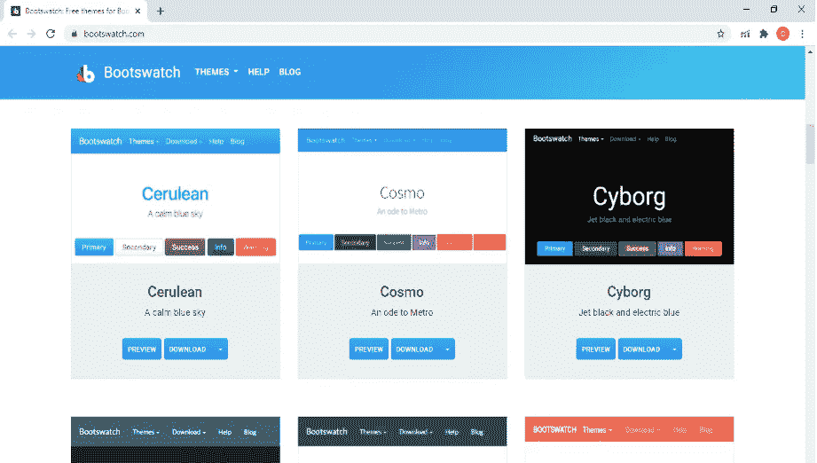

# 以多种方式将引导程序快速添加到 Angular 9|10 应用程序中

> 原文：<https://medium.com/nerd-for-tech/quickly-add-bootstrap-to-your-angular-9-10-application-in-multiple-ways-58fb98ce4dc2?source=collection_archive---------1----------------------->

> 在本文中，我们将讨论在 angular 应用程序中添加引导程序的多种方法，基本上我们将讨论在 Angular 应用程序中安装引导程序库的多种方法。此外，我们将看到我们如何在我们的项目中有不同的颜色主题。

## 什么是自举？

Bootstrap 是一个强大的工具包，它集合了 HTML、CSS 和 JavaScript 工具，用于创建和构建网页和 web 应用程序。这是一个免费的开源项目，托管在 [GitHub](https://github.com/twbs/bootstrap) 上。

Bootstrap 通过 Bootstrap(世界上最受欢迎的前端开源工具包，具有 Sass 变量和 mixins、响应式网格系统、广泛的预构建组件和强大的 JavaScript 插件)为您提供快速设计和定制响应式移动优先站点。

Bootstrap 4 是 Bootstrap (BS)的最新版本，它为框架带来了许多新的强大功能，最重要的是 Flex box，它现在是 Bootstrap 网格布局的默认显示系统，而网格是 Bootstrap 最重要的功能之一。

## 设置角度项目

首先，我们将创建新的 Angular 项目，最简单的方法是，我们将使用 CLI(命令行界面)&打开 CLI 的快捷方式是按下 *windows 键+ R 键*同时它将打开运行窗口键入 cmd 它将在 windows 中打开命令提示符，然后导航到任何驱动器或任何文件夹您想要创建您的项目，然后输入以下命令创建新项目:

```
$ ng new DemoBootstrap
```

现在将目录更改为创建的项目

```
$ cd myproject
```

并运行该项目

```
$ ng serve
```

打开 URL[http://localhost:4200/](http://localhost:4200/)检查项目是否运行良好。

## 安装引导程序

现在 angular 项目已经准备好并运行良好，可以添加引导程序，有多种方法可以在 Angular 中添加引导程序，我们将一个接一个地看到。在这里，你会发现 3 种方法来添加角自举。

## **第一种方式:使用 npm 安装引导程序**

**步骤 1:使用以下命令**安装引导程序

这是一个安装 bootstrap 的简单技术，就像其他 npm 库一样，我们可以安装它，但需要在 *angular.json* 文件中定义它。好处是，如果我们安装 npm 库，它将可以脱机使用。

以下是按版本安装引导程序的命令

**对于引导程序 3:**

npm 安装引导程序@3.3.7

**对于引导程序 4:**

npm 安装引导

**第二步:配置 angular.js**

```
...
"styles": [
  "src/styles.css",
  "node_modules/bootstrap/dist/css/bootstrap.min.css"
],
"scripts": [
  "node_modules/jquery/dist/jquery.min.js",
  "node_modules/bootstrap/dist/js/bootstrap.min.js"
]
...
```

只需在 style.css 中导入:

```
@import '~bootstrap/dist/css/bootstrap.min.css';
```

**第二种方式:本地添加文件，导入**

在本地添加文件的意义上，我们可以很容易地从[链接](https://getbootstrap.com/docs/4.0/getting-started/download/)下载文件，将其复制到 assets 文件夹中，然后将

将其导入到 *angular.json* 文件中，如:

```
"styles": [
  "assets/bootstrap/css/bootstrap.min.css",
  "styles.scss"
],
"scripts": [
    "assets/bootstrap/js/jquery.min.js",
    "assets/bootstrap/js/bootstrap.min.js"
  ],
```

或者

在 style.css 文件中:

```
@import 'assets/bootstrap/css/bootstrap.min.css';
```

或者

在 index.html 文件中:

在下标记

```
<link rel="stylesheet" href="assets/bootstrap/css/bootstrap.min.css">
```

jQuery 库下面的标签下。

```
<script src="assets/bootstrap/css/js/bootstrap.min.js"></script>
```

**第三种方式:只需在 index.html 文件中添加 cdn**

通过这种方式，我们将不得不复制 cdn，即 index.html 文件中 bootstrap 官方网站上提供的 url，以获取 cdn 点击[此处](https://www.bootstrapcdn.com/)。

你的*index.html*文件将会是这样的:

```
<!doctype html>
<html lang="en">

<head>
  <meta charset="utf-8">
  <title>Demo</title>
  <base href="/">
  <meta name="viewport" content="width=device-width, initial-scale=1">
  <link rel="icon" type="image/x-icon" href="favicon.ico">

  <link href="https://stackpath.bootstrapcdn.com/bootstrap/4.5.0/css/bootstrap.min.css" rel="stylesheet"
    integrity="sha384-9aIt2nRpC12Uk9gS9baDl411NQApFmC26EwAOH8WgZl5MYYxFfc+NcPb1dKGj7Sk" crossorigin="anonymous">
</head>

<body>
  <app-root></app-root>

  <script src="https://code.jquery.com/jquery-3.4.1.slim.min.js"></script>
  <script src="https://stackpath.bootstrapcdn.com/bootstrap/4.5.0/js/bootstrap.min.js"
    integrity="sha384-OgVRvuATP1z7JjHLkuOU7Xw704+h835Lr+6QL9UvYjZE3Ipu6Tp75j7Bh/kR0JKI"
    crossorigin="anonymous"></script>
  <script src="https://stackpath.bootstrapcdn.com/bootstrap/4.5.0/js/bootstrap.bundle.min.js"
    integrity="sha384-1CmrxMRARb6aLqgBO7yyAxTOQE2AKb9GfXnEo760AUcUmFx3ibVJJAzGytlQcNXd"
    crossorigin="anonymous"></script>
</body>

</html>
```

在 index.html 文件中，你应该复制部分的 css 链接和部分的 js 文件

注意:在添加 Bootstrap 的 JavaScript 文件之前，必须包含标签中的任何 js 脚本，jQuery。

## 测试 bootstrap 是否完美安装在您的应用程序中

现在我们准备在我们的任何一个应用程序组件中使用 bootstrap，让我们在主组件 app.component.html 中检查一下。

```
<div class="container">
    <div class="jumbotron">
        <h1>Welcome</h1>
        <h2>Angular Bootstrap Demo</h2>
    </div>
    <div class="panel panel-primary">
        <div class="panel-heading">Panel with panel-primary class</div>
        <div class="panel-body">Panel Content</div>
    </div>
</div>
```

酷，你已经成功地在你的应用程序中添加了 bootstrap，你会发现结果，如果你按照步骤正确。

## 使用靴子样本主题

你可以用 boots 沃琪改变你的引导主题，你只需要去 https://bootswatch.com/网站。它将在网站下打开，如下图所示。在网站上，你只需要选择一个主题，然后点击“下载”按钮。它将下载一个名为 bootstrap.min.css 的文件。你必须像上面描述的第二种方法一样将它复制到 assets 文件夹中，然后在之前声明的地方进行更改。

**index.html**

```
<link rel="stylesheet" href="assets/cyborg/bootstrap.min.css">
```

**style.css**

```
@import 'assets/cyborg/bootstrap.min.css';
```

**angular.json**

```
"styles": [
  "assets/cyborg/bootstrap.min.css",
  "styles.scss"
],
```



现在你的主题改变了，你的浏览器有了不同的外观，主题颜色也像这样改变了，你可以尝试不同的主题，因为 Bootswatch 提供了许多不同的主题，你只需要下载并在你的项目中以多种方式配置它。

# 结论:

仅此而已。在这篇文章中，我们学习了在 Angular 项目中添加 bootstrap 的多种方法。也看到了例子后，安装引导，然后如何改变主题与 boots 沃琪。