# Quora 问题对相似性问题

> 原文：<https://medium.com/nerd-for-tech/quora-question-pairs-similarity-problem-5868b7a33e1e?source=collection_archive---------7----------------------->

## 使用文本分析和经典的机器学习方法解决现实世界的问题！

uora 是一个美国问答网站，在这里，互联网用户以事实或观点的形式提出、回答、关注和编辑问题。

每月有超过 1 亿人访问 Quora，所以很多人问类似措辞的问题也就不足为奇了。具有相同意图的多个问题会导致搜索者花费更多的时间来寻找问题的最佳答案，并使作者感到他们需要回答同一问题的多个版本。Quora 关注规范问题，因为它们为积极的搜索者和作者提供了更好的体验，并为这两个群体提供了更大的长期价值。

# 商业问题

确定 Quora 上问的哪些问题是已经问过的问题的重复。

这对于立即提供已经回答的问题的答案可能是有用的。我们的任务是预测一对问题是否重复。

# 用户指南

在我的 GitHub 仓库中， [**Colab 笔记本**](https://github.com/Priyanka-Dandale/Quora-Questions-Pairs-Kaggle-Competition) 可用于这个真实世界的用例！

# 限制

1.  错误分类的代价可能非常高。
2.  你需要一对重复问题的概率，这样你就可以选择任何选择的阈值。比如说，如果你选择概率阈值为 0.95，那么 Prob(问题 1 类似于问题 2) ≥0.95，那么只合并问题 1 和问题 2 的答案，否则不合并。
3.  没有严格的延迟问题。
4.  可解释性是部分重要的。

# 理解数据

您可以从[***Kaggle***](https://www.kaggle.com/c/quora-question-pairs/data)***或我的***[***GitHub***](https://github.com/Priyanka-Dandale/Quora-Questions-Pairs-Kaggle-Competition)***资源库下载用例的数据集。***

**数据概述**

数据将在一个文件 ***train.csv.*** 中总共有 *404，290* 个观测值或行数。它包含 *6* 列:id(观察 id)，qid1(第一个问题 id)，qid2(第二个问题 id)，question1(第一个问题的文本内容)，question2(第二个问题的文本内容)，is_duplicate 是问题是否重复的标签，分别用 1 或 0 表示。

前 10 个数据观察

# ML 问题的类型

这是一个*二元分类问题，对于给定的一对问题，我们需要预测它们是否重复。*

# *探索性数据分析*

***用于训练的问题对总数是多少？**———404290。*

*数据中是否有空值或缺失值？ — —问题 1 有 1 个空对象或缺失值，问题 2 有 2 个空对象或缺失值。我们将用空白字符串填充缺失的值。*

*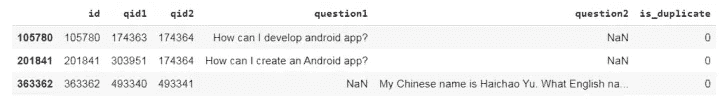*

***最终类标签分布如何？***

*重复(相似或 1)问题数为 *149263* ，非重复(不相似或 0)问题数为 *255027* ，分别占数据的 36.92%和 63.08%。只有 37%左右的问题对是相似的！*

*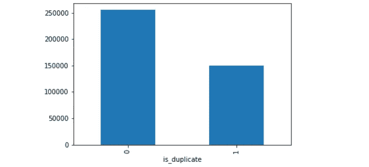*

***独特题有多少？**———537933*

*查找独特问题的图示:在下图的虚拟数据中，请注意问题的 id 在第 4 行和第 5 行重复出现。观察的总数是 5，但是唯一的问题数是 6，分别是 1、2、3、4、5 和 6。为了找到问题的唯一数量，我们应该考虑来自 qid1 和 qid2 的唯一问题 id 的数量。*

*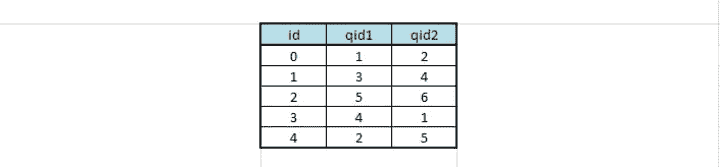*

*大约 21%的独特问题被重复多次。*

*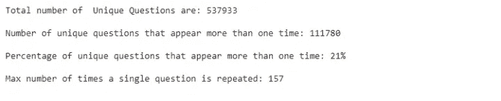*

***重复次数最多的问题是哪个？“减肥的最好方法是什么？”问题是否重复了 157 次。似乎人们对如何减肥更感兴趣！:P***

***有没有重复的成对题？不！***

*查看是否有任何重复问题对的图示:在下图的虚拟数据中，有 2 个重复问题对，一个问题对的 id 为 0 和 4，另一个问题对的 id 为 1 和 2。*

*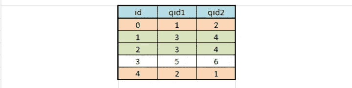*

*每个问题出现的次数是多少？*

*注意 y 轴是对数轴，10 的 0 次方是 1，依此类推……注意有一个问题重复了 160 次左右。*

*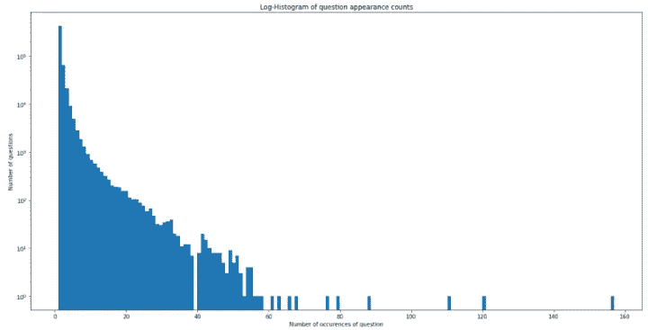*

# *数据清洗前的特征提取*

*让我们从特征工程开始。我们将提取 11 个可能的特征，这些特征中有些可能有用，有些可能根本没用。在构造了下面的特性之后，我们总共有 17 列，包括输出特性 is_duplicate。考虑以下虚拟数据进行说明:*

*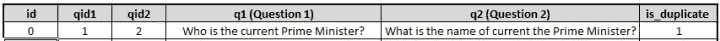**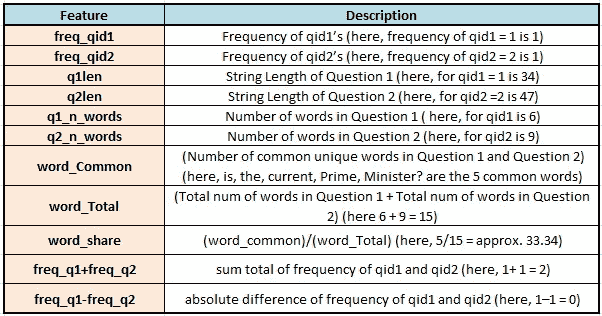*

## *对上面提取的特征的分析*

*   *问题 1 有 67 个问题，问题 2 有 24 个问题，只有一个词！*
*   *“word_share”功能有很强的预测能力，因为它善于将重复问题与非重复问题区分开来。左侧的小提琴图显示，重复问题比非重复问题共享更多的常用词，因此重复问题的 word_share 更高。标准化 word_share 的分布在最右侧有一些重叠，即有相当多的问题具有高的单词相似性。*
*   *有趣的是，它似乎很擅长识别绝对不同的问题，但不太擅长发现绝对重复的问题。*

*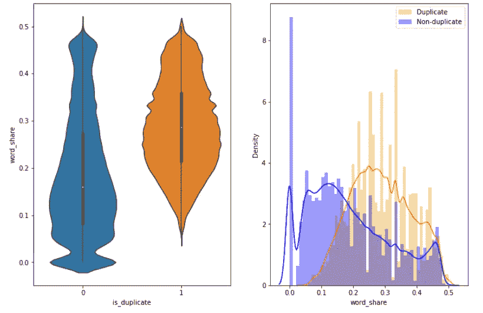*

*   *在下图中，word_Common 特征在相似和不相似问题中的分布高度重叠。因此，这个特性对我们来说并不是很有用。*

*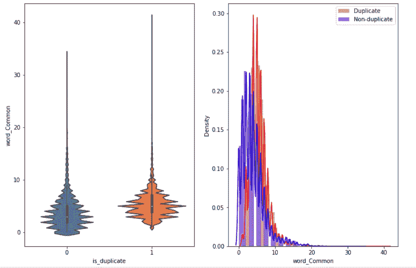*

*   *在下图中，特征词 _Total 的分布高度重叠。因此，这个特征对于区分重复和非重复问题毫无帮助。*

*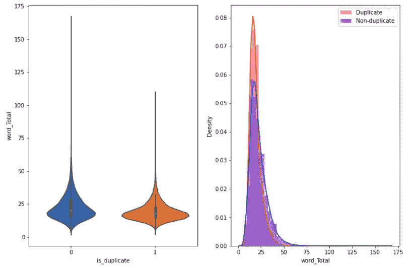*

*   *下面的相关图还显示，并非所有提取的特征都有助于区分问题是否重复。唯一的 word_share 与类标签的相关性稍高。*

*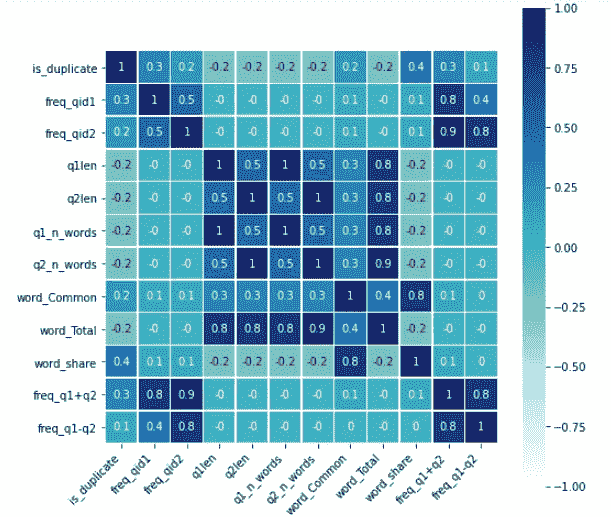*

## *语义分析*

*接下来，我们将看看不同标点在问题中的用法——这可能为后面一些有趣的功能奠定基础。*

*   *带问号的问题:99.87%*
*   *带有[数学]标签的问题:0.12%*
*   *带句号的问题:6.31%*
*   *首字母大写的问题:99.81%*
*   *大写字母的问题:99.95%*
*   *带数字的问题:11.83%*

# *数据清理后的高级特征提取(NLP 和模糊特征)*

*考虑“什么是数据科学？”用于说明的句子:*

*   ***令牌**:将一句话用空格分割，得到一个令牌。*

*《出埃及记》:'什么'，'是'，'数据'，'科学？'是四个代币。*

*   ***停用词**:根据 NLTK 停用词。*

*《出埃及记》:这里“is”是停用词。*

*   ***字**:不是停用字的令牌。*

*《出埃及记》:'什么'，'数据'，'科学？'是单词。*

*以下是我们将提取的 21 项新功能:*

*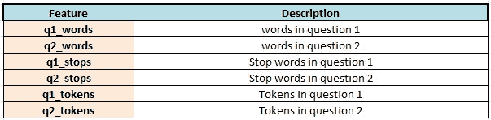**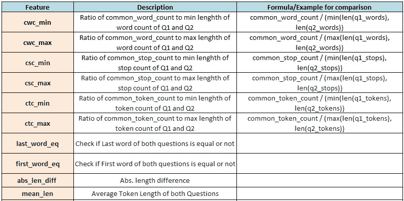**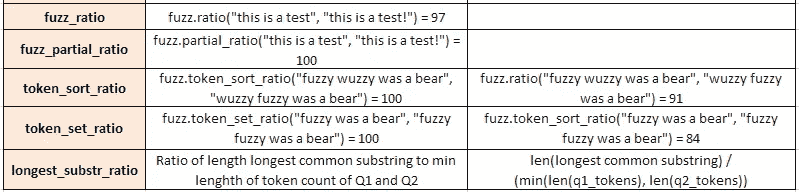*

*更多关于 [**fuzzy-wuzzy 特性**](https://chairnerd.seatgeek.com/fuzzywuzzy-fuzzy-string-matching-in-python/) **的信息。***

## *对上面提取的特征的分析*

*   *类别 1 中的数据点或问题的数量(重复对): *298526**
*   *类别 0 中数据点或问题的数量(非重复对): *510054**

*从问题中删除停用词后:*

*   *重复对问题的总字数: *16109861**
*   *非重复对问题的总字数: *33192952**

*从重复配对问题的文本中生成的词云:*

*   *donald trump、best way、1k 卢比是重复问题对中出现最多的词。*

*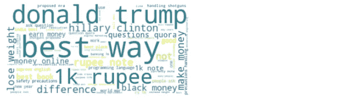*

*从非重复配对问题的文本中生成的词云:*

*   *not、will、difference、India 是非重复问题对中出现最多的词。*

*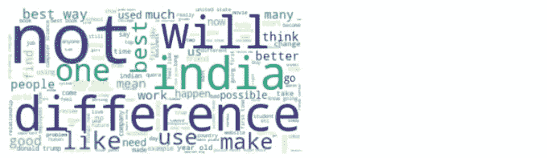*

*   *下面的相关图还显示，并非所有提取的特征都有助于区分问题是否重复。token_sort_ratio、token_set_ratio、fuzz_ratio、fuzz_partial_ratio、ctc_min、ctc_max、cwc_min 和 cwc_max 等特征与类别标签的相关性稍高，因此有助于区分问题是否是重复对。*

*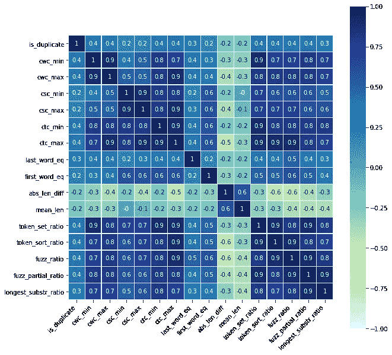*

## *用于可视化的 t-SNE(t-分布随机邻域嵌入)*

*T-SNE 是最常用的降维技术。这是一种统计方法，通过在二维或三维地图中给出每个数据点的位置来可视化高维数据。*

*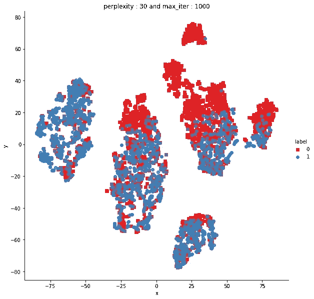*

*在上面的二维图形中，请注意，有几个区域的最大数据点只有一个类 0(非重复)或 1(重复)重叠，但也有几个区域可以快速分离类区域 0 或 1。因此，这给了我们一个提示，我们设计的多维特征在区分这两个类上肯定有一些价值，虽然不是完美的，但是在某种程度上！*

*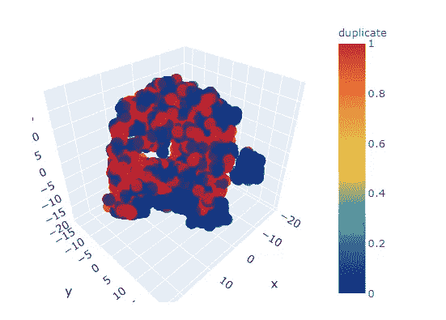*

## *使用 TF-IDF 加权 word2vec 进行特征化*

*我们注意到，一些单词在重复的问题对(即类别 1)中出现得更频繁，而一些单词在非重复的问题对(即类别 0)中出现得更频繁(参见单词云部分)。*

*   *在该方法中，我们将计算每个单词的 TF-IDF 值，然后对 TF-IDF 值与相应单词向量的乘积求和，并将该和除以 TF-IDF 值的和。*

> *注意，我们将使用 Glove(全局向量)来代替 word2vec。*

*   *word2vec 和 Glove 都使我们能够以向量的形式表示一个单词(通常称为嵌入)。它们是两种最流行的单词嵌入算法，可以产生单词的语义相似性，从而捕捉单词含义的不同方面。Word2vec 嵌入基于训练浅层前馈神经网络，而 glove 嵌入基于矩阵分解技术学习。*
*   *Word2Vec 算法平等地对待每个单词，因为它们的目标是计算单词嵌入。当需要处理句子或文档嵌入时，这种区别变得很重要；并不是所有的单词都能代表一个特定句子的意思。这里应用了不同的加权策略，TF-IDF 就是其中一个成功的策略。*
*   *有时，它确实提高了推断的质量，所以这种结合值得一试。*

# *训练和测试分割*

*当用于对未用于训练模型的数据进行预测时，训练-测试分离过程用于估计机器学习算法的性能。*

*想想 ***时间分割或者基于时间的分割***……假设你的完整数据是按时间排序的，然后你把最老的数据分割成训练，把最新的数据分割成测试。时间分割在这里是有意义的，就好像问的问题是“谁是现任总理？”那么合并几年前问的同一个问题的答案会给出无用的答案或结果。因为数据集中没有时间戳相关的特征，所以我们不能使用时间分割技术。因此，我们通过以 70:30 或 80:20 或我们选择的任何比例随机分割来构建训练集和测试集，因为我们有足够的观察数据来处理！*

## *机器学习模型*

*数据集中总共有 796 个要素。问题 1 w2v 数据框中的要素数量与问题 2 w2v 数据框中的要素数量相同，即 384。总共有 794 个训练特征，包括在数据清理之前提取的基本特征、在数据预处理之后提取的高级 NLP 和模糊特征、问题 1 的 Tf-Idf 向量和问题 2 的 Tf-Idf 向量。*

*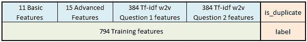*

*这里，我们将以 70:30 的比例将我们的数据分成训练测试。列车数据中的数据点数: *283003* 和测试数据中的数据点数: *121287* 。让我们称之为测试数据，验证数据，因为我们已经有了完全看不见的测试数据。可以从[***Kaggle***](https://www.kaggle.com/c/quora-question-pairs/data)***下载测试数据集。****

*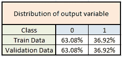*

## *什么是日志丢失？*

*对数损失是基于概率的最重要的分类度量。很难解释原始的对数损失值，但是对数损失仍然是比较模型的一个很好的度量。对数损失是一个介于[0，无穷大]之间的度量。对于任何给定的问题，较低的对数损失值意味着更好的预测。*

*对数损失是对所谓的**似然函数**的一个小小的扭曲。事实上，对数损失是-1 *似然函数的对数。因此，我们将从理解似然函数开始。*

*可能性函数回答了“模型认为实际观察到的结果有多可能”这个问题。如果这听起来令人困惑，举个例子应该会有帮助。*

*例如，一个模型预测三所房子的概率`[0.8, 0.4, 0.1]`。前两套房子卖了，最后一套没卖。所以实际结果可以用数字表示为`[1, 1, 0]`。*

*让我们一次一个地遍历这些预测来迭代计算似然函数。*

*第一栋房子卖出去了，模型显示有 80%的可能性。所以，看一个预测后的似然函数是 0.8。*

*第二栋房子卖出去了，模型显示有 40%的可能性。有一个概率规则，多个独立事件的概率是它们各自概率的乘积。因此，我们通过将前两个预测的相关概率相乘，得到组合的可能性。那就是`0.8 * 0.4`，恰好是 0.32。*

*现在我们开始第三个预测。那套房子没有卖出去。模型说有 10%的可能卖出去。这意味着有 90%的可能卖不出去。因此，根据模型，观察到的*不出售*的结果有 90%的可能性。所以，我们把之前的结果 0.32 乘以 0.9。*

*我们可以逐步完成所有的预测。每次我们都会找到与实际发生的结果相关的概率，然后乘以之前的结果。这就是可能性！*

## *基线随机模型*

*基线预测算法提供了一组预测，您可以像对问题的任何预测一样对其进行评估，例如分类准确性或损失。随机预测算法预测在训练数据中观察到的随机结果。这意味着随机模型随机预测标签 0 或 1。当评估所有其他机器学习算法时，这些算法的分数提供了所需的比较点。 [**更有**](https://machinelearningmastery.com/implement-baseline-machine-learning-algorithms-scratch-python/) ...*

*使用随机模型的验证数据的对数损失为 0.89。减少损失的余地很大！*

*我试过逻辑回归，因为数据是相当高的维度和线性 SVM。我使用了具有“对数”损失的 SGDclassifier，它实际上是一种逻辑回归，使用了具有“铰链”损失的 SGDclassifier，它实际上是一种线性 SVM，并对 alpha(SGD 分类器的参数)执行了超参数调整。但是这两个模型都没有给出承诺的精确度，因此也就没有了对数损失。*

## *XGBoost 模型*

*XGBoost 是一种基于决策树的集成机器学习算法，使用梯度推进框架。XGBoost 的性能不是开玩笑的——它已经成为赢得许多 Kaggle 比赛的首选库。[更多](https://towardsdatascience.com/a-beginners-guide-to-xgboost-87f5d4c30ed7) …*

*对训练数据拟合 XGBoost 模型后，结果如下:*

*   *训练数据的对数损失为 0.69，验证数据的对数损失也约为 0.69。0.69.日志丢失减少得更好，但仍有很大的改进空间！*
*   *在应用一些超参数调整之后，最终实现了训练数据的对数损失为 0.345，验证的对数损失为 0.357，这是一个显著的改进。*
*   *此外，两个损失都很接近，表明模型既不是过拟合也不是欠拟合。*

*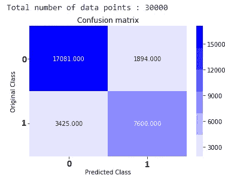*

*   *真阳性(17081)和真阴性(7600)数量很大，这表明正确分类的数量很大。检查 [**此处**](https://vocal.media/stories/machine-learning-model-performance-metrics) 用于分类问题的评估指标及其解释。*

*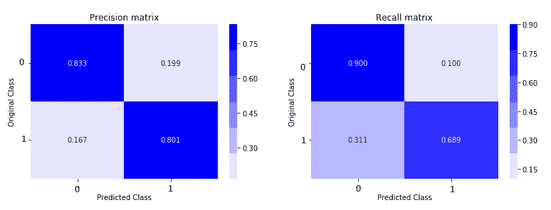*

*   *等级 0 的精度为 83%，等级 1 的精度为 80%。*
*   *同样，类别 0 的召回率是 90%，类别 1 的召回率是 69%。*
*   *两者都是对上述两个线性模型，逻辑回归和线性 SVM 的重大改进。*

*现在，您的任务是将相同的预处理步骤应用于测试数据，并将上述训练好的模型应用于预测！*

*_______________________________________________________________*

*感谢你阅读❤.*

*对于任何建议或疑问，请在下面留下您的评论，并关注更新。*

*如果你喜欢这篇文章，请点击👏图标来支持它。这将有助于其他媒体用户找到它。分享一下，让别人也能看！*

*快乐学习！:)*