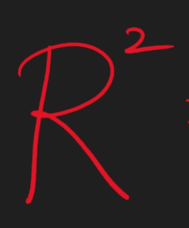
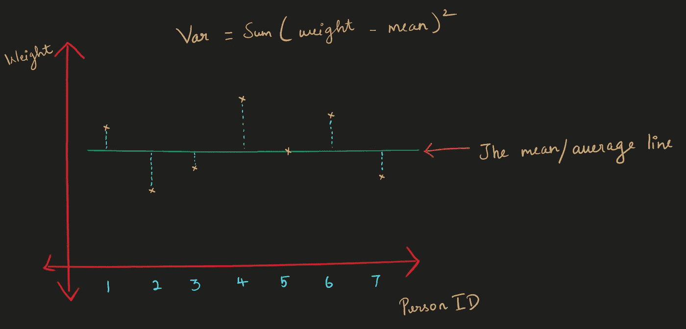
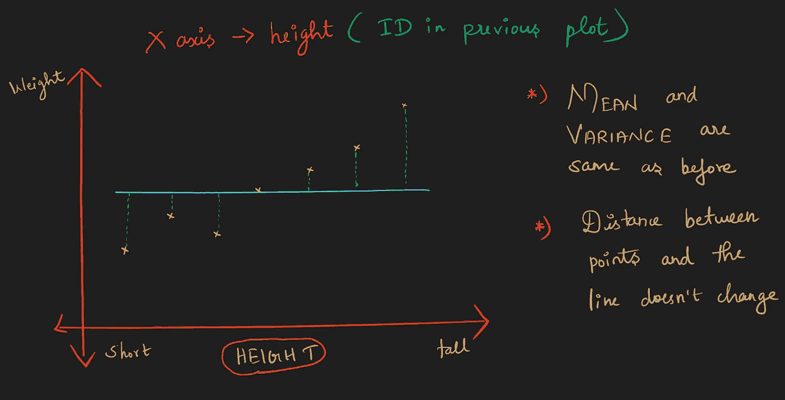
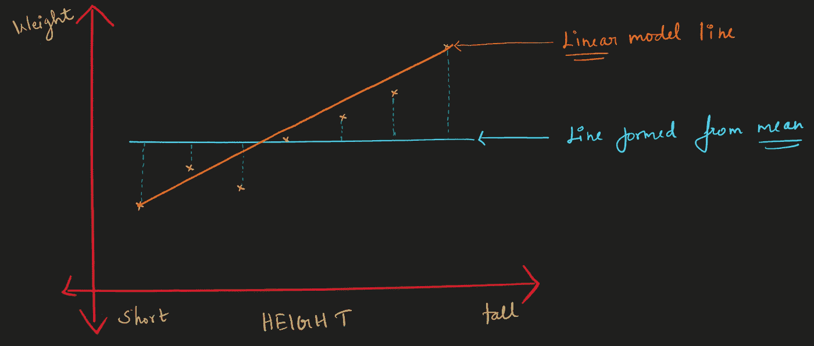
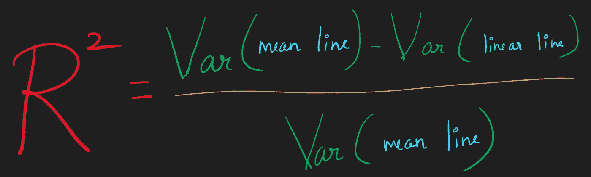
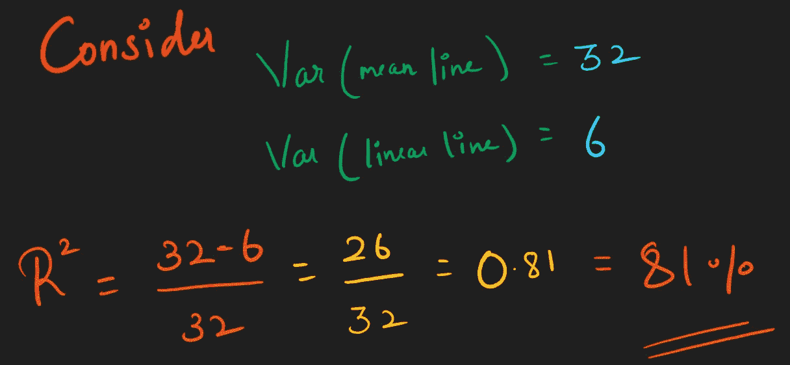

# r 广场

> 原文：<https://medium.com/nerd-for-tech/r-square-4bcb08bb597e?source=collection_archive---------30----------------------->

我们都知道相关性(R)，相关值接近 1 或-1 是好的，并告诉你两个定量变量是强相关的。而相关性为 0 的变量不相关。

什么是 r 广场，为什么要去 r 广场？

R 平方与 R 非常相似，但是可以使用 R 平方进行如下解释:

*   R = 0.7 没有 R = 0.5 好两倍
*   但是 R 平方=0.7 是 R 平方=0.5 的 1.4 倍

让我们考虑一个例子，这里我们在 x 轴上画出了人的 Id，在 y 轴上画出了体重。

个人身份与体重(平均线)

在上面的图片中，我计算了重量的平均值，并绘制成一条解释图表的线。

计算平均值周围的方差。

现在让我们在 x 轴上用高度代替 ID。

身高与体重(平均线)

现在，图**被重新排序**，但是这个图和之前的图的**均值和方差**是**相同的**。即使在重新排序后，点和线之间的距离也不会改变。

**问题:**这是使用 mean 生成的线预测老鼠体重的更好方法吗？

**回答:**不，我们应该对数据拟合一条线(回归)

身高与体重(平均值和直线)

现在我们可以用直线预测给定高度的重量。

**问题:****直线**比**均值线更符合数据吗？**如果是的话**好多少？**

**回答:**从上图看，**直线**比**均线更符合数据。我们可以用 r 平方来量化这种差异。**

r 广场

**Var(中线)—中线周围的变化**我们已经在第一幅图像中计算过了。

**Var(线性线)——线性线周围的变化**，我们可以用计算 Var(均值线)的类似方法来计算

上式使 r 平方的范围从 **0 到 1。**

**围绕**直线**的变化**将永远不会大于围绕**中线**的变化**且永远不会小于 **0。****

让我们考虑一个例子，并尝试解释 r 平方值，

例子

## 解释:

线性线周围的方差比平均值小 81%。

**或**

身高/体重的关系解释了 81%的变异。

这意味着数据中的大部分变化可以用身高/体重的关系来解释。

现在如果 r 平方值是 0.9 的意思，我们可以解读为，“好！这两个变量的关系解释了 90%的数据变化。:-)"

现在考虑如果 r 平方是 0.01，那么你可以说，“ohhh！它只解释了数据中 1%的变化！:-(剩下的 99%肯定有其他原因可以解释。”

## 关于 R and R 广场:

r 平方只是 r 的平方。

如果有人说“R 值为**0.9”**，

你可以说“好！这两个变量的关系解释了数据中 81%的**(如果 R 是 0.9，那么 R 的平方将是 0.81)** 。:-)"

## 最后，

R 平方不给出方向，所以如果给定一个 R 平方，你可以解读为**“要么两个变量与 R 平方正相关=…要么与 R 平方负相关=…但我们说不出方向(正或负)”**

> “R 平方是由两个变量之间的关系解释的变化的百分比。如果有人给你一个简单的 R 值，就把它平方"

谢谢:-)