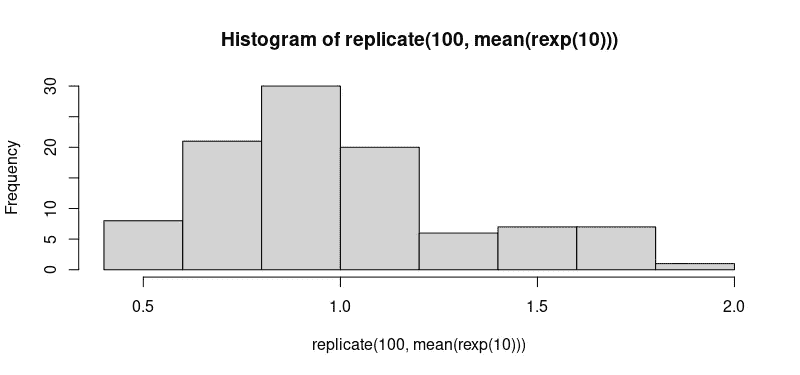

# R 教程—在 R 中应用函数族

> 原文：<https://medium.com/nerd-for-tech/r-tutorial-apply-function-family-in-r-cbbd4b6781cd?source=collection_archive---------16----------------------->

## 了解如何在 R 中使用 apply()函数族

在本文中，我们将讨论 R 中的 *apply()* 函数族、它的类型以及应用于不同数据结构的几种类型。apply()家族是 R 内置的包，所以我们不用单独安装。apply()函数的主要优点是我们可以使用这些函数作为循环操作的替代方法。

在这篇文章中，我们将学习如何使用 R *apply()* 函数，以及应用于不同数据结构的不同类型的函数，如 *lapply()* 、 *sapply()* 、 *tapply()* 、 *mapply()* 和 *replicate()* 。所以让我们开始吧！


照片由[穆罕默德·拉赫马尼](https://unsplash.com/@afgprogrammer?utm_source=unsplash&utm_medium=referral&utm_content=creditCopyText)在 [Unsplash](https://unsplash.com/s/photos/programmer?utm_source=unsplash&utm_medium=referral&utm_content=creditCopyText) 上拍摄

# apply()系列—

*apply()* 系列预装在 R base 包中，由各种函数组成，以重复的方式操作数组、列表、矩阵和数据帧中的数据。apply()函数族帮助我们用很少的几行代码来执行操作。这些功能可以是—

1.  向量化结构，如列表、数组、矩阵等。
2.  平均值、总和、平均值等聚合函数。

## 我们应该如何以及何时使用这些工具？

这些函数的使用取决于我们想要操作的数据结构和我们需要的输出格式。让我们看看如何一个接一个地执行这些功能—

# **apply()函数**

先说家族的第一个函数， *apply()* 函数。这在数组上操作。为了简化，我们在本教程中将只使用 2D 数组。首先，让我们看看基本的 apply 函数是如何工作的。我们可以使用 RStudio 的帮助部分来了解该功能的说明。

```
?apply()
```

R 文档显示该函数的语法如下—

```
apply(X, MARGIN, FUN, ...)
```

其中:-

1.  x 是一个 2D 阵列。
2.  MARGIN 是一个变量，它定义了我们如何应用函数。当 Margin =1 时，它应用于行，当 Margin = 2 时，它应用于列，当 Margin = c(1，2)时，它应用于行和列。
3.  乐趣是我们应用于数据的函数。它可以是任何 R 函数，包括用户定义的函数(UDF)。
4.  …..这用于传递给函数的任何其他参数。

让我们构建一个 4 x 4 的矩阵，并计算每列值的总和—

```
matrix_1 <- matrix(1:16, nrow = 4)matrix_1
```

我们将得到如下输出—

```
[,1] [,2] [,3] [,4]
[1,]    1    5    9   13
[2,]    2    6   10   14
[3,]    3    7   11   15
[4,]    4    8   12   16
```

让我们计算每行值的总和—

```
apply(matrix_1, 1, sum)
```

我们将得到如下输出—

```
[1] 28 32 36 40
```

让我们计算每列值的总和—

```
apply(matrix_1, 2, sum)
```

我们将得到如下输出—

```
[1] 10 26 42 58
```

让我们在矩阵中引入 NA 值，看看我们如何执行函数—

```
matrix_1[2,3] <- NAmatrix_1
```

我们将得到如下输出—

```
[,1] [,2] [,3] [,4]
[1,]    1    5    9   13
[2,]    2    6   NA   14
[3,]    3    7   11   15
[4,]    4    8   12   16
```

让我们使用应用功能—

```
apply(matrix_1, 1, sum)
```

我们将得到如下输出—

```
[1] 28 NA 36 40
```

将 *na.rm* 参数传递给上面的代码—

```
apply(matrix_1, 1, sum, na.rm = TRUE)
```

我们将得到如下输出—

```
[1] 28 22 36 40
```

现在，让我们去掉这个 NA —

```
matrix_1[2,3] <- 10matrix_1
```

我们将得到如下输出—

```
[,1] [,2] [,3] [,4]
[1,]    1    5    9   13
[2,]    2    6   10   14
[3,]    3    7   11   15
[4,]    4    8   12   16
```

在上面的例子中，我们使用 apply()函数来计算一行或一列的总和。在下面的例子中，我们将使用 apply()函数来转换每行和每列中的值。请注意边距参数。我们将定义一个函数，将矩阵的每个元素乘以 5，并将 MARGIN 参数设置为 *1:2* ，以便该函数可以对矩阵的每一行和每一列进行操作。

```
matrix_2 <- apply(matrix_1,1:2, function(x) x*5)matrix_2
```

我们将得到如下输出—

```
[,1] [,2] [,3] [,4]
[1,]    5   25   45   65
[2,]   10   30   50   70
[3,]   15   35   55   75
[4,]   20   40   60   80
```

在前面的例子中，我们在矩阵上使用了 apply()函数。但是让我们看看当我们循环遍历一个向量时会发生什么？

让我们先创建一个向量—

```
vector_1 <- c(1:15)vector_1
```

我们将得到如下输出—

```
[1]  1  2  3  4  5  6  7  8  9 10 11 12 13 14 15
```

让我们使用 apply()函数—

```
apply(vector_1, 1, sum)
```

如果你运行这个函数，你会得到下面的错误—

```
Error in apply(vector_1, 1, sum) : dim(X) must have a positive length
```

如您所见，它不起作用，因为 apply()函数只有在数据至少有两个维度时才能发挥最佳作用。如果使用的数据是矢量格式，那么我们需要使用其他函数，比如 lapply()、sapply()或 vapply()。


照片由 [Magnet.me](https://unsplash.com/@magnetme?utm_source=unsplash&utm_medium=referral&utm_content=creditCopyText) 在 [Unsplash](https://unsplash.com/s/photos/apply?utm_source=unsplash&utm_medium=referral&utm_content=creditCopyText) 上拍摄

# lapply()函数

当我们想要应用一个给定的函数来循环遍历一个列表或一个向量中的每个数据元素时，我们使用这个函数。我们可以使用 RStudio 的帮助部分来了解该功能的说明。

```
?lapply
```

R 文档显示了函数的语法，如下所示。请注意，这个函数中没有 MARGIN 参数。

```
lapply(X, FUN, ....)
```

我们可以将这个函数用于其他对象，如数据帧、列表或向量，我们得到的输出是列表形式的(因此名称以“l”开头)，它具有与传递给它的对象相同数量的元素。我们将创建三个名为 A、B 和 C 的矩阵，并从一列中提取值，看看这是如何工作的。

```
A = matrix(1:16, nrow = 4)
B = 1:10
C = 15:20
my_list <- list(A,B,C)
my_list
```

我们将得到如下输出—

```
[[1]]
     [,1] [,2] [,3] [,4]
[1,]    1    5    9   13
[2,]    2    6   10   14
[3,]    3    7   11   15
[4,]    4    8   12   16

[[2]]
[1]  1  2  3  4  5  6  7  8  9 10

[[3]]
[1] 15 16 17 18 19 20
```

让我们计算每个列表的总和—

```
lapply(my_list, sum)
```

我们将得到如下输出—

```
[[1]]
[1] 136

[[2]]
[1] 55

[[3]]
[1] 105
```

我们可以看到结果是如何保存为列表的。如果我们想要一个向量形式的结果，那么我们必须将 *unlist* 参数传递给 lapply()函数

```
unlist(lapply(my_list, sum))
```

我们将得到如下输出—

```
[1] 136  55 105
```

我们还可以创建自己的函数，并将其传递给 lapply()。例如，如果我们想给每个元素加 10，我们将使用如下所示的代码—

```
lapply(my_list, function(x) x + 10)
```

我们将得到如下输出—

```
[[1]]
     [,1] [,2] [,3] [,4]
[1,]   11   15   19   23
[2,]   12   16   20   24
[3,]   13   17   21   25
[4,]   14   18   22   26

[[2]]
[1] 11 12 13 14 15 16 17 18 19 20

[[3]]
[1] 25 26 27 28 29 30
```

# **sapply()函数**

*sapply()* 函数的工作方式就像 lapply()函数一样，但是它会尽可能地简化输出。事实上，sapply()函数是 lapply()的一个“*包装器*”函数。我们可以使用 RStudio 的帮助部分来了解该功能的说明。

```
?sapply
```

R 文档显示了函数的语法，如下所示。请注意，这个函数中也没有 MARGIN 参数。

```
sapply(X, FUN, ..., simplify = TRUE, USE.NAMES = TRUE)
```

这意味着，如果数据是可简化的，它将返回一个向量，而不是像 lapply()那样返回一个列表。让我们同样使用 *my_list* 的例子。

```
sapply(my_list, sum)
```

我们将得到如下输出—

```
[1] 136  55 105
```

现在让我们将 *simplify = FALSE* 参数传递给上面的代码，看看会发生什么—

```
sapply(my_list, sum, simplify = FALSE)
```

我们将得到如下输出—

```
[[1]]
[1] 136

[[2]]
[1] 55

[[3]]
[1] 105
```

在这里，我们可以看到输出是以列表而不是向量的形式返回的。像 apply()函数一样，我们也可以使用函数来转换数据。这是我们如何做到的—

```
print(sapply(my_list, function(x) x + 5))
```

我们将得到如下输出—

```
[[1]]
       [,1] [,2] [,3] [,4]
[1,]    6   10   14   18
[2,]    7   11   15   19
[3,]    8   12   16   20
[4,]    9   13   17   21

[[2]]
[1]  6  7  8  9 10 11 12 13 14 15

[[3]]
[1] 20 21 22 23 24 25
```

# **VAP ply()函数**

*vapply()* 函数类似于 sapply()函数，但是它要求用户指定他们传递给 vapply()函数的参数的数据类型。我们可以使用 RStudio 的帮助部分来了解该功能的说明。

```
?vapply
```

R 文档显示了函数的语法，如下所示。请注意，这个函数中也没有 MARGIN 参数。

```
vapply(X, FUN, FUN.VALUE, …, USE.NAMES = TRUE)
```

好玩。值是我们需要指定要传递的数据类型的地方。如果你希望列表中的每一项都返回一个数值，那么我们用这个参数来取乐。值=整数(1)。这里要记住的另一件事是，这种简化总是在 vapply()函数的情况下完成的。该函数检查所有的乐趣值是否与乐趣兼容。值，为此它们必须具有相同的长度和类型。

```
vapply(my_list, sum, FUN.VALUE = integer(1))
```

我们将得到如下输出—

```
[1] 136  55 105
```

# **replicate()函数**

该函数通常与 apply()函数族一起使用。当我们将 *replicate()* 函数传递给一个向量时，它会将其值复制指定的次数。我们可以使用 RStudio 的帮助部分来了解该功能的说明。

```
?replicate
```

R 文档显示了函数的语法，如下所示。请注意，这个函数中也没有 MARGIN 参数。

```
replicate(n, expr, simplify = "array")
```

哪里—

1.  *n* 是表示重复次数的整数。
2.  *expr* 是反复评估的表达式。

让我们看一个例子——

```
hist(replicate(100, mean(rexp(10))))
```

我们将得到如下输出—



作者图片

# **mapply()函数**

mapply()函数中的“m”代表“多元”应用。这是模仿 sapply()函数的。我们使用这个函数向量化一个通常不接受向量作为参数的函数的参数。我们可以将这个函数应用于多个列表或多个向量参数。我们可以使用 RStudio 的帮助部分来了解该功能的说明。

```
?mapply
```

R 文档显示了函数的语法，如下所示。请注意，这个函数中也没有 MARGIN 参数。

```
mapply(FUN, ..., MoreArgs = NULL, SIMPLIFY = TRUE, USE.NAMES = TRUE)
```

哪里—

1.  乐趣是要应用的功能
2.  ….要向量化的参数
3.  MoreArgs 列出了其他有趣的论点。
4.  SIMPLIFY 是逻辑或字符串。这会尝试将结果简化为向量、矩阵或更高维的数组。
5.  使用。如果它是一个字符向量，我们用这个字符向量作为名字。

让我们考虑下面的例子。假设我们想要在 4 次复制 1，在 3 次复制 2，在 2 次复制 3，在 1 次复制 4。

```
mapply(rep, times = 1:4, x = 4:1)
```

我们将得到如下输出—

```
[[1]]
[1] 4

[[2]]
[1] 3 3

[[3]]
[1] 2 2 2

[[4]]
[1] 1 1 1 1
```

还有另一种方法可以做到这一点—

```
mapply(rep, times = 1:4, MoreArgs = list(x = 25))
```

我们将得到如下输出—

```
[[1]]
[1] 25

[[2]]
[1] 25 25

[[3]]
[1] 25 25 25

[[4]]
[1] 25 25 25 25
```

我们将得到列表形式的输出。要获得向量形式的输出，请使用以下代码—

```
unlist(mapply(rep, times = 1:4, x = 4:1))
```

我们将得到如下输出—

```
[1] 4 3 3 2 2 2 1 1 1 1
```

现在，让我们创建一个函数并将 mapply()函数传递给它。假设我们有两个向量，想把它们相加后乘以 2。因此，让我们先创建函数，然后将参数传递给它。

```
x <- c(A = 10, B = 20, C = 30)
y <- c(J = 40, K = 50, L = 60)
addition <- function(u,v){
  (u+v)*2
}
mapply(addition, x, y)
```

我们将得到如下输出—

```
A   B   C 
100 140 180
```

# **tap ply()函数—**

此函数将函数应用于不规则数组的每个单元格，即由特定因子级别的唯一组合给出的每个(非空)值组。我们可以使用 RStudio 的帮助部分来了解该功能的说明。

```
?tapply
```

R 文档显示了函数的语法，如下所示。请注意，这个函数中也没有 MARGIN 参数。

```
tapply(X, INDEX, FUN = NULL, ..., default = NA, simplify = TRUE)
```

让我们在 R 中加载*虹膜*数据集，并在这个虹膜数据集上使用 tapply()函数。让我们加载数据集—

```
datasets::irishead(iris)
```

我们将得到如下输出—

```
Sepal.Length Sepal.Width Petal.Length Petal.Width Species
1          5.1         3.5          1.4         0.2  setosa
2          4.9         3.0          1.4         0.2  setosa
3          4.7         3.2          1.3         0.2  setosa
4          4.6         3.1          1.5         0.2  setosa
5          5.0         3.6          1.4         0.2  setosa
6          5.4         3.9          1.7         0.4  setosa
```

假设如果我们想计算所有物种的萼片长度的平均值

```
tapply(iris$Sepal.Length, iris$Species, mean)
```

我们将得到如下输出—

```
setosa versicolor  virginica 
5.006      5.936      6.588
```

类似地，我们可以用这个代码计算这三种物种的萼片长度中值

```
tapply(iris$Sepal.Length, iris$Species, median)
```

我们将得到如下输出—

```
setosa versicolor  virginica 
5.0        5.9        6.5
```

# 结论—

在这篇文章中，我们学习了 r 中的 apply()函数族。如果你喜欢这篇文章或者对我有什么建议，请在下面评论让我知道。

*谢谢你！*