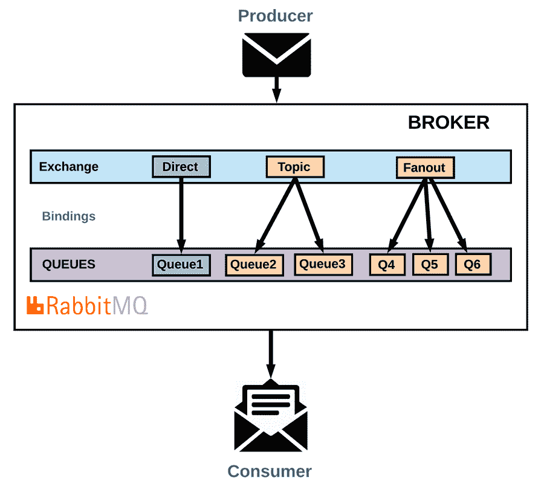

# RabbitMQ in。网络核心

> 原文：<https://medium.com/nerd-for-tech/rabbitmq-in-net-core-4c611eb4e87e?source=collection_archive---------2----------------------->

一个典型的软件通常需要消息来连接和扩展自己。这样的应用程序或者相互连接，或者连接到一个设备，或者在消息传递的帮助下连接到用户的数据。这使得它们看起来像是一个大型应用程序的组件。消息传递是一项异步任务，它通过分离接收和发送消息的任务来分离应用程序。

RabbitMQ 是一个消息代理，它为应用程序提供了一个发送和接收消息的公共平台，并在消息被接收之前保持消息的安全。那么，让我们快速了解一下 RabbitMQ 到底是什么。NET 核心以及它的用处。

**目录**

*   什么是 RabbitMQ？
*   RabbitMQ 的特点
*   RabbitMQ 是如何工作的？
*   中使用 RabbitMQ 的好处。网络核心
*   结论

# 什么是 RabbitMQ？

RabbitMQ in。NET Core 是一个开源的可扩展的消息队列解决方案，任何人都可以免费使用。RabbitMQ 与消息队列遥测传输(MQTT)一起使用，MQTT 是流行的消息传递解决方案之一。它还是一个消息代理，也理解高级消息队列协议(AMQP)。

RabbitMQ 是可伸缩的、可用的，也是容错的。RabbitMQ 是在 Erlang OTP 中实现的，这是一种通常用于使解决方案具有高可伸缩性和容错性的技术。构建的解决方案非常强大，能够处理大量执行的并发操作，RabbitMQ 和 MongooseIM、WhatsApp 等其他系统就是这种情况。

它提供了开发应用程序时所需的多种服务质量(QoS ),因此用户不必担心消息丢失。RabbitMQ 也可以被认为是一个中间件层，它在您正在构建的应用程序中提供多种服务，以方便您与其他人的交流。它还提供了应用程序的广泛解耦，这是通过使用高效的消息和细粒度的路由实现的。

RabbitMQ 支持的协议有

# RabbitMQ 重要术语

在我们了解 RabbitMQ 如何工作之前，我们需要知道一些有助于更好地理解其工作原理的关键术语。

*   消息:-消息可以包含任何类型的信息，从简单的文本消息到序列化的对象。
*   通道:它是一条沟通的线路，本质上是逻辑的，连接发布者和收听者。
*   queue:-rabbit MQ 队列遵循先进先出算法来存储来自发布者的消息。
*   连接:RabbitMQ 的连接基于协议，是拥有通道的必要条件。它将服务器连接到客户端。
*   消费者:-连接到通道的客户端，侦听队列以读取通道上发布的消息。
*   发布者:-连接到发布消息的队列的客户端。
*   通知:-服务运行状况受到监控，并根据不同的度量标准进行定制以发出警报。
*   死信:-在 RabbitMQ 中，侦听器没有读取的消息存储在死信中。
*   route:-rabbit MQ 路由根据它们的交换和路由关键字将消息发送到正确的队列。
*   Exchange:- Exchange 只是一种算法，它决定消息将存储在哪个队列中。
*   绑定:-它是队列和交换之间的链接。

# RabbitMQ 是如何工作的？

RabbitMQ 提供了多种有用的交换类型。这些交换类型涵盖了消息传递的大多数用例。交换只不过是一种算法，它决定存储消息的队列。现在，每个消费者在逻辑的基础上接收队列。有四种类型的逻辑可以用于交换-

1.  **直接交换:**这种交换将传入消息的路由键与队列的绑定键进行匹配。然后，它将传入的消息传递给绑定键完全匹配的队列。它可以被认为是一对一的消息传递系统，因为它使用路由键作为队列名来绑定队列。通过多次使用绑定密钥，将消息传递到多个队列变得很简单。
2.  **主题交换:**该交换将传入消息的路由键与队列的通配符绑定键进行匹配，并将传入消息传递到通配符绑定键完全匹配的队列。对于复合路由键，绑定键可以有通配符匹配标准。例如，日志。UIi.error 和 logs.accounting.error 将是绑定密钥日志的匹配路由密钥。*.error。它帮助程序员通过使用这种交换来编写简单的服务，其中存在良好包含的逻辑，并且消息通过使用 RabbitMQ 到达正确的服务。
3.  **扇出交换:**有一些特定的消息要传递给所有的队列。在这种情况下，可以使用扇出交换，而不是在我们构建的应用程序中编写大量的多播逻辑代码。无需指定绑定密钥，每个服务都通过适当的队列绑定到交换。所有这些都会随着 RabbitMQ 扇出交换的使用而自动发生。即使在编码时指定了绑定键，扇出交换也会忽略它，广播或路由消息会传递到绑定到它的所有队列。
4.  **标头交换:**标头交换增强了高级消息队列协议(AMQP)的结构。基于高级消息队列协议(AMQP)消息头的复杂路由也由该交换机执行。AMQP 发送的每条消息所附的元数据称为报头。

# 中使用 RabbitMq 的好处。网络核心

*   在 JSON 等语言中，它提供了多平台通信。
*   它提供异步操作，因此不会让服务等待。
*   它的特性会定期改进，因为它是开源的，有一个大型社区在开发它。
*   接受多种语言。
*   各种类型的协议用于交换消息。

# 结论

从上面的文章中我们可以看到，几乎所有的交流都可以通过 RabbitMQ 来完成。RabbitMQ 正在成为应用程序和用户设备之间最受欢迎的通信技术之一。最棒的是——作为一项开源技术，它可以被任何人在任何时候使用，而不需要花一分钱。

*原载于*[*https://www . partech . nl*](https://www.partech.nl/nl/publicaties/2021/04/rabbitmq)*。*