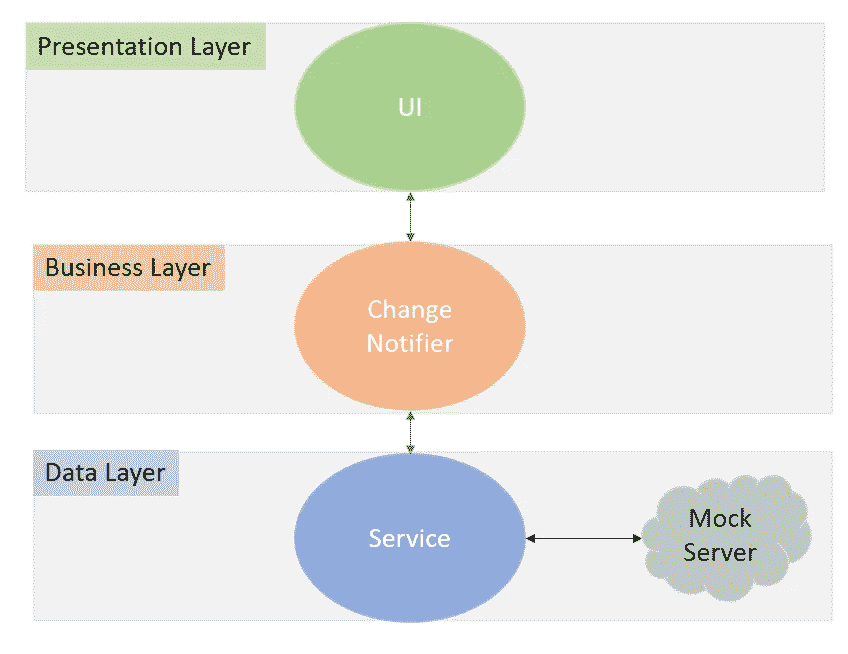
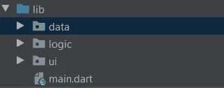

# 具有 ChangeNotifier 提供程序的单选按钮— Flutter

> 原文：<https://medium.com/nerd-for-tech/radiobutton-with-changenotifier-provider-flutter-5a163f8e6bca?source=collection_archive---------0----------------------->

在本文中，我将告诉您如何在 ChangeNotifier 中使用单选按钮，而不会混淆 UI 和业务逻辑。

将我们的业务逻辑移出我们的 UI 非常重要，这样我们就可以轻松地维护和单元测试我们的代码，但是在 flutter 中这非常困难，因为 UI 和业务逻辑都是用一种编程语言——Dart 编写的。因此，我们将在 ChangeNotifier 提供程序中编写所有的业务逻辑，使我们的 UI 非常简洁。(不会使用 **setState()** )

我们将创建一个类似这样的应用程序，

## 我们的应用程序将会做什么

1.  用户可以点击主屏幕上的任何单选按钮，相应的样式将从我们的 fake-API 中获取。
2.  我们的 fake-API 将用包含文本样式格式和一些其他元数据的 JSON 来响应。
3.  我们将使用 JSON 中的文本样式，并用它在主屏幕上呈现“Hello World”文本。

架构图是，



**表示层** —这是我们的 UI 层，我们将在这里编写所有的 UI 代码。

**业务层**——我们所有的逻辑都在这一层。ChangeNotifier 在这里使用服务类来获取数据。

**数据层** —服务类用于从我们的假 REST-API 中获取数据，并将其转换为数据传输对象(d to)

代码结构



为了保持简单，我只有 3 层，我可以将所有的服务类分成一个服务包，因为我们的应用程序很小，只有一个服务类，我更喜欢这种结构。

这是 ***不是一个非常复杂的结构*** ，我将写一篇关于我们如何更精细地构建代码的文章。

让我们从数据层开始，

# 数据层

首先，让我们创建我们的模型(DTO)类，

**模型类**

我在这里没有做很多验证检查，但是如果你愿意，你可以做

这是一个数据传输对象。什么是 DTO？

> 数据传输对象是用于封装数据并将其从应用程序的一个子系统发送到另一个子系统的对象，除了序列化逻辑和反序列化( **fromJson()** 此处)逻辑之外，没有其他逻辑写入其中。([见此处](https://en.wikipedia.org/wiki/Data_transfer_object))

这个类包含一些**文本样式的字段**比如颜色、字体粗细、字体大小，以及一些其他的**元数据**比如 home 很多人喜欢这个文本样式。

**服务等级**

在服务层，我们通常发出 HTTP 请求，从服务器获取数据(任何 CRUD 操作)或访问本地数据库中的数据，并将来自原始数据(JSON、XML 等)的响应解析为数据传输对象。

为了使这篇文章非常简短，我制作了 5 个假的 JSON 响应，并将它们存储在一个列表中。

但是这就是我们从 REST-API 请求数据的方式，

```
Future<TextStyleResponse> fetchTextStyle(int index) async{
    Uri uri = Uri.*parse*("www.myapi.com/styles/$index");
    var response = await http.get(uri);
    Map<String,dynamic> responseMap = json.decode(response.body);
    return TextStyleResponse.fromJson(responseMap);
}
```

既然我们已经完成了数据层，让我们继续我们的业务逻辑层

# 业务层

我们可以使用任何状态管理库，如 Bloc、mobX 等。但由于我们的应用程序非常小，我会选择提供商。

要使用变更通告程序提供程序，请安装提供程序包

```
dependencies:
  provider: ^5.0.0
```

*   **int selectedButton —** 它将保存被选中的单选按钮的值。
*   **TextStyle _style —** 这将决定哪种文本样式将应用于我们主屏幕上的“Hello World”文本。
*   **TextStyleService 服务** —我们的 TextStyleService 类的一个实例。
*   **int likes —** 喜欢我们从 fake-API 中获取的当前文本样式的人数。
*   **int totalResponses —** 我们的 fake-API 中可用的文本样式的总数。

## 我们在 setSelectedButton(index)函数中做什么？

1.  检查传递的索引是否不为空，然后更新该值，否则将其设置为先前选择的按钮，而不进行更改。

```
 selectedButton = index?? selectedButton;
```

**2。获取响应并更新字段。**

```
var response = await service.fetchTextStyle(selectedButton);
_style = TextStyle(
        fontSize: response.fontSize,
        fontWeight: response.fontWeight,
        color: response.color,
       );
likes = response.likes;
```

我们可以直接传递 JSON map 响应，而不用将其解析为 TextStyleResponse 对象，但这不是一个好的做法。因为它将使我们的数据和业务逻辑层耦合。

**3。通知听众(重要步骤)**

```
notifyListeners();
```

这是最重要的。这将通知所有正在监听提供者的小部件进行重建。如果你不调用它，即使值改变了，它们也不会重新构建。

## 表示层

首先，让我们创建单选按钮列表，我们可以很容易地使用带有 RadioListTile 的 ListViewBuilder 来创建。

## 放射虫化石

*   RadioListTile 只不过是一个带有标签的单选按钮。
*   **标题**字段表示单选按钮的标签。
*   RadioListTile 内的 ***value*** 字段表示它的值(如 ID)。
*   ***组值*** 字段表示单选按钮在单选按钮组中的值。如果 **groupValue == value** ，则当前单选按钮被选中，否则不选中。
*   点击磁贴时将调用 onChanged 回调函数。

**变更通知提供者**

下面的行将通过**查找**小部件层次结构来获取 TextStyleProvider。(我们还没有提供 TextStyleProvider)

```
var provider = Provider.of<TextStyleProvider>(context);
```

通过传递**上下文**，我们将小部件注册为提供者的监听器，每当从该提供者调用【notifyListeners()时，它将**重新构建。**

如果你不想要的行为，可以选择不听通过改变— ***听:假***

```
var provider = Provider.of<TextStyleProvider>(context,listen:false);
```

## 标题文本

这个小部件用于显示 Hello World 文本。

我认为这个小部件是不言自明的。我们从构造函数中获取小部件的标题(中间的文本)和赞数作为参数。

## 我们差不多完成了…

现在让我们从 main.dart 连接 TextStyleProvider

您将如何提供 TextStyleProvider 实例？

*   我们知道孩子从他们的祖先那里获得了所需提供者的实例(通过查找部件树)。
*   由于只有 MyHomePage()的子级在使用 TextStyleProvider，所以我们只能用 ChangeNotifierProvider 包装 MyHomePage 小部件。
*   如果您想在全球范围内提供您的提供者**，只需用 ChangeNotifierProvider()包装 **MaterialApp****

> **如果您想提供多个供应商，请使用`MultiProvider()`**

## **我的主页()**

***第 24 行*:我用**expanded()**包装 **TextRadioList** 的原因是我们不能直接将 ListView 嵌套在 Column 小部件中。为什么？**

> **一个`ListView`会占用所有可用的垂直空间，除非它受到其父小部件的限制。然而，默认情况下，`Column`不会对孩子的身高做任何限制。这两种行为的结合导致了`ListView`大小确定的失败。**

## **解决方案:**

1.  ****用展开的。****

**Expanded 将强制嵌套的小部件获取其父部件的所有剩余空间(在以固定大小布局小部件之后)。更多关于此 [*此处*](https://api.flutter.dev/flutter/widgets/Column-class.html) )**

****2。在 ListView 中将包膜设为 true(不推荐)****

**这将使 listview 只获得它需要的空间。**

> **收缩包装滚动视图的内容比扩展到最大允许尺寸要昂贵得多，因为内容可以在滚动过程中扩展和收缩，这意味着每当滚动位置改变时，都需要重新计算滚动视图的尺寸。([文档](https://api.flutter.dev/flutter/widgets/ScrollView/shrinkWrap.html))**

**你从这篇文章中学到的是，**

1.  **如何使用 RadioListTile？**
2.  **如何使用 ChangeNotifier 提供程序？**
3.  **为什么 Listview 不能是 Column 小部件的直接子部件？**
4.  **如何解析对 DTO 对象的 JSON 响应？**
5.  **在哪里提供 ChangeNotifier 提供程序？**

**感谢您通读这篇文章。希望我已经与你分享了一些相关和有用的东西。**