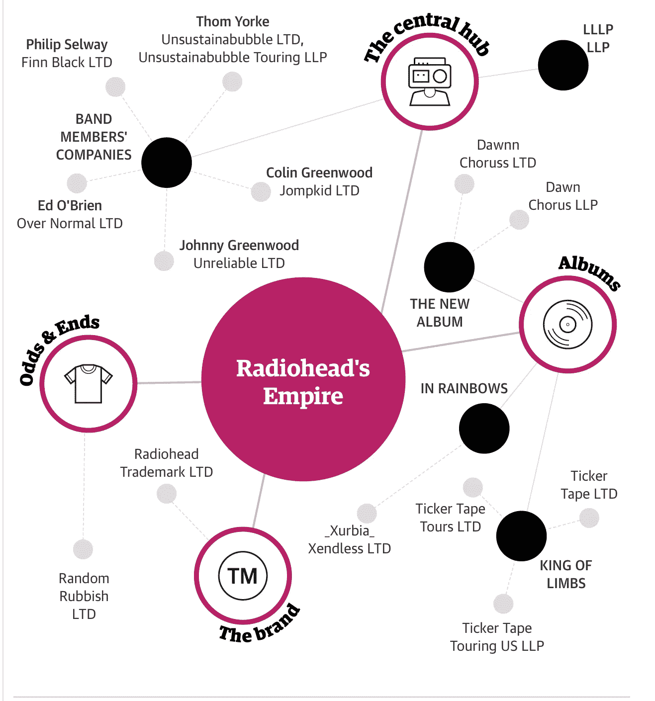
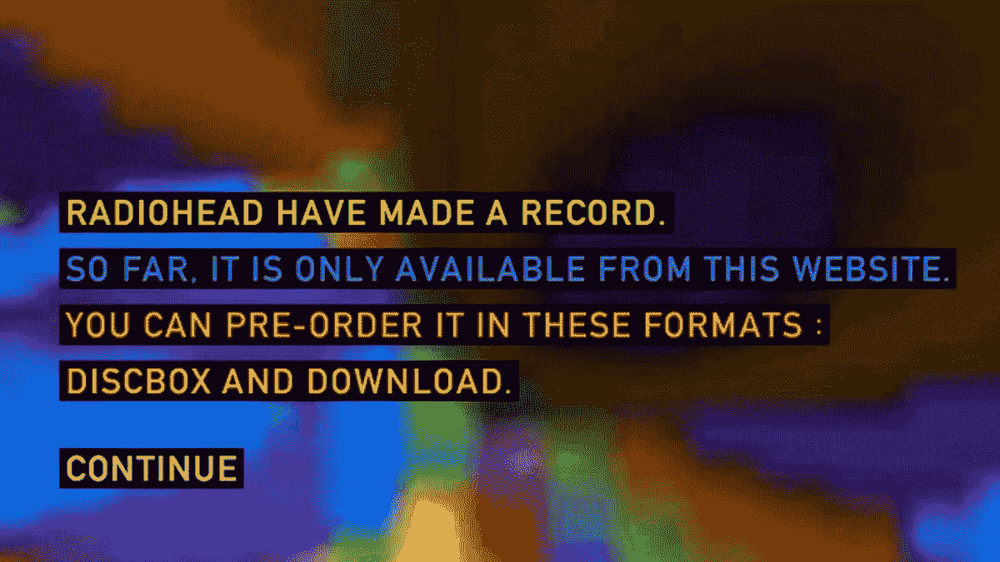
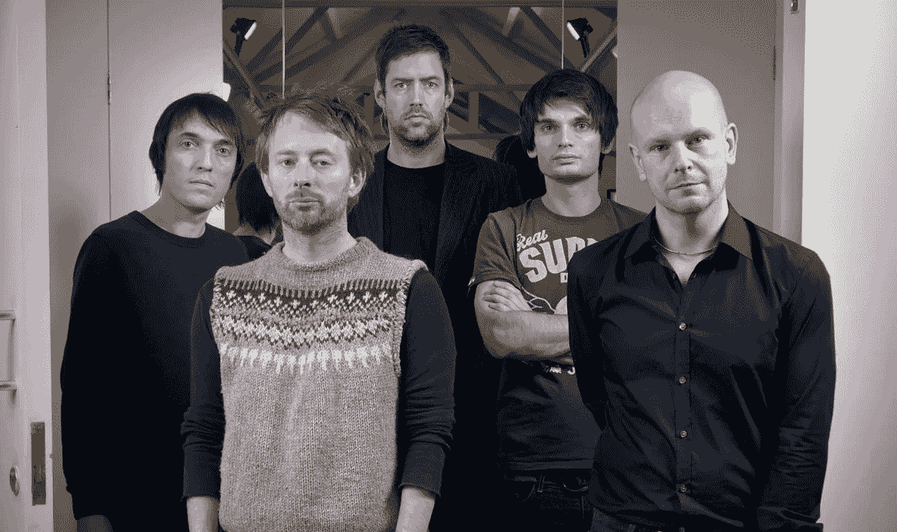

# 电台司令 2007 年改变游戏规则的实验

> 原文：<https://medium.com/nerd-for-tech/radioheads-game-changing-2007-experiment-e0f50bfbd1ea?source=collection_archive---------26----------------------->

我们写了一份关于音乐及其背后的商业和技术的每日时事通讯。如果您想直接在您的收件箱中获得它，请立即订阅 [***！***](https://incentify.substack.com)

什么是好的，人们？

每周，我都会从我最近看到的一本书上写一些趣闻轶事和心得，这本书是威尔·佩奇的《泰山经济学》，它通过八项原则指导行业如何突破颠覆。

你可以看看之前关于星巴克如何成为美国最大的广播电台的报道，这里是**。**

**然而，今天我将谈论电台司令和他们 2007 年的专辑《在彩虹中》的故事，这是他们当时的第七张录音室专辑，它颠覆了音乐出版行业的运作方式，并为未来几年数字流媒体的兴起铺平了道路**

**作为 20 世纪最成功的英国摇滚乐队之一，电台司令拥有:**

**💽卖出超过**3000 万张专辑****

**🏆获得了 6 项格莱美奖，**

**👨🏻‍🎓入选**摇滚名人堂**，**

**🙌🏻与任何其他摇滚乐队不同的是**

**在我谈论他们在 2007 年的分水岭时刻之前，让我们倒回去一点，追溯他们是如何在英国牛津镇开始的👇🏻**

****

**在疯狂的摇滚乐界，电台司令的长寿是一个异数**

**乐队成立于 1985 年，成员- **汤姆·约克**、兄弟**约翰尼·格林伍德和科林·格林伍德、艾德·奥布莱恩以及菲利普·塞尔韦**在牛津郡他们当地的学校相遇。**

**这个组合连同其管理团队的两名成员- **克里斯·赫福德**和**布莱斯·埃奇**在超过 30 年的时间里一直忠于乐队，并于 1991 年签约伦敦的**百代唱片**、**这是一个富有成效的合作伙伴关系，他们发行了 6 张录音室专辑，唱片销量超过 3000 万张。****

**然而，这一切在 2007 年发生了变化，当时乐队发现自己处于音乐术语中的“边缘地带”。**

**这是什么意思？🤔**

**基本上，**乐队已经履行了与百代唱片**的合同义务，可以自由地与唱片公司断绝关系，作为独立艺术家独自完成一切。**

**有什么问题吗？**

**百代唱片公司将保留他们前 6 张专辑的所有权，而电台司令将失去对他们之前录制的所有作品的控制权。**

**当电台司令思考这一困境时，我们注意到他们生活的时代是很重要的。**

**那是 2007 年，在线音乐分享网站- **Napster 几年前刚刚推出，** **CD 销售** -占唱片公司收入的 90%**一落千丈，盗版不断上升**和 **iTunes 最近推出了不受欢迎的模式**，允许用户以 99 美分下载歌曲。**

**佩奇在书中写道，情况非常糟糕，一家唱片公司的一名高管曾和他的团队开玩笑说:**

*****“音乐行业有艾滋病，希望我们最后死”*****

**厌倦了坚持录制和发行专辑的“传送带”流程，电台司令决定改变一下。**

**他们放弃了与百代唱片公司的协议，**加强了他们的管理团队**让会计、法律和出版部门的专家加入进来，并率先应对音乐的新数字时代- **这一举动将在未来几年内被预示。****

**但是他们到底做了什么？让我们开始吧👇🏻**

****

**自 2007 年独立以来，电台司令建立了一个类似于上市有限公司的公司结构，而不是一个摇滚乐队。**

**2007 年 10 月 1 日，电台司令向全世界宣布，他们备受期待的新专辑《彩虹中的 T22》将通过自愿付费模式免费发售。**

**这将是多阶段发布战略的第一步，该战略将在接下来的 3 个月内公布，但在那个时候，其他任何事情都不重要。**

**由格莱美获奖白金摇滚乐队免费发行的专辑？🤯**

****

**电台司令的网站透露了一条神秘的消息，宣布了他们新专辑的发行**

**如果你做到了这一步，看起来你在挖掘我们的内容！请与对此感兴趣的人分享，并帮助支持我们 🤘🏻**

**自然，全球音乐产业的崩溃随之而来。**

**电台司令避免了传统的交错促销周期(专辑将在不同的时间在不同的市场发行)，确保互联网上的粉丝可以同时获得音乐，从而防止盗版网站上的泄漏，这曾困扰过许多以前的大牌发行。**

**但这背后的逻辑是什么？为什么一个乐队会免费赠送其潜在价值数百万美元的作品？**

**事后看来，这是营销中的一招妙棋🙇‍♂️**

**具体怎么做？**

**这里需要注意的重要事情是 2007 年 10 月 1 日🗓公告之后的事件时序**

**粉丝们可以**访问乐队自己的网站，通过自愿付费的选项预购专辑**。**

**谈到定价策略，经理 Bryce 说:**

> **tip-jar 流程的关键是“宣布和发布之间的思考时间”。**粉丝——真正的粉丝——有 7 天时间来决定他们愿意捐多少钱。** **提前到来的粉丝们捐赠了大量的钱——数百英镑——以至于我们决定给小费罐设置一个上限，粉丝们可以捐赠的最高金额为 99 英镑**。**

**2007 年 10 月 10 日早上，电台司令在他们的网站上发布了一个 ZIP 文件，里面包含了专辑的 10 首 MP3 格式的歌曲，供他们的歌迷下载。**

****这是第一阶段，也就是 5️⃣阶段的过程****

**格式很重要，因为**它没有被数字版权管理** ( **DRM)** 锁定，iTunes store 将数字版权管理包裹在他们的文件中，使其不可转让，从而使“彩虹中”的歌曲成为可转让的 MP3 文件。**

**接下来是什么？**

****40 盒限量版套装**包含新专辑的 CD 和重量级双乙烯基唱片，以及第二张包含数码照片和艺术作品的增强型 CD。**

****

**彩虹 40 限量版黑胶盒**

**布莱斯解释了定制专辑的经济学原理:**

> **有了我们自己的商品公司，废物对整个项目至关重要。它给了我们选择。**我们生产了 10 万套盒套，全部直接销售。值得注意的是在发行前的几个月就把它们送到了世界各地的分发仓库，以确保当我们按下开关时，每个人都能在同一天收到光盘盒——然而我们仍然设法对媒体和粉丝保密所有这些后勤工作！****

**小费罐和定制光盘盒这两种“自己做”的选择也避免了音乐行业的旧支付系统，这种系统需要几个月的时间才能将钱从消费者手中转移到创作者手中。**

**通过采用直接处理支付的现代交易模式，该团伙在 72 小时内看到了他们所有的钱——这意味着他们已经兑现了他们的筹码💰在接力赛第三阶段开始之前很久。**

**那么 3️⃣的舞台是什么样的呢？**

****传统 CD 发行**📀2008 年初，这张专辑的第一张专辑在零售店上市，并在英国和美国的排行榜上首次登上第一名**——成为第十张在美国🇺🇸排行榜上登顶的独立发行专辑****

**3 天后**，舞台 4️⃣启动****

**电台司令的专辑在 iTunes 上发布🎵**

****

**2007 年，电台司令终于在 iTunes 上发布了音乐**

**苹果**不允许艺人将一张专辑** **作为** **【硬捆绑】**出售，但由于《在彩虹中》的整张专辑已经可以通过数字下载的方式获得，乐队在 iTunes 上放这张专辑损失更少。**

**在 iTunes 上的首周，In Rainbows 以类似于当月早些时候 CD 销售的方式扩大了苹果的专辑排行榜。**

**半年后，乐队目录的其余部分终于加入了数字书架。**

**那么这一切的最终结果是什么？**

**在《In Rainbows》发行一年后，据报道这张专辑在第一年就卖出了 300 万张，其中超过一半是 CD 格式的，比他们之前的两张专辑都多。**

****即使是黑胶版也是 2008 年最畅销的黑胶专辑**💽**

**电台司令永远改变了音乐的传播方式，并为数字流媒体平台的崛起铺平了道路，互联网和智能手机的普及推动了数字流媒体平台的崛起📲**

****

**《卫报》报道称，电台司令的公司结构类似于硅谷公司**

**那么最后一个阶段是什么？盗版🏴‍☠️**

**这是电台司令没有预料到的。免费赠送专辑后，他们一点也不知道会有惊人的 230 万次非法下载，仅在 10 月 10 日发行当天，BitTorrent network 就录制了 40 万次。**

****Brian Message**——电台司令管理团队核心圈子的一部分人反思了这张专辑对乐队的影响:**

> **我们担心媒体的反应，因为我们没有提前公布记录。我们担心他们会不喜欢这张唱片，这是杞人忧天，他们喜欢这张唱片。我们只是太幸运了。真正的回报是看到乐队在《彩虹》之前在旧金山的演出达到 2 万人，之后达到 6 万人。'**

****概括他们专辑发行的 5 个阶段-****

**1️⃣在他们网站上免费发布整张专辑**

**2️⃣推出 40 张限量版黑胶唱片，成为 2008 年最畅销的唱片**

**3️⃣用传统的 CD 模式制作了这张专辑，立即登上排行榜榜首**

**4️⃣把它放在 iTunes 上，并在下载排行榜上名列前茅**

**5️⃣音乐盗版数量居首位**

**这种扰乱行业的行为怎么样？**

**看看他们在 2008 年旧金山演唱会上表演热门单曲“因果报应警察”的粉丝视频👇🏻**

***如果你喜欢这篇来自*[**Incentify**](https://incentify.substack.com)*的简讯，为什么不和你喜欢的人分享呢？***

***P.S-关注我们的*[***insta gram***](https://www.instagram.com/clubincentify/)*和*[***Twitter***](https://twitter.com/home)*了解更多关于音乐和文化的内容，现在！***

***原载于*[*https://incentify.substack.com*](https://incentify.substack.com/p/radioheads-game-changing-2007-experiment)*。***