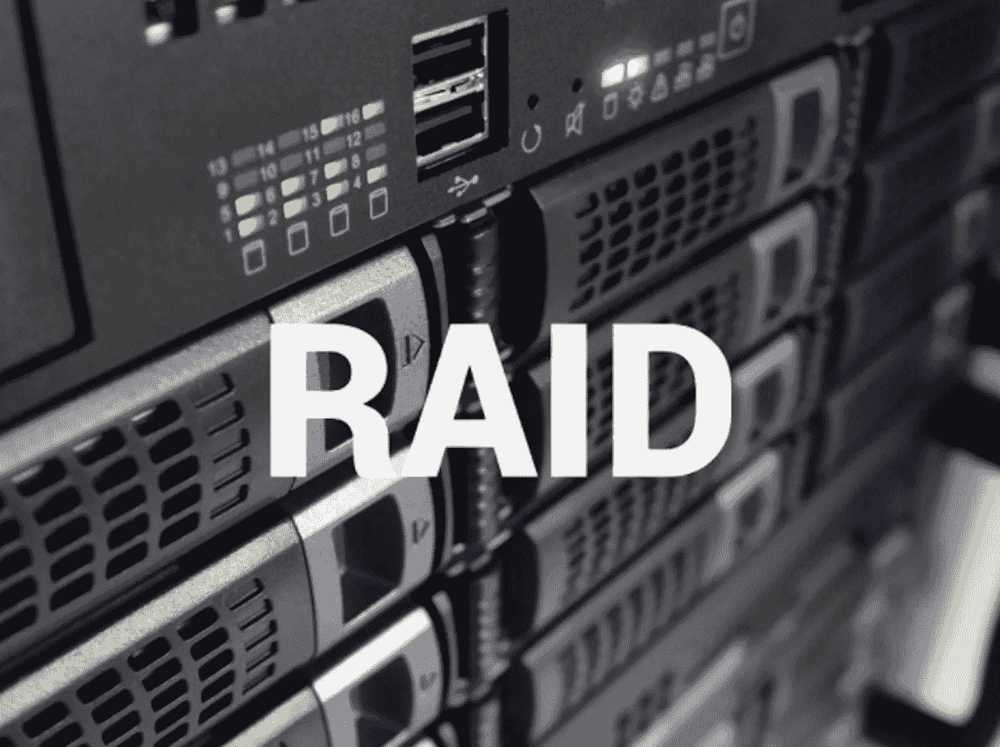
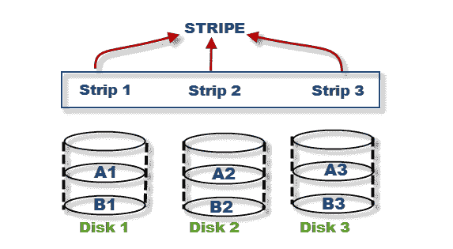
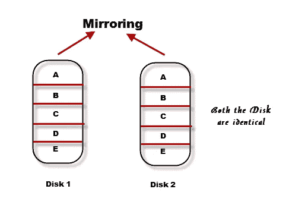
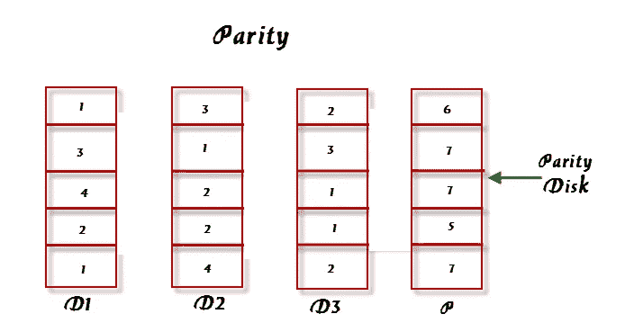
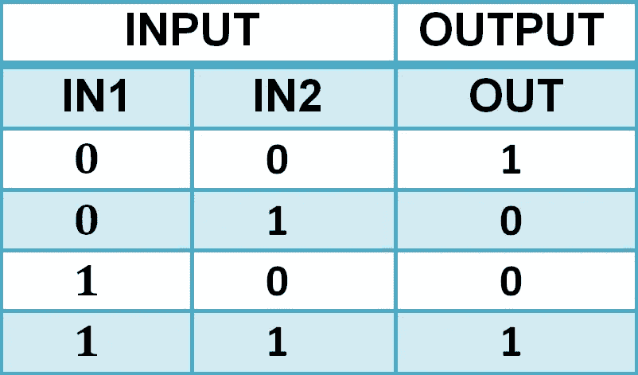

# 独立磁盘冗余阵列

> 原文：<https://medium.com/nerd-for-tech/raid-redundant-array-of-independent-disks-fbd9ff7ba09e?source=collection_archive---------0----------------------->

# 什么是 RAID？

RAID 是一种在多个硬盘或固态硬盘的不同位置存储相同数据的方式。这样做是为了在磁盘出现故障时提供冗余并防止数据丢失。

RAID 不是将所有数据存储在单个磁盘中，而是将数据存储在多个小型磁盘中，从而实现更快的 I/O 操作和数据保护。这提高了整个系统的鲁棒性。如果系统中的一个磁盘出现故障，其他磁盘仍然安全，整个系统不会崩溃。

鸣谢:Tapscape

# **RAID 技术**

RAID 采用某些技术进行数据保护:条带化、镜像、奇偶校验。

**剥离**

这是一种将数据分布在多个驱动器(不止一个)上，并且并行使用所有这些驱动器的技术。与从单个磁盘读取和写入相比，这允许在更短的时间内处理更多的数据，并提高了性能。*在 RAID 集中的每个磁盘内，有预定义数量的连续可寻址磁盘块，称为* ***条带*** *。* *跨越 RAID 集中所有这些磁盘的一组对齐条带称为* ***条带*** *。*

条带和条纹表示法

条带中的所有条带都具有相同的块数。在镜像或配对之前，剥离数据不会提供任何类型的数据保护。

**镜像**

镜像是一种技术，其中相同的数据存储在两个不同的磁盘驱动器中(更像是相同数据的两个副本)。假设两个磁盘驱动器中的一个崩溃，但另一个磁盘上的数据仍然完好无损。这样，数据就不会丢失。如果一个磁盘驱动器出现故障，正常运行的磁盘驱动器上的完整数据有助于控制器继续为主机的数据请求提供服务。当用新磁盘替换故障磁盘时，控制器会从镜像对中正常运行的磁盘复制数据。

镜像(致谢:存储教程)

镜像允许完全冗余，并能更快地从磁盘故障中恢复。因为它涉及到数据的复制，所以它需要两倍于原来存储数据所需的存储空间，而且非常昂贵。

*注意:镜像和数据备份不相似，因为镜像不断捕获数据的变化，而备份捕获数据的时间点映像。*

**奇偶校验**

这是一种保护条带化数据免受磁盘驱动器故障影响的技术，无需额外的镜像成本。这里使用了一个额外的磁盘驱动器来保存奇偶校验值。奇偶校验是一种冗余技术。奇偶校验值由 RAID 控制器计算。它是使用一种数学结构计算出来的，这种结构允许重新创建丢失的数据。

例如，我们假设有 4 个磁盘 D1、D2、D3 和 p。D1、D2 和 D3 是存储数据的数据磁盘。p 是存储奇偶校验信息的奇偶校验磁盘(在下图中，奇偶校验值是每行元素的总和)。如果任何一个数据磁盘出现故障，可以通过从每行的元素总和中减去该行的奇偶校验值来重新创建。

假设 D2 失败了，可以通过从该行元素的总和(1+2=3)中减去奇偶校验值(6)来重新创建它的元素。

6–3 = 3(因此现在我们知道缺少的值是 3)

奇偶校验磁盘表示(学分:存储教程)

奇偶校验的计算表示为数据的算术和。奇偶校验
计算是一个按位异或运算。

异或真值表

如果 IN1、IN2 或 OUT 中的任何数据丢失，可以通过对剩余的可用数据执行 XOR 运算来重新创建。

与镜像相比，奇偶校验更便宜，占用的存储空间也更少。

有一种称为 RAID 级别的东西，它是一组配置，告诉 RAID 如何使用条带化、镜像和奇偶校验从多个通用计算机硬盘驱动器创建大型可靠的数据存储。将在下一篇文章中详细介绍。

*作者:*R·P·帕维特拉