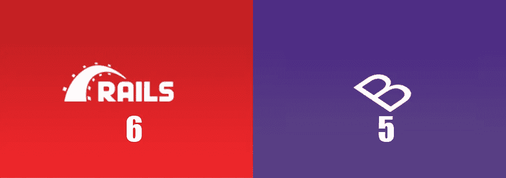
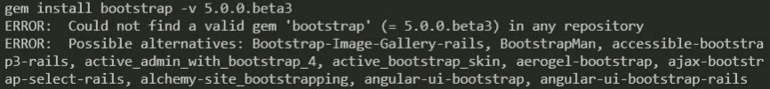
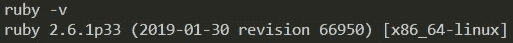
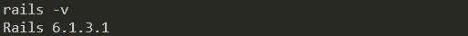
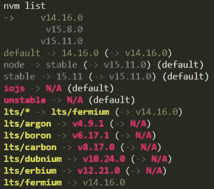
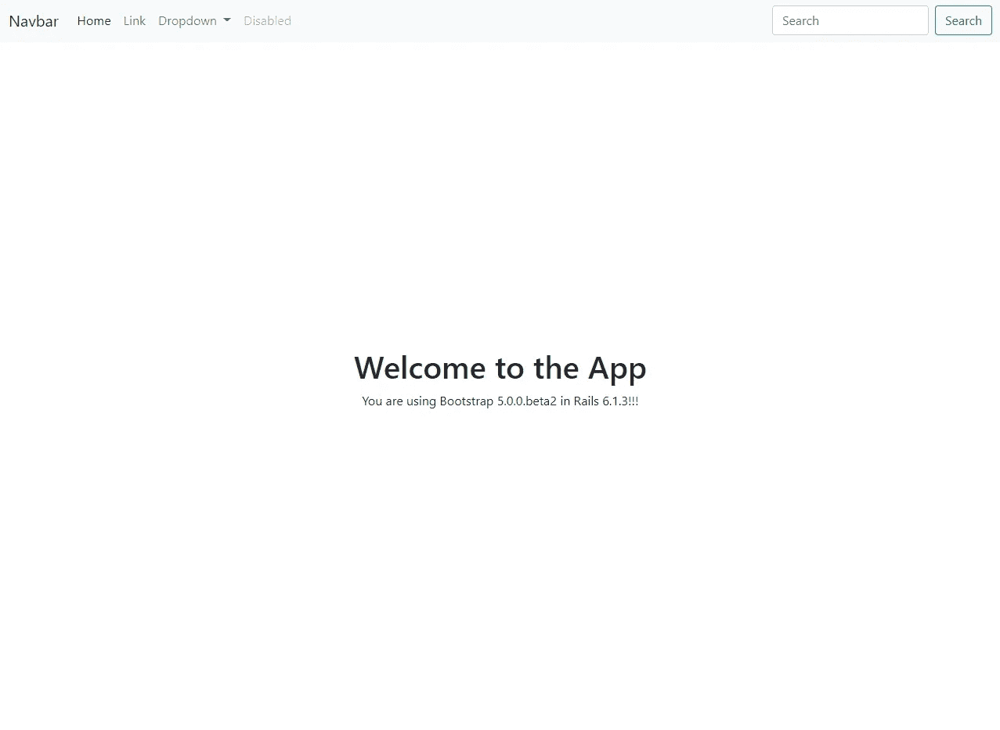
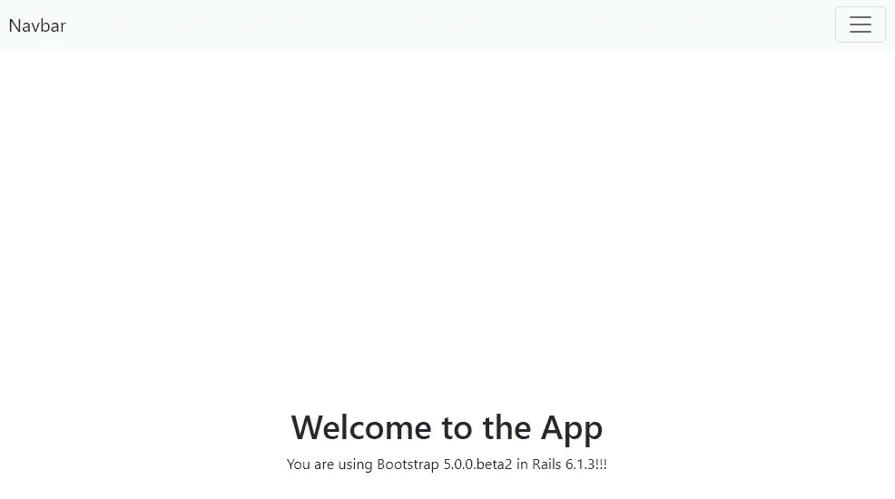
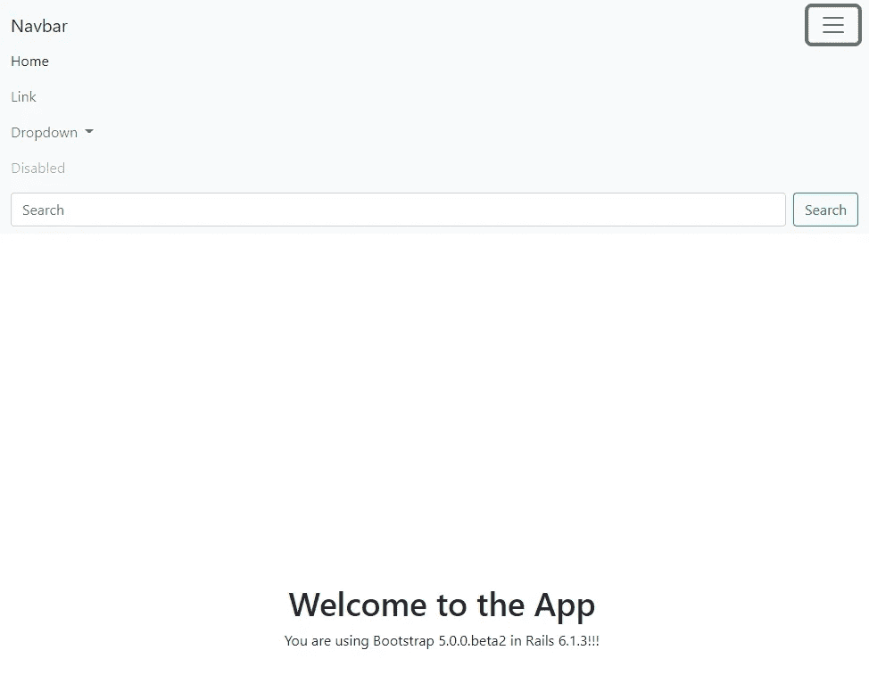

# Rails 6 +自举 5

> 原文：<https://medium.com/nerd-for-tech/rails-6-bootstrap-5-3492b7c0a626?source=collection_archive---------5----------------------->



他们能合作 ate~^^吗？

一起工作很有趣，但同时也是一项艰苦的工作！作为软件工程师，让不同的程序在我们的应用程序中很好地协同工作对我们来说是一项重要的工作。在这篇文章中，我想帮助那些计划在此时(3/28/2021)使用 Rails 和 Bootstrap 的可能最新版本的人:***Rails 6 . 1 . 3***&***Bootstrap 5 . 0 . 0 . beta 2***。工作方式肯定有好几种，这里是我设定的一种。



(beta3 还不适用于 Rails)

# 轨道设置(特别是对于 PC 中的 WSL)

在我的例子中，我使用的是 Ruby 2.6.1，Rails 是 6.1.3。



为了让你的 Rails 应用程序顺利运行，这里的重点是你的 node.js 的版本:你最好使用 ***LTS*** 版本(不是它的 14.16.0)。如果你没有那个版本，首先[安装](https://nodejs.org/en/)到你的电脑上。然后设置这个版本为你的*使用*和*默认*。



以下是更改版本的方法:

```
# Set your ***use*** version
$ nvm use 14.16.0# Set your ***default*** version
$ nvm alias default 14.16.0 
```

现在，用您想要的任何名称创建您的新 Rails 应用程序:

```
$ rails new your_app_name
```

如果你是一个使用 WSL 的 PC 用户，你应该使用这一行作为 [Rails 文档](https://guides.rubyonrails.org/getting_started.html#creating-the-blog-application)的注释:

```
$ rails new your_app_name --skip-spring --skip-listen
```

# 自举设置

你要做的第一件事是添加**引导** & **PopperJs** 到`[yarn](https://classic.yarnpkg.com/en/docs/install/#windows-stable)`。转到*你的应用文件夹*并执行以下两个命令:

```
# You should do this ***in your app folder***!
$ yarn add bootstrap@5.0.0-beta2   
$ yarn add @popperjs/core@2.0.0-alpha.1
```

========================================

*根据@Yaroslav Shmarov 和一些其他研究，安装 gems 部分[between = = = = lines]可能不需要(请参见评论部分)。*

t 获得相关宝石，在根文件夹中找到您的`Gemfile`,并添加 3 个引导相关宝石:

现在你`bundle install`有了这些新宝石。你非常接近在 Rails 6 中使用 Bootstrap 5！

========================================

接下来，你必须调整 2 个文件。第一个是`app/assets/stylesheets/application.css`。改名为`app/assets/stylesheets/application.***scss***`。然后在文件中添加一行`import`(下面的第 9 行):

你要碰的第二档是`application.js`。向该文件中添加 3 个`require`(第 4 行到第 6 行)和`import`引导程序(第 13 行):

去`localhost:3000` routes，尝试一些 Bootstrap 元素~这是我用 Bootstrap 5 navbar 做的一个样本页面:



太棒了。！！



看右上方的按钮~



JS 在 perfectly~^^工作！

最后，你可以从*创建新的优秀应用程序的设置负担*中解脱出来了！我知道这种布置工作是一项单调乏味、看似毫无意义的工作，但是，如果没有坚实的基础，房子就不会牢固。希望这篇文章能对任何想要结合 Rails 6 和 Bootstrap 5 的人有所帮助。编码快乐~~~