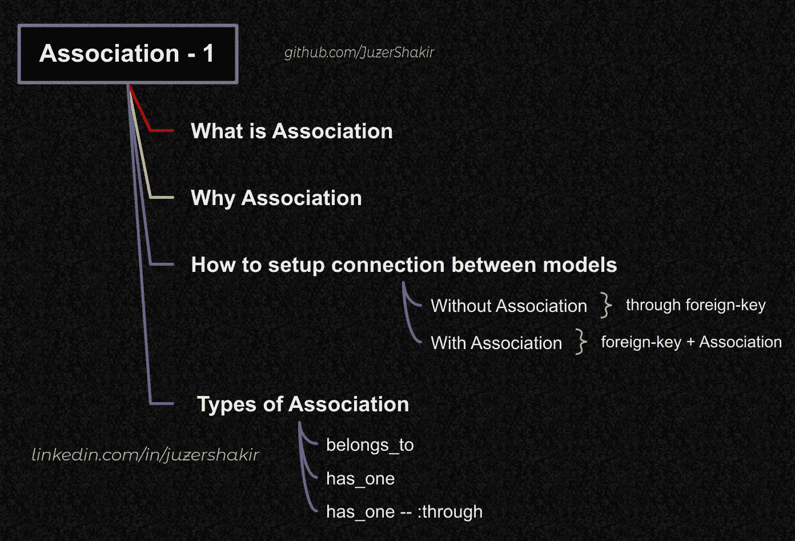
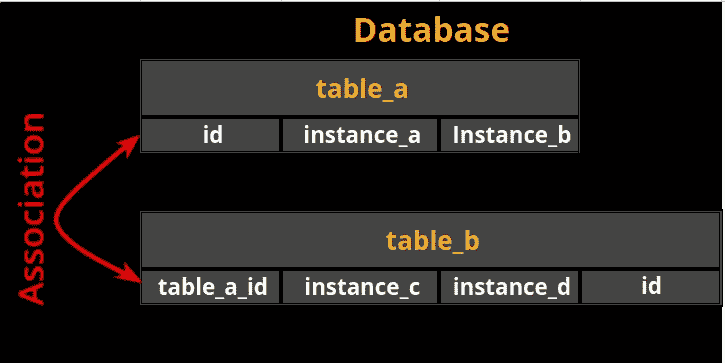
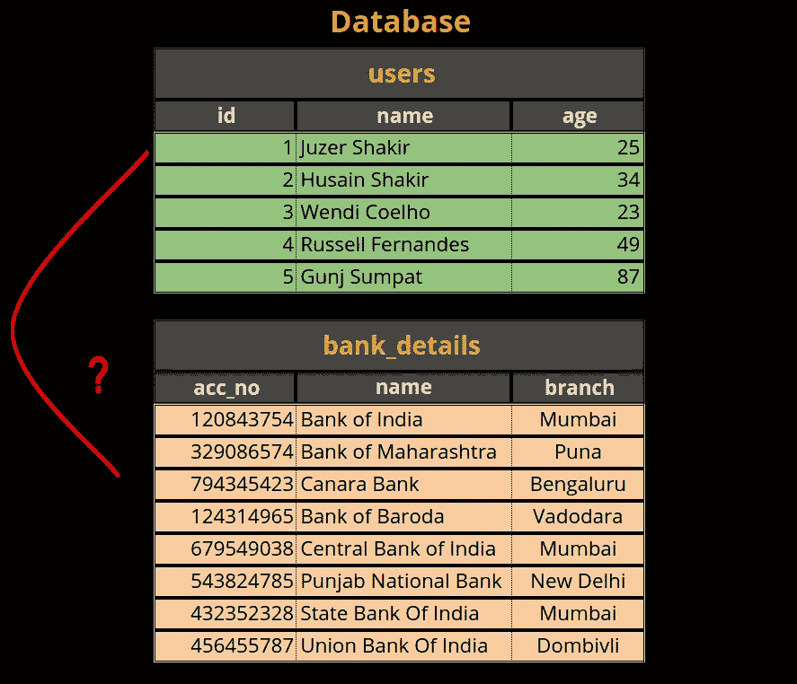
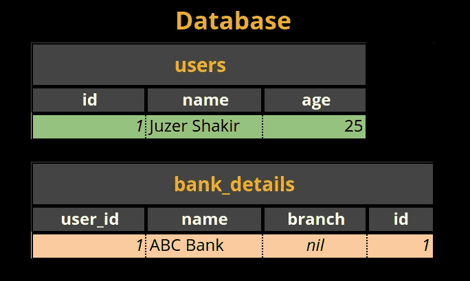
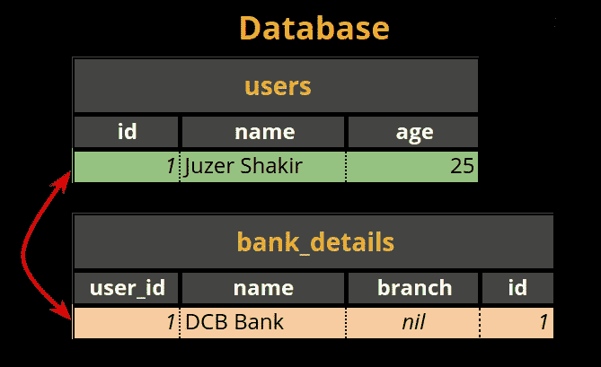
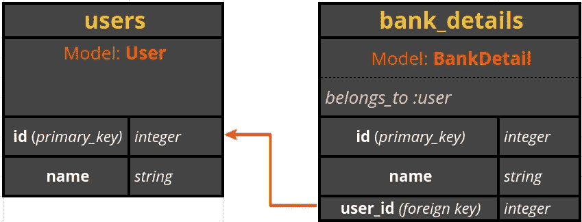
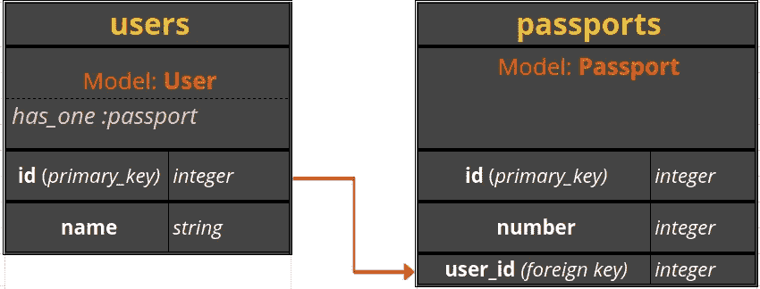
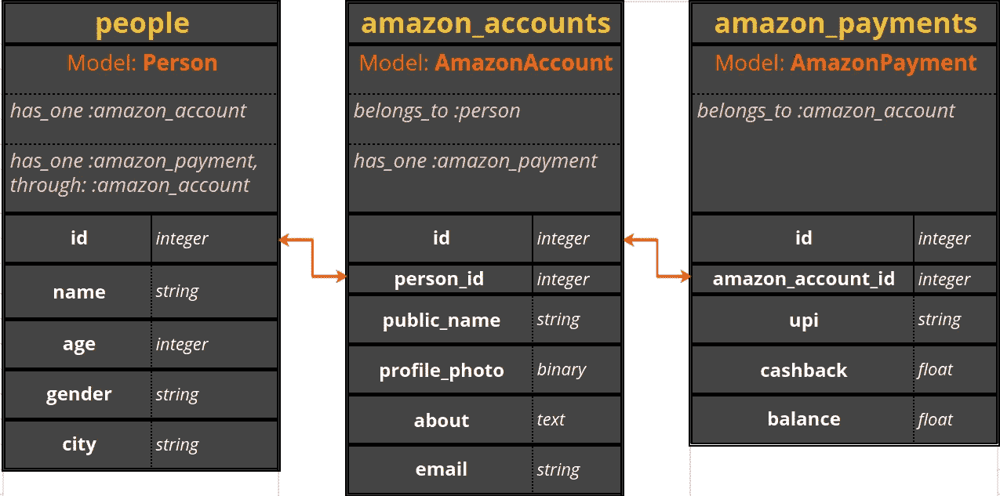
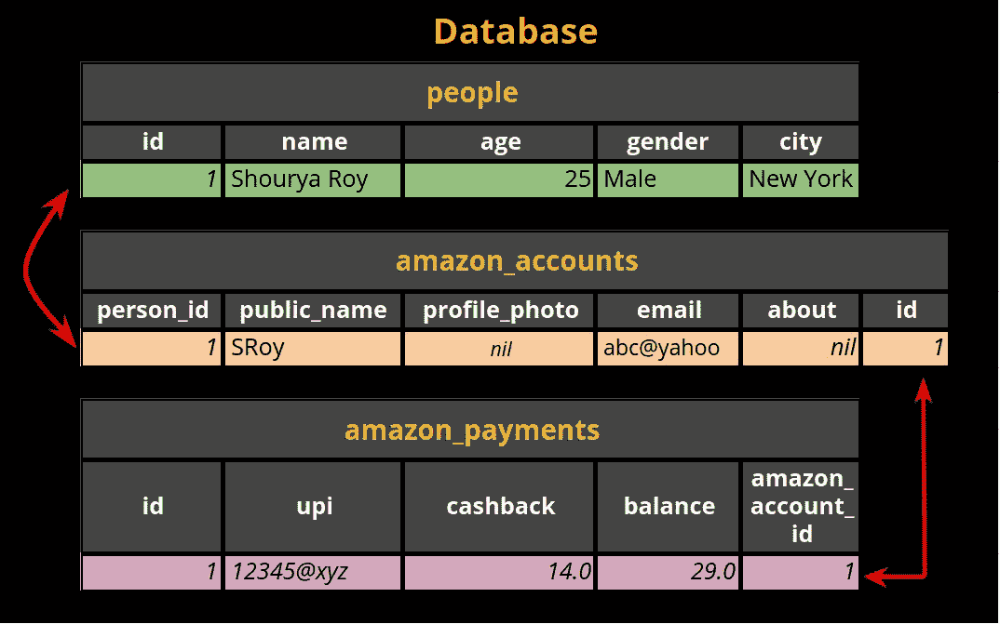

# Rails 协会—第 1 部分

> 原文：<https://medium.com/nerd-for-tech/rails-association-part-1-865c1373fb22?source=collection_archive---------2----------------------->

**什么**，**为什么**，**如何** & **3 种类型**的联想论述。

# 先决条件:

*   [活动记录基础知识](https://juzer-shakir.medium.com/rails-active-record-basics-32852cc1b2b9)
*   **Rails 迁移**
    - [生成迁移文件](https://juzer-shakir.medium.com/rails-migration-part-1-8ce3af467ace)(**Part 1**)
    -[执行迁移文件](https://juzer-shakir.medium.com/rails-migration-part-2-c2ca189e9f57)(**Part 2**)
    -[更新现有表格](https://juzer-shakir.medium.com/rails-migration-part-3-11ae1c2c1b0a) ( **Part 3** )



本文中的示例将涵盖以下主题

# 目录

↣ [**什么是联想？**](#2795)

↣为什么会联想到 [**？**](#b5c4)

↣ [**如何建立模型之间的连接？**](#827f)
↪ [无关联](#f9d7)t46】↪[有关联](#d8ed)

↣ [**联想类型**](#7328)
↪ [属于 _ 属于](#bcaa)
↪ [有 _ 一个](#cc55)
↪ [有 _ 一个还是属于 _ 个？](#f889)
↪ [已经 _one —:通过](#09b6)

# 什么是联想？

> 关联是[活动记录](https://juzer-shakir.medium.com/rails-active-record-basics-32852cc1b2b9)的特征之一，它使我们能够通过模型或活动记录对象在两个或多个表的实例之间进行链接。



# 为什么是联想？

当我们想要通过另一个表`A`提取一个表`B`的一个或多个实例的数据时，这个工具非常方便。

让我们考虑一个人有一个或多个银行账户的情况。我们为它创建两个不同的*表*，首先，它包含人员的详细信息，让我们称这个表为`users`，另一个表为`bank_details`，它包含与他们的银行相关的详细信息。

现在，如果我们有许多*用户*，其中每个*用户*都有一个或多个*银行账户*，并且我们想要提取*单个用户的银行详细信息*的数据，那么 rails 不知道要提取那个特定*用户*的哪个*银行详细信息*，因为我们还没有在*表*之间设置任何关系。



没有外键和表之间的关联，不可能链接。

如果你想知道我们将在这个例子中使用哪个关联，它将是`has_many-belongs_to`类型的关联。

# 如何设置模型之间的连接:

**没有联想:**

但是，有一种方法可以提取一个*用户* **的*银行明细*，而不需要**在模型文件中显式声明关联，方法是通过迁移给出的`reference`方法提供一个*外键*到`bank_details` *表*。

**为什么*外键*在** `**bank_details**` **表上？** **是因为** `**bank_details**` **实例提供了更多关于** `**users**` **表的特定实例的数据。**

我在之前的[文章](https://juzer-shakir.medium.com/rails-migration-part-1-8ce3af467ace)中解释过*外键的定义和声明。*

*因此，在设置了*外键*后，让我们在`bank_details`表中输入银行数据:*

*我们的*模型文件*:*

```
*# app/model/user.rb
class User < ApplicationRecord
end# app/model/bank_detail.rb
class BankDetail < ApplicationRecord
end*
```

*在终端中，首先，我们加载所需的*用户*:*

```
*user = User.find_by(name: "Juzer Shakir")*
```

*然后设置*用户的银行详细信息*:*

```
*bank_detail = BankDetail.create(name: "ABC Bank", user_id: user.id)*
```

*`user_id`是通过*迁移文件*中的`reference`方法设置的*外键*属性。我们为*用户* `*Juzer Shakir*`创建一个新的*银行明细*，方法是将银行名称设置为`ABC Bank`，并将*外键*的值**显式设置为`users`表中`*Juzer Shakir*`的*主键*值。***

**

*没有关联，我们**可以通过**外键**链接**一个用户的一个或多个银行明细。*

*这样，现在我们可以使用*外键*提取一个初始化用户的所有*银行详细信息*。*

```
*bank_details = BankDetail.where(user_id: user.id)*
```

*如果我们想从我们的表`users`中删除一个特定的*用户*，并从`bank_details`表中删除其对应的*银行详细信息*，该怎么办？首先，我们将初始化用户*并提取其*银行数据*(按照上述步骤)，然后:**

```
*bank_details.each do | bank_detail |
   bank_detail.destroy
end
user.destroy*
```

*我们遍历*用户*的*银行账户*列表，然后**手动删除每个账户，然后删除那个用户**。这确保了*用户*的所有*银行详细信息*与*用户*一起被删除。*

*现在，让我们看看在给定关联的情况下这是如何实现的:*

## *有关联:*

*在*模型文件*中声明适当的*关联*后，我们在应用程序中调用几个有用的*模型方法*(在[第 3 部分](https://juzer-shakir.medium.com/rails-association-part-3-4074f71e771b#:~:text=Auto-generated%20methods%20%26%20options%20of%20association)中讨论过)，用它们我们可以操作*表*中的数据。*

```
*# app/model/user.rb
class User < ApplicationRecord
  has_many :bank_details, dependent: :destroy
end# app/model/bank_detail.rb
class BankDetail < ApplicationRecord
   belongs_to :user
end*
```

*现在，为已初始化的*用户*创建一个新的*银行账户*:*

```
*bank_detail = user.bank_details.create(name: "DCB Bank")*
```

*看看我们如何使用关联的力量来适当地设置*外键*的值，并在`bank_details`表中创建一个新的实例，而不是显式地设置*外键*。*

**

*提取该*用户*的所有*银行明细*:*

```
*user.bank_details*
```

*如果我们希望**删除**用户*及其*银行详细信息*，这就简单多了:**

```
*user.destroy*
```

*提供给`User`模型的`:dependent`选项帮助删除了与该*用户*相关的所有*银行详细信息*。Rails 为不同类型的关联提供了许多其他的*选项*(更多信息请参见[第 3 部分](https://juzer-shakir.medium.com/rails-association-part-3-4074f71e771b#:~:text=Auto-generated%20methods%20%26%20options%20of%20association))。*

# *关联类型*

**活动记录*支持 **9** **类型的*关联*** 有:*

1.  *`[belongs_to](#bcaa)`*
2.  *`[has_one](#cc55)`*
3.  *`[has_one](#09b6)` [——](#09b6)`[:through](#09b6)`*
4.  *`[has_many](https://juzer-shakir.medium.com/rails-association-part-2-a563f870e415#:~:text=and%20has_and_belongs_to_many%20associations.-,has_many,-has_many%20association%20links)`*
5.  *`[has_many](https://juzer-shakir.medium.com/rails-association-part-2-a563f870e415#:~:text=to%20primary%20key.-,has_many-%3Athrough,-has_many-%3Athrough%20association)` [——](https://juzer-shakir.medium.com/rails-association-part-2-a563f870e415#:~:text=to%20primary%20key.-,has_many-%3Athrough,-has_many-%3Athrough%20association)`[:through](https://juzer-shakir.medium.com/rails-association-part-2-a563f870e415#:~:text=to%20primary%20key.-,has_many-%3Athrough,-has_many-%3Athrough%20association)`*
6.  *`[has_and_belongs_to_many](https://juzer-shakir.medium.com/rails-association-part-2-a563f870e415#:~:text=without%20primary-key.-,has_and_belongs_to_many,-This%20HABTM%20association)`*
7.  *[多态](https://juzer-shakir.medium.com/polymorphic-a13c329151d0)*
8.  *[自连接](https://juzer-shakir.medium.com/self-join-91416fc5b75e)*
9.  *[单表继承](https://juzer-shakir.medium.com/single-table-inheritance-sti-769070972ea2)*

*本文将涵盖前 3 个协会，# 4–6 将在[第 2 部分](https://juzer-shakir.medium.com/rails-association-part-2-a563f870e415)中涵盖，其余协会有其单独的文章。*

*所以，现在让我们从第一个关联开始，`belongs_to`是所有关联中最简单和最常用的。*

# *属于*

> *“属于”建立了与另一个模型的关系，使得声明模型的每个实例(其中声明了`belongs_to`)恰好“属于”另一个模型的一个实例。*

*这个定义是不言自明的，我们上面看到的例子就是例证。然而，我们也可以将其设置为*单向关联*，这意味着我们只从一侧设置与另一个*模型*的关系，而不是从两侧设置，这意味着我们只在一个*模型文件*中声明`belongs_to`。所以从上面举同样的例子，我们的*模型文件*现在将会是:*

```
*# app/model/user.rb
class User < ApplicationRecord
end# app/model/bank_detail.rb
class BankDetail < ApplicationRecord
   belongs_to :user
end*
```

**

*两个表之间的单向连接*

***单独在模型文件中声明一个** `**belongs_to**` **并不能保证引用的一致性，但是通过*迁移*** 声明的表中的*外键*为:*

```
*create_table :bank_details do | t |
    t.reference :user, foreign_key: true
    #...
end*
```

*在*单向关系* p 中，`bank_details` *表*的每个实例都知道它的*用户*，但是`user` *表*的每个实例都不知道它们的*银行明细*。*

*为了建立*双向关系*，我们可以将*型号*上的`has_one`或`has_many`与`belongs_to`结合使用到相对的*型号*，如上面的示例[所示。](#827f)*

> ****注意:***
> 向`belongs_to`方法声明的表名将始终采用单数-蛇形。*

# *有一个*

> *`has_one`关联将表`A`的任何实例设置为另一个表`B`的唯一实例。*

*例如:“一个*用户*只能有**一个** *护照”*。我们将其关联设置如下:*

```
*# app/model/user.rb
class User < ApplicationRecord
   has_one :passport
end# app/model/passport.rb
class Passport < ApplicationRecord
end*
```

*这设置了一个*单向关系*。因此作为值传递给`has_one`的*表*应该有一个*外键*，该外键引用声明`has_one`的模型。在我们的例子中，`passport` *表*应该有一个引用`user` *表*的*外键*。*

**

*两个表之间的单向连接*

*通常，关联在两个方向上工作，通过要求在两个不同的模型*上声明关联来建立一个**双向关联**。*为了使我们的示例*双向，*我们在另一个模型上设置了一个`belongs_to`关联(更多关于*双向*的信息请参见[第 3 部分](https://juzer-shakir.medium.com/rails-association-part-3-4074f71e771b)):*

```
*# app/model/user.rb
class User < ApplicationRecord
   has_one :passport
end# app/model/passport.rb
class Passport < ApplicationRecord
   belongs_to :user
end*
```

*现在，在数据库中创建一个新的*用户*及其 *passport* 实例，启动您的终端，导航到一个适当的目录并运行`**rails c**` 或`**rails console**`*

*   *在`users`表中创建一个新实例:*

```
*$ u = User.create(name: "Akshay")
=> #<User id: 1, name: "Akshay", created_at: "##", updated_at: "##">*
```

*   *创建那个*用户的*护照*，在`passports` 表 *:* 中新建一个*实例*

```
*$ u.passport = Passport.create(number: 97645)
=> #<Passport id: 1, number: 97645, user_id: 1, created_at: "##", updated_at: "##">* 
```

*注意，`user_id`(又名。*外键*链接到我们创建的*用户*的*主键* ( `id`)。现在提取一个*用户*s’*护照*:*

```
*$ u.passport*
```

*或者从`passports`表中提取一个*用户*，首先我们从*护照*表中加载一个实例:*

```
*$ p = Passport.find(1)
=> #<Passport id: 1, number: 97645, user_id: 1, created_at: "##", updated_at: "##">$ p.user
=> #<User id: 1, name: "Akshay", created_at: "##", updated_at: "##">* 
```

*给*类对象*的`passport` & `user`实例方法是由*活动记录*创建的，因为我们给这些*值、* `*:*passport` & `:user`，给我们的*关联* *方法(has _ one/belong _ to)*，它们链接到适当的*模型类**

# **有一个或属于？**

**要在两个*模型*之间设置一个*一对一的*关系，我们可以使用`has_one`和`belongs_to`的组合，但是我们如何确切地知道哪个模型要用`has_one`或`belongs_to`来声明呢？**

**答案就在你的数据里！比如， ***一个人只有一部智能手机*** ，我们有一部*型号*命名为`Person`和一部`Smartphone`。因此，在`Person` s' *模型中，*我们声明`has_one`关联，因为我们的数据表明一个*人*只能拥有**一部**智能手机，并且因为我们知道哪个模型具有`has_one`关联，所以另一个模型将具有`belongs_to`关联。然而，如果我们交换关联，这将意味着*‘一部智能手机只有一个人’，*这与我们的例子相反。**

**一旦您知道哪个模型声明了一个`belongs_to`关联，我们就可以通过*迁移*为相应的*表*设置一个*外键*。**

# **has_one —:通过**

**在这个关联中，链接模型的概念类似于`has_one`关联，但是我们需要 3 个模型，而不是 2 个。因此...**

> **`has_one-:through`关联在 3 个模型之间建立一对一的连接，其中第一个模型的实例可以通过第二个模型链接到第三个模型，其中第二个&第三个模型包括一个外键。**

**为了更好地理解这一点，让我们以“**一个人通过其亚马逊账户拥有一个亚马逊支付账户”为例。****

**为了实现上面的例子，我们将需要数据库中的 3 个*表*，并且在它们对应的*模型文件*中，我们将设置以下*关联*:**

```
**# app/model/person.rb
class Person < ApplicationRecord
   has_one :amazon_account
   has_one :amazon_payment, through: :amazon_account
end# app/model/amazon_account.rb
class AmazonAccount < ApplicationRecord
   belongs_to :person
   has_one :amazon_payment
end# app/model/amazon_payment.rb
class AmazonPayment < ApplicationRecord
   belongs_to :amazon_account
end**
```

**这是*模型*如何链接的可视化表示:**

****

**这种关联使我们能够直接提取*个人的亚马逊支付* **的数据，而不是首先提取*个人的亚马逊账户*的数据，然后提取其*亚马逊支付*的数据。为了更好地理解，让我们为*表*设置一些数据:****

```
**$ person = Person.create(name: "Shourya Roy", age: 25, gender: "Male", city: "New York")**
```

***关联*使我们能够通过`.amazon_account`方法访问`person`s’*亚马逊账户*到类`Person`的类对象。**

```
**$ person.amazon_account
=> nil**
```

**由于我们**还没有**设置那个`person`s’*亚马逊账户*的任何数据，它将返回值为`nil`，所以我们来设置一下:**

```
**$ person.amazon_account = AmazonAccount.create(public_name: "SRoy", email: "abc@yahoo")
=> #<AmazonAccount id: 1, public_name: "SRoy", profile_photo: nil, email: "abc@yahoo", about: nil, person_id: 1, created_at: "##", updated_at: "##">**
```

**`person_id`链接*亚马逊账户*的实例来修正`person`。现在要设置`person`的*亚马逊支付*，我们需要通过一个*亚马逊账户*来设置。**

```
**$ acc = AmazonAccount.first$ acc.amazon_payment = AmazonPayment.create(upi: "12345@xyz", cashback: 14.00, balance: 29.00)
=> #<AmazonPayment id: 1, cashback: 14.0, upi: "12345@xyz", balance: 29.0, amazon_account_id: 1, created_at: "##", updated_at: "##">**
```

**让我们将上面设置的数据可视化:**

****

**提取一个`person`的所有*亚马逊支付*细节:**

```
**person.amazon_payment**
```

**为了只提取那个*用户*的`balance`值:**

```
**person.amazon_payment.balance
= 29.00**
```

**其余的关联`has_many`、`has_many-:through`和`has_and_belongs_to_many`在[轨道关联—第 2 部分](https://juzer-shakir.medium.com/rails-association-part-2-a563f870e415)中详细讨论。那里见！**