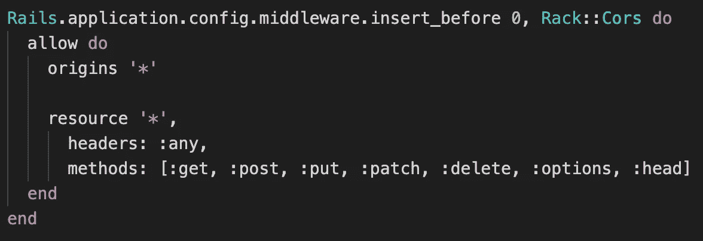

# 轨道架 CORS

> 原文：<https://medium.com/nerd-for-tech/rails-rack-cors-6c0c7ee438bb?source=collection_archive---------7----------------------->

来自[派克斯](https://www.pexels.com/photo/people-inside-building-3184455/?utm_content=attributionCopyText&utm_medium=referral&utm_source=pexels)的[派克斯](https://www.pexels.com/@fauxels?utm_content=attributionCopyText&utm_medium=referral&utm_source=pexels)拍摄的照片

Rails 简化了许多耗时的任务，而这些任务是开发人员过去花费时间和精力去解决的。这些简化的任务之一由机架 CORS 执行。

机架 CORS 处理跨源资源共享(CORS ),以便接受跨源 AJAX 请求。我怎么知道这个？因为 Rails 直接在位于 config/initializer/cors.rb 内自动生成的 Rails 应用程序文件夹中的 CORS . Rb 文件中进行注释:

> #避免从前端应用程序调用 API 时出现 CORS 问题。
> 
> #处理跨源资源共享(CORS ),以便接受跨源 AJAX 请求。

Rails 还通过注释扩展了它的有用支持:

> #修改此文件时，请确保重新启动服务器。
> 
> #阅读更多:【https://github.com/cyu/rack-cors 

建议的 Github 站点进一步解释了 Rack CORS 是一个中间件，它为 CORS 提供了对 Rack 兼容的 web 应用程序的支持。我已经陈述了 CORS 代表什么，但是 Rack 是什么？Rack 是一个网络服务器接口。根据维基百科:

> Rack 是 web 服务器和用 Ruby 编程语言开发的 web 应用程序之间的模块化接口。使用 Rack，用于 web 框架和中间件的应用程序编程接口(API)被封装到一个处理 HTTP 请求和响应的方法调用中。

简单地说，机架 CORS 允许机架兼容前端应用程序从您的 Rails 后端请求信息。您的数据存储在后端，因此当用户点击前端应用程序时，这些点击会向 Rails 后端发送获取请求，以执行任务和收集数据。这个动作被描述为跨源的，因为请求来自一个 Rails 后端不熟悉的实体。机架 CORS 允许这种请求发生，并让您控制谁可以提出请求以及可以提出什么类型的请求。

例如，您可以允许请求查看姓名列表，但不允许请求将姓名添加到列表中。还可以使用星号(*)允许来自任何来源的对任何资源的请求。

要在 Rails 后端实现机架 CORS，请在 Gemfile 中取消注释或添加以下内容:

**宝石'架-cors'**

运行软件包更新来安装这个 gem。然后在您的 cors.rb 文件中，取消对 cors 中间件的注释，如果您希望允许所有请求，请确保 origins 和 resource 带有星号:

就是这样！现在可以向 Rails 后端发出获取请求，给用户一个完整的交互体验。

因此，当您设计和构建 Rails 后端 API 时，请记住您的用户，并设置机架 CORS 来反映他们将如何使用您的数据或与您的数据交互。

机架上的文档可在以下位置找到:
[https://guides.rubyonrails.org/rails_on_rack.html](https://guides.rubyonrails.org/rails_on_rack.html)

关于 CORS 的文件可以在 https://developer.mozilla.org/en-US/docs/Web/HTTP/CORS
找到