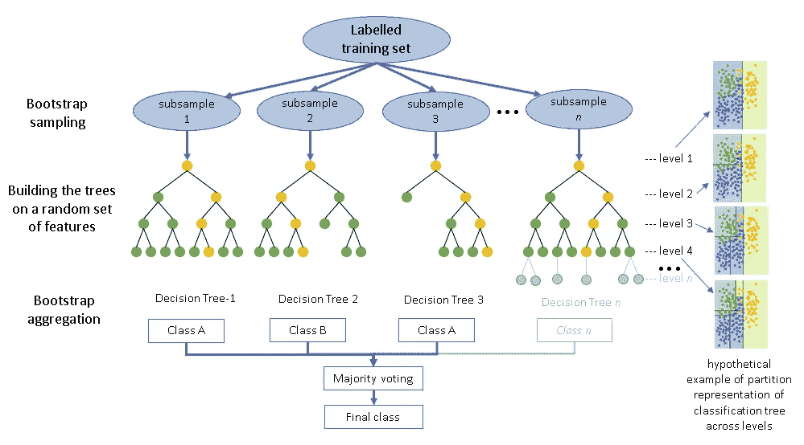
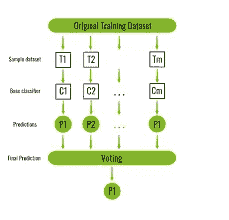

# 随机森林——一种可靠的算法。

> 原文：<https://medium.com/nerd-for-tech/random-forest-sturdy-algorithm-d60b9f9140d4?source=collection_archive---------11----------------------->

决策树有许多问题，如贪婪算法、过拟合、低预测精度和计算变得复杂，当有许多类别标签时。为了克服这些问题，我们使用随机森林。

随机森林分类器

集成是一种机器学习范式，旨在让慢学习者成为快学习者。有几种类型的集成方法，如装袋、助推、堆叠。随机森林属于装袋法。

Bootstrap Aggregating 或 Bagging 是一种机器学习元算法，旨在提高统计分类和回归中使用的机器学习算法的稳定性和准确性。它还减少了方差，有助于避免过度拟合。

替换为原始大小的引导数据集称为引导。它使用引导数据集创建决策树，但在每一步中只使用随机变量子集。装袋减少了差异，减少了过度拟合的机会。不包括在引导数据集内的数据被称为包外数据集。被错误分类袋外样本的命题被称为“袋外误差”。

随机森林通过对树木进行去相关的小调整，提供了对袋装树木的改进。随机森林仅选择变量的子集，并基于该变量形成根节点。因此它避免了预测值的变化，减少了过度拟合的机会。随机森林对于为每个决策树随机选择不同特征并对这些特征进行评分的特征选择是有用的。

它汇总了所有估计器的预测结果。在分类问题的情况下，它根据投票分类器给出最终输出，在回归任务中，它计算聚合值的平均值并给出最终预测值。

## 超参数:

数据科学家的主要角色是适当地调整模型中可用的超参数。随机森林中有几个可用的超参数。他们是

→ n_estimators:森林中决策树的数量。

→ max_feature:寻找最佳分割时要考虑的特征数量。

→ max_depth:树的最大深度

→ min_samples_split:分割内部节点所需的最小样本数

→ min_sample_leaf:一个叶节点所需的最小样本数。

还有更多可用的超参数，请参考文档以了解随机森林中可用的超参数的更多信息。

对于分类问题，每个树中要考虑的特征数量是 **m=sqrt(p)。**

对于回归问题，每棵树中要考虑的特征数量是 **m=p/3。**

每个模型的性能都通过出袋样品进行测试。当森林中的每棵树都用袋外样本测试时。当平均时，它可以提供袋装模型的估计精度。这种估计的性能通常被称为 OOB 性能估计。这些性能指标与交叉验证估计值有很好的相关性。

**优点**:

*   它不会过度拟合
*   这是目前最精确的学习算法之一。
*   不需要特征缩放。
*   它在大型数据库上高效运行。

**缺点**:

*   偏向于具有许多类别的特征。
*   它消耗更多的运行时间。

**结论**:

*   随机森林是预测的有效工具。
*   Forest 给出的结果与 boosting 和 adaptive bagging 具有竞争力，但不会逐渐改变训练集。
*   随机输入和随机特征在预测中产生良好的结果。
*   它需要非常少的特征工程。

参考这个 github [链接](https://github.com/Rishikumar04/Practise-Problems/blob/main/Udemy_Practise_Problem./05-Decision%20Trees%20and%20Random%20Forest%20Project.ipynb)了解实际实现。