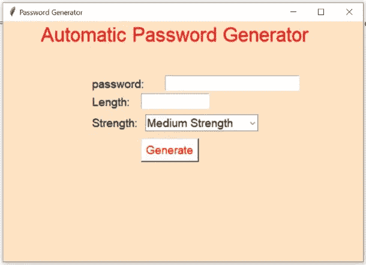
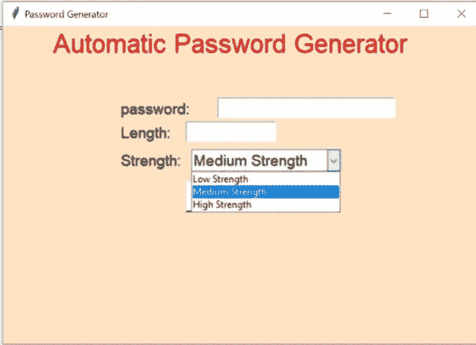

# 使用 Tkinter 的随机密码生成器

> 原文：<https://medium.com/nerd-for-tech/random-password-generator-using-tkinter-635f61cfaae8?source=collection_archive---------6----------------------->

使用 Python GUI(Tkinter 模块)创建随机密码生成器的完整指南


**什么是随机密码生成器？**

这是一个工具，生成密码的基础上，给定的准则，你设置创建一个不可预测的强密码为您的帐户。密码生成器工具为用户创建一个随机的自定义密码，帮助他们创建一个提供更高安全性的强密码。

关于随机模块的更多信息，请参考本文档*(*[*【https://www.w3schools.com/python/module_random.asp】*](https://www.w3schools.com/python/module_random.asp))

**现在让我们开始一个使用 Python GUI 的随机密码生成器项目:**



# 项目代码:

[https://github . com/platform uma/medium _ blog/blob/99776992 f 7 e 40 a 4 bcbcd 8753991 aa 264 f 0101952/random _ password _ generator _ GUI . py](https://github.com/Platforuma/medium_blog/blob/99776992f7e40a4bcbcd8753991aa264f0101952/random_password_generator_gui.py)

**现在让我们逐行深入理解代码。**

# 定义代码工作:-

```
from tkinter import *
from tkinter.ttk import Combobox
import random
```

**Tkinter** 是 Python 中 GUI 库的名称。

**[**tkinter . ttk**](https://docs.python.org/3/library/tkinter.ttk.html#module-tkinter.ttk)**模块提供了对 **Tk** 主题小部件集和导入**组合框的访问。**组合框是一个 GUI 特性，组合框结合了下拉框、列表框或提供用户选择的输入。****

```
**screen = Tk()
screen.title("Password Generator")
screen.geometry('600x400')
screen.configure(background ="bisque")**
```

******Tk** 类用于创建根窗口。Tk 函数提供了一个 GUI 窗口，并且提供了许多功能，如设置标题、设置 GUI 窗口的几何形状。****

****在这些步骤中，我们给出了 GUI 根窗口的标题。标题是在一行中定义的。 **Tkinter** 提供了很多方法，其中之一就是 geometry()方法。****

****在这一行代码中，我们正在处理 Tkinter GUI 窗口的背景颜色。****

```
**def gen():
global sc1
sc1.set("")
passw=""
length=int(c1.get())
lowercase='abcdefghijklmnopqrstuvwxyz'
uppercase='ABCDEFGHIJKLMNOPQRSTUVWXYZ'+lowercase
mixs='0123456789'+lowercase+uppercase+'@#$%&*'**
```

****现在来看下一行代码，我们定义了一个函数。这里我们定义了全局变量 sc1。编程中包含两种类型的变量，第一种是局部变量**，第二种是全局变量****。******

****在这行代码中，我们在 **sc1** 上使用了 set 方法。这里我们将 sc1 的值设置为 null。然后我们用一个空值定义 **passw** 变量。在这行代码中，我们定义了**长度变量**来保存 c1 的值，并将 c1 值类型定义为整数。现在我们定义小写的**变量**来保存一些字符串值。接下来，我们定义大写的**变量**来保存一些字符串值。在代码的最后一行，我们定义了**混合**。****

```
**if c2.get()=='Low Strength':
for i in range(0,length):
passw=passw+random.choice(lowercase)
sc1.set(passw)
elif c2.get()=='Medium Strength':
for i in range(0,length):
passw=passw+random.choice(uppercase)
sc1.set(passw)
elif c2.get()=='High Strength':
for i in range(0,length):
passw=passw+random.choice(mixs)
sc1.set(passw)**
```

****在这行代码中，我们定义了 if 条件，用于在项目中指定一些条件。****

********

****因此，在代码中，我们定义了 **if 条件**，其中条件为:C2 . get()= =‘低强度’。这里条件为真，然后程序跳转到代码的下一步。然后我们为一个**循环**定义。接下来，我们定义 **passw** 变量来保存小写的 **passw + random** 选择值。我们再次使用 set 函数，从 **passw** 变量中为 **sc1** 变量分配新值。****

****现在我们在代码中使用 **elif 条件**。先领悟，**什么是 elif？所以 elif 是 python 编程语言中的关键字。当前面的 if 条件不为真时，使用 Elif，程序跳转到 elif 条件”。这里我们定义了 elif 条件，条件是:c2.get()== '中等强度'。******

****定义**为一个循环**。现在，我们再次使用 set 函数，从 passw 变量中设置 sc1 变量的值。****

****在这行代码中，我们再次定义了 **elif 条件**，其中条件为:c2.get()=='High Strength '。当条件为真时，程序跳转到下一行代码。这里我们为一个循环定义。现在，当循环完成时，程序再次进入下一行代码。这里我们定义了 **passw** 变量来保存来自 mix 变量的 **passw + random** 选择值。现在，我们再次使用 set 函数从 passw 变量中设置 sc1 变量值。****

```
**sc1=StringVar('')
t1=Label(screen,text='Automatic Password Generator',font=('Arial',25),fg='red',background ="bisque")
t1.place(x=60,y=0)
t2=Label(screen,text='password:',font=('Arial',14),background ="bisque")
t2.place(x=145,y=90)**
```

****现在在这行代码中，我们定义了 sc1 变量。****

****现在来看看 GUI 窗口的设计部分。这里我们在一个项目中使用了一些**标签、输入框**和**按钮**。所以让我们开始理解工作。****

****这里我们在 GUI 窗口上定义了一个标签 t1，其中 t1 是标签对象的名称。在这里，我们在标签上写下文本，并设置标签的字体和背景。****

****现在我们再取一个标签，定义一个标签 t2，反之亦然。我们使用 x 或 y 坐标值来指定 t1 标签的位置。****

```
**il=Entry(screen,font=('Arial',14),textvariable=sc1)
il.place(x=270,y=90)
t3=Label(screen,text='Length: ',font=('Arial',14),background ="bisque")
t3.place(x=145,y=120)
t4=Label(screen,text='Strength:',font=('Arial',14),background ="bisque")
t4.place(x=145,y=155)
c1=Entry(screen,font=('Arial',14),width=10)
c1.place(x=230,y=120)**
```

****在我们之前的 Python GUI 项目中，我们理解了输入框是如何工作的。****

****这里，我们在 GUI 窗口上用对象 il 定义输入框，并设置 il 条目的字体，文本变量保存 sc1 的字符串值。现在在这一行中，我们使用 x 或 y 坐标值来指定 il 条目的位置。****

****我们再次定义标签 t3。接下来，我们通过坐标值来指定地点。我们定义标签 t4。接下来，我们通过坐标值来指定地点。现在我们再次定义条目 c1。指定地点。****

```
**c2=Combobox(screen,font=('Arial',14),width=15)
c2['values']=('Low Strength','Medium Strength','High Strength')
c2.current(1)
c2.place(x=237,y=155)
b=Button(screen,text='Generate',font=('Arial',14),fg='red',background ="white",command=gen)
b.place(x=230,y=195)
screen.mainloop()**
```

****在这一行代码中，我们正在处理**组合框**。这里我们定义了组合框 c2。将组合框 c2 的值定义为低强度、中等强度和高强度。这里我们用当前函数设置 c2 值。我们还可以给出组合框的位置，并使用 x 或 y 坐标值来指定 c2 组合框的位置。****

********

****现在来看一个项目的**按钮部分**，当我们点击这个按钮时，我们正在执行一个动作。****

****这里，我们在 GUI 窗口上定义了一个 b 按钮，并在按钮上给出了 gen 命令，用于在按下按钮时执行一个动作。然后，我们使用 x 或 y 坐标值来指定 b 按钮的位置。****

****现在来看该项目的最后一行代码是提供无限循环的**主循环**函数。那么让我们开始理解它是如何工作的？****

******mainloop()** 是一个用来运行应用程序的无限循环，使用这个函数窗口只要不关闭。****

****就是这样！！！****

****这里，我们使用 Python Tkinter、random 和 Combobox 模块完成了 GUI 项目。****

# ****访问我们的网站:****

****[](https://www.platforuma.com/) [## 学习、创新和激励-平台

### Platforuma 是一家位于印多尔的教育科技初创公司，提供学习和 Arduino 培训、Python 学习、机器人技术…

www.platforuma.com](https://www.platforuma.com/) 

**作者:** [**普里扬卡**](https://www.instagram.com/p_i_h_u_9754/)

**编辑:**[**Ashutosh Raghuwanshi**](https://www.instagram.com/ashutosh_.i/)**，**[**Devendra Patidar**](https://www.instagram.com/dev__ptdr/)， [**Riya Patidar**](https://www.instagram.com/riyapatidar002/)****