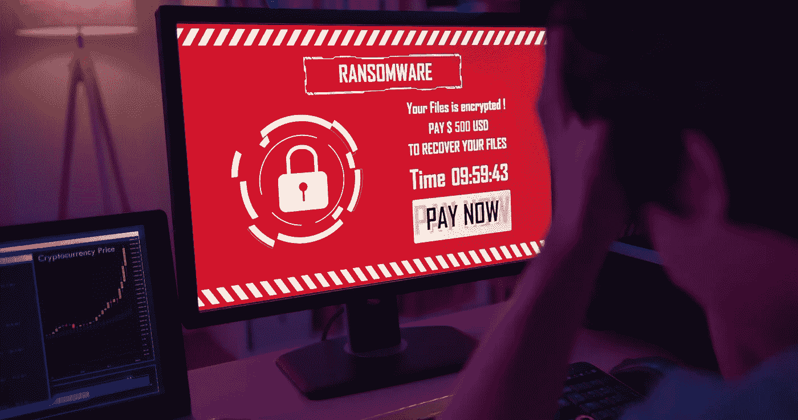

# 欧洲的勒索软件攻击:本周的“警钟”

> 原文：<https://medium.com/nerd-for-tech/ransomware-attacks-in-europe-the-wake-up-calls-of-the-week-83f270b3859?source=collection_archive---------1----------------------->

仅造成经济损失的安索姆软件攻击似乎就像过去的好时光一样。因为不仅仅是金钱、知识产权或隐私处于危险之中。威胁是身体上的，影响健康和安全。

近年来，攻击者越来越关注致力于关键基础设施(CI)的组织，如能源、食品、公用事业、卫生、交通等。原因很明显。如果他们能够阻止 CI 提供商运营，并可能使数百万人处于风险之中，他们认为他们更有可能获得数万到数百万的快速回报，

因此，您可能会认为组织，尤其是在 [16 个 CI 部门](https://www.cisa.gov/critical-infrastructure-sectors)的组织，会专注于加强他们的安全以应对日益增长的威胁。

根据统计数据，你可能错了。受害者的名单很长，而且越来越长——联邦调查局的“[互联网犯罪报告 2021](https://www.ic3.gov/Media/PDF/AnnualReport/2021_IC3Report.pdf) ”记录了 649 起针对美国关键基础设施运营商的勒索软件攻击投诉，其中大多数针对医疗保健、金融服务、信息技术和关键制造业。

**走向全球**

当然，目标不仅仅是美国的关键基础设施。这是一个全球性的问题。

8 月中旬，Clop 勒索软件集团(又名 Cl0p)在其 leak 网站上宣布，它已经攻破了英国南斯塔福德郡水务公司(South Staffordshire Water)，这是一家为大约 160 万客户提供水的私营公司。

正如 Vedere Labs [几天后](https://securityboulevard.com/2022/08/analysis-of-clops-attack-on-south-staffordshire-water-uk/)报道的那样，攻击者没有加密数据。“他们选择使用越来越受网络犯罪分子欢迎的勒索技术:泄露一些泄露的数据，公开羞辱受害者，并威胁如果不支付赎金将会有进一步的后果。”

Clop 不仅泄露了一份包含员工电子邮件地址、用户名和密码的电子表格，以显示他们在南斯塔福德郡自来水公司内部，而且还发布了几张截图，表明他们可以操纵水中的化学物质水平。

在这种情况下，很可能没有造成重大伤害——ve dere 指出，该公司可能有补偿控制，不会接受篡改的化学值。但它表示，泄露的材料显示，“攻击者可以访问南斯塔福德郡水务公司的 it(信息技术)和部分 OT(运营技术)网络，这表明该公司可能在这两者之间存在薄弱的分割政策。这在针对关键基础设施的勒索事件中很典型。”

然后是医疗保健。位于巴黎城外约 17 英里的 CHSF 中心医院宣布，8 月 21 日，该医院遭到勒索软件攻击，服务中断，迫使医院将患者转介给其他服务提供商。根据翻译的公告，攻击“使医院的业务软件、存储系统(特别是医疗成像)以及与患者入院相关的信息系统暂时无法访问”。

攻击者据称是勒索软件集团 LockBit 3.0 的子公司，要求 1000 万美元的赎金。截至上周晚些时候，没有来自 CHSF 的关于是否支付赎金的报道。

但是,[AttackIQ 的联合创始人兼首席技术官 Stephan Chenette 告诉 CyberWire](https://thecyberwire.com/newsletters/privacy-briefing/4/163) ,这次攻击“再次提醒人们，组织根本没有充分发挥他们的防御能力，尤其是医疗保健组织应该评估他们现有的安全控制措施，以便在攻击者发现之前发现漏洞。我们不断看到基本安全保护失败导致大大小小的公司数据丢失。”

事实上，如果袭击者袭击了多个目标，而 CHSF 的病人又没有“其他提供者”可以求助，那会怎样呢？

**按下贪睡按钮？**

Chenette 和 Vedere 实验室都表示，这些攻击应该成为关键基础设施运营商提高安全性的“警钟”。

但愿如此。这些只是近年来几十起灾难性网络攻击中的几起——勒索软件和其他——被贴上了警钟的标签。它们包括

*   2010 年，震网病毒摧毁了伊朗核设施的很大一部分
*   [Industroyer，](https://www.welivesecurity.com/2016/01/04/blackenergy-trojan-strikes-again-attacks-ukrainian-electric-power-industry/)2016 年导致乌克兰部分电网瘫痪
*   2014 年发现的对[人事管理办公室](http://www.csoonline.com/article/3130682/data-breach/the-opm-breach-report-a-long-time-coming.html)的攻击，泄露了超过 2200 万现任和前任联邦雇员的个人和财务信息
*   2021 年[对殖民地输油管道](https://www.politico.com/news/2021/05/08/colonial-pipeline-cyber-attack-485984)的勒索软件攻击导致东海岸近一半的燃料供应——汽油、柴油、喷气燃料和取暖油——关闭了近一周
*   “三大”信用报告机构之一的 Equifax2017 年[数据泄露，泄露了超过 1.47 亿人的重要个人数据](https://krebsonsecurity.com/2017/09/breach-at-equifax-may-impact-143m-americans/)
*   2021 年 JBS 食品公司遭遇勒索病毒攻击，导致肉类供应中断，价格飙升。

然而，正如切尼指出的那样，在经历了所有这些以及更多之后，太多的情报人员仍然犯有“基本安全保护失败”的罪行。这在数字上相当于把门、文件和保险箱都不上锁。

新思软件完整性小组的高级安全工程师鲍里斯·西波特说，这些失败的一个原因是人们否认他们自己的漏洞来自不安全的软件。“通常人们不会向他人学习，”他说。“所以当坏事发生在他们身上时，警钟就敲响了。但那时已经太晚了。”

他的同事、首席安全顾问迈克尔·法比安(Michael Fabian)也认为，“我们在不断重复同样的讨论和‘警钟’。”

具有讽刺意味的是，事情本不必如此糟糕。有很多好的安全建议。联邦调查局的报告建议采取几项措施，包括

*   更新您的操作系统和软件
*   实施用户培训和网络钓鱼练习，以提高对可疑链接和附件风险的认识
*   如果您使用远程桌面协议，请保护并监控它
*   对您的数据进行离线备份

Vedere 实验室建议

*   识别连接到网络的所有设备:IT、OT 和 IoT 都将成为攻击者的目标
*   对网络中所有连接的设备实施安全合规性
*   细分 IT 和 OT 系统以降低风险
*   监控网络通信，以便在检测到异常流量时，可以执行响应操作或更严格的控制

列表上的事情并不总是简单的——尤其是保持系统更新。修补或更新运行许多关键基础设施的工业控制系统，比点击智能手机上的图标安装应用程序的最新更新要复杂得多。

新思科技网络供应链风险管理项目总监唐纳德·戴维森在几个月前的一次 CI 攻击后表示，修补 CI 系统“不像修补软件那么简单”，因为解决运营技术安全问题意味着更新硬件。“我们都把传统硬件保存得太久了，”他说，“所以尽管我们一直在发现更多的漏洞，但我们在纠正或减轻它们方面速度很慢。”

显然，这种情况需要改变。Fabian 和 Cipot 都表示，与联邦机构的建议相比，政府可能会采取更严厉的措施。它需要授权，并强制执行这些授权。

“官方标准和要求需要很长时间才能通过，尽管有大量的参考资料，”Fabian 说。“我不确定政府通过罚款或其他法律处罚来真正打击安全的临界点会是什么。”

Cipot 同意。他说，大多数 CI 运营商已经将他们的 IT 和 OT 系统分开，“但恶意软件仍然设法进入。”

“建议是一种很好的姿态，可以帮助那些想要防止坏事的人，”他说。然而，任务会帮助那些甚至不知道坏事会发生在他们身上的人。