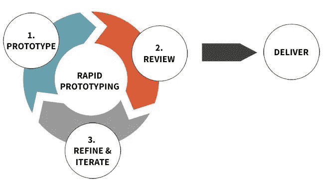

# 快速原型练习，以提高你的 UX 技能

> 原文：<https://medium.com/nerd-for-tech/rapid-prototyping-exercises-to-enhance-your-ux-skills-eb426d352d7b?source=collection_archive---------25----------------------->

> “一幅好图胜过千言万语。”

T 他的老话道出了用户界面原型化的核心内容。利用各种视觉素材直接展现软件系统和界面细节，远比用一千个字来口头描述一件事情要多得多。设计和开发规范更加清晰和直观。

[Wondershare Mockitt](https://bit.ly/3ewCXuz) 表示[快速原型制作](https://bit.ly/2ObNoJr)是指设计师通过快速原型制作来模拟网站或软件系统未来状态的过程。这对于诸如用户、投资者、开发者和设计者的更多相关人员来说是方便的。创建高质量快速原型的关键是设计师需要从用户反馈出发，结合合适的原型方法，快速修改软件原型，从而提出更能满足用户需求的设计方案。

快速原型可以帮助 UI/UX 设计师团队快速测试和迭代各种设计思想和方法。让他们在交流和讨论的过程中能够使用更直观、形象的设计素材。而不仅仅是口头描述。同时可以保证参与的每一个人都能得到一致的理解，减少甚至避免遗漏一些重要需求的风险。最终达到越来越快完成软件设计的目的。

# 什么是快速成型？

快速原型制作目前是每个人都在谈论的话题，许多研究人员说技术是不久的将来决定性的大趋势之一。但是这个术语的真正含义是什么呢？快速原型制作是一个迭代的过程，用来展示将制作什么样的网站或应用程序；目的是从用户、股东、开发者和设计者那里获得反馈和验证。

快速原型在实现这些目标的过程中扮演着重要的角色。它包含了许多不同的技术，并允许 UX 设计师使用各种生产和测试方法来完善他们的想法。通过创新的快速原型制作流程，公司可以在短时间内生产出高精度的原型。

如果使用得当，快速原型法将增强各方之间的沟通，降低构建错误需求的风险，从而提高设计质量。

# 快速成型的过程

一个原型往往从产品关键部分的一个非常简单的模型开始，在每次迭代中，基于从用户反馈中收集的越来越多的数据，它变得越来越复杂。快速原型法由按需多次迭代的开发三部曲组成:

**1。原型:**创建一个解决方案或用户界面的可视化模型。

**2。评审:**与用户分享原型，根据用户的需求和期望进行改进。

**3。细化:**根据反馈，确定需要改进或细化的部分。

借助快速原型设计，可以快速轻松地优化设计和功能，这为公司带来了诸多优势。此外，快速成型工艺还包括 3D 打印。快速原型法的使用给公司带来了一系列的好处。我们在下面向您介绍其中最重要的几个:

***更快的生产出原型***

使用快速原型制作过程，原型可以比传统方法生产得更快。由于快速原型制作技术，原型可以更早更频繁地设计出来。

***时间和成本效益***

快速原型不需要任何先前昂贵或耗时的工具制造。许多不同的几何形状可以用同一个快速原型制造装置来制造。可以更好、更快地识别错误和不准确之处，同时节省大量时间和成本。

***新技术可能性***

快速原型制造的另一个好处是它允许更多的实验性制造方法。通过生物打印 3D 打印机，可以模仿真实的人体组织等。世界各地的几个研究项目已经在致力于打印整个器官。

***改进产品***

第二个优势是借助快速原型制作获得产品的三维印象，从而更好地找出弱点。随着每一个新原型的产生，旧的弱点被消除，直到一个准备好用于批量生产的产品最终出现。使用以前的建造方法，这只有在相当大的投资下才有可能。

# 3 个快速原型练习来提高你的 UX 技巧

***1。8–6–4–2 快速原型法。***

8–6–4–2 快速原型制作是提高 UX 技巧的非常有效的方法。练习这个练习有助于你在设计的所有阶段整合反馈。这也是让你的团队参与到项目早期阶段的快速练习——尤其是那些不熟悉 UX 流程的团队。一些 UX 设计师使用这种技术来帮助我快速解决问题——完成这个练习不到 30 分钟，就有作品展示出来了。在处理自己的项目或设计挑战时，这也是一种快速实践的技巧。

技巧:8 分钟、6 分钟、4 分钟和 2 分钟的素描，中间有 2 分钟的反馈时间。在你开始画草图之前，向给你反馈的人提供一点关于问题的背景会有所帮助。

**2*。一扭上#DailyUI 挑战***

日常 UI 的挑战始于一位设计师 Paul Flavius Nechita，他在 dribbble 上发布了一个界面作品。你只需要在网站上注册邮箱，你每天都会在邮箱里收到一个 UI 话题。在他完成了 100 天挑战后，他还启发了许多设计师做同样的挑战。但做这样的挑战，一开始最头疼的就是“问题”。为自己考虑这个主题实际上不是一件容易的事情。

**日常 UI 练习的利与弊**

1.日常的确有许多优点，例如:

2.百日挑战是自我挑战的一种很好的形式。每天都有一个具体的努力目标，这样练习就更有方向了。

3.每天积累的成果非常可观。不仅能快速积累作品，还能考验你的决心和毅力。积累的天数越多，越能显示出你非凡的毅力。

4.与一般的练习方法相比，可以在短时间内快速提升力量。

如果你是一个视觉设计师，单纯想提高自己的视觉设计技能，日常 UI 也可以认为是一个可以利用的练习。在互联网上，如运球，许多有经验的设计师也参加了挑战，分享他们的工作。初级 UI/UX 设计师可以通过查看或临摹来增强视觉敏感度。

***3。解决你遇到的问题。***

作为一名 UX 设计师，你会觉得某些问题应该有更好的解决方案。每天花时间写下这些问题。也许，你已经积累了 2-5 个问题。现在是你开动脑筋的大好时机。

**任务:**列出现实生活中的问题，每天留出 1-2 小时进行用户调研。解决最重要的用户痛点。完整的高保真设计。

# 改善设计缺陷的快速原型工具

一个有效的原型工具不仅可以实现 UX 设计师的高效率，而且可以为不同的目标用户创建不同类型的原型。设计师可以用它通过这些快速成型工具直接展示产品的风格和结构。

***Mockplus***

Mockplus 是一个快速原型开发工具，新的产品经理可以轻松学习。工具的设计原则是他们关心的是设计，而不是工具。如果你的时间有限，你不会错过这个工具，因为你只能花半个小时来学习如何使用它。对了，这个工具的交互设计也很受欢迎。不需要复杂的数据和编程，移动鼠标就可以轻松完成交互设计。因此，对于新设计师来说，它是一个很好的快速成型工具。

***轴***

Axure 是 Axure 软件解决方案的旗舰产品，是一种专业的原型开发工具。它确保负责用户定位需求、标准、设计功能和界面的设计师快速为应用和网站创建原型、线框、流程图和规范文档。它有完整的功能，方便您的团队一起工作，更好地沟通您的想法。所以我觉得如果你是一个需要做一些复杂交互设计的专业设计师，那么 Axure 可能是一个不错的选择。

***Balsamiq 样机***

它是加州 Balsamiq 工作室推出的快速原型制作工具之一。它能抓住原型制作的核心和平衡，不仅设计草图还能进入团队的流程和工具。它形式多样，设计精美，还支持 HTML 原型图片。这个专业的原型制作工具也很受欢迎。但是，设计原型时没有交互功能。

# 结论

我坚信快速原型法在创建高质量用户界面的过程中帮助了我们。我们生活在一个丰富的动态用户界面的世界里，无论是在网络上还是在我们的设备上。我们创建的界面是交互式的，对用户输入有反应，并且有情感。快速原型制作允许你用一种简单的展示形式不能表达的方式表达设计感受和功能。通过快速原型训练，你可以培养快速解决问题和验证假设的能力。

感谢您花时间阅读这篇文章。[了解更多关于 Mockitt 的信息](https://bit.ly/3ewCXuz)

我们为 UX 初学者创建了一个[终极指南](https://bit.ly/2OLPPlW)，它收集了来自多个 UXers 的知识、经验和建议。

订阅我们的[YouTube](https://www.youtube.com/channel/UCESxamaRS8nOGpWYvP1VSqA)脸书 insta gram

*最初发表于*[*【https://mockitt.wondershare.com】*](https://mockitt.wondershare.com/ui-ux-design/rapid-prototyping.html)*。*