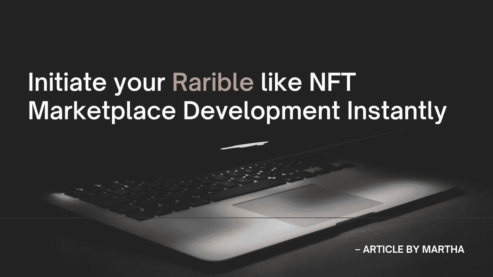

# 稀有的克隆脚本——立即启动你的稀有的 NFT 市场开发

> 原文：<https://medium.com/nerd-for-tech/rarible-clone-script-initiate-your-rarible-like-nft-marketplace-development-instantly-5f10cec964a4?source=collection_archive---------3----------------------->

## Rarible 克隆脚本预先开发，并帮助您创建 NFT 市场像 Rarible 即时低成本。

随着数字空间的当前趋势，企业家正在寻找在 web 3.0 上创业的机会。如果我们看看这个 web 3.0 领域的商业选择，NFT 市场业务是最好的商业模式之一。这种商业模式已经影响了许多企业家开始在 NFT 市场做生意，比如 Rarible NFT 市场。Rarible NFT 市场成立于 2 年前，在 NFT 市场中已达到显著的高度。Rarible NFT 市场成立于 2020 年，现在他们是整个 NFT 地区的知名品牌。根据 productmint 的数据，自上线 18 个月以来，Rarible 已经创造了 1.5 亿美元的总销售额。根据 Growjo 的统计报告，该市场的年收入为 1420 万美元(约为 2000 万美元)。)每年。

收入因素是影响许多企业家创办像 Rarible 这样的 NFT 市场的重要原因之一。但可悲的事实是，许多企业家认为创建像 Rarible 这样的 NFT 市场是一项艰巨的工作，需要高额的资金投入和技术支持，但只有当你从零开始创建 NFT 市场时，才需要这些。还有其他有效的方法来启动 NFT 市场，比如使用一个稀有的克隆脚本。让我们看看什么是稀有的克隆脚本，以及为什么它是启动 NFT 市场的有效方式。

# 什么是稀有的克隆脚本，为什么它是启动 NFT 市场的有效方式？

一个 [**Rarible 克隆脚本**](https://coinsqueens.com/rarible-clone-script?utm_source=rariblecltop&utm_medium=medium&utm_campaign=RJ) 是一个预编码软件，拥有 NFT 市场的所有基本功能，准备部署像 Rarible 这样的 NFT 市场。稀有克隆脚本是在以太坊区块链网络上开发的，用户可以在平台上交易&收集 NFT。您还可以根据您的业务需求定制功能和修改区块链网络。如果你发现需要，建立一个多区块链支持的 NFT 市场也是可能的。除此之外，还有许多其他的商业福利等待企业家去探索。

## 使用稀有克隆脚本的好处:

1.  **高效的监控和报告**—rari ble clone 脚本支持对 NFT 市场的监控和报告。
2.  **众多 ROI**—rari ble clone 脚本中集成了多个 ROI 特性。
3.  **测试模块** —您可以使用测试模块在您的 NFT 市场上运行多项测试。
4.  **成本高效** —使用这种方法开发 NFT 市场的成本相对较低。
5.  **短时间** —使用稀有克隆脚本部署和启动 NFT 市场只需很少的时间。
6.  **可定制的智能合同** —智能合同可以根据您的业务需求以安全的方式进行定制。
7.  **多区块链兼容性**—rari ble 克隆脚本在改变区块链网络和创建支持多区块链的 NFT 市场方面具有高度兼容性。

这些是稀有克隆脚本中出现的对企业的一些极好的好处。您需要了解的另一个重要因素是稀有克隆脚本的特性。

## **稀有克隆脚本的特性**

Rarible clone 脚本有很多特性，你需要检查一些基本特性，让你的用户有更好的体验。您还可以根据您的业务需求添加和更改其他功能。您需要确保可复制的克隆脚本与主要特性集成在一起，

*   店面
*   分类和过滤选项
*   投标和拍卖
*   多钱包支持系统
*   评级和审查
*   高流动性 API
*   铸造
*   多语言支持
*   多支付网关集成
*   管理员/买家/艺术家面板
*   高端安全功能

这些是你应该在稀有克隆脚本中寻找的关键特性。现在很多企业家提出这个问题，要花多少钱。

## 使用稀有克隆脚本创建一个 NFT 市场要花多少钱？

Rarible clone 脚本成本从 6k 美元开始，这不是标准价格。如果您要根据您的业务需求在可复制的克隆脚本中进行任何定制，成本会有所不同，克隆脚本提供商在成本中也起着很大的作用。然而，成本差异并不等于暂存法的成本。

正如我前面提到的，您的克隆脚本的成本根据您的克隆脚本提供商而不同，并且您的稀有克隆脚本的质量也会改变。所以你应该确保你选择一个值得信赖的稀有克隆脚本提供商。

## 谁提供的顶级稀有克隆脚本？

启动 NFT 市场的关键但有影响的一步是选择一个值得信赖的稀有克隆脚本提供商。市场上充斥着许多稀有的克隆脚本提供商。在做决定之前，确保你研究了以下标准。

1.  在加密领域的工作年限
2.  投资组合
3.  智能合同质量
4.  使用的技术堆栈
5.  评论和评级
6.  收取的价格
7.  客户证明等等。

你可能没有太多的时间来做所有的分析，为了让你的研究过程更容易，我将分享我对脚本提供者的研究结果。在整个研究过程中，我经常碰到这个名字，所以我查了一下。他们达到了我上面提到的所有标准。如果你要在 NFT 市场推出像 Rarible 这样的业务，你可以联系他们获得高质量的 Rarible 克隆脚本。

立即获得他们的 [**稀有克隆脚本**](https://coinsqueens.com/rarible-clone-script?utm_source=raribleclbtm&utm_medium=medium&utm_campaign=RJ) 的免费演示。