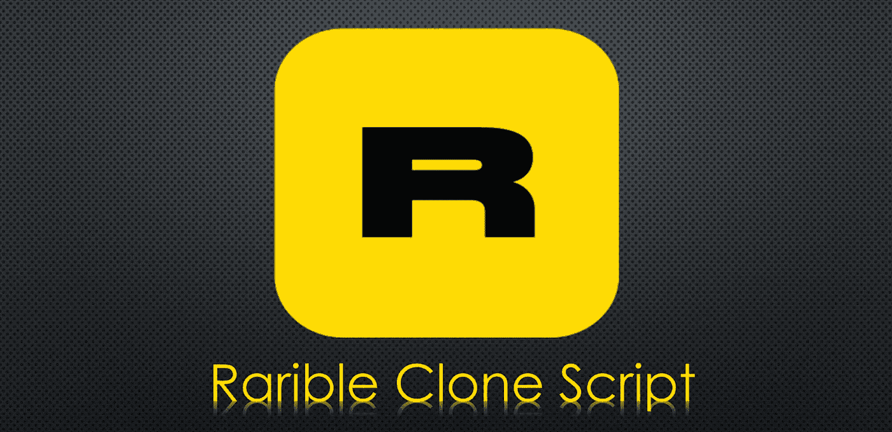

# 稀有克隆脚本(介绍+比较公司)

> 原文：<https://medium.com/nerd-for-tech/rarible-clone-script-introduction-comparing-companies-bdb90f5cf99c?source=collection_archive---------13----------------------->

在我们生活的这个数字世界中，每个人都想扮演一个角色，他们想了解所有相关信息，并拥有自己的 NFT 市场。艺术家和创作者需要通过 NFTs 显示他们的杰作的所有权，Rarible 是可以用于此目的的克隆脚本之一，因此，开发 Rarible 可以确保您的成功。在这篇文章中，我们将向您简要介绍 Rarible，一些好处，它是如何工作的，最后，开发这个克隆脚本的公司的一些功能。所以和我在一起。

# 稀有克隆脚本

[**稀有克隆脚本**](https://radindev.com/rarible-clone-script/) 是一个功能齐全的点对点加密收藏品交易 NFT 市场平台的进程，可以部署到区块链，如币安、以太坊等。这实际上是一个为任何有兴趣拥有一个独特市场的人铺平道路的过程。

# 稀有克隆脚本是如何工作的？

在这里，我们将为您提供实现这一目标所需的步骤。这个平台的目标是让卖家、创造者或任何拥有某些资产的人喜欢上想要它的人或买家，所以步骤如下。

**第一步**:铸造一枚 NFT 是第一步。为了将数字作品转化为 NFT，创作者必须通过无线软件创造一个令牌。Rarible software 实际上是一个可以在电脑和手机上部署的平台，它有自己的克隆版本，与你想象的略有不同。

第二步:对于铸造，创作者必须填写一份表格，并附上他们的图像或其他数据，如他们的标价和更多代表他们作品的一些细节。

**第 3 步**:在这一步之后，Rarible platform 在区块链网络上创建一个新的令牌，它可以是基于你的偏好的任何东西。

**第四步**:这些 NFT 代币可以使用稀有克隆软件在钱包之间转移。

**第五步**:当交易在平台上线时，买卖双方都要向 Rarible clone 平台支付交易费用，不用说，所有这些转账过程都将通过智能合约完成，我们将对此进行解释。

# 启动一个像 Rarible 这样的 NFT 市场需要多少钱？

创建一个像 Rarible 这样的 NFT 市场是密码行业的先进发展理念。因此，利用这个漏洞，许多 NFT 市场开发公司可以向您收取每次升级和技术实施的额外费用，所以基本上这取决于您想要的市场，因此，不确定应该如何支付才能拥有一个市场，但平均来说，大约 6k 至 12k 美元，这是根据预期可以承受的。与将为你完成任务的公司的专家交谈是知道需要支付的确切价格的最好方法。有很多公司给你提供这份工作，但是他们在奖金、福利、特点和时间方面是不同的。

在文章的这一部分，我将介绍 Rrible 中强调的一些好处，让我们一起来看看。

# NFT 平台的好处

## 基于社区的功能

像 NFT 市场这样罕见的是社区驱动的系统，允许用户与其他人联系和分享他们的收藏品。因此，它就像一个数字大型商场，让用户浏览商店。

## 所有权部分

像 Rarible 这样的 NFT 市场允许在 NFT 市场交易资产，并拥有部分所有权，而不是全部，因为有时，由于多种原因，需要共享所有权。

## 分散的

这是一个完全去中心化的平台，消除了中间任何第三方的干扰。

## 智能合同

在智能合约上运行是 Rrible clone 脚本的最大好处之一，它为用户在市场上执行的交易提供了完全的授权。

## 多样化的收藏品

用户可以在市场上发布任何收藏品，没有特定类别的任何限制。

## 侵犯版权

严密的安全特征授权数字收藏品，并防止复制或误用创作者的任何创造性数字内容。所以你可以确信你的资产不会受到威胁。

**显著的特点造就了 NFT 市场**

**NFT 图库:**市场用户可以使用图库功能轻松查看待售的非功能性桌面列表。

**智能过滤器:**买家可以通过使用可用的过滤器选项来过滤他们感兴趣的 NFT。人们可以很容易地键入她想要的 NFT，然后她可以根据价格、拍卖类型、截止日期和 NFT 类型进行过滤。

**拍卖:**拍卖是你所熟悉的一种销售方式，在这种方式下，NFT 将在投标的基础上挂牌出售。在拍卖时间结束前出价最高的人将获得 NFTs。

**数字钱包**:内置的数字钱包以安全的方式存储买卖双方的所有非金融交易。新用户可以注册集成到平台中的钱包。不管它是什么样的钱包。

**像 Rarible 这样的 NFT 市场服务于不同的领域，如艺术、音乐等。**

**艺术:**如今，数字艺术作品就像网络朋克一样成为潮流，它们比其他种类的数字收藏更具优势。能创作杰作的熟练艺术家可以在你的平台上标记他们的收藏。

游戏: NFT 的游戏是超级英雄。玩家可以解锁大量游戏收藏品，并在您的市场上进行交易。

音乐:音乐家可以通过 NFTs 保留他们音乐作品的所有权。音乐艺术家将获得特权，可以不经任何中间人以非专利形式出售他们的作品。

**不动产:**有趣的是，不动产也可以转换成 NFT，以获得所有权。你可以很容易地在你或别人的市场上买或租房子或类似的东西。

**媒体和娱乐:**娱乐相关的可以铸造成不可替换的代币。可以是电影，演唱会，也可以是其他。

# 如何建立一个像 Rarible 这样的 NFT 市场？

稀有的 NFT 市场的零障碍环境引起了许多密码爱好者的兴趣。但问题是，如何才能创建一个像 Rrible 这样的市场？如果你擅长编程，你可以从头开始创建一个 NFT 市场。如果你不太擅长编程，你可能会面临问题。你可以给自己买一个像 NFT 市场一样稀有的白色标签。最后一个是使用 Rarible 克隆脚本创建一个类似 Rarible 的 NFT 市场。

在文章的这一部分，我将介绍一些开发这个克隆脚本的公司，以及它们的一些好处和特性。

# 拉丁捷夫

一般来说，他们是数字资产和数字世界行业中最好的公司之一，他们为那些正在寻找成为这个巨大的 NF T 世界的一部分的人提供多种服务。他们在这个领域有丰富的经验，他们声称应该选择他们，因为他们将帮助你选择以更低的成本推出 NFT 市场的最佳方式，任何区块链都可以为他们提供，他们准备好部署你想要的每个区块链的项目，他们试图在承诺的期限内交付完整的产品，他们为你在部署市场时遇到的任何问题提供 24/7 技术支持。

他们必须为自己的稀有克隆脚本提供的独有功能有:

多支付网关

多语言援助

高级过滤器

高级过滤器

高端安全性

提供高流动性 API

各种收藏品

# 马蒂茨

关于这家公司的一个有趣的事实是，它被认为是最古老的区块链发展公司之一。该公司位于印度泰米尔纳德邦的马杜赖，为世界各地的客户提供尖端的工程解决方案和服务。服务不限于此，他们还为客户提供设计和开发加密交易所、DApp、智能合约、web 开发、移动应用程序开发和 NFT 市场开发。Raribe 是最伟大的榜样之一，在上述公司中也有，他们可以帮助人们按照他们的愿望定制他们的市场，此外，值得一提的是，该公司还赢得了各种奖项。

以下是他们在 Rarinle 脚本中包含的功能列表

多链互操作性:上面提到的克隆脚本是用多链互操作性特性开发的，因此它支持多个区块链网络。

多个钱包:他们提供的克隆脚本支持多个钱包的集成，这使得支付过程比以前更容易。

支付网关集成:多个支付网关选项也可用于预期的克隆脚本。

高端安全:市场开发了多种安全功能，以保护市场免受入侵攻击。

高级过滤器:高级过滤器选项帮助用户找到他们感兴趣的 NFTs，并使 NFTs 交易变得容易。

多设备兼容性:该功能允许用户在移动设备、桌面设备、平板电脑等各种设备上访问他们的帐户..

他们稀有克隆的好处:

有效的数据分析

高投资回报率

各种收藏品

智能合同已审核

社区治理

多重标准非功能性测试

# 硬币皇后

该公司于 2018 年成立，位于印度。正如他们所声称的那样，除了 NFT 市场开发之外，CoinsQueens 还是一家领先的加密货币兑换脚本提供商，它以低成本提供可靠、高质量的加密货币兑换脚本。他们是最好的公司之一，他们在 NFT 的服务不仅限于 Rarible clone，他们还提供不同角色模型的 NFT 市场软件。

以下是他们在该主题上提供的功能列表:

高端安全

多链互操作性

支付网关集成

多设备兼容性

多重钱包

高级过滤器

NFT 铸币厂

NFT 拍卖

多链轮廓

他们稀有克隆的好处:

各种令人兴奋的 ROI 功能

短历时

可定制的

Rarible 的确切特征

用户友好的界面

预算友好的价格。

高度安全

各种各样的收藏品。

出色的数据分析

在这篇文章中，我试着给你一些关于[稀有](http://rarible.com)的信息，以及它可能带来的更多好处。我们选择这个主题是因为我们认为它可能会有所帮助，因为现在一切都围绕着非母语教学，他们需要在这方面接受教育。为了建立像 Rarible 这样的 NFT 市场，你可能需要咨询你想要的 NFT，因为你可能需要一些独特的想法，你可能希望它们被覆盖。有很多公司愿意帮助你，比如文章中提到的 Radindev、Adddupe、Hivelance，他们为你提供演示，并为你提供他们公司特有的功能和优势。