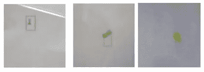
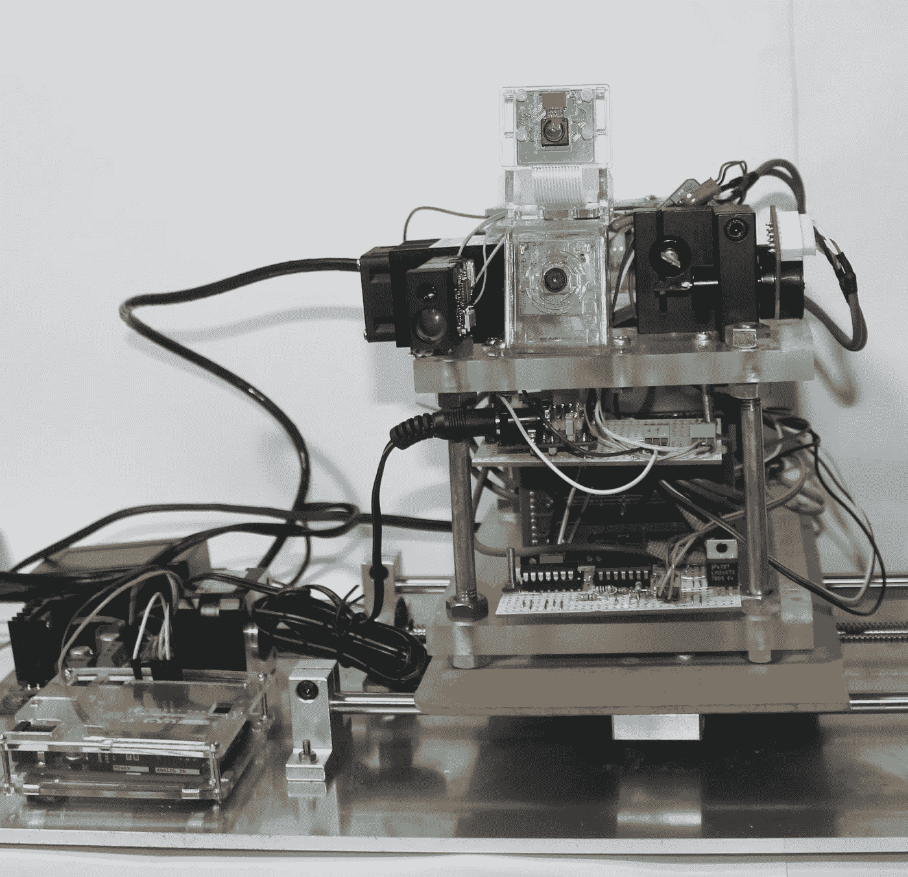
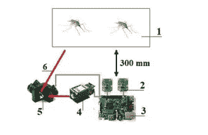

# 激光灭蚊树莓皮

> 原文：<https://medium.com/nerd-for-tech/raspberry-pi-for-kill-mosquitoes-by-laser-e99334a97d68?source=collection_archive---------13----------------------->

他的主要观点是，今天，高科技的进步已经让我们能够解决像蚊子这样的老问题。蚊子是个大问题。由于蚊虫叮咬，世界上每年有超过 70 万人死亡。所以，开始控制蚊子吧——这是为世界做些有益事情的好机会。

但如果我们说的是世界范围内对蚊子的控制，那么设备必须是廉价高效的，否则有什么意义。低价的段是必需的！

幸运的是，硬件成本和计算能力成本的降低让我们能够做到这一点。在这项研究中，我使用了最基本的机器视觉工具 OpenCV 库和在单板计算机市场上最廉价的硬件设备之一——raspberrypi 3(甚至不是 RaspberryPI4)上通过颜色对比进行的对象搜索。

开放的 CV 库可以让我们在相机——Pi 相机，索尼 IMX219 Exmor 上几米处追踪到一只色彩对比鲜明的蚊子的位置。图为使用 OpenCV 检测一只蚊子的例子。

当然，事实上(我现在正在做)，你已经可以使用 Jetson nano(或任何其他更强大的系统)——这将允许使用深度神经网络，如 YOLOv3，4-tiny。
这个设备看起来像这样，它太重了(因此我已经在制作自己的 PCB 板，这将允许创建一个口袋版本)。

下图中的方案解释了该装置的工作原理。

立体摄像机 2-确定蚊子 1 的位置，并将数据传输到计算机 3，计算机 3 计算 3d 坐标。之后，计算机打开激光器-4，将镜子角度的坐标发送到检流计，检流计将光束-6 的激光导向蚊子。

但是最主要的问题，安全问题。**激光会伤害眼睛，会引起火灾等。所以不建议非激光专业工作的人连碰都不要碰！！。**

我没有做一个很好的蚊子中和过程的视频。但是你可以看到检流计的调整过程，其实意义是一样的。在视频中，激光控制黄色 LED 位置。

我想说，我在这里写的一部分是作为预印本发表的。

Rakhmatulin，I .用于通过激光杀死蚊子树莓皮。预印本 2021，2021010412(doi:10.20944/预印本 202101.0412.v1)。

 [## 激光灭蚊树莓皮

### 世界上每年观察到超过 70 万人死于蚊虫叮咬。它是…的两倍多

www.preprints.org](https://www.preprints.org/manuscript/202101.0412/v1) 

也可以看文章——机器视觉用功率激光低成本遥控蚊子。

 [## 基于机器视觉的低成本激光遥控蚊子

### 在本文中，我们提出了一种新的和有效的方法来远程监测蚊子和它们的生活环境

link.springer.com](https://link.springer.com/article/10.1007/s11554-021-01079-x) 

抱歉，这篇文章是专有的，可供 springer 的订阅者使用。在这篇论文中，我用相机的长焦镜头从远处追踪蚊子。

感谢所有人

关于伊尔达