# RAWGraphs:一个免费的开源数据可视化工具

> 原文：<https://medium.com/nerd-for-tech/rawgraphs-a-free-and-open-source-tool-for-data-visualization-b79e337d750a?source=collection_archive---------0----------------------->

## RAWGraphs 的内容和方法。由[法西尔·s·叶瓦拉](https://de.linkedin.com/in/fassil-s-yehuala/)和[王莹](https://www.linkedin.com/in/ying-wang-06a46070/)

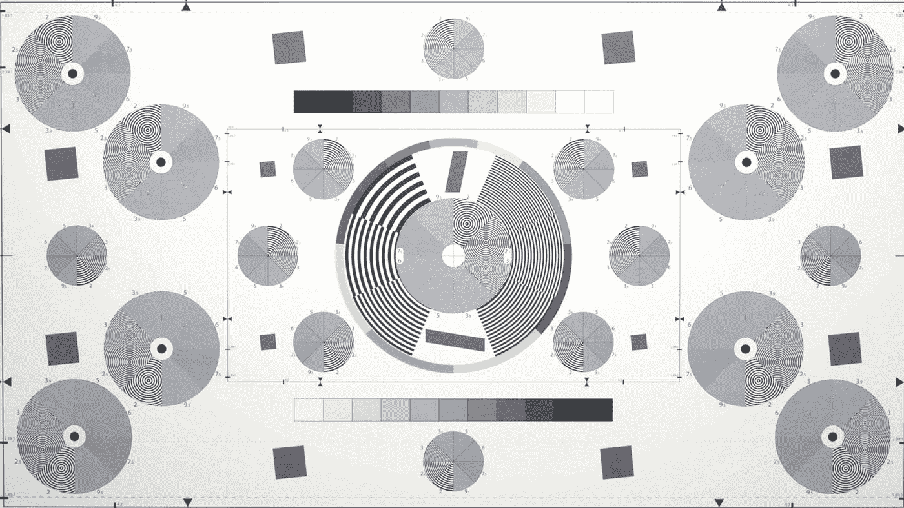

照片由 [ShareGrid](https://unsplash.com/es/@sharegrid?utm_source=unsplash&utm_medium=referral&utm_content=creditCopyText) 在 [Unsplash](https://unsplash.com/s/photos/circle-chart?utm_source=unsplash&utm_medium=referral&utm_content=creditCopyText) 上拍摄

本文旨在介绍一个名为 [RAWGraphs](https://www.rawgraphs.io/) 的免费开源数据可视化工具，这是一个旨在使复杂数据易于可视化的开源数据可视化工具。

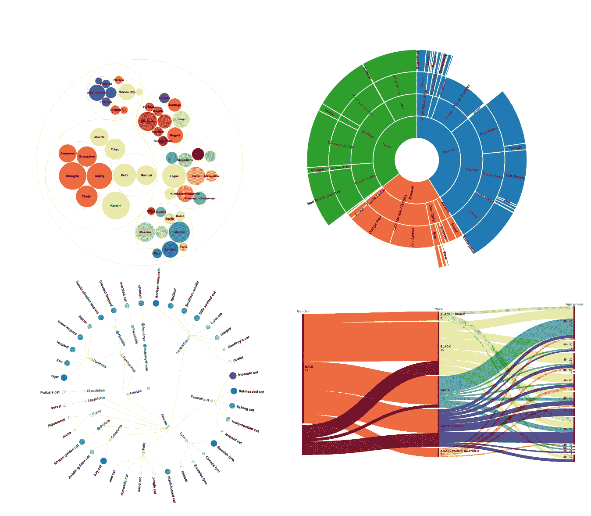

我们将讨论它的推荐用途、不用途以及使用方法。此外，我们将利用我们自己的数据集和 RawGraphs 的样本数据集来创建有趣的图形。让我们从了解什么是 RAWGraphs 开始。

# 什么是 RAWGraphs？

RAWGraphs 是一个基于 web 的开源数据可视化工具，无需下载软件即可使用。因此，可以通过网站导入数据，从而定制数据可视化。旨在尽可能容易地可视化大量复杂数据。RAWGraphs 旨在提供“电子表格应用程序和矢量图形编辑器之间缺失的一环”。这是一个应用程序，允许没有编程技能的人产生可视化，而不必编写代码。

基于 SVG 格式，RAWGraphs 处理表格数据，即电子表格和 CSV。数据可以通过不同的方式加载。

*   只需粘贴或上传您的数据
*   通过输入指向数据的网址(URL ),直接从网站输入数据。
*   与 SPARQL 查询的集成

在输出方面，它还允许将可视化导出为矢量(SVG)或光栅(PNG)图像，并将它们导入另一个图形编辑器。可以将它们嵌入到网页中。

注意，关于安全性，该网站强调，即使操作是在 Web 平台上进行的，也没有服务器存储。

# 向谁推荐 RAWGraphs？

RAWGraphs 是图形设计师和数据可视化爱好者使用矢量图形软件的完美工具。基于数据、颜色和大小创建图形的能力，以及配置每个元素的能力，代表了用 vector 设计的任何数据可视化项目的完美基础。不仅适用于印刷媒体，还可以嵌入到网页中。使用 RAWGraphs 获得的结果可以作为使用其他软件(如 Adobe Illustrator)进行进一步开发的起点。

# 如何使用 RAWGraphs？

RAWGraphs 徽标是您在登录页面上看到的第一样东西，还有两个选项:“[立即使用！](https://app.rawgraphs.io/)”和“GitHub”。如果你想直接在你的浏览器上进行可视化，那么“现在就用吧！”是正确的选择。请记住，此选项需要稳定的互联网连接。然而，如果你想在你的机器上运行它，你可以把它放到 GitHub 上。这个选项推荐给那些对它比较熟悉的人。

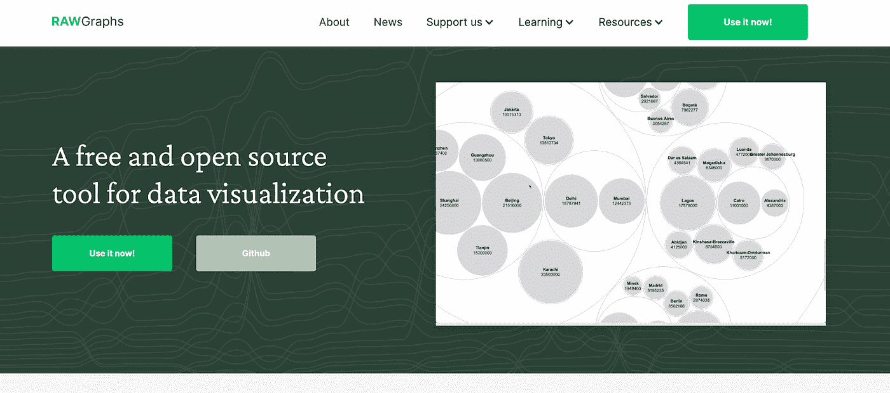

在本文中，我们将向您展示如何在浏览器上使用 RAWGraphs。当你点击“立即使用！”按钮，它将带您到另一个页面，在那里您可以选择您喜欢如何加载您的数据。右侧的空白区域是显示上传数据的地方。

## 步骤 1:加载数据

您可以从 MS Excel、GoogleSheets 或任何其他表格或 JSON 数据等其他应用程序中复制数据，并将其粘贴到空白区域。

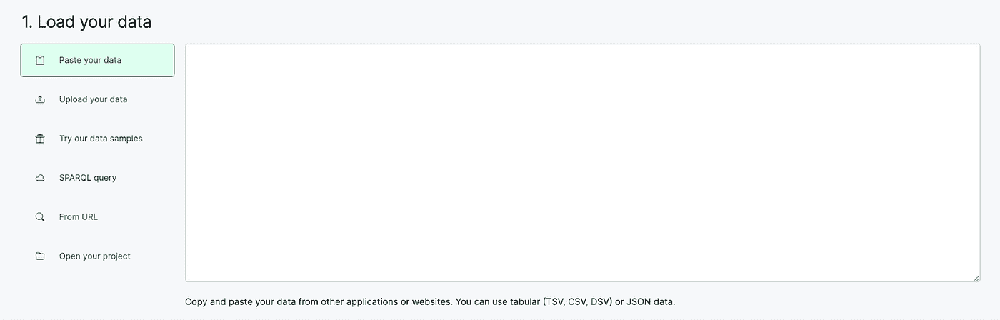

您也可以在不使用数据的情况下在 RAW Graph 中测试您的数据。有几个样本数据集可以让您创建不同的图表。了解应用数据时图表的外观也是一种很好的做法。

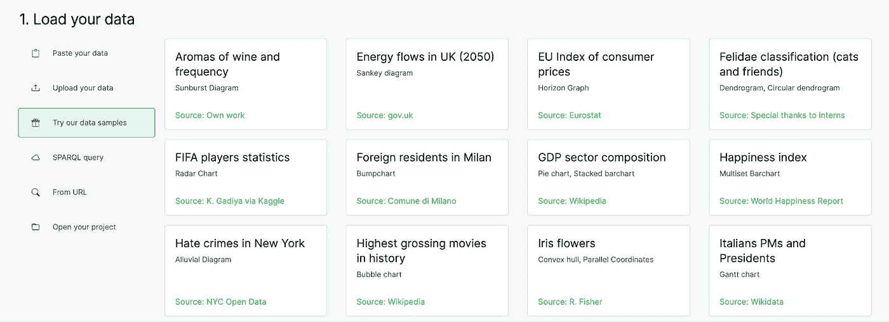

现在让我们从电子表格上传数据。只需粘贴可视化所需的列，就会使数据出现在空白区域。您还会看到一个绿色按钮，确认您的数据集已被成功解析。

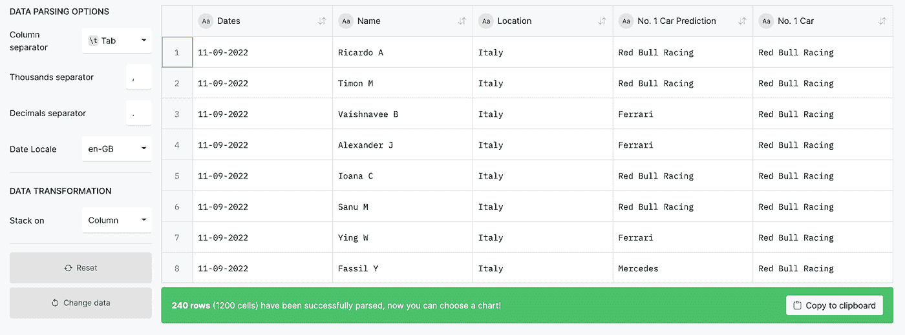

## 第二步:选择图表

此时，您可以向下滚动并查看 RAWGraphs 提供的模型列表。他们有一些现成的模板和 27 种不同的漂亮图表。毫无疑问，选择正确的可视化模型不是一件容易的事情。您应该了解您的数据集以及您想要可视化的内容。在我们的案例中，我们有描述 datadice 员工对 F1 车队在 2022 年 3 月至 9 月期间获得最高分的预测的数据。

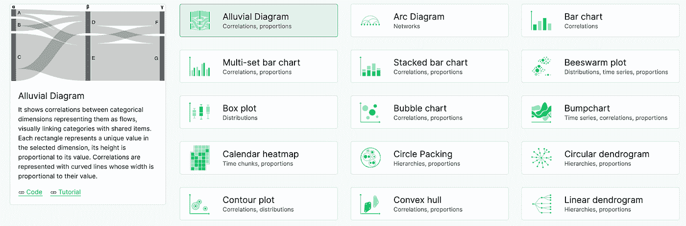

## 第三步:映射

现在让我们用冲积图来想象一下 2022 年第一团队的预测。一旦选择了可视化模型，您就可以向下滚动，开始映射您想要在图形中显示的维度。

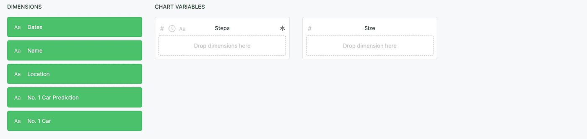

在左侧，对应于数据集列的维度以绿色按钮显示。要为图表变量分配维度，您只需将维度拖放到空白区域即可。由于冲积图的主要目的是直观地将分类变量与共享项目联系起来，因此您应该分配想要关联的维度。

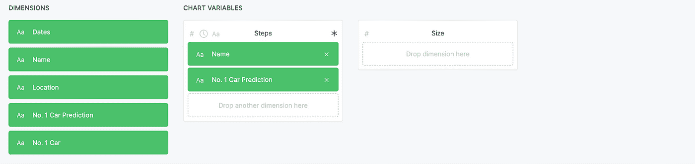

如果我们想将大小与图表变量相关联，我们可以将定量维度拖放到大小下的空白区域。然而，这样做不是强制性的。一旦您对要映射的维度感到满意，您可以向下滚动以定制图表。

## 第四步:定制

所以在这个阶段，我们可以按照我们想要的方式定制图表。首先，我们根据提供商的常规设置得到了图形结果(图 1)。之后，我们可以进行调整，如表 2 所示。

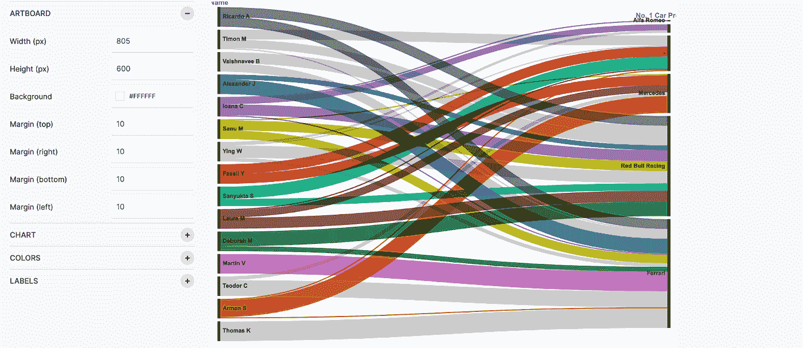

*图表 1*

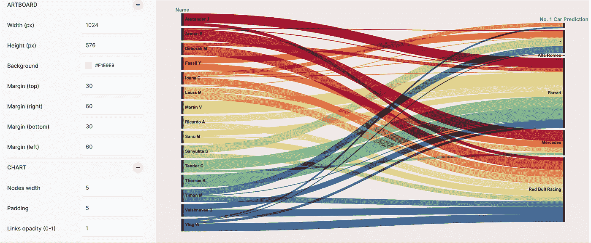

*图表二*

# 使用样本数据可以生成什么？

您可以使用现成的数据集生成大量令人兴奋的图表。现在，让我们使用样本数据集来尝试一些图表。

*   使用圆形包装探索世界上人口最多的城市。

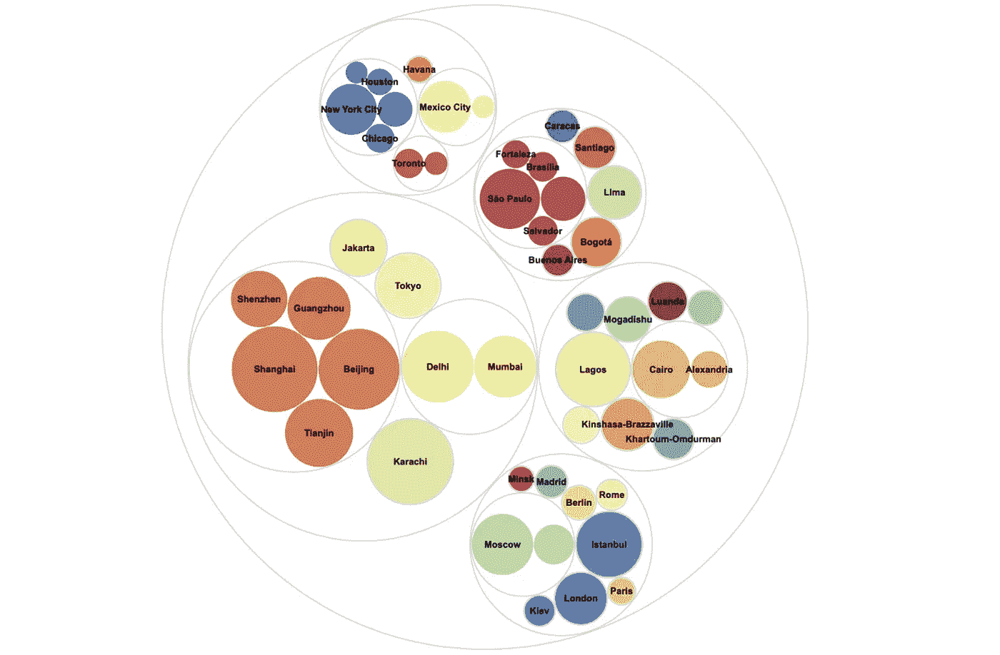

*   使用冲积图可视化 2020 年纽约的仇恨犯罪受害者。

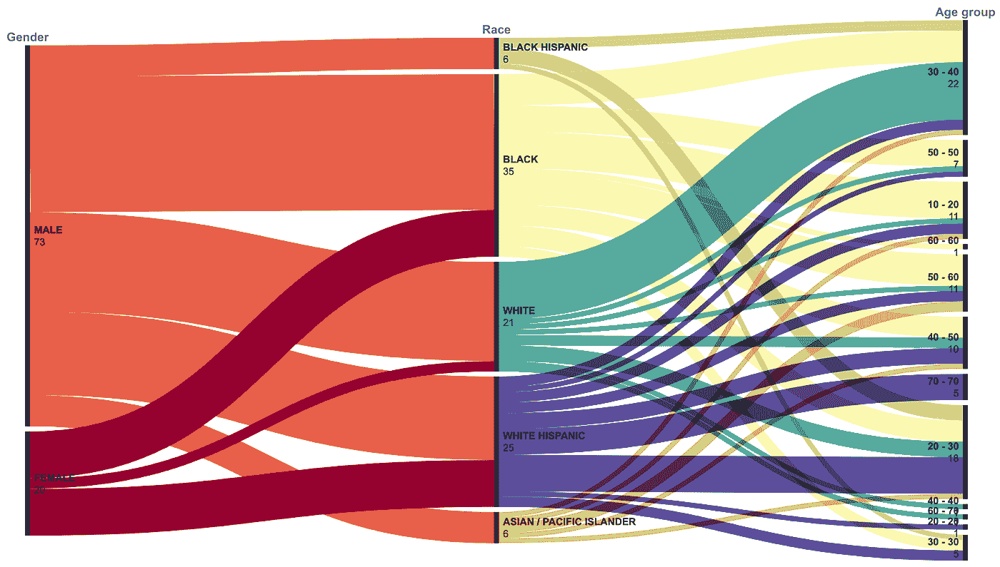

*   野生猫科物种的分支及其灭绝风险。

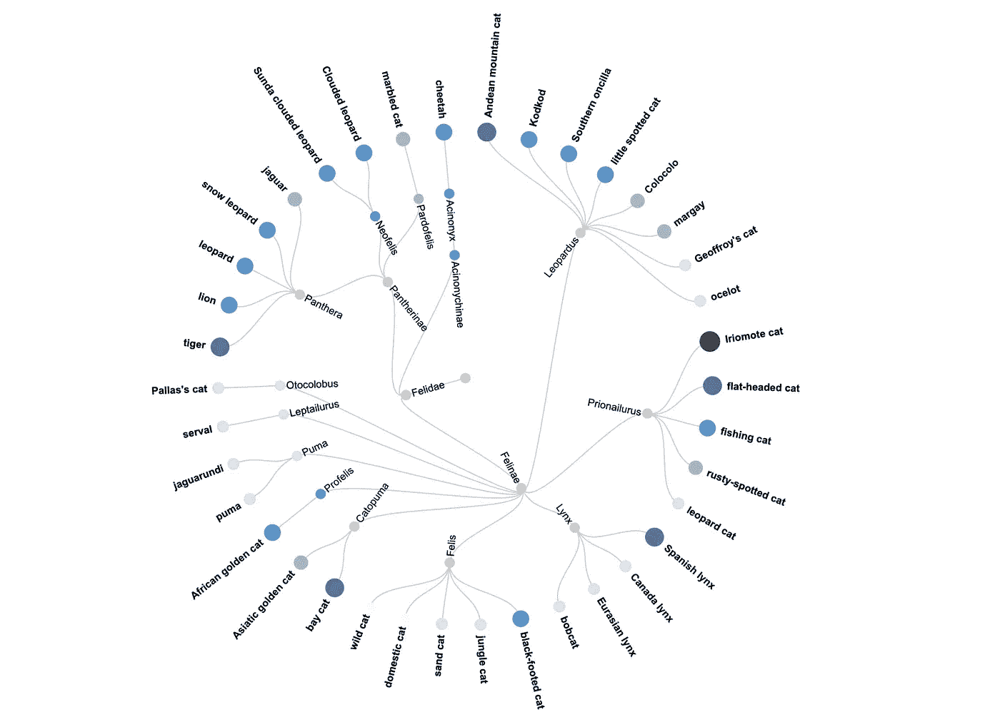

*   使用旭日图根据根源对葡萄酒香气进行分类。

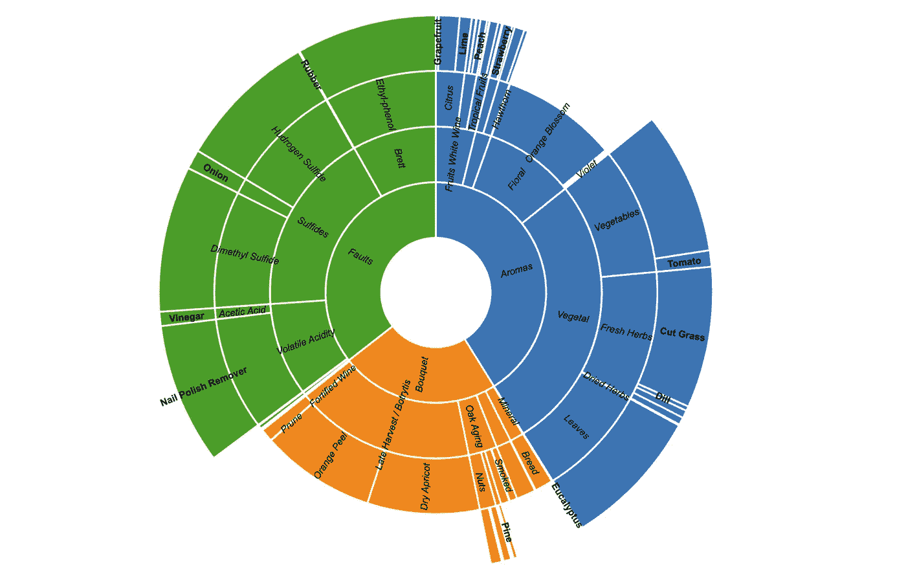

# 结论

如果目标是创建静态输出，如 PowerPoint 或 pdf，RAWGraphs 是一个完美的选择。换句话说，你用 RAWGraphs 创建的是一个静态图像。但是，它不适合寻找工具来帮助他们动态浏览数据的用户。该图形工具能够连接到本地文件(格式即。tsv，。csv，。dsv 或者。json)，或者通过输入 URL 从网络上获取某些数据。尽管如此，如果您想连接到您的数据库，RAWGraphs 不是您正在寻找的解决方案。

总而言之，RAWGraphs 是一个很好的工具，可以轻松地创建图形并以矢量格式导出它们。然而，您可以创建静态图像的事实使得它对于 BI 爱好者来说不是一个有吸引力的选择。

# 本月即将发布的 datadice 博客文章

*   [谷歌数据分析的最新更新(2022 年 12 月)](/geekculture/latest-updates-on-google-data-analytics-december-2022-3e1ab0122cb7?source=your_stories_page-------------------------------------)
*   [为什么 Shopify 的销售报告不是很准确](/nerd-for-tech/why-shopifys-sales-report-is-not-very-accurate-eaa0cce789ab?source=your_stories_page-------------------------------------)

# 更多链接

在本文中，我们介绍了 RAWGraphs，这是一个开源的数据可视化框架，使复杂的数据易于可视化。

查看我们的 [LinkedIn](https://www.linkedin.com/company/datadice) 账户，深入了解我们的日常工作生活，并获得关于 BigQuery、Data Studio 和营销分析的重要更新

我们也从我们自己的 YouTube 频道开始。我们讨论了重要的 DWH、BigQuery、Data Studio 和许多其他主题。点击查看频道[。](https://www.youtube.com/channel/UCpyCm0Pb2fqu5XnaiflrWDg)

如果你想了解更多关于如何使用 Google Data Studio 并结合 BigQuery 更上一层楼，请查看我们的 Udemy 课程[这里](https://www.udemy.com/course/bigquery-data-studio-grundlagen/)。

如果您正在寻求帮助，以建立一个现代化的、经济高效的数据仓库或分析仪表板，请发送电子邮件至 hello@datadice.io，我们将安排一次通话。

*原载于*[*https://www . data dice . io*](https://www.datadice.io/rawgraphs-a-free-tool-for-data-visualization)*。*