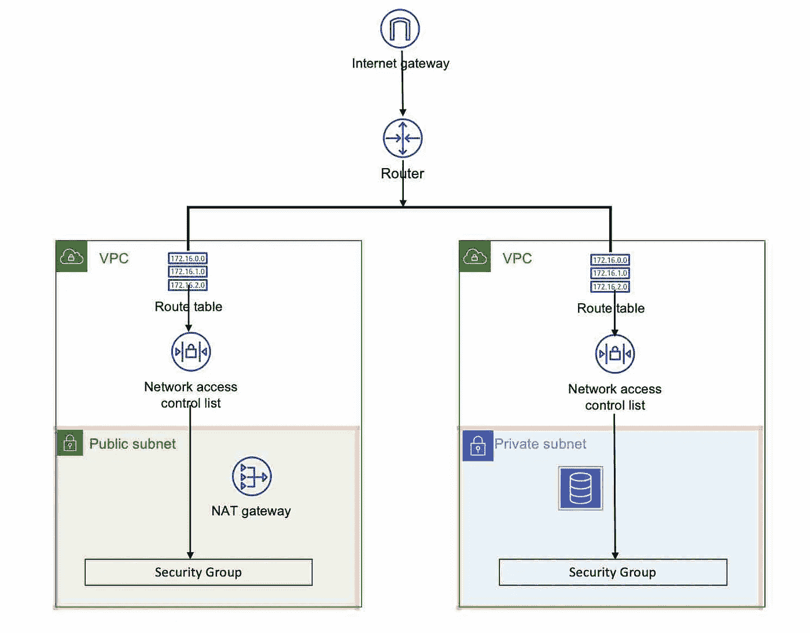
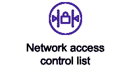
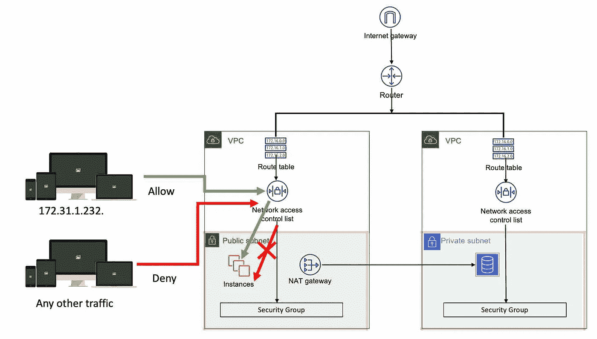
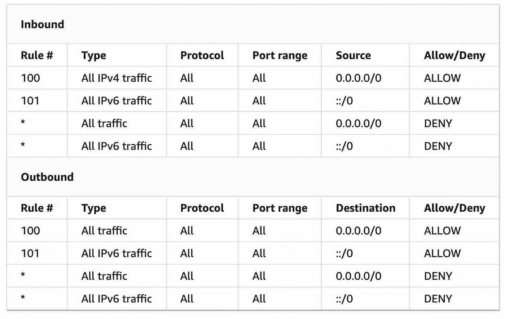
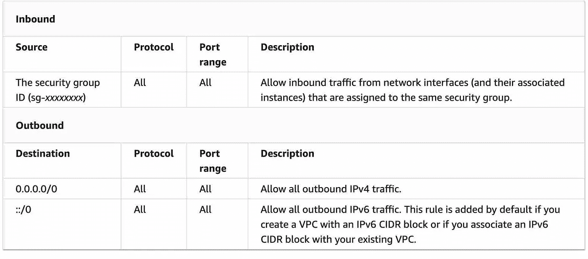

# AWS 系列#2:安全层—防火墙

> 原文：<https://medium.com/nerd-for-tech/raws-series-2-security-layer-firewall-15432b8d63e?source=collection_archive---------10----------------------->

NACL 和安全集团

NACL 和安全组不是独立的功能，不能单独提供。这些是您提供的 VPC、子网等主要服务的一部分。因此，要了解 NACL 和子网，必须了解整个流程。

**VPC**

**真实世界的例子:**一旦你进入办公室，那已经是 VPC 了。办公室，办公室内的所有资源一切都被放置在该建筑的一个楼层中，目的是根据用户可用的访问路径和访问权限来访问该空间。

**在 AWS 上:**进入 VPC 并不能自动获得访问所有资源的权利。root 用户通过 IAM 创建的每个用户都可以将访问资源的限制级别设置为和。基于已被许可的内容，用户被设置为访问资源。

# **可用性区域**

**现实世界例子:**在任何办公室，你都可能看到不止一个会议室。如果一个会议室不能装修(这里不认为这是在用)，可以使用另一个会议室。

**在 AWS 上:**可用性区域支持灾难恢复。AWS 上的大多数服务为其 SAAS 或 PAAS 产品提供多可用性区域或多 AZ。如果它不允许隐式，您总是可以自己管理一个。

# **路由器**

**现实世界示例:**路由器就像点击门禁卡后分配电梯一样。

**在 AWS 上**:路由器把你带到路由表中列出的 NACL。

# **路由表**

**真实世界示例:**一旦你进入指定的电梯，你将被送到你的门禁卡被分配到的楼层(让我们假设，每张门禁卡只能进入一个楼层)。到达楼层后，你仍然需要得到允许才能进入指定的办公室。可以提供相同的访问卡来进入。办公室门口提供的进入检查点的访问权限类似于 NACL(网络访问控制列表)。

**在 AWS 上**:云入口处可用的进入检查点的权限类似于 NACL(网络访问控制列表)。

# **53 号公路**

现实世界的例子:假设你想去你朋友家，他们给了你纬度、经度和海拔的详细信息，让你去那里。不如给个地址吧？在物理世界中，地址不是一个事后事实，它是一个关键信息，其下有地理空间信息。

AWS 上的:53 号公路是一项可选服务，但也是一项良好的实践。它支持 4 项关键任务— DNS 管理；交通管理；可用性监控和域名注册。

# **NACL**

**现实世界的例子**:让我们假设第五层是你指定的楼层，那一层只有一间办公室。办公室是安全的，只有刷/敲有适当许可进入的门禁卡，你才能进去。NACL 能让你进入办公室的所有房间吗？不尽然——你在办公室里，可以看到一般的。让我们假设你在接待处，并获得进一步进入有进一步的防火墙。该 NACL 与实际资源可用的子区域相关联。但是现在，要访问包含资源的子区域，您需要访问权限。

**在 AWS** 上:你已经提供了 VPC，你将如何保护和隔离你的云，并确保只有列出的人才能进入你的服务器？答案是 NACL。网络访问控制列表(NACL)是控制一个或多个子网流量的第一道防线。这是一个可选层。它基于入站和出站的接受和拒绝规则工作。编号列表规则对评估访问的方式进行排序。这是无状态的，这意味着入站流量受出站流量规则的约束。NACL 保护是在子网级别。

NACL 决定谁应该进出子网，这是一个可选的安全层。默认情况下，NACL 允许所有入站和出站流量，与相应的应用程序开发团队讨论并设计子网的入站和出站流量是您组织的安全团队的责任。您还可以创建自定义 NACL，并将其关联到子网。但默认情况下，自定义 NACL 会拒绝所有发往该子网的流量。

NACL 允许和拒绝流量

主要特点:

1.  **网络 ACL 规则**:允许您添加/删除规则，以启用或禁用外部/内部网络对您的子网的访问。
2.  **默认网络 ACL** :配置为允许所有流量流入和流出与其相关实例的子网。
3.  **自定义 NACL** :使您能够创建自定义 ACL 并关联到子网。默认情况下，自定义 NACL 将拒绝所有流量。

*   临时端口— NACL 与临时端口范围 32768–65535 相关联。但是，当您想要关联不同的范围时，您可以这样做。
*   路径 MTU 发现—路径 MTU 发现用于确定两个设备之间的路径 MTU。

参考:AWS

# **子网**

**真实世界示例**:如果 VPC 是大楼，子网就是办公空间中的房间。假设每个房间都可以通过门禁卡访问，这就是安全组。每个房间内都有实例和 NAT 网关。

**在 AWS 上**:子网位于可用区域内。在一个可用性区域中，可以有多个子网。子网可以是私有的，也可以是公有的。公共子网是可以通过互联网网关访问的子网，可用于启动 EC2 或 Web 服务器。另一方面，私有子网不能通过因特网网关访问，或者不能通过 SSH 进入。可以访问私有子网的唯一方式是通过公共子网，SSH 到私有子网—数据库可以是私有子网的一部分，不允许外部访问。

# **安保组**

**真实世界示例:**你在办公室里，假设你想进入服务器机房，该机房有访问限制，只能通过红外线访问，这就是云世界中的安全组。

**在 AWS 上**:您已经为您的架构提供了 VPC 和一些服务器(应用程序和数据库)。您如何保护和隔离您的服务器？答案是安全组。一旦进入子网，要访问 EC2 实例，您必须拥有访问子网内实例所需的权限。这适用于任何类型的实例，无论是 EC2 还是数据库。安全组位于实例级别，而不是子网级别。

它充当虚拟防火墙，将您的实例(应用服务器和数据库)围起来，并使用入站和出站流量配置来控制入站和出站流量。与 NACL 不同，安全组是有状态的，它会记住谁被允许请求，谁被用来响应，您必须使用添加规则提供允许但不拒绝流量，并且每个实例最多可以提供 5 个组。现在，如果您已经创建了一个实例，但是没有分配安全组，这是否意味着您的实例没有受到保护？与 AWS 的共享责任模型一样，没有什么是不受保护的，它采用 VPC 的默认安全组。但是，您的所有服务器和实例都必须有一个定义明确的安全组。这是因为 VPC 可能由多个接入点访问，但是每个实例只能由特定的目标接入点使用，这些接入点必须经过明确的配置。添加到安全组的实例不能相互通信-您必须单独定义规则。

主要特点:

1.  **规则:**指定允许规则，不拒绝规则
2.  **流量**:您可以根据协议和端口号范围定义入站和出站流量。
3.  **有状态的**:记住请求，以便同样的请求得到响应。

参考:AWS

# **NAT**

**真实世界示例**:任何人想要进入办公室的服务器机房，都必须联系 Infra，如果他们认为合适，他们会授予访问权限。

**在 AWS 上**:访问子网内实例的最佳方式是通过 NAT，这样所有的流量都通过 NAT 网关和单一许可窗口进行路由。

# **实例**

**真实世界示例**:服务器机房内应有 Linux 服务器、数据库服务器、AD 服务器、托管 VM 的 HP 服务器等。,

**在 AWS 上**:在子网内部，您可以启动 EC2 或数据库之类的实例。

母篇: [AWS 多件套系列。](/nerd-for-tech/aws-series-multi-part-series-on-aws-cloud-and-related-guidelines-c7c2437f1639?source=your_stories_page-------------------------------------)