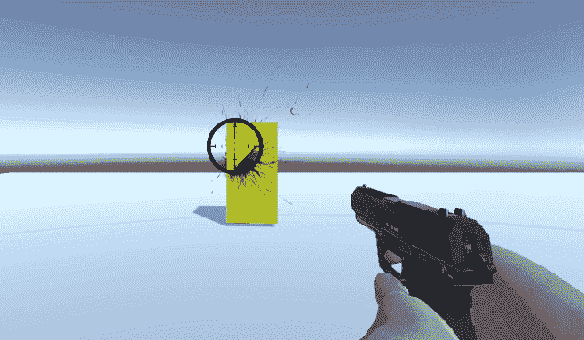
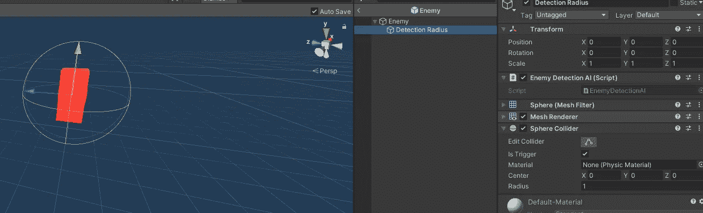
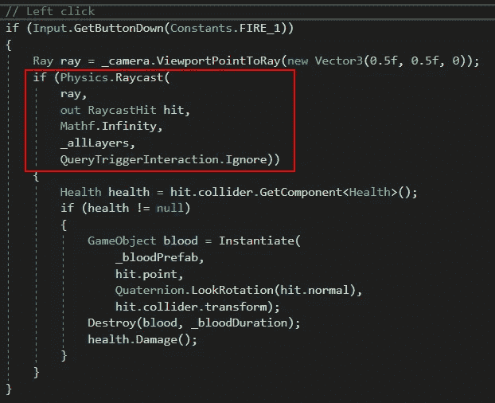

# 光线投射忽略触发碰撞器

> 原文：<https://medium.com/nerd-for-tech/raycast-ignore-trigger-colliders-b5b853270215?source=collection_archive---------1----------------------->

目标:允许*光线投射*忽略触发碰撞器。

我们的敌人有一个触发碰撞器的玩家探测半径。当我们从相机向敌人投射光线时，我们的镜头正击中那个球体。但是有一种方法可以忽略所有的触发碰撞器。

当我们称之为*物理学时。Raycast* ，我们可以将第五个参数设置为 *QueryTriggerInteraction。忽略*。在图层蒙版上使用 using 方法的好处是它会忽略所有地方的所有触发碰撞器*！毕竟，我们的镜头不会停在其他触发碰撞器上，如压力板、物品拾取或接近报警器！*

