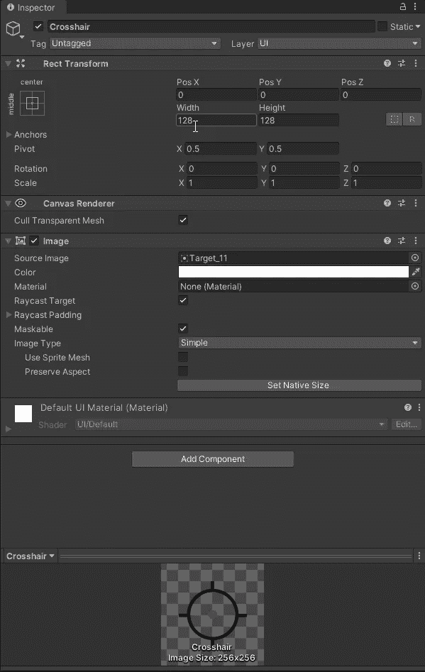
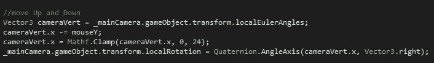
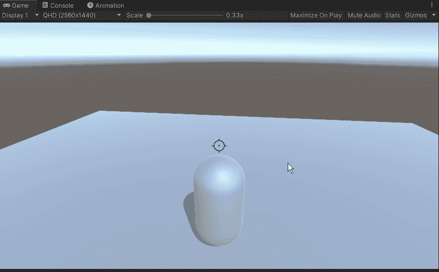
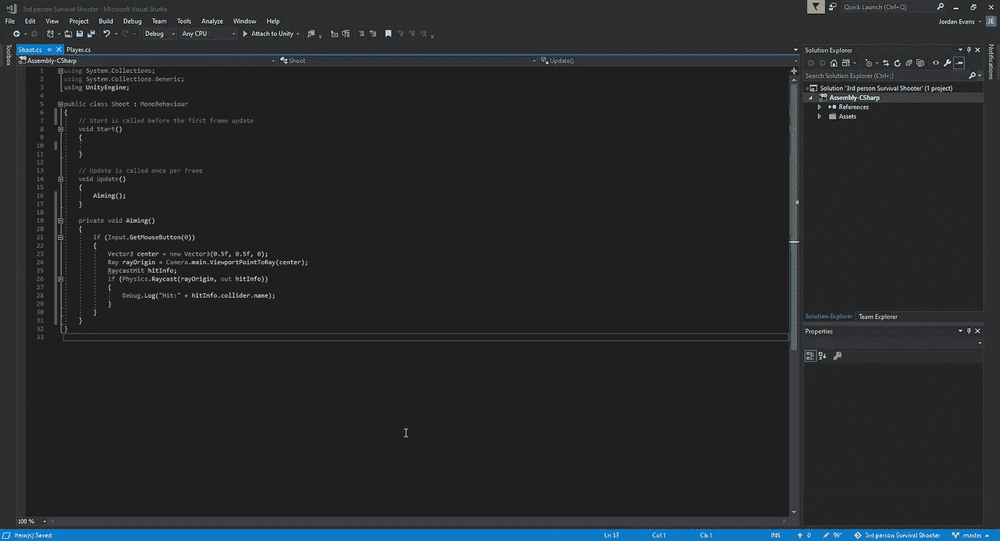
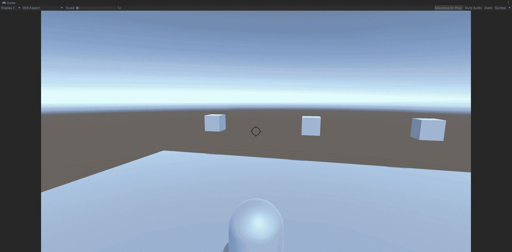

# Unity 中的光线投射

> 原文：<https://medium.com/nerd-for-tech/raycast-in-unity-ddafd54677fa?source=collection_archive---------2----------------------->

让我们来看看如何添加十字准线，添加限制我们的相机能够移动的地方，并使用 raycast 拍摄我们的投射物。首先，我们将使用画布上的图像在游戏中构建一个十字准线:

从这里，我们可以在我们的游戏中查看它，如果我们认为合适，可以对大小进行任何调整:

用我们喜欢的尺寸和样式的十字准线，接下来我们需要创建一个方法来限制我们能够垂直移动相机的程度。为了做到这一点，我们需要对垂直移动摄像机的代码进行一些调整，并创建一个限制十字准线移动的夹钳:

通过为我们的垂直移动内置的这种方法，我们能够添加一个我们可以移动相机的限制。有了这个限制，我们可以看看它在我们游戏中的情况，看看是否需要进一步的改变:

在这个范围内，我们在屏幕上仍然有一个玩家的小视野，同时我们的十字准线不会击中玩家，给它一个更好的第三人称感觉。
接下来，让我们看看如何使用 Raycast 拍摄目标。首先，我们将创建几个随机目标，并为射击方法创建一个新的脚本:

我们在这里所做的是告诉 unity，我们希望我们的光线从屏幕的中心投射，由中心向量表示。然后，我们告诉 Unity，我们希望射线告诉我们它击中了什么。现在这已经就位，让我们看看它在游戏中是怎样的:

现在我们已经有了我们的射击方法，我们可以开始看看我们将如何为游戏建造我们的敌人单位。