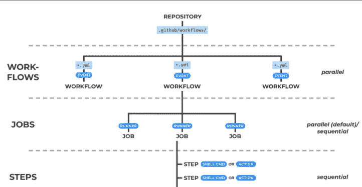

# 重用您的 Github 动作工作流程

> 原文：<https://medium.com/nerd-for-tech/re-using-your-github-action-workflow-888660df183c?source=collection_archive---------2----------------------->


照片由[诺亚·布舍尔](https://unsplash.com/@noahbuscher?utm_source=medium&utm_medium=referral)在 [Unsplash](https://unsplash.com?utm_source=medium&utm_medium=referral) 上拍摄

**您是否曾遇到过需要跨文件复制粘贴 Github 动作工作流程而无法找到重用它们的方法的情况**，

我这里有一篇文章，会给你一个关于 Github 的 beta 特性的新想法，让你跨文件重用你的工作流

## 什么是工作流？



工作流程

每个工作流包含一组作业，可以简化为测试、部署或检查 lint，此外，一个作业被划分为步骤，这些步骤是内部流程的更简化版本

# 创建可重用的工作流

为了创建一个可重用的工作流，我们需要附加一个不同于常规 onPush 或 onPR 的调度程序，您需要包含`onWorkflowCall`，它将在工作流中触发工作流

## 限制和选项

在创建工作流程之前，请尝试了解您应该记住的事项，例如

*   可重用工作流不能在另一个可重用工作流中重用
*   您不能从调用的地方继承变量，您需要显式传递变量
*   工作流可以包含除`onWorkflowCall`之外的其他触发器
*   如果可重用工作流是公共的，则只能在同一回购协议或同一组织内使用

## 开始

首先，你可以在`.github/workflows/sample-test.yml`或者类似的地方创建一个文件

```
on:  
 workflow_call:
    inputs:
      image_name:
        required: true
        type: string
      tag:
         type: string
    secrets:
      registry_username:
        required: true
      registry_password:
        required: truejobs:  
 build:
// your steps...
```

在这里，您可以使用键`workflow_call`创建一个工作流，并使用`input`和加密输入作为`secrets`传递变量

现在，如果您调用这个工作流，您在作业中编写的任何内容都将运行

# 怎么打电话？

接下来，可能会有一个问题，如何在另一个工作流中调用这个工作流

要使用一个工作流，你应该遵循与常规工作流文件相同的过程，但是主区域在`jobs`里面

您可以创建一个单独的

```
 jobs:..other jobs docker:    
 uses: n3wt0n/ReusableWorkflow/.github/workflows/buildAndPublishDockerImage.yml@main    
 with:
      image_name: my-awesome-app
      tag: $GITHUB_RUN_NUMBER    
secrets:
      registry_username: ${{secrets.REGISTRY_USERNAME}}
      registry_password: ${{secrets.REGISTRY_PASSWORD}}
```

这就是你需要做的。完成此操作后，您可以在项目中运行和重用任意数量的工作流

如果你喜欢我的内容，请考虑订阅我的 substack 账户[这里](https://piyushdubey.substack.com/?r=omfzc&utm_campaign=pub&utm_medium=web&utm_source=copy)

谢谢！