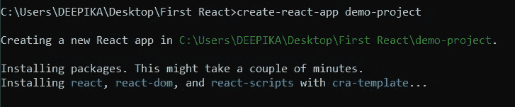
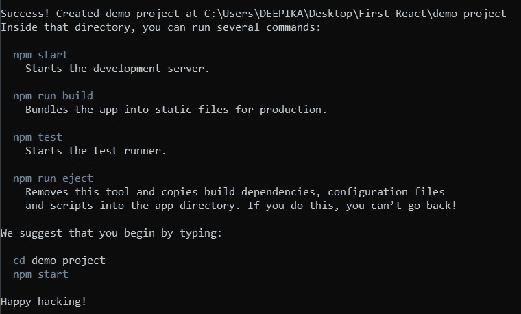
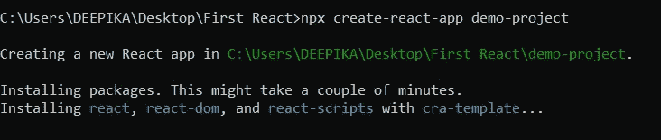
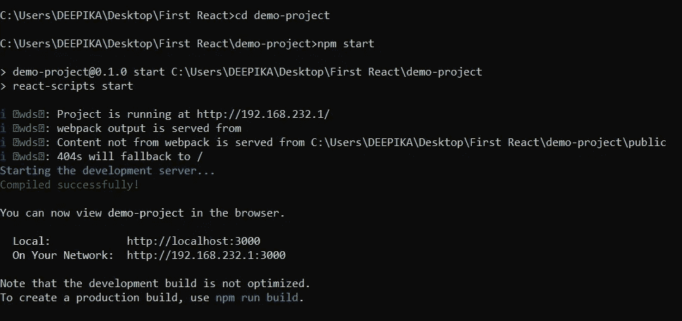
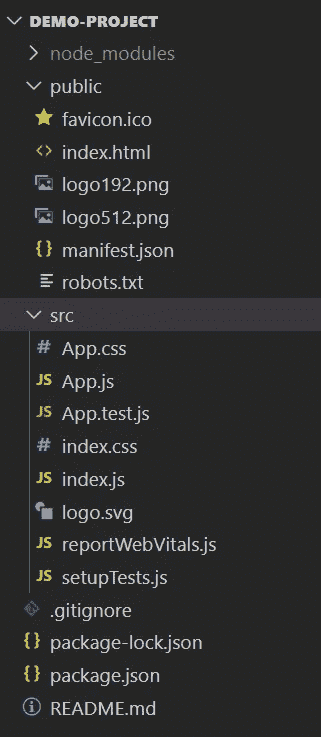
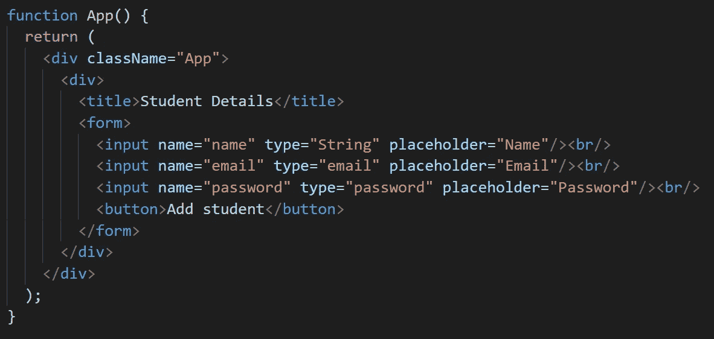
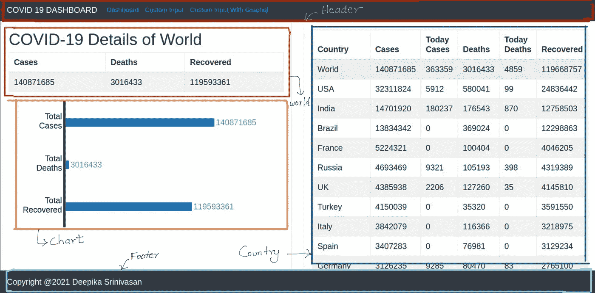

# 反应-一个简单的开始😀

> 原文：<https://medium.com/nerd-for-tech/react-a-simple-beginning-df98c89066d2?source=collection_archive---------10----------------------->

# **要求**

*   节点和安装在计算机上的 IDE。

# **什么是 React？😕💭**

React 是一个开源的前端 JavaScript 库，由脸书于 2013 年创建。React 是最好的 JavaScript 库之一，它用最少的代码使 web 应用程序更快更有效。

在本文中，让我们了解 react 的基础知识以及如何创建 React 应用程序。

# **为什么反应？❗️ ❗️**

*   **更容易学习** -因为 react 很有名，并且被很多行业使用，所以 react 上有很多好的文档、博客、文章和教程。所以更容易自学。
*   **拥有 JSX**——JSX 是 HTML 和 JavaScript 的结合，这使得编码变得更加容易。
*   **可重用组件**——在 react 中，我们可以将代码分解成更小的组件，并反复重用它们。这将有助于减少代码库。

# **让我们使用“ *create-react-app”创建一个 react 应用程序💻***

你需要在你的机器上有[节点> = 10.16 和 npm > = 5.6](https://nodejs.org/en/) 。

然后打开命令行(CLI ),使用以下命令在您的计算机中全局安装`create-react-app` :

`**npm install -g create-react-app**`

现在，为了创建一个 react 应用程序，我正在创建一个名为“First React”的文件夹，并在该文件夹中打开终端。然后在终端输入`**create-react-app <project name>**` 。您可以给任何名称作为项目名称。但是要确保项目名称没有大写字母，否则 react 将抛出一个错误。

这个 create -react-app 将创建一个 react 应用程序的模板。

我的项目名称是演示项目

完成 react 应用程序后，您将获得此信息

你也可以直接使用 create-react-app 而不用安装它。使用可以使用下面的命令:

`**npx create-react-app <project name>**`

npx 是 npm 中包含的包运行程序命令。

你会得到同样的结果

现在我们需要导航到项目目录。类型`cd <project name>`

然后运行 react 应用程序，键入`npm start`

当 create-react-app 创建一个示例模板时，我们可以运行并查看示例应用程序。

成功运行项目后，您将得到类似这样的内容。它将在浏览器中自动启动 react 应用程序，或者您可以在浏览器中手动键入`[http://localhost:3000/](http://localhost:3000/)` 来打开该应用程序。

在浏览器中，您可以看到这样的示例项目。

# **项目目录简要说明👍**

如果您使用的是 VSCode，只需在项目目录中键入`code .` 即可在 VSCode 中打开项目。

**package . JSON**——这个文件包含项目所需的依赖项和脚本。

这确保了我们的依赖项的一致安装

**。gitignore** -我们在将项目添加到 GitHub 时需要忽略的文件。我们也可以手动将不想添加的文件添加到 GitHub 中。

**README.md** -关于 react app 的细节(如何运行、构建等。)

**node _ modules**——我们安装的所有依赖项。

**public - icons** 和 **images** 用于 react 示例模板，**index.html**-项目中唯一的 HTML 页面。

**src** -我们开发时最常用的文件夹。

*I****ndex . js***——指定根组件(App)和 DOM 元素。这与我们之前见过的 index.html 有关

***app . js***——负责浏览器上显示的 HTML。代表我们在浏览器中看到的视图。

***CSS 文件*** -包含 CSS 设计。

# **你需要知道的基本概念👀**

## **JSX**

JSX 是一种类似 XML/HTML 的语法。它将 XML/HTML 语法添加到 JavaScript 中。

看起来像普通的 HTML 文件

## **组件**

在 react 应用程序中，组件是主要的构建块。一组组件构成一个 react 项目。

在这里你可以看到这个页面是用 5 个组件创建的。(页眉世界、国家、图表和页脚)。我们也可以在任何其他页面中重用页眉和页脚。

有两种类型的组件。

*   类别组件
*   功能成分

## **道具**

Props 是不可变的，这是通过将属性/数据从一个组件传递到另一个组件来使组件动态化的一种方式。它只是将一些信息由父组件传递给子组件。

## **状态**

状态是每个类组件中的变量，它具有动态存储信息的能力，并由组件控制。它对于那个组件是私有的。

# **参考文献🙏**

*   [https://reactjs.org/docs/create-a-new-react-app.html](https://reactjs.org/docs/create-a-new-react-app.html)