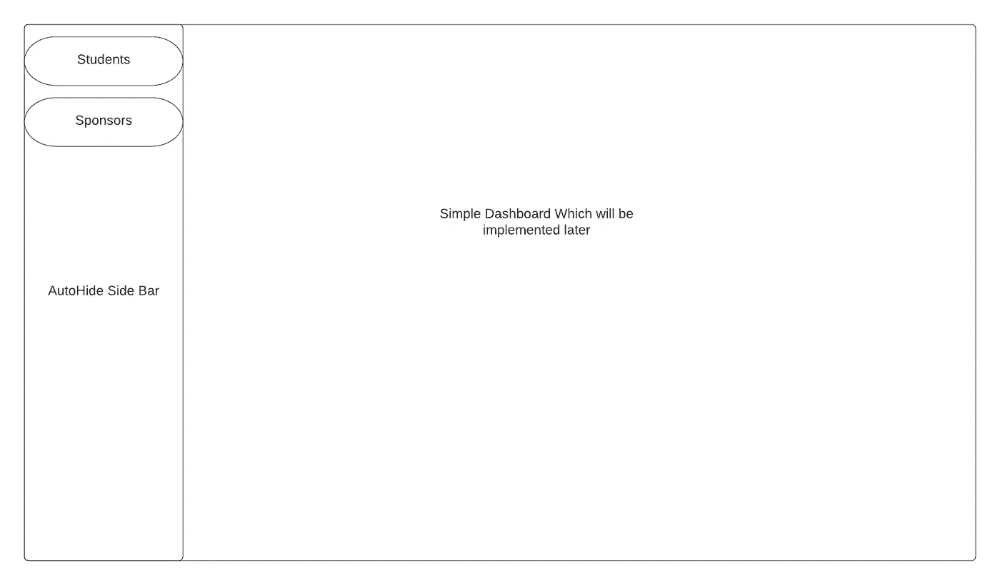
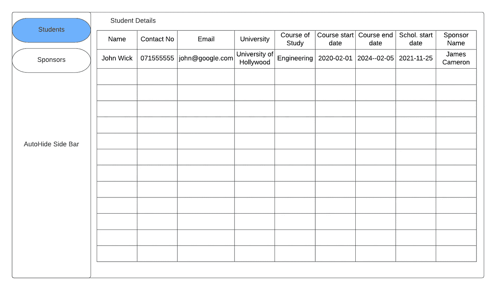
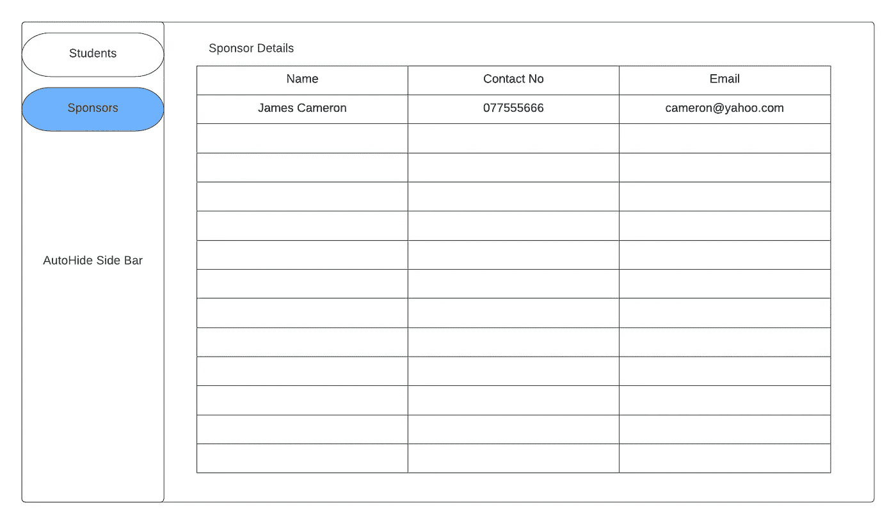
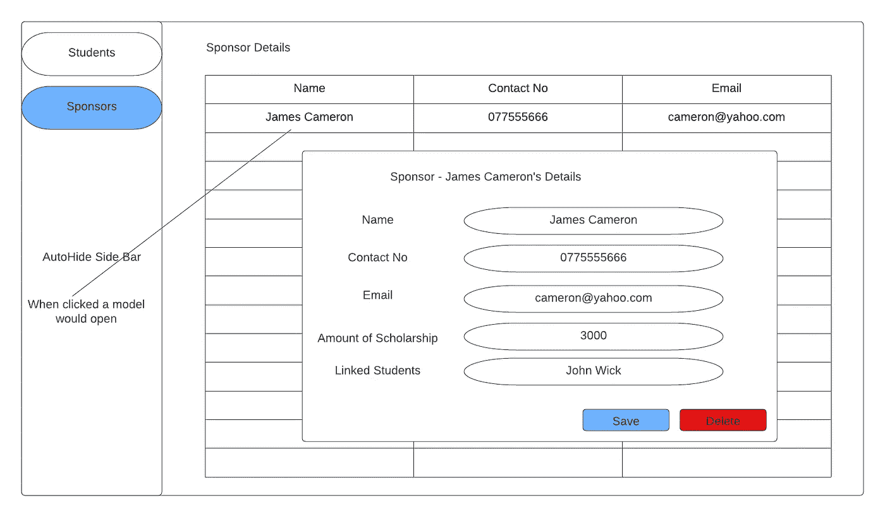

# 利用 Typescript 系列(慈善网站应用程序)—规划用户界面

> 原文：<https://medium.com/nerd-for-tech/react-basic-series-charity-web-app-planning-the-ui-99da0a3a4dcc?source=collection_archive---------1----------------------->

大家好，在上一个教程中，我们已经了解了如何使用 typescript 创建一个全新的 React 项目。在本教程中，我们将在这个项目中实现我们的需求。

 [## reaction 基本系列(慈善网站应用程序)—使用 Typescript 创建 reaction 应用程序

### 大家好，我最近启动了一个简单的项目，为一家慈善组织创建一个 web 应用程序。他们所做的是，他们…

billa-code.medium.com](https://billa-code.medium.com/react-basic-series-charity-web-app-creating-a-react-app-with-typescript-32154afb3f19) 

使用 reactor 创建 UI 应用程序时，一个主要优势是我们不需要在不同的地方使用相同的代码。使用组件，我们可以重用代码。这些组件与我们在 OOP 中看到的类非常相似。要在 React 中创建一个组件，我们必须扩展 reactor . component。

现在，作为第一步，让我们再次检查我们的需求。我们要做的是创建一个应用程序来管理授予大学生的奖学金数据。在我们的需求中，利益相关者是学生、捐赠者和管理者。所以这些用户中的每一个都应该有 3 个不同的应用程序视图。这可以通过引入用户角色来实现。然后我们必须为学生和捐赠者创建 UI 来处理 CRUD 操作。现在，我们可以在管理控制面板中为学生和捐赠者提供两个选项卡。这些选项卡中的每一个都将重定向到一个页面，在那里我们可以执行 CRUD 操作。

所以现在我们的应用程序中有几个组件。我们应该有一个类似于组件的表来列出学生和捐赠者的数据。然后，我们应该有一个模式一样的组成部分，以增加新的学生或捐助者。在表中，我们可以有一个链接到每个项目，以打开一个弹出窗口显示个别数据。这也可以有编辑选项。现在我们有 6 个主要组成部分为学生和捐赠者。

拥有组件的主要目的是尽可能地重用类。所以在这个项目中，我将只使用 2 个组件来处理所有这些上面提到的 6 个组件。为了呈现与这 6 个实例相关的 UI，我们将使用另一组称为容器的类。然后，所有这些容器都将包含到 App.tsx 文件中，以获得应用程序的完整布局。

通常在软件开发公司中，这个 UI 规划阶段主要由业务分析师完成。他们所做的是，通过使用来自客户方的需求，他们将设计电线框架。然后，这些框架被展示给客户和开发团队，他们达成协议，开发团队将交付到什么程度。对于我们的应用，以下将是金属线框架。为了设计这些框架，我使用了一个叫做 [LucidCharts](https://www.lucidchart.com/pages/) 的工具。

登录页线框

学生页面视图

赞助商页面视图

详细信息的模式弹出窗口

从这些设计中我们可以看到，对于与数据相关的组件，我们只需使用 2 个组件。一个用于数据表，另一个用于模式弹出。将不得不动态地将字段传递给这两个组件。将有 2 个容器供学生和赞助商使用。然后自动隐藏侧边栏组件和一个着陆容器，以包括所有这些。

现在我们知道下一步该做什么了。会在下一个教程中遇到。编码快乐！！！:)