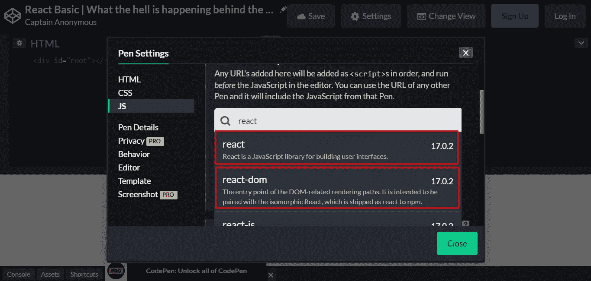
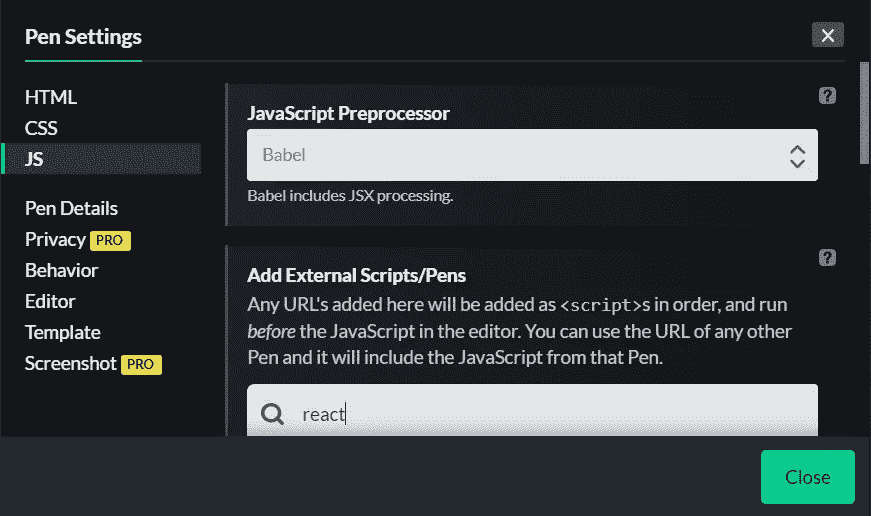
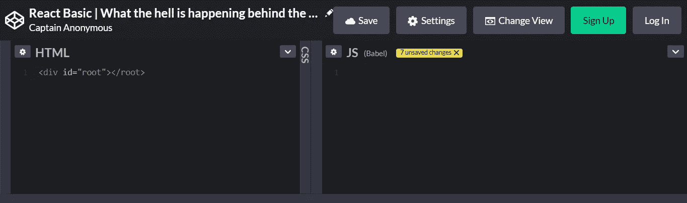
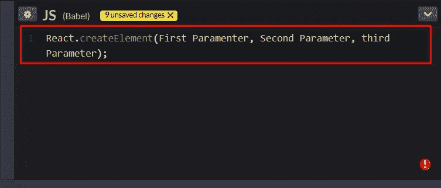
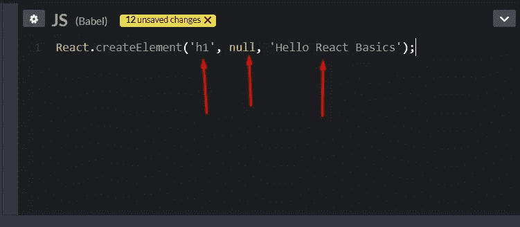
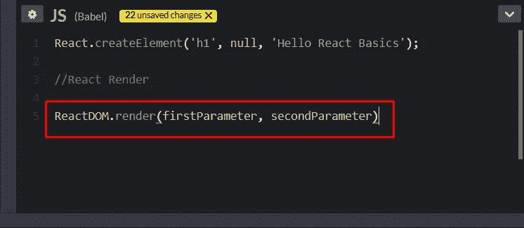
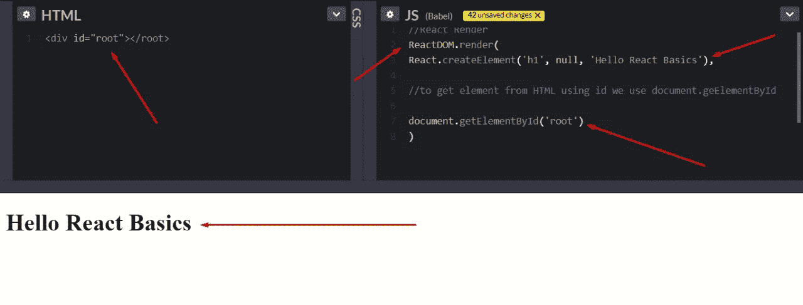

# React 基础|幕后发生了什么？

> 原文：<https://medium.com/nerd-for-tech/react-basics-what-is-happening-behind-the-scene-f0f90dcc873?source=collection_archive---------12----------------------->

在这个博客中，你将会学到关于 React 的基本概念。本博客将涵盖的主题如下:

1.  **先决条件**
2.  **反应到底是什么？**
3.  【React 是如何在幕后运作的？

## 学习前的先决条件反应

每个框架都有自己的先决条件。React 也有它的先决条件。在开始 React 之旅之前，我在下面提到了 React 的先决条件。

1.  **HTML**
2.  **CSS**
3.  **JavaScript (ES6)**

现在的问题是为什么我们需要学习所有的先决条件？所以，答案很简单。React 是 JavaScript 的一个框架。这意味着它是一个 javascript 代码库，帮助我们轻松开发高性能的 web 应用程序。所以框架只是一个特定语言的库。你需要学习它的核心语言来了解这个框架。HTML 和 CSS 是开发任何网站的基础。学习 HTML 和 CSS 是必须的。

## 反应到底是什么？

React 是一个 javascript 框架，它允许我们开发具有更高性能和良好结构代码的网站。现在，它如何帮助网站比使用传统的开发工具表现得更好？。React 中有一个名为 **React DOM 的库。**你一定听说过 **JavaScript DOM，**react 中的概念是一样的，只是功能不同。所以让我来解释一下 React DOM 做了什么。

因此在 React DOM 之前，当我们不得不切换到一个新的页面，或者我们不得不改变网站的一个特定区域时，我们不得不重新加载整个页面来进行改变，这花费了大量的重新加载时间，降低了网站的性能。那么 React DOM 在处理这个问题上就派上用场了。现在，使用 ReactDOM，我们不需要重新加载整个页面来更改单个组件。**例如，**我们要在页面上显示新的最新消息，React DOM 会帮助我们更改特定的组件，而不是整个页面，网站也不需要重新加载。

## **React 是如何在幕后运作的？**

在直接进入 React 编码之前，让我先弄清楚创建 react web 应用程序需要什么。下面是我们开始代码之前需要的东西。

1.  **做出反应**
2.  **反应 DOM**
3.  **巴别塔**

当我们导入 React、React DOM 和 Babel 时，我们就可以开始编码了。

在 Codepen 中导入 React 和 React DOM

我已经在 CodePen 中导入了 React 和 ReactDOM。现在我们需要巴贝尔，这样我们才能走得更远。

为我们的 React 项目设置巴别塔

现在我们已经成功地将 Babel 导入到我们的项目中。现在，我们可以创建自己的 react 应用程序。

用 Id Root 编写 HTML Div

接下来，我创建了一个 Id 为 root 的 Div，这样我们就可以将代码放入其中并显示它。

下一件事是使用 Javascript 创建 React 元素，并将其推入我们的网站。为此，我们将使用 React Object 和 createElement 方法。

该方法需要 3 个参数，

1.  在第一个参数中，您需要告诉您想要创建什么元素。例如，我想创建一个 H1 元素。
2.  在第二个参数中，你需要告诉你是否想要在你想要创建的元素中放入任何属性，在我的例子中，我不想要任何属性，我将把它置为 Null。通过放 Null，它会明白我不想在参数里放任何属性。
3.  在第三个参数中，您将告诉它您想要添加什么内容。在我的例子中，我想添加“Hello React 基础知识”

现在我们需要在 DOM 中呈现我们的元素。为此，我将使用 ReactDOM 的 render 方法。

现在 ReactDOM.render 需要两个参数

1.  在第一个参数中，您将告诉它您想要呈现什么元素。在我的例子中，我想呈现我之前创建的元素。
2.  在第二个参数中，您将告诉我们您希望在哪里呈现元素。在我的例子中，我将被呈现在我们之前用 root id 创建的 div 中。

这就是 React 在幕后的工作方式。我希望你喜欢我的博客。如果我的博客有助于增加你的知识，请鼓掌并与你的同伴分享，这样他们也可以学习。

**在 LinkedIn 上关注我:**[www.linkedin.com/in/saifswl86](http://linkedin.com/in/saifswl86)