# React 超越基础(不包括钩子):上下文、错误、引用、hoc、渲染道具。

> 原文：<https://medium.com/nerd-for-tech/react-beyond-the-basics-excluding-hooks-context-errors-refs-hocs-render-props-52df90d61229?source=collection_archive---------15----------------------->

本文假设您理解 React 的基础知识，并试图阐明更高级的概念。

我将讨论上下文、错误、引用、高阶组件和渲染道具。

# 语境

我们可以使用`props`在组件之间传递数据，但是有些东西将被许多组件使用，在这种情况下，我们可以使用上下文，而不是使用`props`将相同的东西从一个组件传递到下一个组件。

为了能够使用上下文，我们需要一个提供者和一个消费者。当我们有一个想要使用上下文的嵌套元素时，React 将沿着链向上直到找到它，并且它将使用那个值。

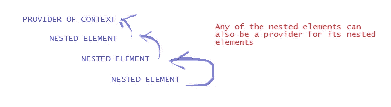

在这个索引文件中，我创建了一个 MyContext，并将其设置为文件中嵌套代码元素的提供者。当上下文被设置为嵌套元素的提供者时，我们指出它将具有什么值。

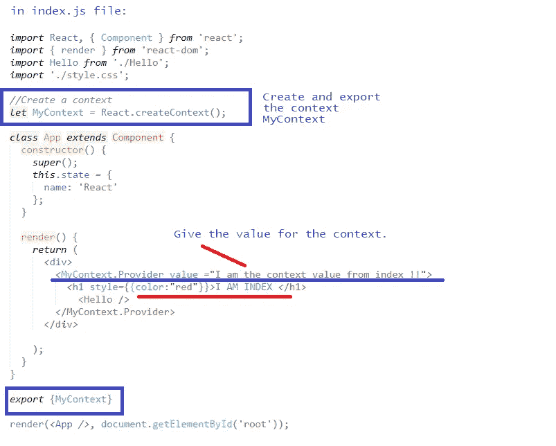

在本例中，Hello 组件将使用所提供的上下文，并且还将为其嵌套元素创建一个上下文。

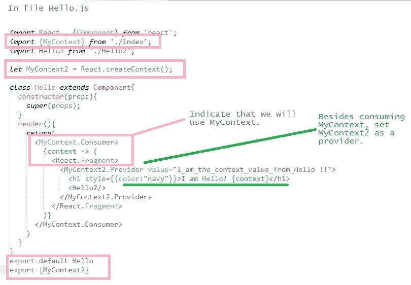

我们还有组件 Hello2，它将使用两种上下文:

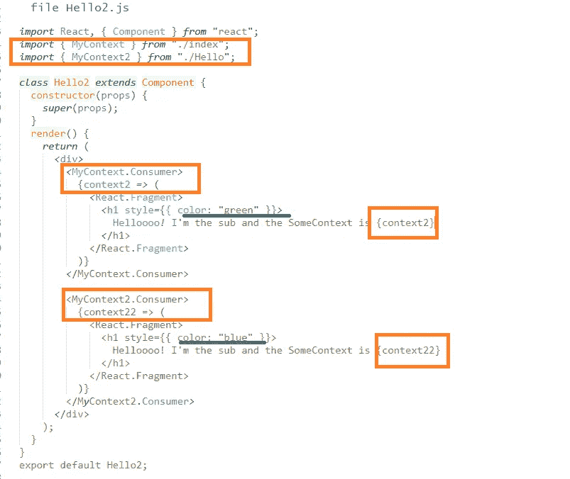

上面的代码将在浏览器中显示:

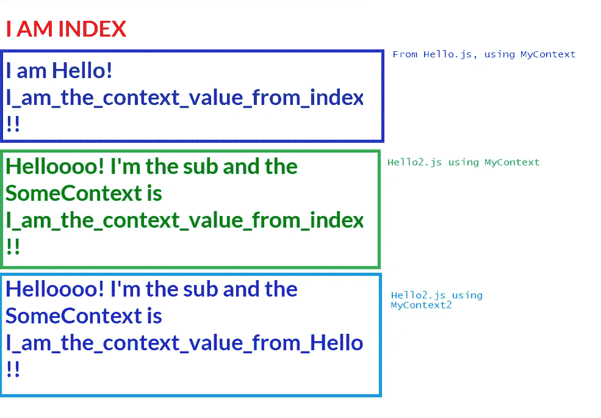

# 误差边界

错误边界是 React **组件**，它们捕捉它们的**子**组件树中任何地方的 JavaScript 错误，记录它们，并显示一个回退 UI 而不是崩溃的组件树，这可能会提供太多信息。它们不能捕捉所有类型的错误(服务器端、事件处理程序、异步代码)。

通过创建具有方法**getderivedstatefromrerror**()和/或 **componentDidCatch** ()的类来创建错误边界。

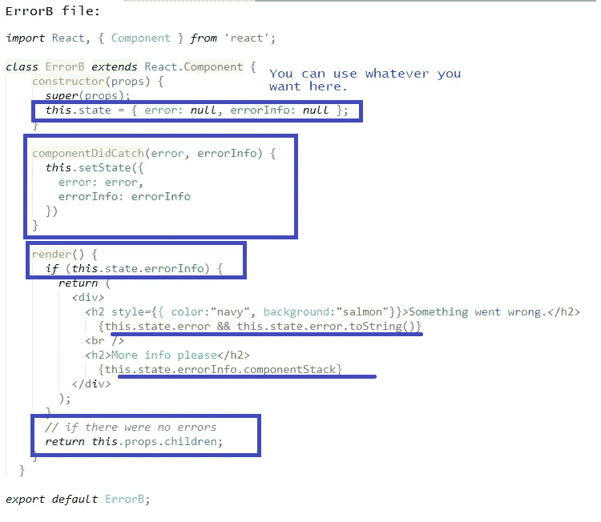

如果有错误，它将显示以下内容(如果没有错误，它将按预期显示组件)。

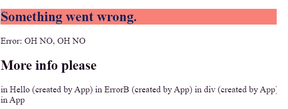

在上面的屏幕截图中，OH NO OH NO 来自索引中使用的 Hello 中的错误，该错误具有 errob 组件:

```
import React , {Component} from 'react';
import {MyContext} from './index';
class **Hello** extends Component{
     constructor(props){
          super(props);
          **throw new Error("OH NO, OH NO");**
}
render(){
     return(
          <React.Fragment>
               <h1 style={{color:"navy"}}>I am Hello! </h1>
          </React.Fragment>
            )
      }
}
export default Hello
#########################class App extends Component {
     constructor() {
          super();
          this.state = {
               name: 'React'
           };
      }
render() {
     return (
          <div>
               **<ErrorB>**
                    <h1 style={{color:"red"}}>I AM INDEX </h1>
                    <Hello />
               ** </ErrorB>**
          </div>
    );
   }
}
```

# REFS

通过引用，你可以直接访问组件的**元素。**

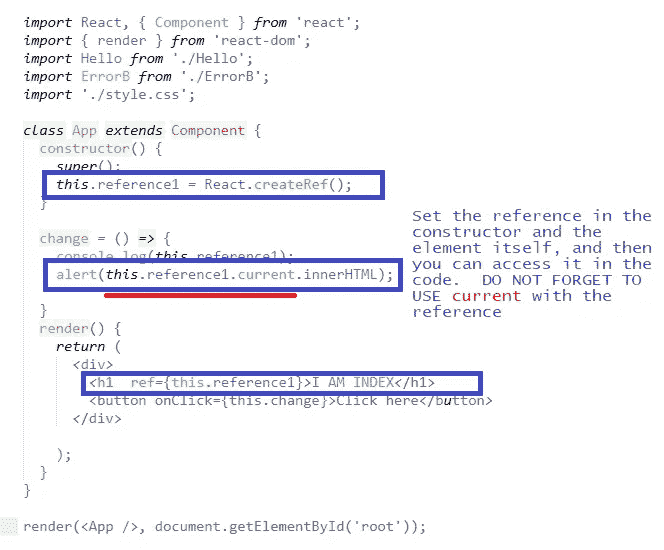

你可以用回调引用完成同样的事情。注意与前一种方式的区别(下面注释掉了)。

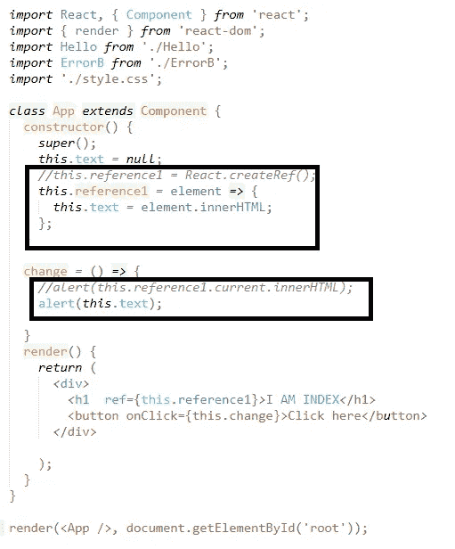

注意:React 也有一个 **this.refs** 可以使用，但它已经过时，不推荐使用，所以我不在这里包含它。如果你看到它，它会看起来像`this.refs.reference1`

React 还允许您将引用从一个组件传递到其子组件。只有当接收引用的组件是用 React.forwardRef 创建的时候，这种方法才有效。

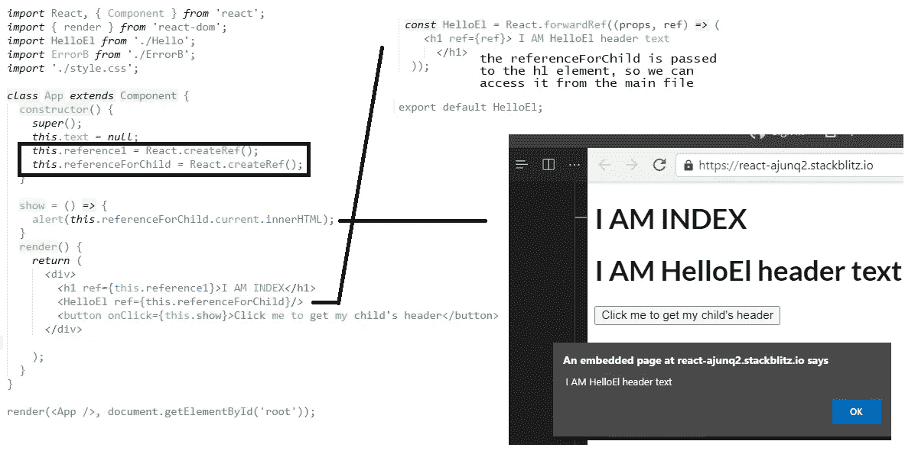

# 高阶组件—特设

高阶分量是接受一个分量并返回一个新分量的函数。这类似于组件的继承，尽管它本身不是继承。

新组件将没有来自原始组件的任何静态方法。道具将被传递给新组件，但引用不会。这个用一个例子比较好解释。

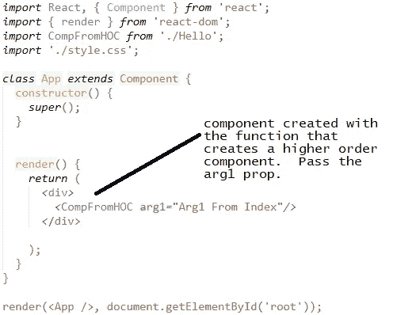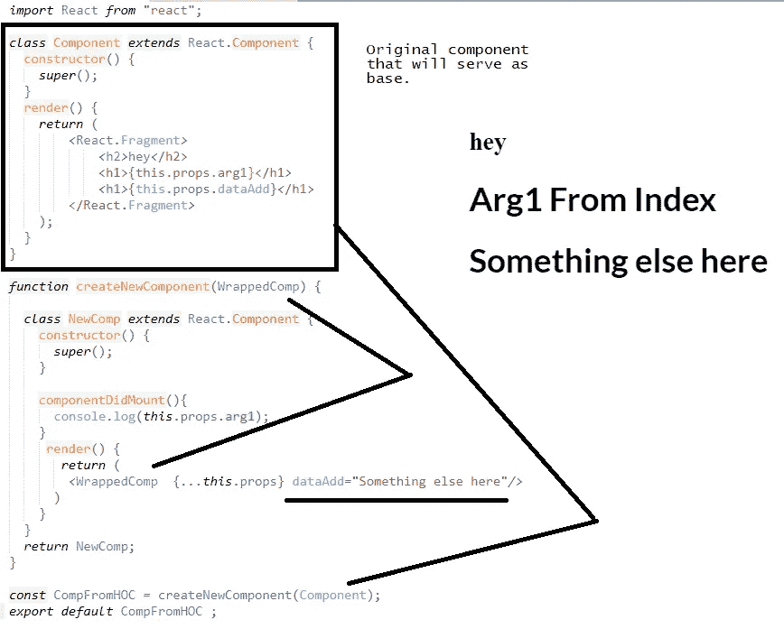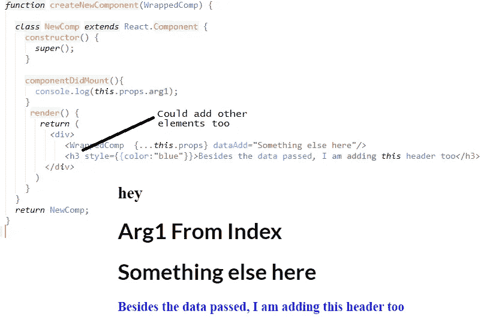

# 渲染道具

这是一种用于在 React 组件之间共享代码的技术。这是通过使用带有函数值的 prop 来完成的。传递了渲染属性的组件将接受一个函数，该函数将返回一个 React 元素。它将调用这个函数，而不是实现自己的逻辑。

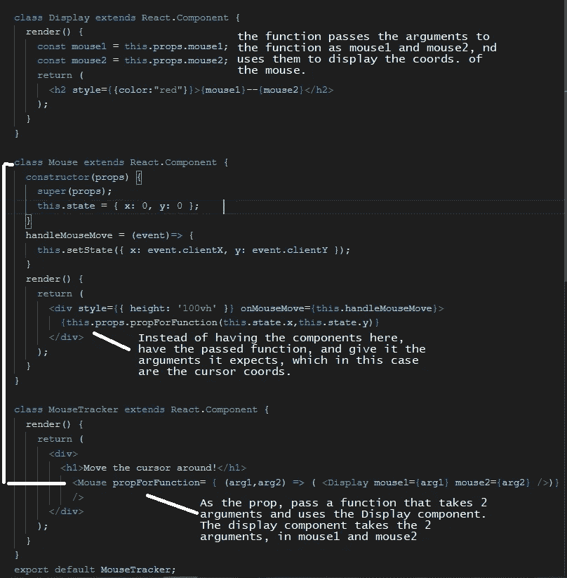

太多了！或者至少对我来说是很多。希望这能澄清一些事情(它帮助我理解了这些概念)。

感谢您的阅读，并随时评论。