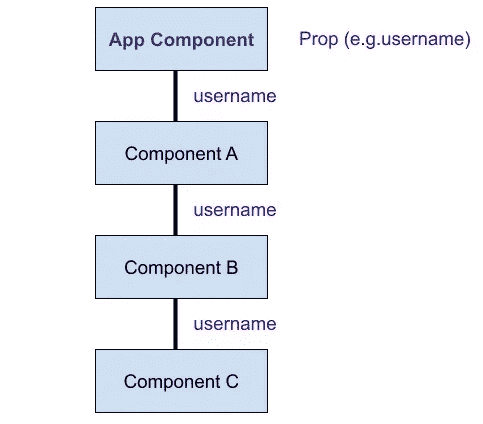
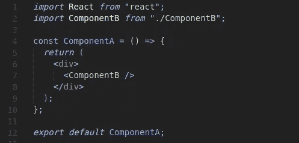
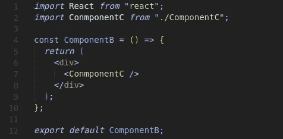
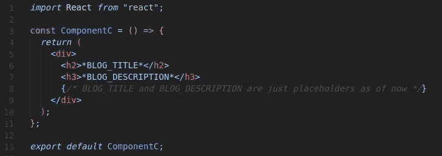
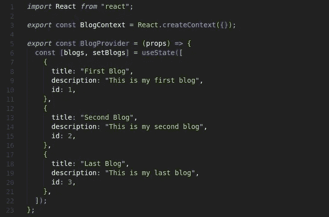
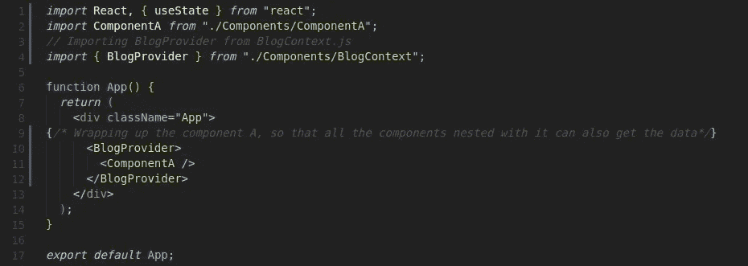
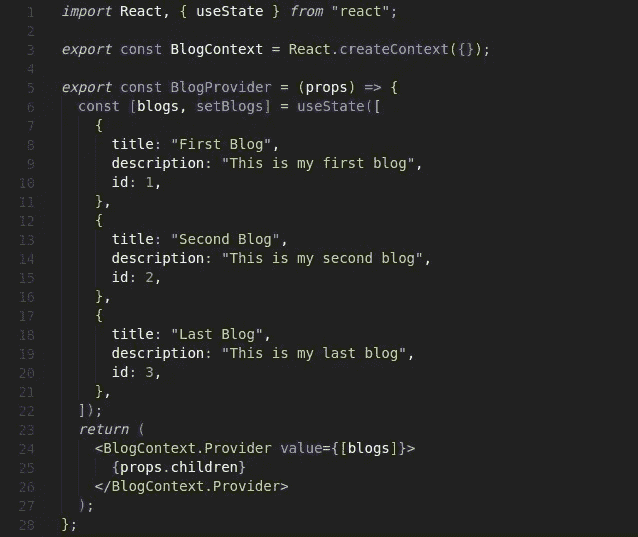
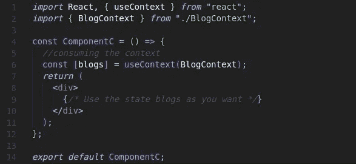

# 使用钩子在功能组件中反应上下文 API

> 原文：<https://medium.com/nerd-for-tech/react-context-api-in-functional-components-using-hooks-c80777bda5e3?source=collection_archive---------2----------------------->

## 了解 React 中的术语 prop drilling，以及上下文 API 如何在 React 应用程序中避免 prop drilling。

正如我在文章的副标题中提到的，上下文 API 有助于在我们的 React 应用程序中避免**道具钻**，如果你不知道术语 ***道具钻*** ，这并没有什么错。所以让我们先了解一下。

在 React 中，我们只能单向传递数据，即通过 props 从上到下(从父到子)。Prop drilling 是一个过程，在这个过程中，我们需要在一个深度嵌套的组件树中向下传递每个级别的 Prop，以便我们可以在最低级别的组件中访问它们。让我们用一个例子来理解这一点，

考虑下图中给出的组件嵌套结构，我们有一个应用程序组件，然后与它嵌套，我们有另一个组件 A。进一步的组件 A 有一个子组件 B，然后组件 B 有一个子组件 c。

组件树

假设组件 C 需要来自 App 组件的一些数据(例如用户名),因此为了使其在组件 C 中可用，prop(用户名)也必须通过所有其他子组件传递，即我们必须将 prop 从 App 组件向下传递到组件 A， 必须向下传递组件 B 中的属性，然后它通过组件 B 向下传递到组件 c。即使组件 A 和组件 B 不需要属性用户名，但我们仍然必须通过它们传递属性，以便能够将其传递到树中更下面的组件。

但是这里有一个问题，为什么要将数据传递给所有那些中间组件，而它们根本不需要这些数据，只是帮助数据通过树传递呢？这就是我们在 React 中需要**上下文 API** 的地方。

> React 中的 ***Context*** 只是提供了一种将数据直接传递给所需组件的方式，而不是通过组件树的每一层来传递数据。

因此，使用 React 上下文，我们不必向所有不需要道具的中间组件传递不必要的道具。因此，我们已经讨论了为什么需要上下文，现在让我们了解上下文 API 的一步一步的工作，以解决这个问题的道具钻井。

**注意:在我们深入研究上下文 API 的工作之前，建议先了解一下 *React* *钩子，如 useState、useContext 等。***

让我们考虑这个非常基本的例子来理解 React Context API 的工作，其中我们在我们的 **App.js** 中有一个**博客**集合，我们需要将这些数据传递给其他一些**组件 C** (显然不是 App.js 的子组件)来呈现给浏览器。

最初 **App.js 的代码结构—**

App.js 文件

**组件 A，**也就是**组件 只是渲染组件 B，**

ComponentA.js 文件

**组件 B** ，渲染组件 C，

ComponentB.js 文件

而**组件 C** 负责将所有数据渲染到与那些博客相关的浏览器上；

ComponentC.js 文件

在这种情况下，一遍又一遍地通过 props 传递博客的数据可能会给应用程序带来问题。传递道具对开发者来说也很困难，因为有时你可能传递了比你需要的更多的道具，甚至忘记传递你确实需要的道具，等等。因此，在这种情况下，我们可以选择使用上下文 API。

**步骤 1:创建上下文—**

第一步是使用 React 的 **createContext()** 方法创建一个上下文对象。所以在 **BlogContext.js 中，**我们将创建一个上下文 **BlogContext** 像这样

这个 createContext()方法接受一个参数作为状态或数据的默认值。虽然此默认参数值不是必需的，但只有当组件在树中没有任何匹配的提供程序时，才会使用它。

现在，我们已经创建了上下文，来自 createContext 的上下文对象总是带有另外两个 React 组件— **提供者和消费者**。接下来，我们将创建一个提供者组件。

**步骤 2:创建一个提供者组件—**

一个提供者组件基本上包含了我们希望与使用上下文的其他组件共享的所有状态或数据。这意味着在我们的例子中，我们需要将博客状态从我们的应用程序组件放到提供者组件中，

博客上下文. js 文件

**步骤 3:包装组件并提供要传递的值-**

使用 context 对象和 provider 组件，我们将包装所有想要共享数据的组件。但是我们不会从 Context.js 中呈现它们，而是使用它们的父组件(在本例中为 App.js)来包装所有需要这些数据的子组件(在本例中仅为组件 C)。

现在我们的 **App.js** 看起来会像这样—

App.js 文件

在 BlogContext.js 中，我们可以通过 props 从 App.js 访问这些子组件，因此这里我们将简单地在 Provider 组件中呈现 *{props.children}* ，其中需要一个 prop 作为*值*，我们需要传递想要共享的数据，即我们案例中的博客状态。注意，只有当我们通过这个*值*属性传递上下文(数据)时，我们才能共享它。

博客上下文. js 文件

**第四步:消费所需组件中的数据—**

现在最后一步是使用 ***useContext*** 钩子消耗所需组件中的上下文值。

## 使用上下文的步骤:

转到所需组件并从 React 导入 *useContext* 钩子，从 BlogContext.js 导入 BlogContext

ComponentC.js

我们使用上下文对象(BlogContext)通过使用 context 方法从 Provider 组件中获取上下文值(即数据)。此 useContext 方法接受上下文对象作为其参数，并返回当前上下文值。

ComponentC.js

这就是我们如何单独创建上下文，并使用 useContext 钩子在我们的应用程序中任意使用它。

## 结论:

*   使用反应的 **createContext()** 方法，我们创建了上下文对象。
*   从上下文对象中拉出**提供程序**。
*   用**供应商包装父组件中的所有必需组件。**
*   最后，使用 **useContext()** 钩子来使用上下文，并按照您想要的方式使用它。

**希望本文内容翔实。如果您认为内容有帮助，请鼓掌**👏**并在下面的评论部分自由发送您的反馈和任何与 React Context API 相关的查询。**

**感谢您的阅读。祝您愉快:**