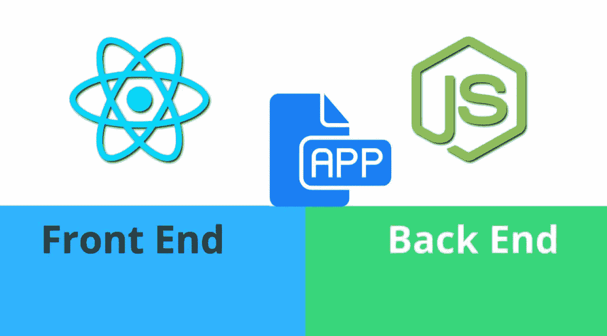
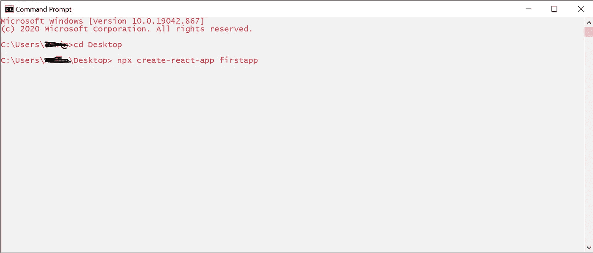
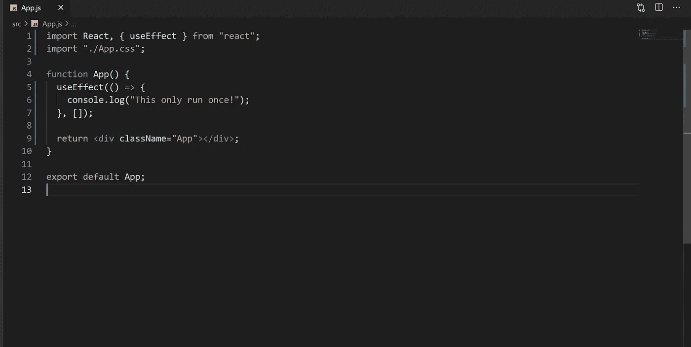
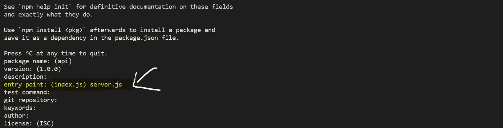
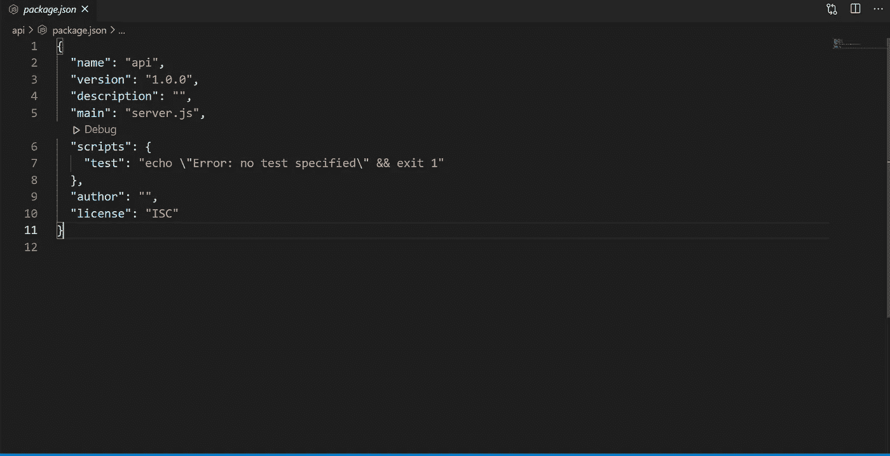
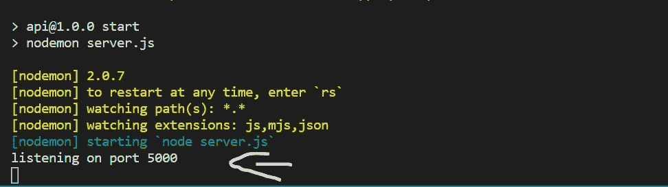
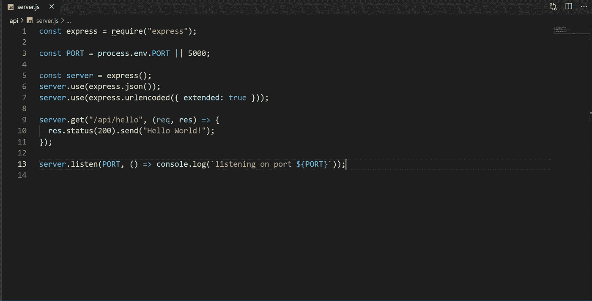
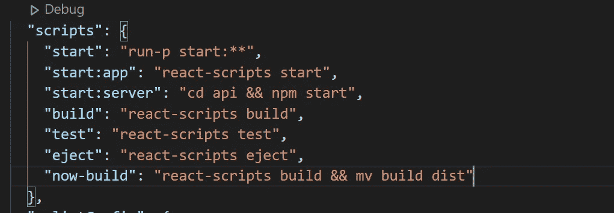
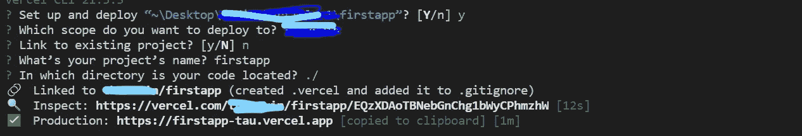

# React(前端)- Nodejs(后端)

> 原文：<https://medium.com/nerd-for-tech/react-frontend-nodejs-backend-167e2904e5c9?source=collection_archive---------2----------------------->



图片来自 Morioh

我们中的许多人，包括我，都很难开发一个连接到 Nodejs 后端的 React 应用程序！今天，通过这篇文章，我将向你展示连接这两者的基础知识，以及奖金！，如何将站点发布到 [Vercel](https://vercel.com/) (包括后端和前端)

我不是去聊天或其他应用程序，而是一个小的'你好世界'的例子！

所以让我们*投入*进去吧…

## 先决条件:

*   安装了最新版本的[节点](https://nodejs.org/en/)
*   在 [Vercel](https://vercel.com/) 设立账户
*   最新版本的 [vercel-cli](https://vercel.com/download) 已安装 [***已登录***](https://vercel.com/docs/cli#commands/login)

这就是你所需要的！

# 客户端安装

首先，在命令行中使用`npm i create-react-app -g`安装软件包“create-react-app”。(对于本教程，我使用的是 Windows CMD)。

安装完成后，您可以转到想要创建前端的文件夹(使用 cmd)。在您的文件夹中，键入`npx create-react-app firstapp` (您可以根据自己的意愿更改`firstapp`)



安装应用程序

安装完成后，键入`cd firstapp`，然后键入`code .`，这将打开 VSCode。(您可以使用您喜欢的代码编辑器。我现在将使用 VSCode)。

现在是清洁过程。在项目的根中。可以去`src` 文件夹。在里面，你*可以*删除`App.test.js`和`setupTests.js` ，因为这些都是不需要的！

*好消息是我们已经完成了客户端安装！*

# 客户端设置

现在，让我们*深入*你的代码。正如我上面所说的，我只去“Hello-World”的例子。为此，让我们导航到`src`文件夹中的`App.js`。您可以删除`<div className="App">`中的所有代码。删除后，将这段代码添加到您的(整个)代码的最上面:`import React, { useEffect } from “react";` 现在您应该有类似于:

```
import React, { useEffect } from "react";
import "./App.css";function App() {
 return <div className="App"></div>;
}export default App;
```

接下来，在`function App()`中添加:

```
useEffect(() => {
 console.log("This only run once!");
}, []);
```

现在你的整个`App.js`可能看起来像这样:



App.js

> 通过使用`UseEffect`钩子，你告诉 React 你的组件需要在**渲染**之后做一些事情。React 将记住您传递的**函数**(并在执行 DOM 更新后调用它。

接下来，让我们通过在 VSCode 中转至 Terminal > New Terminal 来运行应用程序。在终端键入`npm start`。这将为我们的发展打开`localhost:3000`。现在你可以在浏览器的控制台上看到，“这只运行一次！”印好了！

你可以通过按下`Ctrl + c` 关闭开发服务器，然后在终端中点击回车！

下一步是安装`axios`。即使现在不需要，我们也要完成它。打开一个新的终端并键入`npm i axios`。安装完成后，导航到`src`文件夹并创建一个名为`axios.js`的新文件。在其中，添加这段代码:

```
import axios from "axios";  //imports axiosconst instance = axios.create({
 baseURL: "/",
});export default instance;  //exports the instance
```

这里，我们将 axios baseURL 设置为“/”。例如，如果我们网站的链接是“www.firstapp.com”，那么 baseURL 将是“www.firstapp.com **/** ”。你会明白的，因为我们还设置了服务器端！

正如我已经说过的，这对现在的*来说并不重要，*但我们无论如何都需要它！

好消息是我们已经完成了客户端的设置！

# 服务器端安装

导航到项目的根目录。创建一个名为`api`的新文件夹。现在，在您的终端中，通过`cd api`导航到`api` 文件夹。然后在终端中，键入`npm init`。这将为我们创建一个`package.json`。这可能会问我们几个问题。但重要的是`entry-point`。对于这个问题，只需输入`server.js`。对于其他人，只需按回车键。



npm 初始化

现在，在您的后端文件夹(`api`文件夹)中，您可能会看到一个`package.json`。它的内容应该是这样的:



package.json(初始)

现在让我们做一些改变！

创建新的终端。键入`cd api` ，然后键入`npm i nodemon --save-dev`。在这个过程之后，导航到您的 package.json

```
"start": "nodemon server.js"
```

> nodemon 是一个工具，通过在检测到目录中的文件更改时自动重新启动节点应用程序，来帮助开发基于 node.js 的应用程序。

接下来是在你的后端(`api`文件夹)添加一个`.gitignore`文件。在`.gitignore`文件里面，添加:

```
/node_modules
```

> 一个`gitignore`文件指定了 Git 应该忽略的未被跟踪的文件。

*好消息是我们已经完成了服务器端的安装！*

# 服务器端设置

让我们深入研究一下我们的服务器端设置。

首先，让我们安装`express`。在您的终端中，导航到`api`文件夹。类型`npm i express --save`。

然后，您可以在后端(`api`文件夹)中创建一个`server.js`文件。在`server.js`里面加上这些:

```
const express = require("express");  //requires (imports) the               //express packageconst PORT = process.env.PORT || 5000;  //see below
const server = express();server.listen(PORT, () => console.log(`listening on port ${PORT}`));
```

> process.env.PORT || 5000 表示:环境变量 PORT 中的任何内容，如果没有任何内容，则为 5000。

现在在终端中(在`api`文件夹中)键入`npm start`。您可能会看到:



现在，您可以关闭服务器(通过按下`Ctrl + c`然后按回车键)。

在您的`server.js`中，在`server.listen`前添加:

```
server.use(express.json());
server.use(express.urlencoded({ extended: true }));
```

> `express.json()`使用 JSON 有效负载解析传入的请求，并且基于[主体解析器](http://expressjs.com/en/resources/middleware/body-parser.html)。
> 
> `express.urlencoded()`是 Express 中内置的中间件功能。它使用 urlencoded 有效负载解析传入的请求，并且基于 [body-parser。](http://expressjs.com/en/resources/middleware/body-parser.html)

就在下面，补充一下:

```
server.get("/api/hello", (req, res) => {
 res.status(200).send("Hello World!");
});
```

> 当向'/api/hello '发出请求时，服务器将发送“Hello World”作为响应，并将响应状态设置为 200。

现在`server.js`将看起来像:



server.js

```
const express = require("express");const PORT = process.env.PORT || 5000;const server = express();
server.use(express.json());
server.use(express.urlencoded({ extended: true }));server.get("/api/hello", (req, res) => {
 res.status(200).send("Hello World!");
});server.listen(PORT, () => console.log(`listening on port ${PORT}`));
```

让我们测试您的简单服务器。只需键入，(在`api`文件夹中)，`npm start`。然后在你的浏览器中，进入[http://localhost:5000/API/hello](http://localhost:5000/api/hello)。

就是这样！(您可以暂时关闭服务器！)

*好消息是我们已经完成了服务器端的设置！*

# 连接前端和后端

去你的**前端**。在里面加上:

```
"proxy": "http://localhost:5000/",
```

> 为了告诉开发服务器将任何未知的请求代理到开发中的 API 服务器，在您的`package.json.`中添加一个`proxy`字段以获得更多信息:[https://create-react-app . dev/docs/proxy ing-API-requests-in-development/](https://create-react-app.dev/docs/proxying-api-requests-in-development/)

接下来，您希望您的后端和前端同时运行！为此你可能需要包`npm-run-all`。通过`npm i npm-run-all --save-dev`将它安装在项目前端。安装后，你必须在你的前端`package.json`做一些改变。将`package.json`中`"scripts"` 的所有代码改为:

```
"start": "run-p start:**",
"start:app": "react-scripts start",
"start:server": "cd api && npm start",
"build": "react-scripts build",
"test": "react-scripts test",
"eject": "react-scripts eject",
"now-build": "react-scripts build && mv build dist"
```



package.json

现在在终端中，(在你的项目的根目录中)通过`npm start`启动你的项目

就是这样！

现在，在你的`src > App.js`:

```
import axios from "./axios";//rest of the code ...useEffect(() => {
 axios.get("api/hello").then((response) => {
  console.log(response.data);
 });
}, []);
```

在此之后，您的`App.js`将看起来像:

```
import React, { useEffect } from "react";
import "./App.css";
import axios from "./axios";function App() {
useEffect(() => {
 axios.get("api/hello").then((response) => {
  console.log(response.data);
 });
}, []);return <div className="App"></div>;}export default App;
```

现在，在您的代码中，您可能会看到`axios.get("api/hello")`。这里，正如我在客户端设置中所说的，在“api”之前不需要“/”。

*好消息是我们已经完成了前端和后端的连接！*

# 在用户界面中显示结果

最后一步是在 UI 中显示获取的结果。为此，将`App.js`改写为:

```
import React, { useEffect, useState } from "react"; 
import "./App.css";
import axios from "./axios";function App() {
const [result, setResult] = useState("");useEffect(() => {
 axios.get("api/hello").then((response) => {
  setResult(response.data);
 });
}, []);return <div className="App">
 {result && <h1>{result}</h1>}
</div>;}export default App;
```

> 在第一行中，我们添加了从“react”导入`useState`的代码。然后我们创建了一个名为“结果”的新状态。当获取完成后，我们将“结果”设置为`response.data`(这是来自服务器代码的“Hello World”)。然后使用 h1 标签在 UI 中显示结果

*好消息是我们已经完成了在用户界面上显示结果！*

# 发布到 Vercel

在我们将应用程序发布到 Vercel 之前，我们需要为 Vercel 创建配置文件。我们将该文件添加到您的项目的根目录中，并将其命名为`vercel.json`。在里面加上:

```
{"version": 2,"public": false,"builds": [
 { "src": "package.json", "use": "@vercel/static-build" },
 { "src": "/api/server.js", "use": "@vercel/node" }
],"rewrites": [
  { "source": "/api/(.*)", "destination": "/api/server.js" },
  { "source": "(.*)", "destination": "/index.html" }
 ]
}
```

> 有关`vercel.json`的更多信息，请访问[https://vercel.com/docs/configuration](https://vercel.com/docs/configuration)

现在让我们*潜入*生产部分！(对于这一步，您应该满足上述先决条件)

使用终端，在项目的根目录中，键入`vercel --prod`。

这将促进你的网站的生产，会问一些问题，你提供的答案必须是:



你可以点击“生产”的链接。好了

好消息是我们已经完成了你网站的发布！

今天就到这里吧！如果你读这篇文章感到无聊，可以看看这个有趣的提示:“Github”这个名字是如何形成的？通过连接字母 G-i-t-h-u-b。就是这样！*好消息是，我们已经看完了我的小* ***笑话*** *！*

如果你还没看过我的*下篇(*来自未来 *)* 文章，在这里找[。](/nerd-for-tech/uploading-images-to-cloudinary-with-react-e432c644485)

希望你们都喜欢这个！

谢谢！