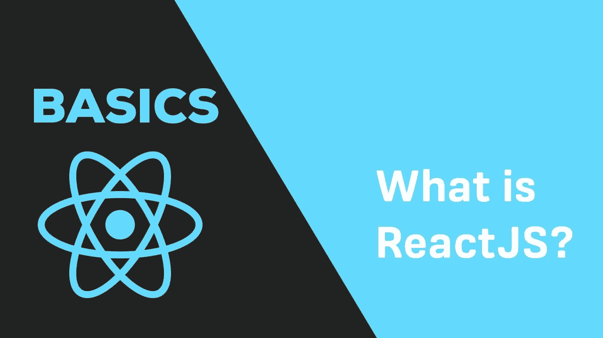
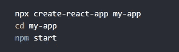
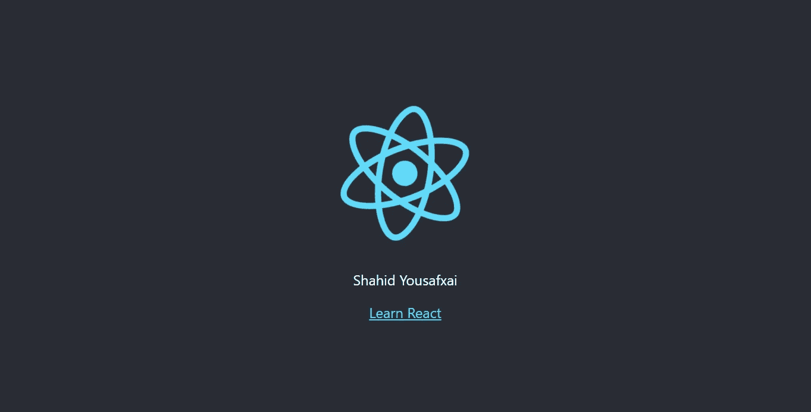

# React Fundamentals(基础)-什么是 React App 以及如何开始使用 React App。

> 原文：<https://medium.com/nerd-for-tech/react-fundamentals-basics-what-is-and-how-to-start-react-app-9258b2af87e9?source=collection_archive---------11----------------------->

React 一个专门为单页应用程序构建用户界面的 JavaScript 库。

React JS 框架基础。

它用于处理 web 和移动应用程序的视图层。React 还允许我们创建可重用的 UI 组件。React 允许开发人员创建可以更改数据的大型 web 应用程序，而无需重新加载页面。React 的主要目的是快速、可伸缩和简单。它只在应用程序的用户界面上起作用。

## 开始反应的要求:

1.  超文本标记语言
2.  半铸钢ˌ钢性铸铁(Cast Semi-Steel)
3.  JavaScript (ES6)

ECMAScript 2015 或 ES2015 或 ES6 是 JavaScript 编程语言的重大更新。这是该语言自 2009 年标准化的 ES5 以来的首次重大更新。因此，ES2015 通常被称为 ES6。以下是 [ES6](https://www.w3schools.com/js/js_es6.asp) 的新特性。

1.  字母关键字
2.  const 关键字
3.  JavaScript 箭头函数
4.  用于/的 JavaScript
5.  JavaScript 类
6.  JavaScript 承诺
7.  JavaScript 符号
8.  默认参数
9.  函数剩余参数
10.  Array.find()
11.  Array.findIndex()
12.  新的数学方法
13.  新数字属性
14.  新的数字方法
15.  新的全球方法
16.  JavaScript 模块

## React 所需的开发环境:

1.  结节
2.  浏览器:Chrome，Firefox，Opera，Safari…
3.  文本编辑器:VS 代码，Sublime，Atom…
4.  [React 开发者工具](https://chrome.google.com/webstore/detail/react-developer-tools/fmkadmapgofadopljbjfkapdkoienihi)

## 节点:

Node.js 是一个开源的服务器端运行时环境 JavaScript 引擎。它提供了一个事件驱动、非阻塞(异步)I/O 和跨平台运行时环境，用于使用 JavaScript 构建高度可伸缩的服务器端应用程序。

节点。射流研究…

Node.js 可用于构建不同类型的应用程序，如命令行应用程序、web 应用程序、实时聊天应用程序、REST API 服务器等。然而，它主要用于构建网络程序，如 web 服务器，类似于 PHP、Java 或 ASP.NET。

## NPM 基本命令:

1.  NPM 初始化
    创建 package.json 文件，列出依赖项
2.  NPM 安装 <package name="">—将
    安装包保存到本地并添加到 package.json</package>
3.  NPM 安装 <package name="">-g
    全局安装包</package>
4.  NPM 安装 <package name="">—保存-开发</package>

## React 开发人员工具:

React Developer Tools 是 Chrome DevTools 对开源 React JavaScript 库的扩展。它允许您在 Chrome 开发工具中检查 React 组件层次结构。它将向您显示页面上呈现的根 React 组件，以及它们最终呈现的子组件。
通过选择树中的一个组件，您可以在右边的面板中检查和编辑其当前属性和状态。在面包屑中，您可以检查选定的组件、创建它的组件、创建它的组件等等。

现在是开始(创建)React 框架的时候了。

## 正在创建 React 应用程序:

首先打开你的终端，导航到你想要创建 React 应用的目录。现在使用下面的命令创建 React 应用程序。

该命令将为您创建一个目录，所有 React 应用程序都将位于其中。现在导航到您刚刚创建应用程序的目录。

NMP 启动—该命令将启动 react 的实时服务器。你的屏幕会是这样的。

这是它，你在正确的位置开始开发单页应用程序。