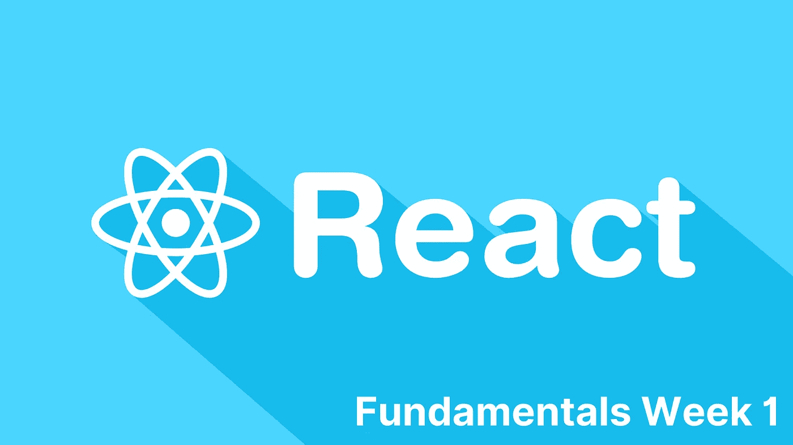

# 反应基础第一周

> 原文：<https://medium.com/nerd-for-tech/react-fundamentals-week-one-5df0bc29947b?source=collection_archive---------20----------------------->



React 学习系列，第 1 周

这篇文章是我的 [react 学习系列](https://dhash.medium.com/my-weekly-react-learning-series-c94d129a6c21)的延续，在那里我每周发布一篇关于我的 react 学习进度的文章，并分享有用的资源和材料，帮助我更好地理解概念并提高我的 javascript 技能。

本周，我把基础知识放在桌子上，在开始编码之前，我浏览了大量的理论和文章，以便更好地理解概念。让我从上到下给你看一下我的第一周。资源在最底层。

# 你好世界

当然，我怎么能错过规范呢，对吧？

```
ReactDOM.render(
  <h1>Hello, world!</h1>,
  document.getElementById('root')
);
```

用来理解 React 的基础和原理的资源是唯一的 [reactjs 纪录片](https://reactjs.org/docs/hello-world.html)，我很晚才知道，但是如果你正在学习一个新的框架、库或语言。官方纪录片是你最好的朋友。我知道这可能会很无聊，一些纪录片甚至没有更新，也没有提供完整的信息，但大多数时候这是你最好的选择，至少对开始来说是这样。

# 基本面亮点

## 1.Javascript XML (JSX)

JSX 允许我们用 JavaScript 编写 HTML 元素并将它们放在 DOM 中，而不需要任何预先构建的方法，如 createElement()和/或 appendChild()方法。简单而精确地说，JSX 将 HTML 标签转换成 react 元素。

下面是一个简单的例子，其中声明了一个常量名称元素

```
const element = <h1>This is JSX</h1>
```

这段代码看起来很熟悉，但它既不是 HTML 也不是字符串。JSX 设计它是为了让我们可以传递由 HTML 或 React 元素组成的树结构，就好像它们是标准的 JavaScript 值一样。

## 在 JSX 嵌入表达式

在 JSX，可以将有效的 JavaScript 表达式放在花括号内

```
const name = 'Josh Perez';
const element = <h1>Hello, {name}</h1>;ReactDOM.render(
  element,
  document.getElementById('root')
);
```

在上面的代码片段中，我们嵌入了“name”表达式，这是一个 JavaScript 字符串，它完全有效，甚至是在您的 JSX 中使用 JavaScript 表达式的标准。

我们可以用 JSX 编写 React 应用程序，但没有人这样做，因为 JSX 让代码非常简短，易于理解，它让程序员可以在 Javascript 中传递元素。

## 2.组件和道具

众所周知，React 中的所有东西都是一个组件，组件让您可以将 UI 分割成独立的、可重用的部分。简而言之，组件只不过是一个 JavaScript 函数。在 react 中有两种方式定义组件，基于类的组件和功能组件，但是自从 React 中引入钩子(这是另一个星期的话题)以来，人们更喜欢使用功能组件，因为它们易于编写、维护和阅读。

```
function Welcome(props) {
  return <h1>Hello, {props.name}</h1>;
}
```

这是一个有效的 react 组件，因为它接受一个单独的 prop(接下来将出现),并在一个单独的 JSX 包装器中返回所有内容。

## 小道具

在许多情况下，组件需要相互通信，以简化彼此之间的数据交换，组件之间传递数据的方式是使用 props。

*   带有属性的数据是单向传递的。
*   Props 数据是只读的。
*   属性被传递给像函数参数这样的组件。
*   当使用基于类的组件时，像`this.prop`一样声明道具
*   `props.childresn`对于组件的开始和结束标记之间声明的任何元素。

## 3.州

用最简单的话来解释，State 是 React 中的内置对象。它是一个存储属于组件的属性值的对象，当状态对象改变时，组件会在屏幕上重新呈现自己。

在下周的文章中，我将深入探讨 useState()钩子的使用，其中我将涉及 React 钩子和一些中间主题。

## 4.反应生命周期

React 中的每个组件都有一个生命周期，您可以根据组件的不同阶段对其进行操作，

1.  挂载:意味着将元素加载到 DOM 中。
2.  更新:意味着更新 DOM 中的组件，或者每当组件的状态或属性发生变化时进行更新。
3.  卸载:这是组件从 DOM 中移除的最后一个阶段。

## 5.事件

基于用户事件的动作被称为事件，比如当用户点击某个东西，改变某个东西，鼠标悬停等等。

在 React 中添加事件的注意事项。

*   React 事件用类似`onClick`的 camelCase 语法编写
*   React 事件处理程序写在花括号内。

## 6.反应造型

这是最简单的部分，有很多方法来对 CSS 进行样式反应，我不会对每种方法都进行举例，我将只描述我使用过的几种方法，并且认为它们有助于完成工作。

*   内嵌样式

```
<h1 style={{color: "red"}}>Hello Style!</h1>
```

*   驼峰式属性名

```
<h1 style={{backgroundColor: "lightblue"}}>Hello Style!</h1>
```

*   JavaScript 对象:在完全不同的 JS 代码块中声明样式。

```
const mystyle = {
      color: "white",
      backgroundColor: "DodgerBlue",
      padding: "10px",
      fontFamily: "Arial"
    };
```

*   最后，但不限于样式表，创建一个不同的文件来维护组件的样式。创建不同样式表的重要部分是，当您在 react 组件中导入和提到您的类名时，您必须使用`className`语法，而不是常规 HTML 中的`class`。

接下来的一周，我将在基础上实施一些小的项目，并将转移到中级主题，敬请关注。感谢阅读。

对于基本面来说，这两个资源非常有用。这个 youtube 播放列表信息丰富，作者解释了基于类别的组件和功能组件以及它们之间的区别。

[1][https://reactjs.org/](https://reactjs.org/)

[2][https://www.youtube.com/playlist?list = plc3y 8-rfhvwgg 3 vayjghgnmodb 54 rxok 3](https://www.youtube.com/playlist?list=PLC3y8-rFHvwgg3vaYJgHGnModB54rxOk3)