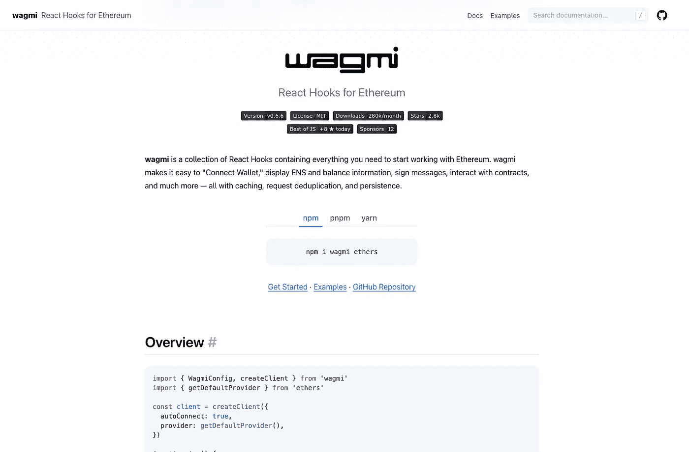

# 针对 Web3 以太坊开发者的 React 挂钩

> 原文：<https://medium.com/nerd-for-tech/react-hooks-for-web3-ethereum-developers-e69da7fe0a85?source=collection_archive---------1----------------------->

挂钩连接钱包、缓存数据、避免重复、与合同交互



瓦格米

## Web3 正在激增。

我说的是 [Wagmi](https://wagmi.sh/) 以太坊的 react 挂钩系列。

这个库每月有 28 万次下载，但只有一个 3K github stars——只有一行安装代码。

```
yarn add wagmi ethers
```