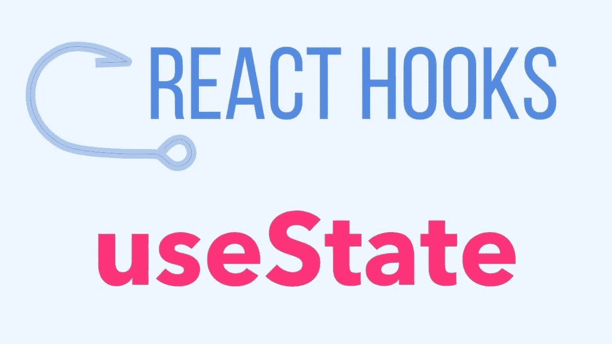
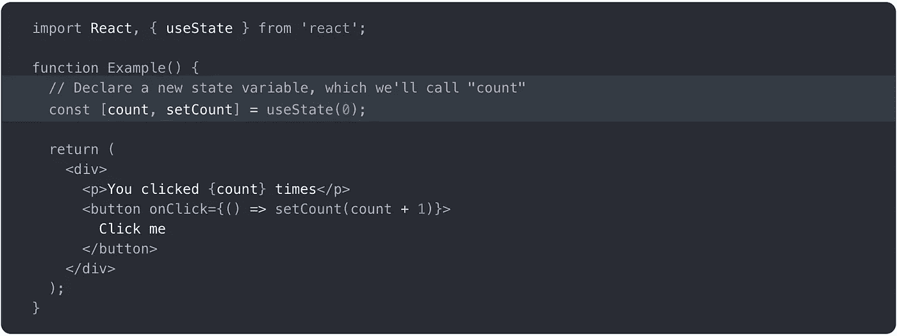
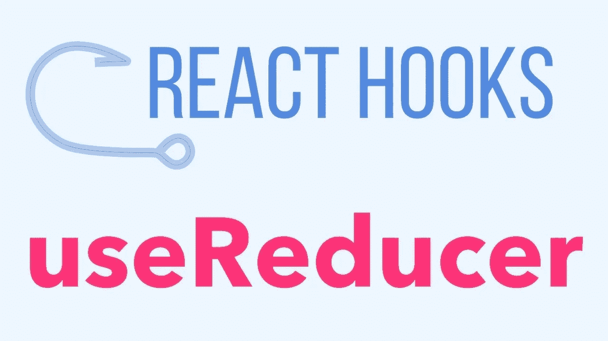
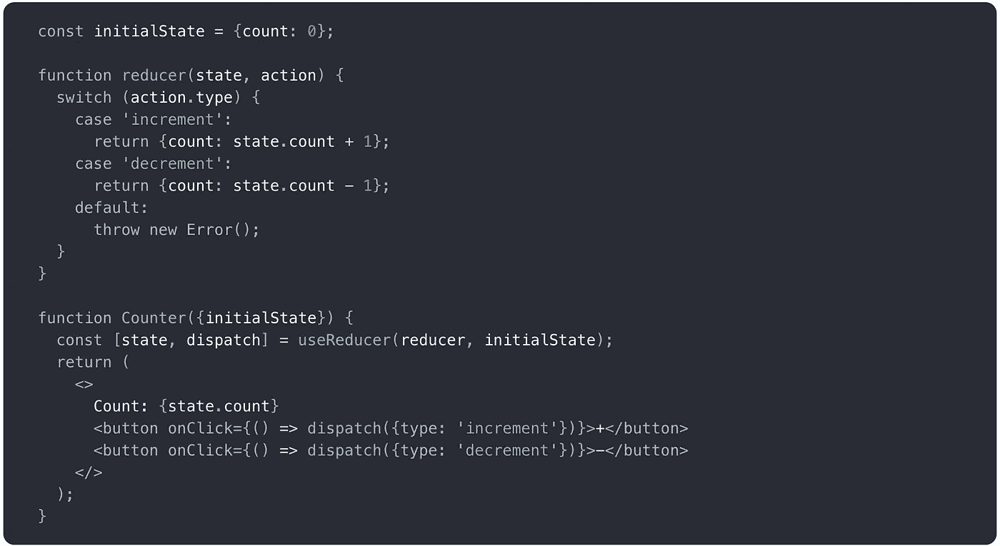
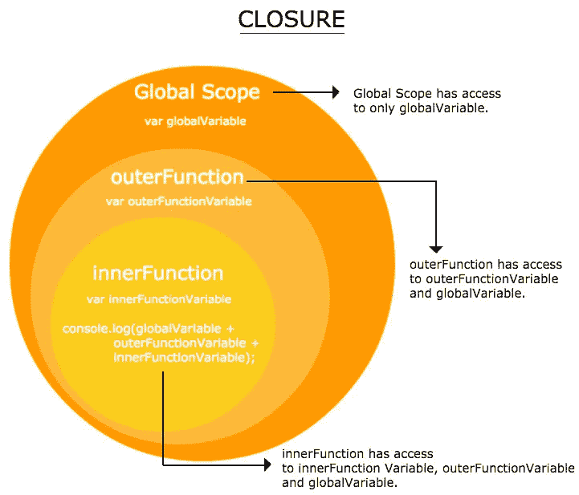
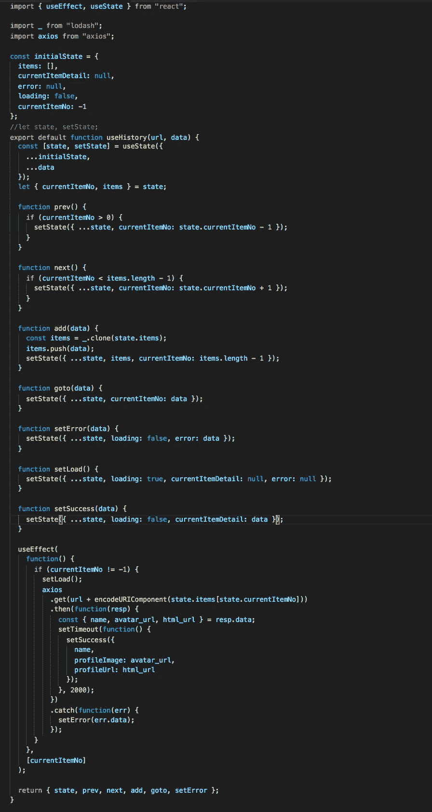
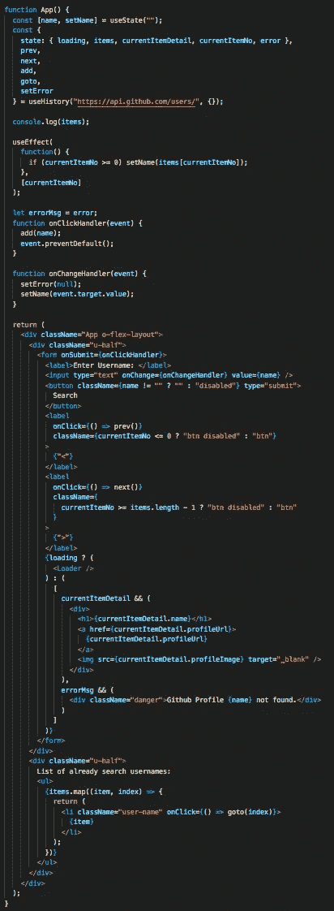
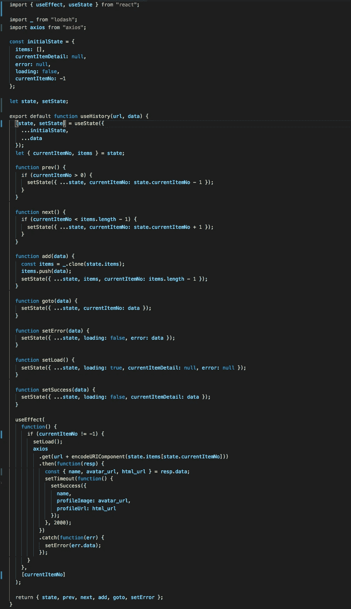
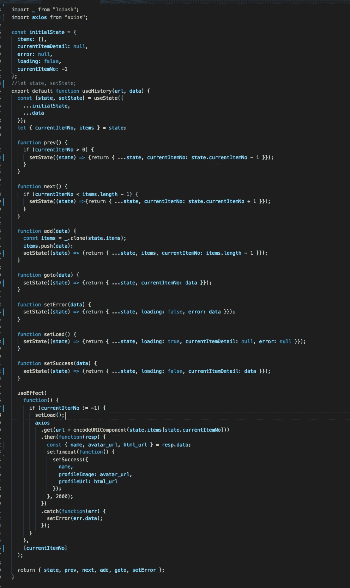
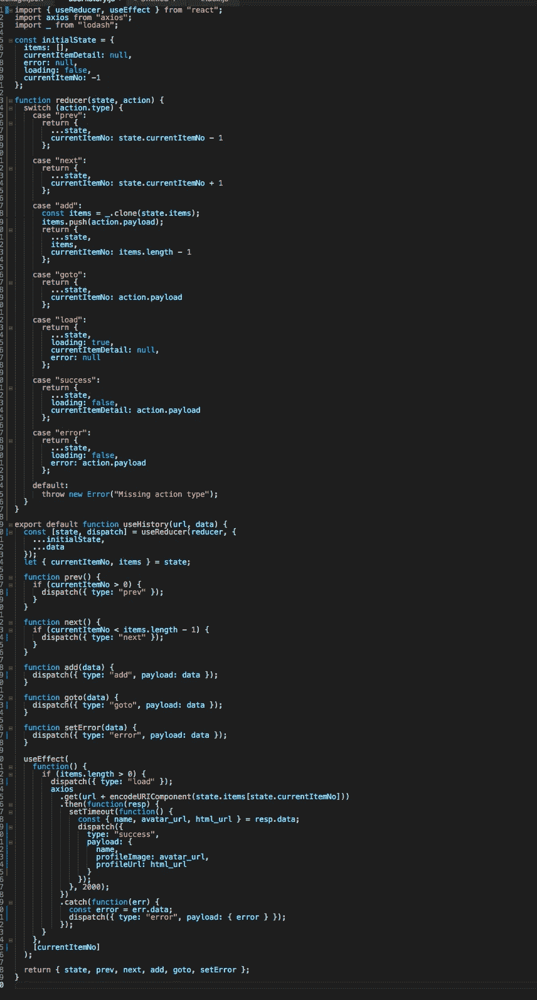

# 用闭包反作用钩子:useState v/s useReducer

> 原文：<https://medium.com/nerd-for-tech/react-hooks-with-closures-usestate-v-s-usereducer-9e0c20e81051?source=collection_archive---------0----------------------->


您是钩子的新手吗，正在努力理解影响功能组件从而影响钩子的闭包吗？如果答案是肯定的，那么你来对地方了。

所以，让我们从基础开始:

# 使用状态



useState 是所有内置钩子中最常用的。它类似于`this.setState`，我们用它来设置功能组件的状态。

在下面附上一个简单的代码片段:



有关使用状态的更多详细信息，请点击[此处](https://reactjs.org/docs/hooks-reference.html#usestate)。

# 用户教育



当您有涉及多个子值的复杂状态逻辑或者下一个状态依赖于前一个状态时，useReducer 通常比 useState 更可取。

在下面附上一个简单的代码片段:



有关 useReducer 的更多详细信息，请点击[此处](https://reactjs.org/docs/hooks-reference.html#usereducer)。

# 关闭



闭包是捆绑在一起(封闭)的函数与对其周围状态(词法环境)的引用的组合。换句话说，闭包允许您从内部函数访问外部函数的范围。在 JavaScript 中，闭包是在每次创建函数时创建的。

有关关闭的更多详细信息，请点击[此处](/javascript-scene/master-the-javascript-interview-what-is-a-closure-b2f0d2152b36)。

# useState v/s useReducer (w.r.t 闭包)

为了理解闭包如何影响带有钩子的功能组件，以及何时使用哪个，我将讨论一个名为 **useHistory 的钩子。**这是一个自定义挂钩，用于存储历史记录并供您使用。

**使用历史:**

我们今天要做的例子让我们输入一个用户名句柄，使用 github api 搜索它，并获取用户的信息。

它存储搜索的用户名的历史，并为您提供上一个、下一个和您想要搜索的特定用户名的功能。

让我先给你看一个 useHistory 钩子的演示:

 [## 演示

### 使用历史](https://drive.google.com/open?id=1ZiS8M1s7G8a-627Ag8upezmys7_XJn0L) 

**使用无回调的 useState 和 useEffect 挂钩的 useHistory 的代码段:**



现在让我们来看看我们在使用这段代码时遇到的问题，因为这个问题，我们想到了使用 useReducer 钩子。

 [## 关闭问题

### 使用 useState 挂钩的 useHistory](https://drive.google.com/open?id=14Dpqr8gQecXo-FpgzqY_UH7SsCBbmFl_) 

现在，如你所见，如果我们在短时间内多次点击“上一页”或“下一页”，我们的代码将进入无限循环。在很短的时间内，这将导致内存泄漏和浏览器崩溃。

如你所见，在 useEffect 钩子函数的代码中，我们没有改变任何状态变量(如果成功:**加载，当前详细信息**，如果错误:**加载，错误**，导致重新渲染(**当前详细信息**)。但不知何故，这些变量( **currentItemNo** )正在发生变化。这就是闭包出现的问题，在我们的例子中，它产生了一个问题。

当调用被调用时，其中的函数进入作用域链，状态对象被保存为当前的状态，此后，当函数组件再次被调用时，状态对象获得不同的内存引用，因此不会被更新。

让我们用流程图来看看这个问题:


正如您所看到的，因为 currentItem 在每次成功/错误回调时都会发生变化，所以 useEffect 钩子会被一次又一次地触发，这将导致一个无限循环(或多个不必要的调用)。

现在，问题是因为变量 state 在函数组件内部被初始化，因此每当它被再次调用时，变量 state 就会得到另一个引用，因此，因为闭包保存了旧状态，所以我们用旧状态更新 setState。

```
const [state, setState] = useState({...initialState,...data});
```

现在，解决这个问题的解决方案很少:

1.  **在功能组件外声明变量**:



现在，由于变量已经在函数组件范围之外声明，即使再次调用函数，状态变量的内存引用也不会改变，因此我们的函数(如 setSuccess、setError)将获得最新的状态。

2.**通过回调使用 useState 的 setState:**



现在，当我们在像 setSuccess 这样的相应函数中调用 setState 时，setState 会给我们最新的状态，因此当我们更新它时，我们将更新关于最新状态的更改。

3.**使用 useReducer:**



现在，如你所知，当下一个状态依赖于前一个状态时，使用 useReducer，因此，它将总是具有前一个状态，因此，我们不需要担心状态函数被重新初始化或保存旧值。

这都是我的观点。感谢你耐心阅读我的第一篇关于 react hooks 的博客。:)