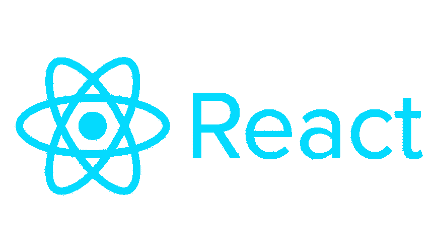

# React JS 初学者步骤

> 原文：<https://medium.com/nerd-for-tech/react-js-8ab4dede5c68?source=collection_archive---------1----------------------->

React JS 是一个用来创建 SPA(单页应用)的前端库。它可以用 Javascript 或 TypeScript 风格编写。

React JS 也可以作为 React Native 在 Android 和 IOS 上使用。简而言之，Android 和 IOS 不再需要单独的代码库。

它最适合来自不同技术背景的人。希望成为全栈开发人员的设计师、后端开发人员。

初学者介绍:

React 可以写在扩展名为。js(对于 Javascript 来说)。jsx(Javascript 的语法扩展)。tsx(用于类型脚本)。您可以使用任何扩展。

大多数开发人员更喜欢使用 jsx，但它不是强制性的。它基本上定义/看起来像基于模板的结构，但带有 javascript 的全部功能。添加 JSX 需要巴贝尔出现在项目中。如果它的基本 html 示例，您可以将它添加到您的脚本标签中。但是，它不适合生产。最好作为依赖项添加到 package.json 中。

您可以构建不同类型的 React js 应用程序:

1.  对于简单的网络应用，你可以使用“创建反应应用”

2.对于带有节点 js 的服务器端渲染，可以使用“Next.js”。

3.对于面向静态的网站，可以使用“盖茨比”。

**节点 JS :**

在开始用 **create react app 编写 Web 应用之前，需要 Node.js** 。所以请务必从 [Nodejs 主页](https://nodejs.org/en/)下载并安装 node.js。它有很多优点。但是现在，下载不同的库并使用命令启动、构建和测试 web 应用程序是很有用的。

Node js 简介:一个带有 chrome V8 Javascript 引擎的 C++程序。这意味着，在 node js 之前，只有 web 浏览器是运行 javascript 的平台，但是由于 node 的发明，现在可以很容易地在浏览器之外使用 javascript。

安装以下组件:

npm -g 我创建-反应-应用

它将帮助您用基本的源代码创建 web 应用程序。简而言之，react 应用程序的代码生成器。“g”表示“全球”级安装。

npm 创建-反应-应用程序

根据行业和市场标准，kebab case 用于命名 web 应用程序

## npm 创建-反应-应用程序待办事项-应用程序

创建一个名为“todo-app”的文件夹。它将包含 React 开发和 eco 系统所需的所有基本 src 文件。更多的第三方库可以根据需要添加到项目中。

您可以在 [create react app](https://reactjs.org/docs/create-a-new-react-app.html) 页面查看安装 Create React App 的基本示例。更多的基础知识和深入的概念请关注我的博客。