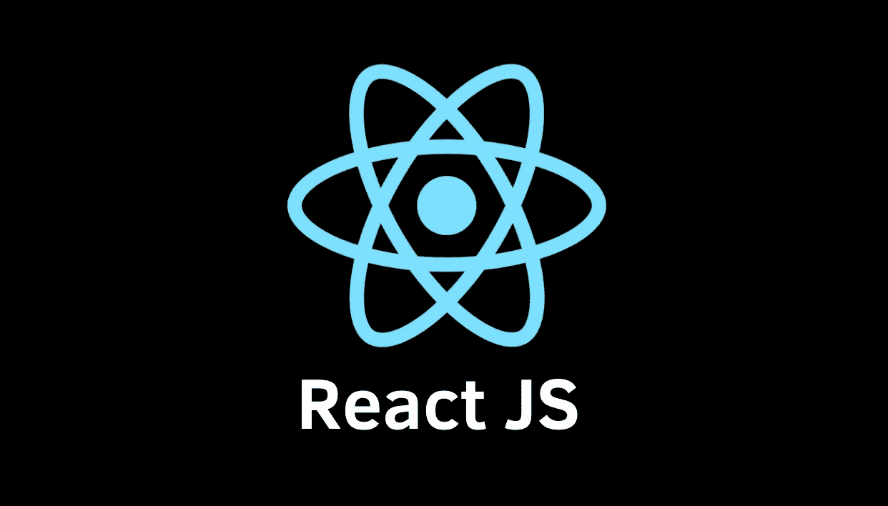
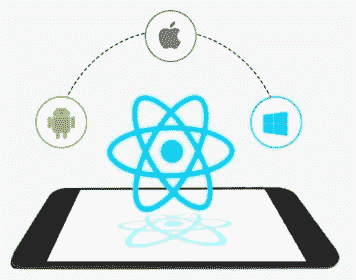
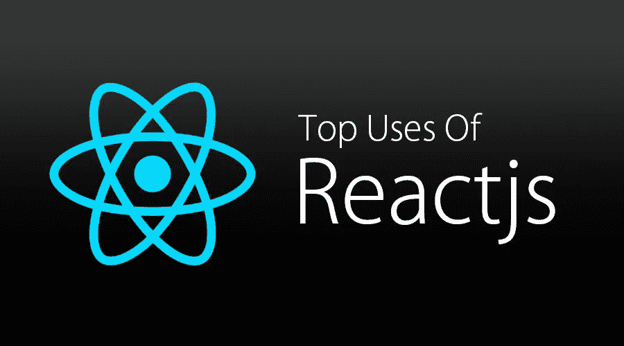

# React.js

> 原文：<https://medium.com/nerd-for-tech/react-js-c4c1cf6f6b29?source=collection_archive---------22----------------------->

## ReactJS 简介



图 1: React JS 徽标

**React.js** (也称为 **React** 或 **ReactJS** )是一个开源的、基于组件的前端 JavaScript 库(javascript framework)，用于构建用户界面和 UI 组件。此外，它是一个用于用户界面的声明式、高效且灵活的 JavaScript 库。React 可用于单页面 web 应用程序或移动应用程序。因此，它需要为路由和某些客户端功能使用额外的库。ReactJS 由脸书和一个由个体公司组成的社区维护。

应用程序看起来像是每个状态的简单视图。当您的数据发生变化时，React 将高效地更新和呈现正确的组件。声明式视图使您的代码更容易预测，也更容易调试。它由多个组件组成，每个组件负责呈现一个微小的、可重用的 HTML 片段。那些**组件**可以嵌套在其他组件中，用简单的构建模块构建而成。

**React Native 简介**



图 2:本地反应

React 有原生库。它是一个为 IOS、Android 和 UPD 开发的移动应用程序的 JavaScript 框架。这是脸书在 2015 年推出的。它使用与 React 相同的设计，看起来非常“本土”。

React 原生应用也是使用 **JavaScript** 和 **JSX** (XML 风格标记)编写的。它公开了平台 API 的 JavaScript 接口。这些可以访问平台功能，如位置或摄像机等。

## React 的顶级特性。Js？



图 ReactJs 的主要用途

开发前端 web 应用的平台非常多。但是在 React 中，有一些独特的特性可以让您更容易地开发应用程序。以下是它的主要特点:

*   **易学:**任何人都可以轻松理解这种语言。但是你需要 HTML 和 CSS 的基础知识。
*   **性能:** React 没有为依赖提供任何内置容器的概念。可以使用 **Require JS** ， **EcmaScript** 6 模块，我们可以通过 Babel，ReactJS-di 使用这些模块来自动注入依赖关系。
*   **简单性:** 基于组件的方法、普通 JavaScript 的使用及其生命周期使得 ReactJs 非常容易学习。它帮助我们构建专业的 web 应用或移动应用。React 使用一种叫做 " **JSX"** 的特殊语法，它允许你混合 HTML 和 JavaScript。因为 JSX 更容易用于开发我们的应用程序。此外，我们可以使用普通的 JavaScript 来构建它。
*   **数据绑定:** 使用**单向数据绑定**和一个应用架构( **Flux)** ，通过一个控制点控制数据流向组件。因此，更容易调试。
*   **原生方式:** 这个*可以*用来创建移动应用。它支持可重用性。所以我们可以制作 Android、IOS 和 Web 应用程序。
*   可测试性:我们可以非常容易地测试这些应用程序。

## 参考

```
[https://www.oreilly.com/library/view/learning-react-native/9781491929049/ch01.html](https://www.oreilly.com/library/view/learning-react-native/9781491929049/ch01.html)[https://reactjs.org/docs/getting-started.html](https://reactjs.org/docs/getting-started.html)
```