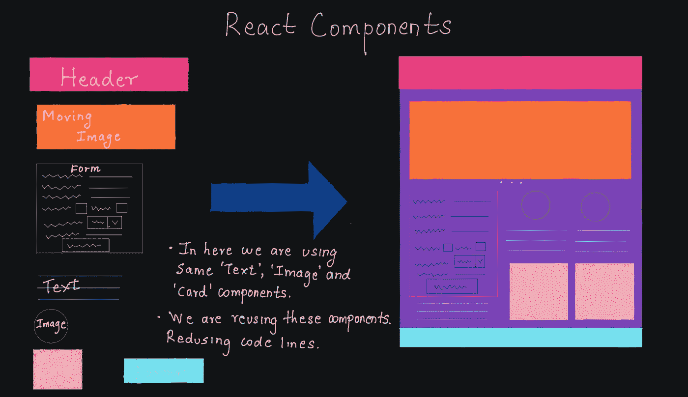
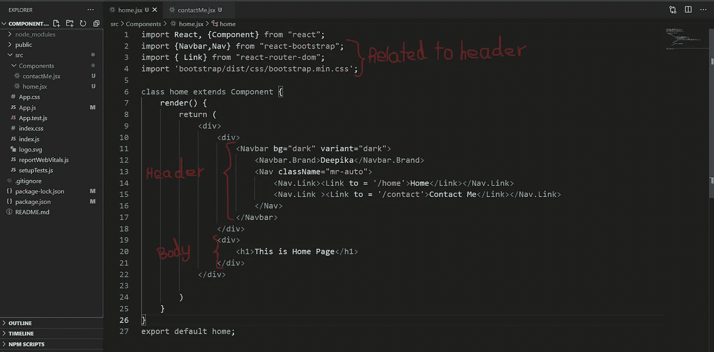
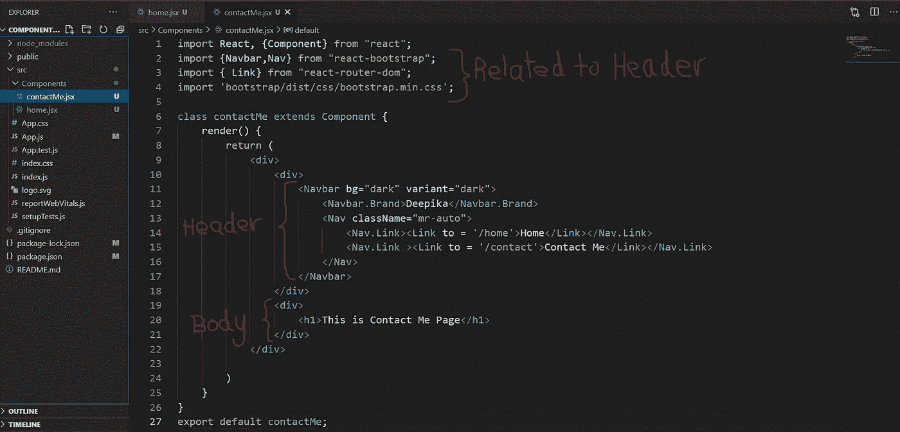
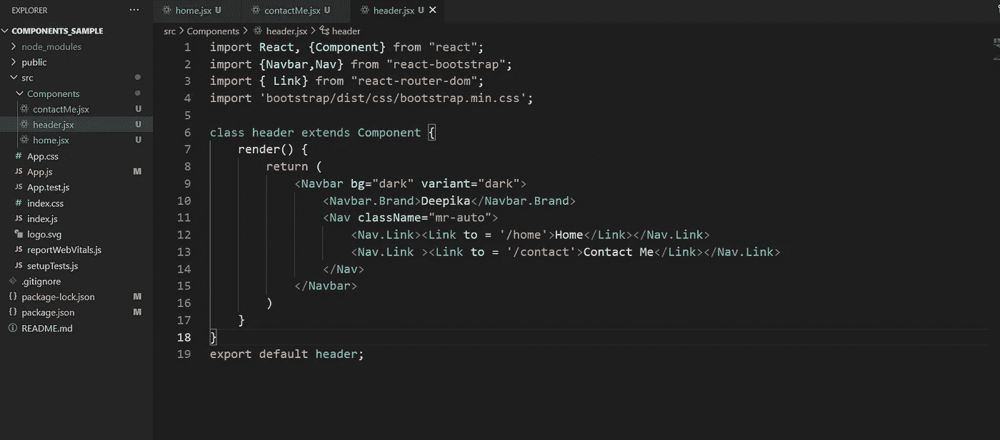
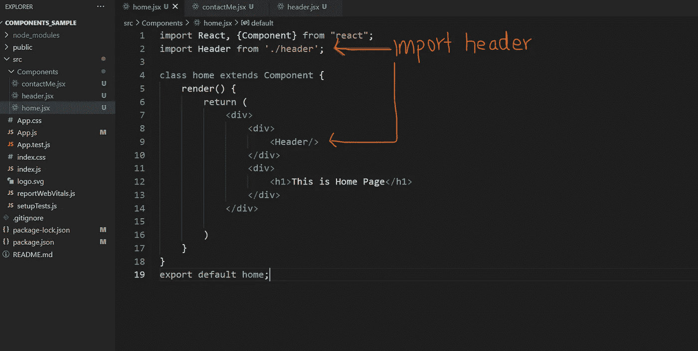

# 反应 JS 类组件和功能组件😧 😕

> 原文：<https://medium.com/nerd-for-tech/react-js-class-components-and-functional-components-f346cb92a02c?source=collection_archive---------16----------------------->



现在，基于组件的开发因其简单性而在开发人员中很出名。大多数流行的语言都支持组件库开发，React 就是其中之一

# 什么是基于组件的开发？😕

> 基于组件的开发是一种专注于可重用组件的设计和开发的软件开发方法。—

*简而言之* ***组件是可复用的、独立的代码块，将项目的 UI 分割成小块*** *。*基于组件的架构帮助我们创建易于组合、重用和版本化的代码。

所以我们不需要在一个文件中有几千行代码。我们可以将它们划分为组件并重用它们。

# **什么叫重用？**

让我们这样想。你在为自己做投资组合。因此，您的文件夹将有一个标题，其中包括一些导航部分(主页，关于我，联系我和我的作品)。

你需要给所有的网页添加相同的标题(主页，关于我，联系我和我的工作)。没有组件我们要怎么做呢？

是的，我们将在每个文件中添加 HTML 和 CSS 代码。因此，让我们借助组件来简化它。

让我们创建一个文件 ad Header.jsx，它将只实现 Header。现在我们可以在我们喜欢的任何其他文件中重用这个 jsx 文件。让我们说，在主页只需添加该组件，它会工作得很好。

还是不明白好吗？😢没问题，让我们实际地做它😃

首先我们需要创建一个 react 应用程序。如果你不知道如何去做，看看我的[**React——一篇简单的开头**](/nerd-for-tech/react-a-simple-beginning-df98c89066d2) 的文章。

在 react 项目中，让我们创建一个名为“Components”的文件夹，它将包含我们所有的 web 组件。然后让我们创建两个名为 **home.jsx** 和 **contactMe.jsx** 的文件，其中包含一个示例**头**。



输出将是这样的👇

但是你可以看到我们在两个页面上添加了相同的头文件。如果我们有 20 页，我们需要为每一页添加页眉，该怎么办？😟

这就是为什么我们把它作为可重用的组件。让我们将 header.jsx 创建为一个单独的文件，并在这两个类中重用同一个头。



在这个 header.jsx 文件中，我们只有与标题相关的内容。让我们看看 home.jsx 页面。我们只是导入 header，并将组件命名为 **< Header/ >。**



输出将是相同的。因此，您可以清楚地看到，代码的长度减少了，我们重复使用了两次 header 组件。

React 有两种类型的组件，它们是:**类组件**和**功能组件。让我们来看看它们。👇**

# **类成分😮**

作为基本 ES6 类的类组件。它们比功能组件复杂。类组件有构造函数、生命周期方法、render()等等。

在上面的例子中，我们使用了类组件。让我们看一个简单类组件的例子。

```
import React, {Component} from “react”;class ClassComponent extends Component {
    render() {
        return (
            <div>
                <h1> This is a simple class component</h1>
            </div> 
        )
    }
}
export default ClassComponent;
```

这里，我们需要将 ClassComponent 扩展为 Component，以便 React 可以理解这个类是一个组件，并且它呈现一个 React 元素(JSX)。

反应类组件:

*   可以在构造函数中接受**道具**(如果需要的话)。
*   使用**状态**来维护自己的数据。
*   必须有一个 **render( )** 方法。

# **功能组件😯**

功能组件是一个基本的 JavaScript 或 ES6 函数，它返回一个 React 元素。

```
import React from ‘react’;const FunctionalComponent = () => {
    return <h1>This is a functional component</h1>;
};
export default FunctionalComponent;
```

作为 ES6 箭头功能👆

作为 JavaScript 函数👇

```
import React from ‘react’;
const FunctionalComponent(){
    return <h1>This is a functional component</h1>;
};
export default FunctionalComponent;
```

> **功能组件**也称为无状态组件，因为在过去，我们不能像功能组件中的类组件那样做更复杂的事情。
> 
> 但是在**版本 16.8** 中 React 引入了 **React 钩子**，它现在允许我们使用状态&功能组件中的其他特性。

*功能组件在需要时以* ***道具*** *作为自变量，并且必须* ***返回*** *反应元素。*

# **结论😃 😄**

组件是 React 的重要组成部分。因此，必须具备良好的零部件知识。您可以在项目中使用类组件或函数组件。但是在处理更复杂/更长的项目时，最好使用函数组件。

有关 react 组件的更多信息，您可以访问参考资料中提到的 react 官方页面。

# **参考文献🙏**

*   [https://www . perforce . com/blog/VCS/component-based-development](https://www.perforce.com/blog/vcs/component-based-development)
*   [https://reactjs.org/docs/components-and-props.html](https://reactjs.org/docs/components-and-props.html)