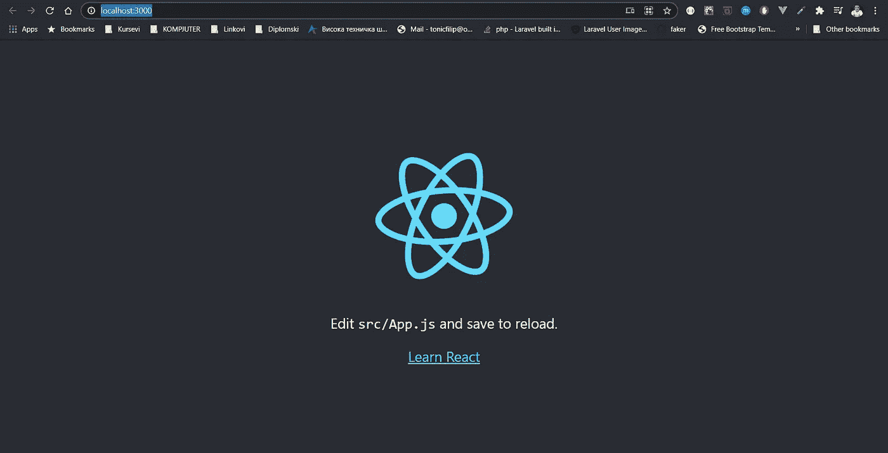
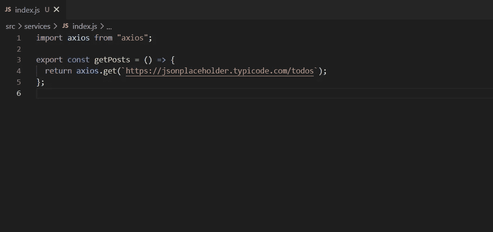
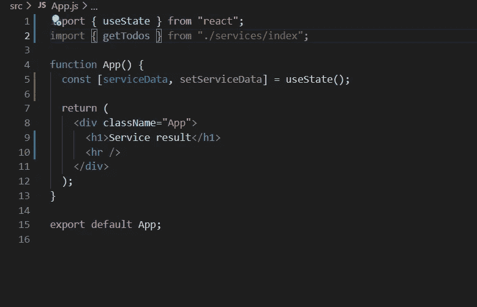
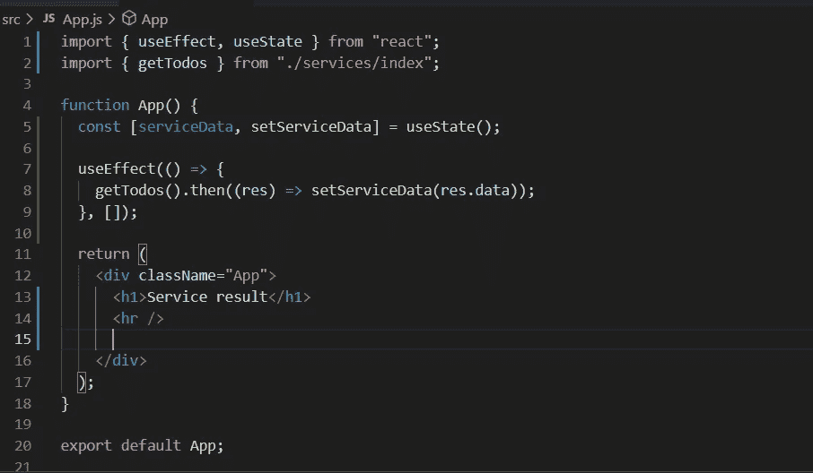
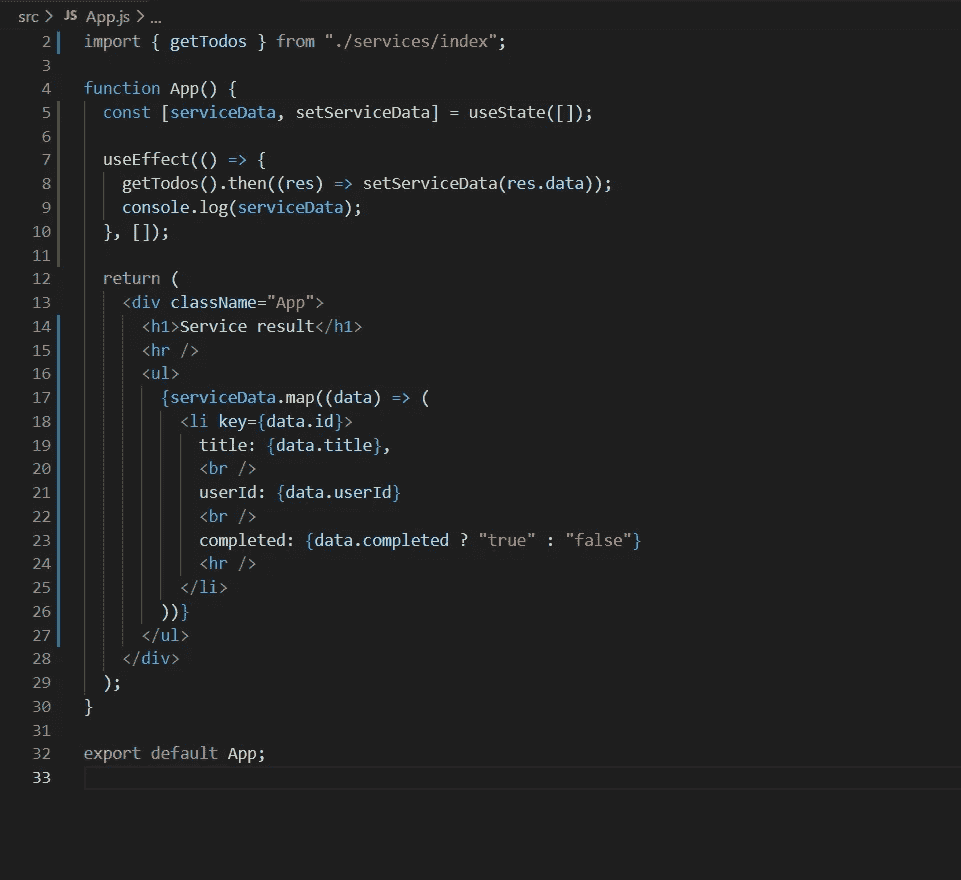
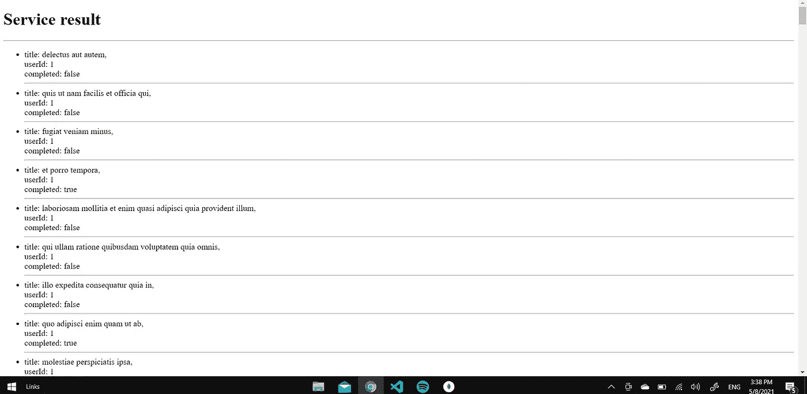

# React.js 服务

> 原文：<https://medium.com/nerd-for-tech/react-js-services-854be54a6ba1?source=collection_archive---------0----------------------->

反应和服务？啊？🤔

亲爱的读者您好，在这个简短的教程中，我们将看到如何在 React.js 应用程序中实现“服务”。为什么我们称它们为服务，而不是别的名称？老实说，这个问题没有正确的答案，至少在我看来是这样。简而言之，服务只是普通的类，其中包含您自己选择的函数，所以您可以随意称呼它们。💡

让我们开始吧！🚀

我们将从全新的 React 应用程序开始。
**npx create-react-app“your-app-name”，**用你喜欢的**代码编辑器打开，**我用 [vs-code](https://code.visualstudio.com/) 。

使用 **npm start** 启动应用程序，我们会得到很好的旧起始页:

现在让我们直奔主题。创建名为 **services** 的文件夹，并在其中放入文件 **index.js.** 在现实世界中，显然会有更多按用途命名的文件，但我们在这里只做一个演示。现在我将使用第三方 **API** 来模拟服务器，并使用 **Axios** 库来获取 API。

在您的终端键入 **npm 安装 axios。**在我们的服务中，我们会在旁边写一些东西:

你可以看到这是怎么回事。你会有很多函数，当然更大更复杂，但是你会把它放在一个文件里吗？所以你会有 S **服务 1.js，服务 2.js …ServiceN.js** 然后所有这些都在这个 **Index.js** 里面连接起来，你就**单个导出**但是可以访问服务里面的很多代码。但是让我们坚持我们的例子。下一步是什么？我们将导入我们的服务，然后从外部 API 获取数据，最后显示在页面上。它应该是这样的:

所以我们是直接导出一个服务函数。我们像往常一样使用 [**React 钩子**](/nerd-for-tech/fetching-api-using-useeffect-hook-in-react-js-7b9b34e427ca) ，以防止数据被服务，并在我们需要时使用它们。

我们使用 useEffect()并在它里面作为我们的**服务函数**返回一个**承诺，**我们只是接受它并将数据从 API 放到 **serviceData 变量中。从现在开始，所有的数据都可以被操作，我只会在页面上显示，作为工作做得很好的证明。当然，你可以用任何你喜欢的方式来处理它。**

通过从服务中收集的数据绘制

如您所见，我只是映射了数据，并以列表的形式显示出来。

# 结论

这就是了。同样，这是一种方法，当然还有其他方法。
希望你喜欢，一定要看看我以前的 [**文章**](/me/stories/public) ，分享并留下评论。

你可以一直用一杯 [☕](https://www.buymeacoffee.com/tonicfilip) 来支持我

直到下一次，保持安全和快乐的编码。

**领英**:[www.linkedin.com/in/filip-tonic](http://www.linkedin.com/in/filip-tonic)
**邮箱**:tonicfilip@outlook.com