# React.js SPA with。网络核心 5

> 原文：<https://medium.com/nerd-for-tech/react-js-spa-with-net-core-5-8e419834e48?source=collection_archive---------1----------------------->

各位读者好。在 [**上一篇**](/nerd-for-tech/net-jwt-authentication-with-mongodb-9bca4a33d3f0) 中，我们用**做了后端应用。NET** 用于我们的服务器技术，而 **MongoDb** 用于我们选择的数据库。我们还有一个 **JWT 认证**，这是向系统认证用户的最常见方式之一。所以一定要去看看👉 [**此处**](/nerd-for-tech/net-jwt-authentication-with-mongodb-9bca4a33d3f0) 。

在本文中，我们将使用 **React.js** 库来制作一个关于**如何对**和**做出反应的漂亮、简单但非常方便的例子。Net** 可以一起工作，但是当然这些概念基本上可以和任何技术组合一起工作。

# 先决条件

在开始之前，我们需要确保我们的机器上安装了一些东西。打开你最喜欢的终端，输入: **node -v. Y** 你应该会在你的机器上得到一个当前安装的 node 版本。

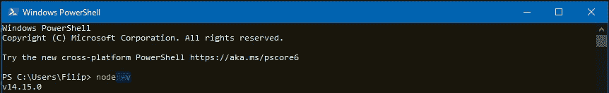

我的版本是 14.15.0，有可能在你读这篇文章的时候，它的版本会更高，不过这不是问题。

接下来，我们将检查是否也安装了 NPM。在您的终端中键入: **npm -v.**

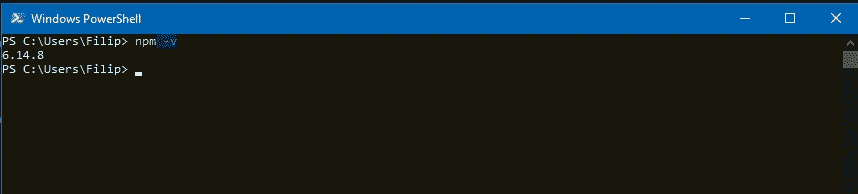

我的版本是 6.14.8，你的可能会更高。现在我们已经拥有了所有需要的东西，是时候制作一个新的 React 应用程序了。

我将使用 **npx，**但是如果你觉得它更合适，你可以在你的本地机器上安装" **create-react-app** "并使用它的 cli。

所以打开你的终端，输入:**npx create-react-app your app name。应用程序制作完成并准备就绪后，在您喜欢的代码编辑器中打开它。
我正在使用 vs 代码。您应该得到这样的结果:**

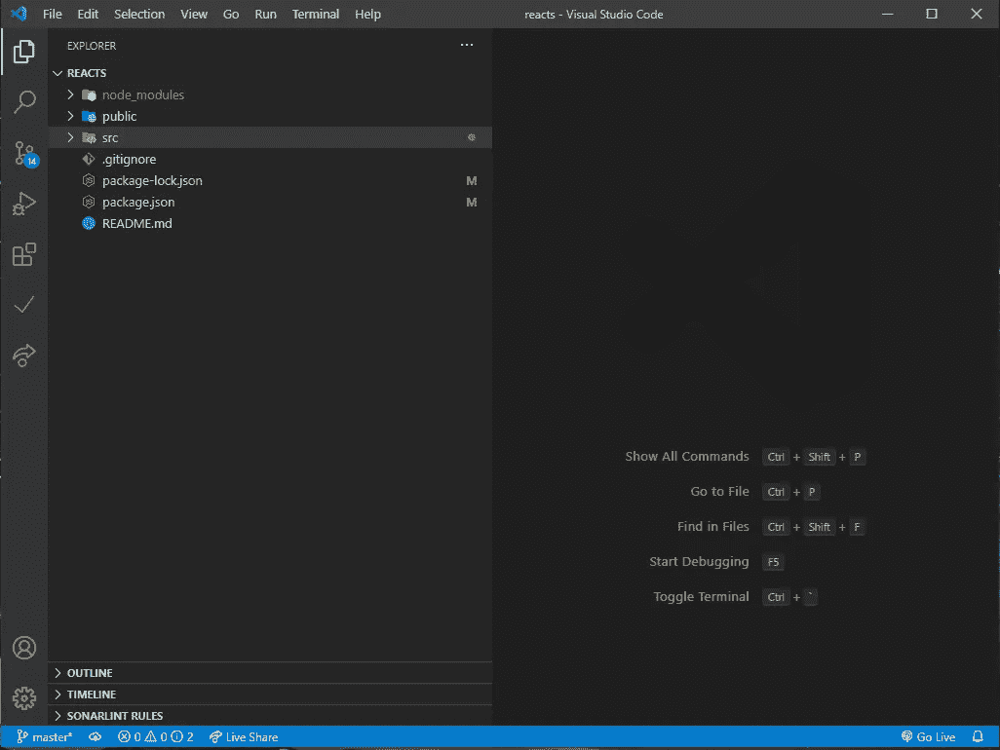

我们通过执行脚本启动 React 应用程序: **npm start。**您的浏览器将会弹出，您应该会看到以下页面:

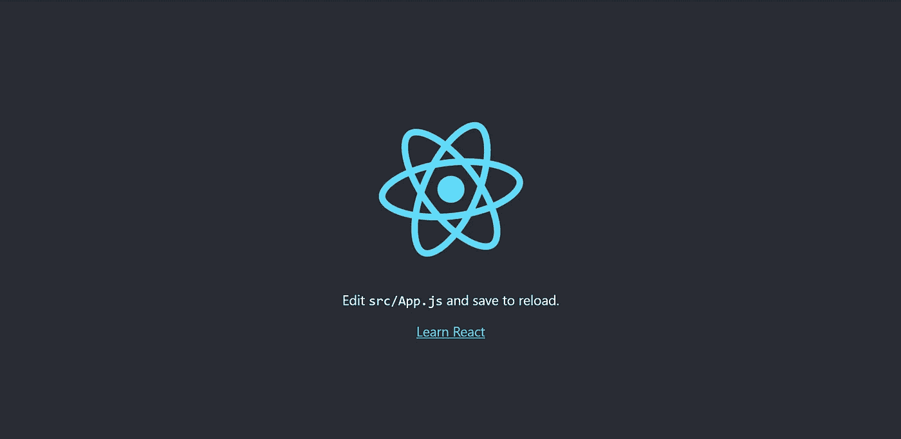

让我们开始构建我们的界面。我会用 **Material UI** 作为 css 库，在前端世界很流行。同样，你可以使用任何其他的库，比如: **Bootstrap，Tailwind Css，布尔玛…**

那么我们来做:**NPM install @ material-ui/core。**我们还将安装稍后会用到的材质 ui 图标。为此我们将做 **npm 安装**[**@ material**](http://twitter.com/material)**-ui/icons。**

我们的大部分应用程序位于 **src** 文件夹中，所以我们大部分时间也将在其中度过。:)
所以导航到 **src** 并创建文件夹**组件。这是我们的组件将生活的地方。
现在让我们创建第一个 **React 组件**。在 components 文件夹中添加另一个文件夹 **Auth** ，我们将有一个名为 **Login.js** 的新文件。**

为什么是另一个文件夹？你可以想象，随着应用程序的增长，组件文件夹会被不同类型和种类的组件淹没，所以将组件放在相应的模块文件夹中是一个好的做法。

# 创建第一个 React 组件

现在回到我们的 **Login.js** ，我们将创建一个所谓的**功能组件**。在我看来，这种组件更容易理解和维护。此外，在我个人看来，React 创建者倾向于引导开发者使用功能组件。
**函数组件**无非是一个普通的 **javascript** 函数，它返回某种 html，也称为 **JSX。**

所以把这个放进你的档案里:

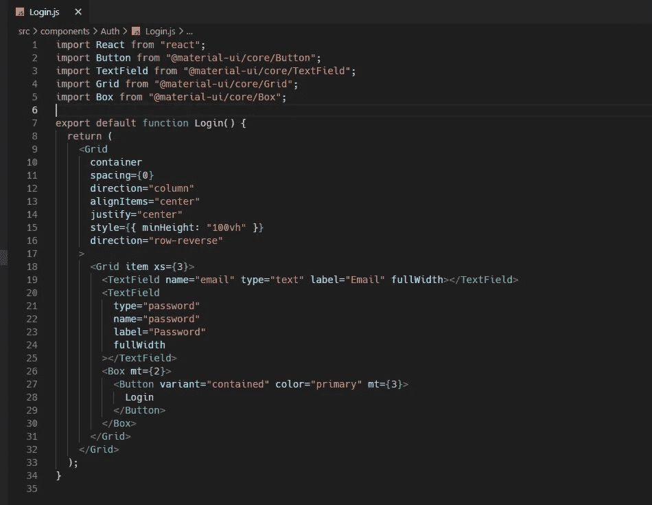

如果你愿意，你当然可以在文件的底部进行导出。现在我们如何看到这一点？很简单。转到您的 **App.js** 文件，像这样调用我们的登录组件:

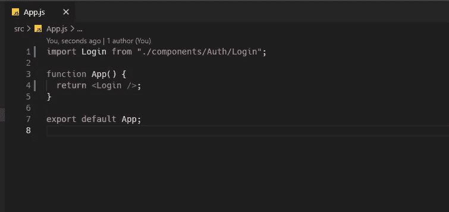

很简单。如果你回到你的网络浏览器，这就是你将得到的。

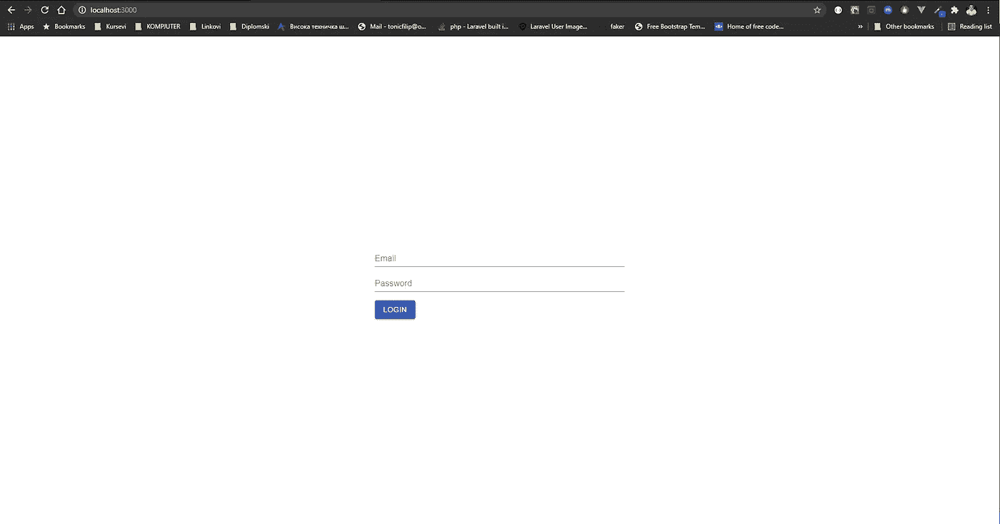

很简单，居中的形式。接下来，我们将对我们的服务器进行一个 **api 调用**，并尝试从我们的数据库中取回数据。出于这个目的，我们将使用 **Axios** 库，但是你总是可以做一个很好的旧的**获取。**

因此，在终端中执行: **npm install - - save axios。** 我们还会利用 **React 的状态钩子，**就是一个允许你在函数组件内部使用**状态**的函数。

一会儿就清楚多了。:)
所以我们将在登录组件中添加一些东西。首先，上面提到的钩子。

这是怎么回事？我们有一个**用户**对象，它将保存我们的**电子邮件**和**密码，**基本上这就是**使用状态()中的内容。**下一个参数是 **setUser，**该函数将为**用户对象**的**电子邮件**和**密码**设置我们将要在表单字段中键入的值。

现在让我们来看看实际情况。

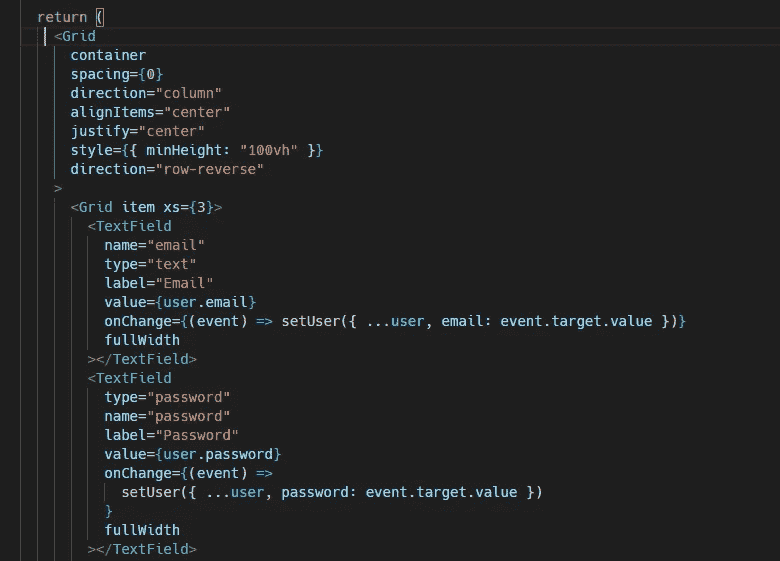

我们将**值**属性添加到我们的字段中，它从上面的**用户**对象中获取**电子邮件**和**密码**。起初，字段是空的，这就是为什么我们有 **React.useState({ email:" "，password: " "})** 。

我们还有 **onChange** 事件，就像我之前说的，当那个事件发生时，它会用**键** : **值**对调用我们的 **setUser** 函数。因此，当我们输入我们的字段时，**用户**对象的值会相应地改变。

还有一件事在这一点上不清楚，那就是**…用户➡传播用户对象。**

这样做的原因是，每当我们开始在其中一个字段中键入时，它将改变用户对象中一个属性的状态，但当我们跳到第二个字段时，它将“重置”状态，并将前一个字段设置为其默认状态，这是一个空字符串。

通过传播用户对象，我们“保存”了我们输入的内容。现在我们已经设置好了组件状态，我们准备好对服务器进行 api 调用了。

为此，我们将创建一个接受事件的函数，并执行 **axios** 调用。

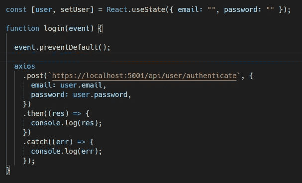

我调用了我的函数 **login()，**你可以随意调用它。在现实世界中，您可能会将该函数保存在某种专用文件中。如果你来自 **Angular** world，你一定熟悉著名的 **Angular services。**:)

出于测试目的，我们只是在控制台中记录响应。当我们提交表单时，这个函数将被调用。

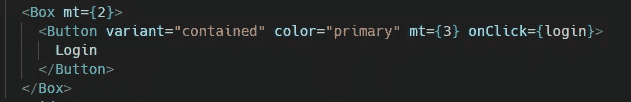

我们正在添加 **onClick** 事件，在其中调用我们的函数。
来自**上一篇文章**我们的数据库中有一个测试用户。让我们做个测试。

启动后端应用程序并尝试登录。我们从服务器上取回数据。

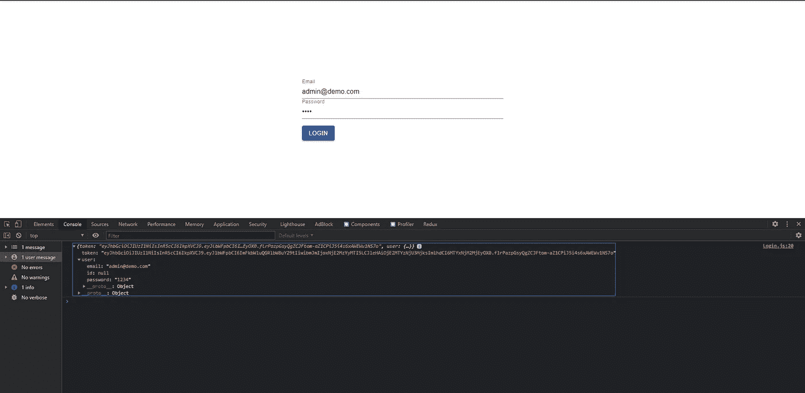

这很好，现在登录控制台并没有做太多的工作。为了简单起见，让我们用用户数据制作一个个人资料页面。如果用户通过登录，我们将重定向到此页面。为了有任何重定向，我们应该有路线。

让我们安装两个东西: **react-router** 和 **react-router-dom。**非常简单，现在我们将创建用户配置文件组件。在组件文件夹中创建文件夹**用户**并在其中 **Profile.js**

为了让这个活动更漂亮，让我们在顶部有一个**导航条**，上面有我们的路线链接，你知道，就像是一个专业的水疗中心。:)

我喜欢把它放在**共享的**文件夹中，因为**导航条**应该一直存在。所以让我们做这些吧。

## 导航. js

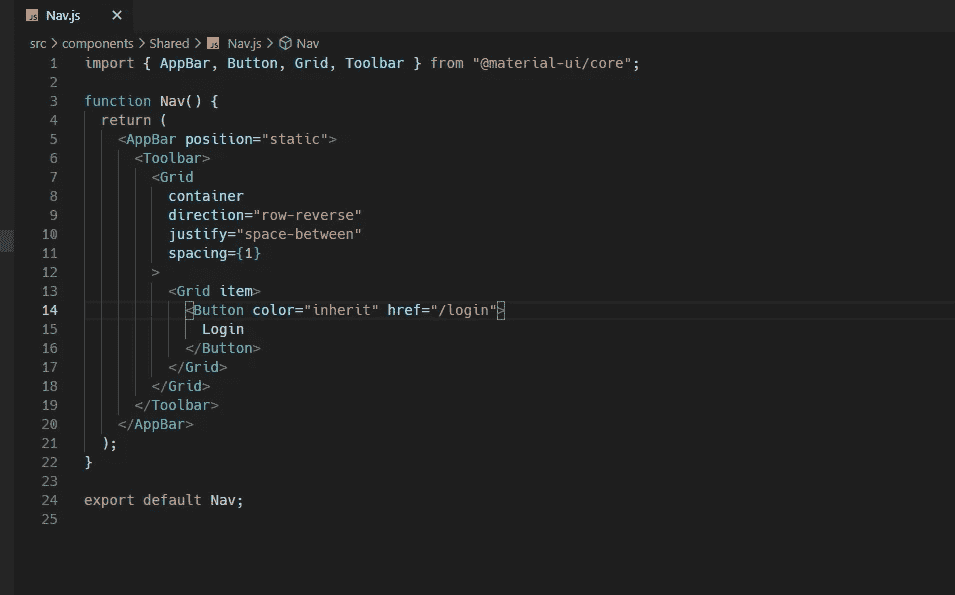

## 简介. js

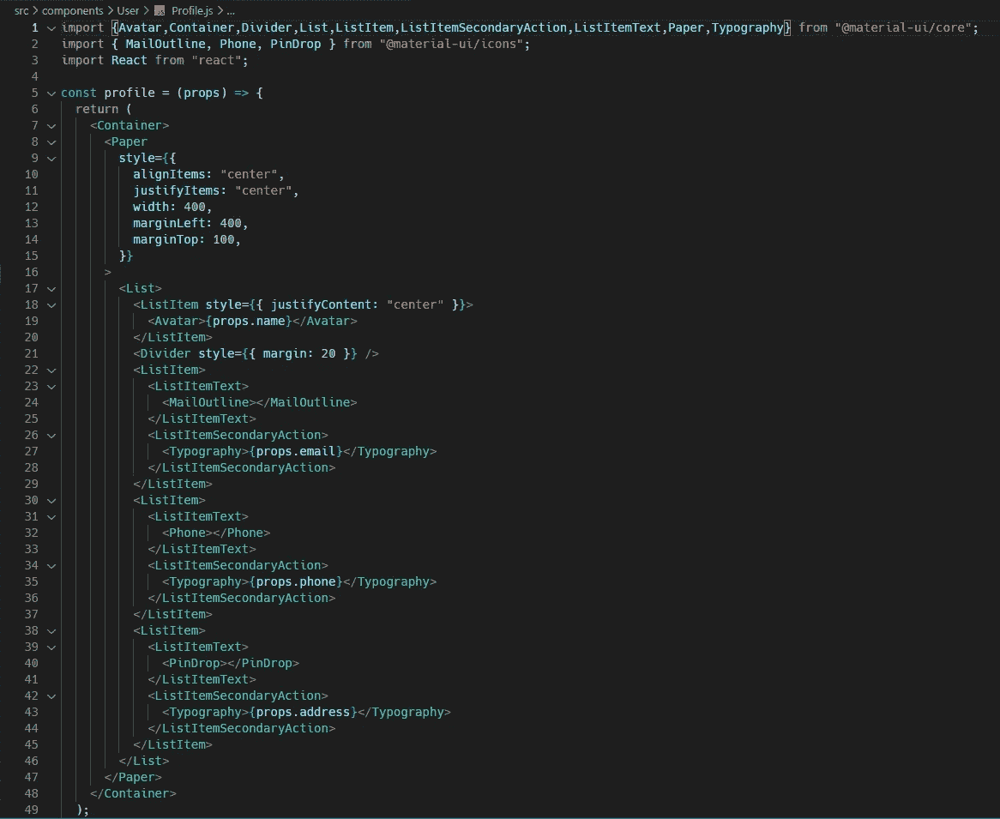

这些道具(电话，地址…)是为了演示的目的，当然你可以在后端构建你的用户对象。

我们还必须在登录方法中添加一个重定向，这样我们就可以在从服务器获取数据后进行切换。

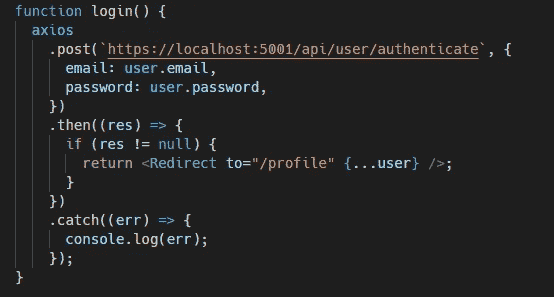

正如你所看到的，我们用之前的用户对象重定向到 **"/profile"** 。我们当然确信我们会得到服务器的响应，因为这只是演示。在现实生活中，你会遇到错误处理槽状态，并呈现某种类型的**错误组件。**

我们还需要修改的是 App.js

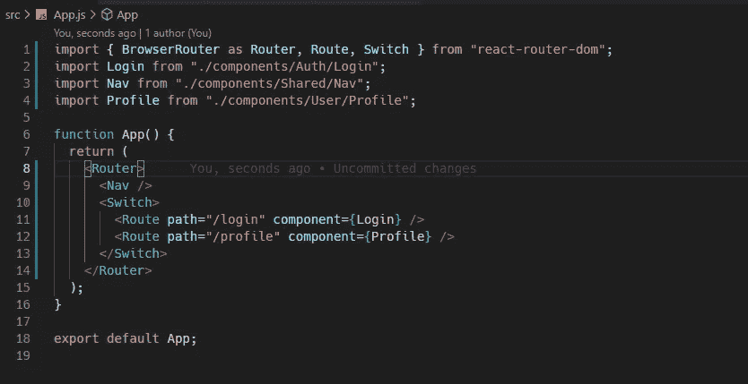

我们将所有应该成为路由主题的内容都放在了**路由器中。** 接下来，由于**导航**是共享组件，它位于**开关**之上，在它内部我们有自己的路由。同样，随着应用程序的增长，路由的数量也会增长，因此在现实世界中，您应该将这些路由保存在专用的路由文件中。

现在让我们进行最后一次测试！:)

所以**登录**页面:

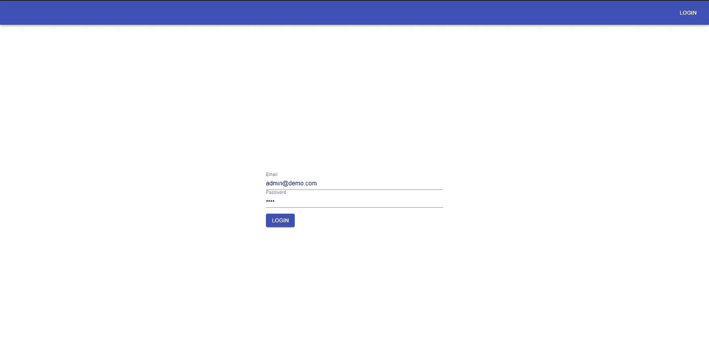

登录后，我们将被重定向到**个人资料**页面:

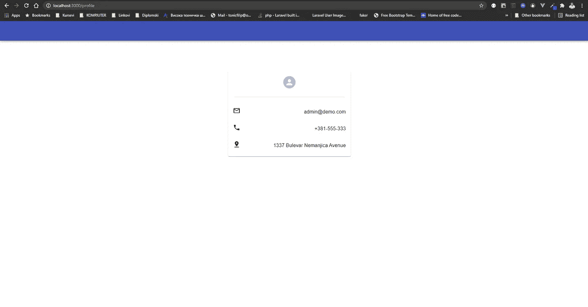

这就是了！我们讨论了一些重要的事情，比如**状态挂钩、**功能组件、**从一个组件向另一个组件发送道具、 **api 调用、**、**路由**。**

在我的下一篇文章中，我将介绍 **Redux** 的用法，并展示这种应用程序如何利用该库来处理**登录**、**注销**、**令牌过期**等。
敬请期待！:)

如果你喜欢这篇文章，你可以支持我的工作和 [**给我买个**](https://www.buymeacoffee.com/tonicfilip) ☕😊

请分享你的想法，下次快乐编码！